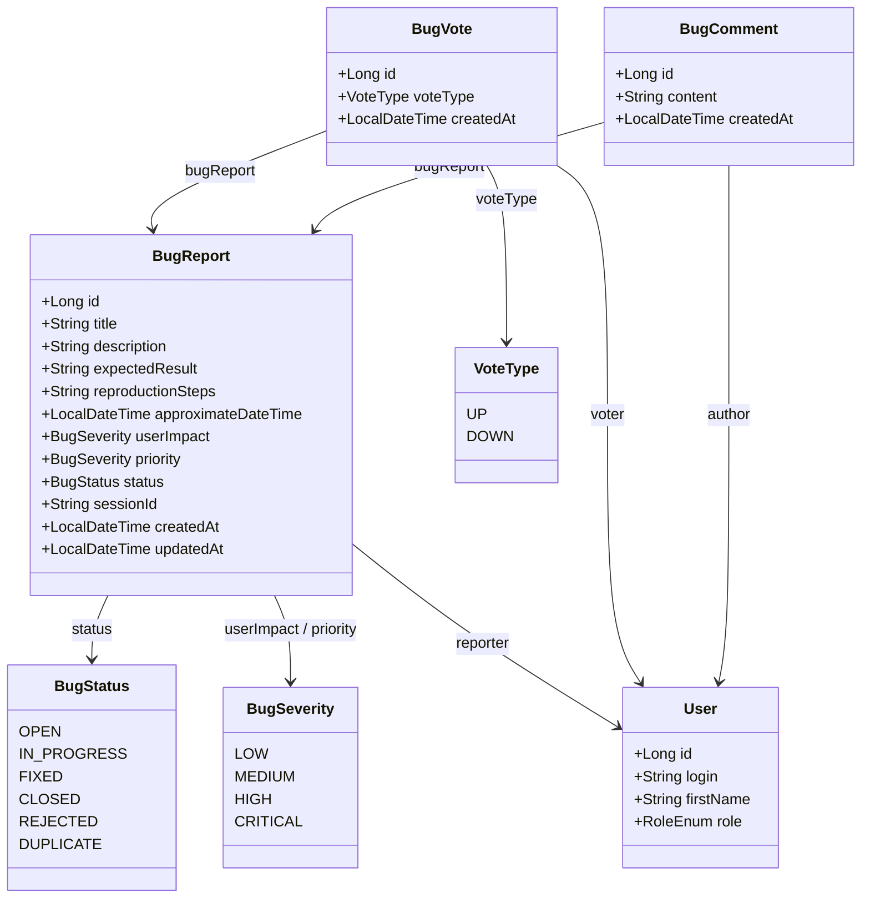
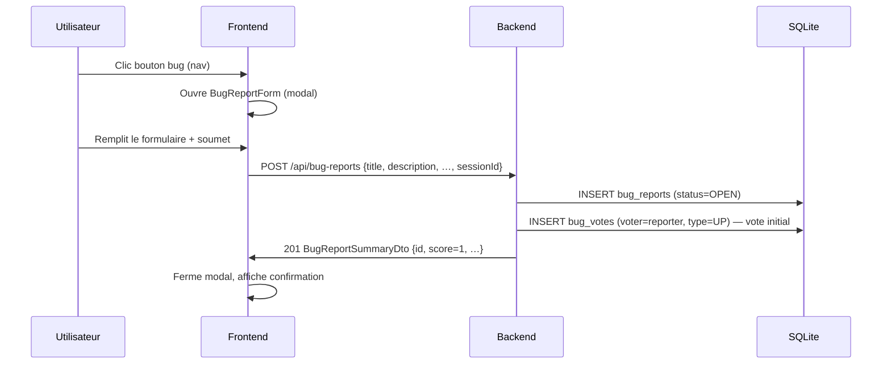

# Signalement de bugs — Architecture

Système de remontée et de suivi des bugs permettant aux utilisateurs de signaler
des anomalies et d'interagir via votes et commentaires, avec gestion de la priorité
et du statut côté administrateur.

---

## Vue d'ensemble

Tout utilisateur authentifié peut **signaler un bug** via un bouton discret dans la
navigation. La fiche créée est immédiatement visible de tous les utilisateurs connectés,
qui peuvent la **voter** (+1 / -1) et la **commenter**. L'administrateur dispose d'une
vue dédiée pour **trier, prioriser et faire évoluer le statut** des bugs reçus.

```
Utilisateur → saisit le bug → score démarre à +1 (vote auto du reporter)
Autres utilisateurs → upvotent / downvotent + commentent
Admin → fixe la priorité, change le statut, commente
```

---

## 1. Cycle de vie d'un bug

### 1.1 Statuts

| Statut | Signification |
|--------|---------------|
| `OPEN` | Bug reçu, en attente de triage (statut initial) |
| `IN_PROGRESS` | Pris en charge, correction en cours |
| `FIXED` | Corrigé, déployé ou à déployer |
| `CLOSED` | Résolu et validé, archivé |
| `REJECTED` | Non retenu (comportement attendu, hors périmètre…) |
| `DUPLICATE` | Doublon d'un bug déjà enregistré |

Transitions autorisées : l'admin peut passer d'un statut à n'importe quel autre en
une seule action — pas de machine à états rigide.

### 1.2 Score de votes

Le score est calculé à la volée :

```
score = Σ(+1 pour chaque UP) + Σ(−1 pour chaque DOWN)
```

À la création, un vote `UP` est automatiquement enregistré au nom du reporter.
Son score démarre donc à **+1**. Le reporter ne peut pas voter sur son propre bug
(le vote initial est posé par le système, pas par une action UI).

---

## 2. Modèle de données

### 2.1 Entité — `BugReport`

Table : `bug_reports`

| Champ | Type Java | Colonne SQLite | Description |
|-------|-----------|----------------|-------------|
| `id` | `Long` | `id` (PK) | Identifiant auto-incrémenté |
| `title` | `String` | `title` | Titre court (max 200 caractères) |
| `description` | `String` | `description` | Description du problème (TEXT) |
| `expectedResult` | `String` | `expected_result` | Résultat attendu (TEXT, nullable) |
| `reproductionSteps` | `String` | `reproduction_steps` | Étapes pour reproduire (TEXT, nullable) |
| `approximateDateTime` | `LocalDateTime` | `approximate_date_time` | Date/heure approximative du problème (nullable) |
| `userImpact` | `BugSeverity` | `user_impact` | Impact saisi par l'utilisateur |
| `priority` | `BugSeverity` | `priority` | Priorité définie par l'admin (nullable) |
| `status` | `BugStatus` | `status` | Statut courant |
| `sessionId` | `String` | `session_id` | ID session analytics au moment du signalement (nullable) |
| `reporter` | `User` | `reporter_id` (FK) | Utilisateur ayant signalé le bug |
| `createdAt` | `LocalDateTime` | `created_at` | Date de soumission |
| `updatedAt` | `LocalDateTime` | `updated_at` | Dernière modification |

### 2.2 Entité — `BugVote`

Table : `bug_votes`

| Champ | Type Java | Colonne SQLite | Description |
|-------|-----------|----------------|-------------|
| `id` | `Long` | `id` (PK) | Identifiant auto-incrémenté |
| `bugReport` | `BugReport` | `bug_report_id` (FK) | Bug concerné |
| `voter` | `User` | `voter_id` (FK) | Utilisateur votant |
| `voteType` | `VoteType` | `vote_type` | `UP` (+1) ou `DOWN` (−1) |
| `createdAt` | `LocalDateTime` | `created_at` | Date du vote |

**Contrainte** : `UNIQUE(bug_report_id, voter_id)` — un utilisateur ne peut voter
qu'une fois par bug. Un nouveau vote remplace l'ancien (upsert).

### 2.3 Entité — `BugComment`

Table : `bug_comments`

| Champ | Type Java | Colonne SQLite | Description |
|-------|-----------|----------------|-------------|
| `id` | `Long` | `id` (PK) | Identifiant auto-incrémenté |
| `bugReport` | `BugReport` | `bug_report_id` (FK) | Bug concerné |
| `author` | `User` | `author_id` (FK) | Auteur du commentaire |
| `content` | `String` | `content` | Corps du commentaire (TEXT, max 2000 caractères) |
| `createdAt` | `LocalDateTime` | `created_at` | Date de publication |

Les commentaires ne sont pas modifiables après création.

### 2.4 Enums

```java
public enum BugStatus {
    OPEN,
    IN_PROGRESS,
    FIXED,
    CLOSED,
    REJECTED,
    DUPLICATE
}

public enum BugSeverity {
    LOW,
    MEDIUM,
    HIGH,
    CRITICAL
}

public enum VoteType {
    UP,
    DOWN
}
```

> **Choix de conception :** `BugSeverity` est partagé entre `userImpact` (saisi par
> l'utilisateur) et `priority` (saisi par l'admin). Deux champs distincts sur la même
> entité, même enum — évite la duplication de valeurs identiques dans deux enums.

### 2.5 Diagramme de classes



---

## 3. Calculs et règles d'affichage

### 3.1 Score d'un bug (DTO)

```
score         = count(votes UP) − count(votes DOWN)
userVote      = vote courant de l'utilisateur connecté (UP | DOWN | null)
commentCount  = count(commentaires du bug)
```

Ces trois valeurs sont calculées à la volée et ne sont **jamais persistées**.

### 3.2 Affichage des auteurs de commentaires

| Contexte | Champ affiché |
|----------|---------------|
| Utilisateur connecté (non admin) | `author.firstName` |
| Admin | `author.login` + `author.role` |

Le DTO `BugCommentDto` inclut un champ `authorDisplay` calculé selon le rôle
de l'appelant dans le service.

---

## 4. API REST

### 4.1 Endpoints utilisateur (authentifié)

| Méthode | URL | Description |
|---------|-----|-------------|
| `GET` | `/api/bug-reports` | Liste paginée (tous les bugs, triés par score desc) |
| `GET` | `/api/bug-reports/{id}` | Détail + commentaires + score + vote courant |
| `POST` | `/api/bug-reports` | Signaler un bug (vote initial UP auto-créé) |
| `PUT` | `/api/bug-reports/{id}/vote` | Voter UP ou DOWN (remplace si déjà voté) |
| `DELETE` | `/api/bug-reports/{id}/vote` | Retirer son vote |
| `POST` | `/api/bug-reports/{id}/comments` | Ajouter un commentaire |

### 4.2 Endpoints admin

| Méthode | URL | Description |
|---------|-----|-------------|
| `GET` | `/api/admin/bug-reports` | Liste complète (filtrée par statut, priorité) |
| `GET` | `/api/admin/bug-reports/{id}` | Détail avec login + rôle des commentateurs |
| `PATCH` | `/api/admin/bug-reports/{id}` | Modifier statut et/ou priorité |
| `DELETE` | `/api/admin/bug-reports/{id}` | Supprimer un bug |

> **Choix de conception :** les commentaires admin passent par le même endpoint
> `POST /api/bug-reports/{id}/comments`. Le backend identifie l'auteur via le
> principal Spring Security ; l'affichage adapte le champ `authorDisplay` selon le
> rôle de l'appelant.

Détail complet des endpoints : [`docs/api/bug-reports.md`](../api/bug-reports.md)

---

## 5. Architecture backend

```
com.myfinance
├── domain/
│   ├── BugReport.java
│   ├── BugVote.java
│   ├── BugComment.java
│   ├── BugStatus.java
│   ├── BugSeverity.java
│   └── VoteType.java
├── repository/
│   ├── BugReportRepository.java
│   ├── BugVoteRepository.java
│   └── BugCommentRepository.java
├── service/
│   └── BugReportService.java
├── controller/
│   ├── BugReportController.java       (endpoints utilisateur)
│   └── AdminBugReportController.java  (endpoints admin)
└── dto/
    ├── BugReportSummaryDto.java        (liste — titre, statut, score, commentCount)
    ├── BugReportDetailDto.java         (détail — tous les champs + commentaires)
    ├── BugReportAdminDetailDto.java    (détail admin — login+rôle commentateurs)
    ├── BugCommentDto.java              (commentaire avec authorDisplay adapté)
    ├── CreateBugReportRequest.java
    ├── PatchBugReportRequest.java      (statut + priorité, champs optionnels)
    └── VoteRequest.java                (voteType : UP | DOWN)
```

`BugReportService` injecte :
- `BugReportRepository`
- `BugVoteRepository`
- `BugCommentRepository`

---

## 6. Architecture frontend

```
frontend/src/
├── api/
│   └── bugReports.js              # Appels API /api/bug-reports + /api/admin/bug-reports
└── components/
    ├── bugs/
    │   ├── BugReportButton.jsx    # Bouton discret dans la nav (icône bug)
    │   ├── BugReportForm.jsx      # Modal de signalement (bottom drawer mobile)
    │   ├── BugListPage.jsx        # Liste paginée pour utilisateurs
    │   ├── BugDetailModal.jsx     # Détail + votes + commentaires (modal)
    │   └── AdminBugReportPage.jsx # Page admin (liste + filtres statut/priorité)
    └── Navigation.jsx             # + bouton BugReportButton intégré
```

### 6.1 Bouton dans la navigation

Icône SVG discrète (style "bug" ou "flag") dans la barre de navigation, positionnée
entre les actions utilitaires (masquage des valeurs, dark mode). Clique → ouvre
`BugReportForm` en modal sans quitter la page courante.

### 6.2 Page liste (`BugListPage`)

Accessible via un lien dans la navigation (tous les utilisateurs connectés).

- Tri par défaut : score décroissant
- Filtres : statut (OPEN / IN_PROGRESS / FIXED / CLOSED / REJECTED / DUPLICATE)
- Chaque ligne : titre · badge statut · badge impact · score (↑ N) · nb commentaires · date
- Clic → ouvre `BugDetailModal`

### 6.3 `BugDetailModal`

Affiche :
- Informations complètes du bug (tous les champs saisis)
- Score avec boutons ↑ / ↓ (désactivés si reporter = utilisateur courant)
- Thread de commentaires (prénom auteur) avec champ de saisie
- Badge statut + priorité (si définie par admin)

### 6.4 Page admin (`AdminBugReportPage`)

- Liste complète filtrée par statut et/ou priorité
- Colonne supplémentaire : priorité admin, login du reporter
- Panneau détail inline ou modal : tous les champs + commentaires avec login+rôle
- Actions : sélecteur statut + sélecteur priorité + champ commentaire rapide

---

## 7. Flux — signalement d'un bug



---

## 8. Règles métier

1. **Vote initial** : à la création, un vote `UP` est automatiquement inséré pour le reporter. Le reporter ne peut plus voter sur son propre bug ensuite.
2. **Unicité du vote** : `UNIQUE(bug_report_id, voter_id)` en base. Un `PUT /vote` remplace le vote existant (upsert par delete + insert).
3. **Ownership du reporter** : l'utilisateur peut voir ses propres bugs mais ne peut pas les modifier, supprimer ni re-voter dessus.
4. **Suppression** : seul l'admin peut supprimer un bug (cascade sur votes et commentaires).
5. **Commentaires** : non modifiables après soumission. L'auteur peut commenter ses propres bugs.
6. **Priorité** : seul l'admin peut renseigner `priority`. Ce champ est ignoré si présent dans un `POST /api/bug-reports`.
7. **Statut** : l'utilisateur ne peut pas modifier le statut. Seul le `PATCH /api/admin/bug-reports/{id}` le permet.
8. **SessionId** : transmis par le frontend depuis `sessionStorage["analytics-session-id"]` au moment de la soumission — permet de croiser avec les logs analytics (`GET /api/admin/analytics/journey/{sessionId}`).
9. **Visibilité** : tous les bugs sont visibles par tous les utilisateurs authentifiés, quel que soit leur statut.

---

## 9. Tests unitaires

| Classe de test | Contenu |
|----------------|---------|
| `BugReportServiceTest` | CRUD, vote initial auto, unicité vote, ownership, calcul score, filtres |
| `BugReportControllerTest` | Endpoints user, 401 sans auth, 403 vote propre bug |
| `AdminBugReportControllerTest` | Endpoints admin, contrôle d'accès ADMIN |
| `BugReportIntegrationTest` | Scénario complet : signalement → vote → commentaire → triage admin |

---

## 10. Évolutions futures envisagées

| Évolution | Description |
|-----------|-------------|
| **Notifications** | Alerte reporter quand le statut change ou un commentaire est posté |
| **Pièces jointes** | Upload d'une capture d'écran liée à un bug |
| **Duplicate linking** | Lier un bug `DUPLICATE` à son bug parent |
| **Tri avancé** | Tri par date, impact, priorité en plus du score |
| **Export CSV** | Export de la liste des bugs pour suivi externe |
