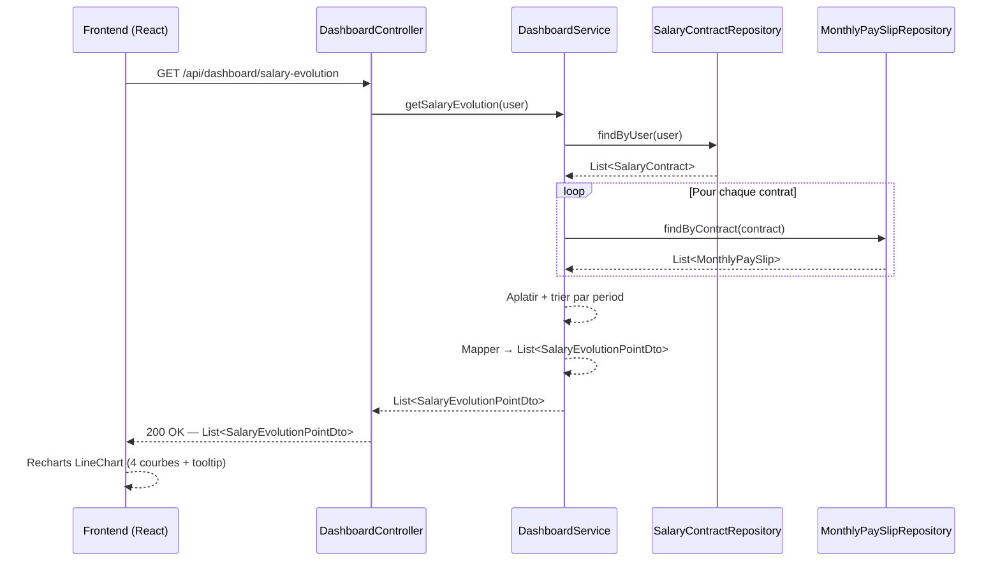
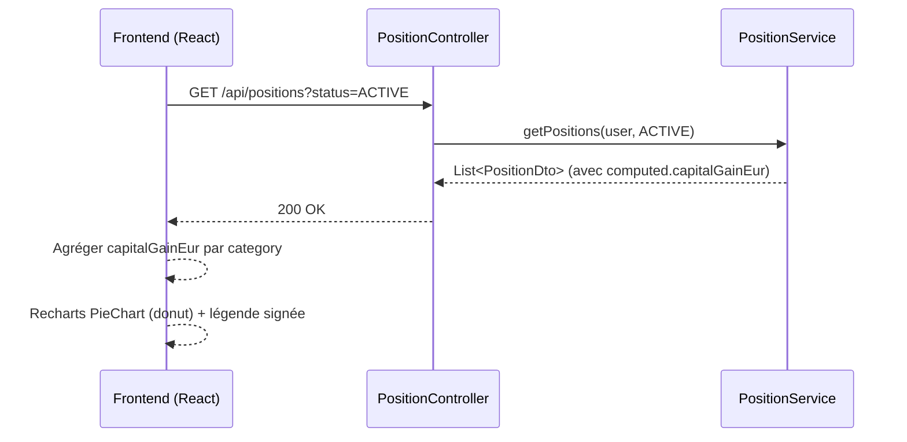

# Tableau de bord

## Vue d'ensemble

Le tableau de bord est la page d'accueil de l'application après connexion. Il offre une vision synthétique et temporelle des finances de l'utilisateur, sous forme de graphiques.

---

## 1. Graphique d'évolution salariale — `SalaryEvolutionChart`

### Objectif

Visualiser l'évolution dans le temps des quatre indicateurs issus des **bulletins de paie réels** (`MonthlyPaySlip`) de l'utilisateur :

| Indicateur | Champ source | Description |
|---|---|---|
| Salaire brut | `grossSalary` | Salaire brut mensuel |
| Net fiscal | `taxableNetSalary` | Revenu net après cotisations sociales, avant impôt |
| Net versé | `netSalary` | Montant effectivement reçu sur le compte |
| Prélèvement à la source | `incomeTaxWithholding` | Impôt prélevé sur le bulletin |

### Pourquoi MonthlyPaySlip et non les projections contrat ?

Les projections (`SalaryContractDto`) sont calculées à la volée avec les paramètres fiscaux **actuels** (PASS 2025, taux de cotisations 2025, barème IRPP 2025). Appliquer ces paramètres à des salaires historiques de 2012 ou 2018 produirait des valeurs fiscales fausses.

`MonthlyPaySlip` contient les **vraies valeurs du bulletin de paie** : les montants saisis reflètent ce qui a été réellement perçu, quel que soit le contexte fiscal de l'époque.

### Source de données

Un utilisateur peut avoir **plusieurs contrats** successifs dans le temps (changements d'employeur). Chaque contrat possède ses propres bulletins. Le graphique **agrège tous les bulletins de tous les contrats** de l'utilisateur, triés chronologiquement par `period`.

```
Contrat A (2022-01 → 2025-01)          Contrat B (2025-01 → en cours)
  bulletins : Jan 2022 … Déc 2024         bulletins : Jan 2025 … aujourd'hui
                     ↓                              ↓
              ────────────────────────────────────────────▶ temps
              Jan 22  …  Déc 24  Jan 25  …  aujourd'hui
```

Le nom de l'entreprise (`companyName`) est inclus dans chaque point pour permettre un affichage dans le tooltip ou un marqueur de changement d'employeur.

### Règles métier

- Seuls les mois ayant un bulletin saisi apparaissent sur le graphique (pas d'interpolation).
- Si l'utilisateur n'a aucun bulletin saisi, le graphique est vide (message d'invitation à saisir des bulletins).
- Les bulletins sont triés par `period` croissante, tous contrats confondus.
- En cas de chevauchement temporel entre deux contrats (cas anormal), les deux bulletins apparaissent.

### Composant frontend

**Fichier :** `frontend/src/components/dashboard/SalaryEvolutionChart.jsx`

**Librairie :** Recharts (`LineChart`)

**Courbes affichées :**

| Courbe | Couleur suggérée | Champ |
|---|---|---|
| Brut | indigo | `grossSalary` |
| Net fiscal | violet | `taxableNetSalary` |
| Net versé | vert | `netSalary` |
| Prélèvement à la source | orange | `incomeTaxWithholding` |

**Axes :**
- X : `period` (format `MMM YYYY`, ex : `Jan 2024`)
- Y : montant en € (axe gauche)

**Tooltip :** affiche les 4 valeurs + le nom de l'entreprise pour le mois survolé.

**Insights visuels attendus :**
- L'écart entre brut et net fiscal représente les cotisations sociales (~20-22 %)
- L'écart entre net fiscal et net versé représente le PAS
- Les primes et 13ème mois apparaissent comme des pics sur le brut
- Les changements d'employeur sont visibles par des sauts de salaire

### DTO backend

**`SalaryEvolutionPointDto`** — record Java, non persisté :

```java
record SalaryEvolutionPointDto(
    LocalDate period,
    String companyName,
    Float grossSalary,
    Float taxableNetSalary,
    Float netSalary,
    Float incomeTaxWithholding
) {}
```

### Flux de données



---

## 2. Graphique des plus-values par catégorie — `CapitalGainsByCategoryChart`

### Objectif

Visualiser la **répartition des plus-values latentes** du portefeuille de l'utilisateur par catégorie d'actif, sous forme de camembert (donut chart).

### Source de données

Le composant appelle directement `GET /api/positions?status=ACTIVE` (endpoint patrimoine existant) et agrège côté frontend le champ `computed.capitalGainEur` par catégorie.

```
plus-value catégorie = Σ position.computed.capitalGainEur  (pour toutes les positions actives de la catégorie)
```

Aucun endpoint dashboard dédié n'est nécessaire — les données proviennent du module patrimoine.

### Règles d'affichage

- Seules les catégories ayant une plus-value absolue > 0,01 € apparaissent dans le graphique.
- Les tranches du camembert représentent la **valeur absolue** de la plus-value (pour permettre l'affichage des catégories en perte).
- Les catégories en perte sont affichées avec une opacité réduite (0,45) et un label "en perte" dans la légende.
- La légende affiche la valeur réelle signée (+/−) en vert (`text-emerald-700`) pour les gains, rouge (`text-red-600`) pour les pertes.
- Un total général est affiché en bas de la légende.
- Si aucune position active n'existe (ou toutes à zéro), un message d'invitation s'affiche à la place.

### Couleurs par catégorie

Les couleurs sont cohérentes avec les badges de `PatrimoinePage` (même palette Tailwind, valeur hex utilisée pour Recharts) :

| Catégorie | Hex | Tailwind équivalent |
|---|---|---|
| `BOURSE` | `#2563eb` | `blue-600` |
| `CRYPTO` | `#7c3aed` | `violet-700` |
| `IMMO_PAPIER` | `#ea580c` | `orange-600` |
| `IMMO_PHYSIQUE` | `#dc2626` | `red-600` |
| `LIVRET` | `#06b6d4` | `cyan-500` (distinct de BOURSE) |
| `LIQUIDITE` | `#d97706` | `amber-600` |

> `LIVRET` utilise cyan plutôt que bleu pour le distinguer visuellement de `BOURSE` dans le camembert, les deux partageant `blue-700` dans les badges.

### Composant frontend

**Fichier :** `frontend/src/components/dashboard/CapitalGainsByCategoryChart.jsx`

**Librairie :** Recharts (`PieChart` + `Pie` + `Cell` + `Tooltip`)

**Layout :** camembert (donut, `innerRadius=58`, `outerRadius=96`) à gauche + légende personnalisée à droite, en `flex-col md:flex-row`.

**Largeur sur le dashboard :** `w-1/4` — la carte occupe un quart de la largeur disponible.

### Flux de données



---

---

## 3. Graphique d'évolution salariale annuelle — `SalaryAnnualBarChart`

### Objectif

Visualiser l'évolution du salaire **par année** sous forme de barres empilées, en distinguant les charges sociales, l'impôt estimé et le net d'impôt.

### Source de données

Le composant appelle `GET /api/salary-contracts` puis `GET /api/salary-contracts/{id}/revisions` pour chaque contrat. Le calcul est entièrement **côté frontend**.

### Algorithme de construction

Pour chaque année couverte par au moins un contrat :

1. Sélectionner le contrat actif au 31 décembre de l'année (le plus récent si chevauchement).
2. Identifier la révision salariale active au 31 décembre (`MAX(effectiveDate ≤ 31/12/année)`).
3. Appliquer le salaire brut de la révision ; à défaut, celui du contrat de base.
4. Extrapoler `netImposable` et `netAfterTax` par proportionnalité (les ratios du contrat de base sont appliqués au brut révisé).

### Segments empilés

| Segment | Couleur | Calcul |
|---------|---------|--------|
| Net d'impôt (`segBase`) | `#059669` vert | `netAfterTax` |
| Impôt estimé (`segImpot`) | `#f97316` orange | `netImposable − netAfterTax` |
| Charges sociales (`segCharges`) | `#d1d5db` gris | `brut − netImposable` |

> Si le profil fiscal de l'utilisateur est incomplet (`netAfterTax = null`), seuls deux niveaux sont affichés : net imposable (violet) et charges sociales (gris).

### Composant frontend

**Fichier :** `frontend/src/components/dashboard/SalaryAnnualBarChart.jsx`

**Librairie :** Recharts (`BarChart`, barres empilées via `stackId`)

**Axes :**
- X : année (`year`)
- Y : montant en k€

**Tooltip :** affiche brut, net imposable, net d'impôt + nom de l'entreprise pour l'année survolée.

---

## 4. Répartition du patrimoine par catégorie — `PatrimoineByCategoryChart`

### Objectif

Visualiser la **répartition de la valeur actuelle** du portefeuille par catégorie d'actif. Utilisé en deux variantes sur le dashboard :
- **Patrimoine brut** : toutes catégories confondues.
- **Patrimoine financier** (`financierOnly = true`) : hors `IMMO_PHYSIQUE` et `IMMO_PAPIER`.

### Source de données

Appelle `GET /api/positions?status=ACTIVE` et agrège `computed.currentValueEur` par catégorie côté frontend.

### Règles d'affichage

- Seules les catégories avec une valeur > 0,01 € apparaissent.
- Les couleurs sont celles de `CATEGORY_META.chartColor` défini dans `constants.js`.
- La légende affiche le pourcentage et le montant pour chaque catégorie + un total en pied.

### Composant frontend

**Fichier :** `frontend/src/components/dashboard/PatrimoineByCategoryChart.jsx`

**Librairie :** Recharts (`PieChart` donut, `innerRadius=42`, `outerRadius=72`)

**Props :**

| Prop | Type | Défaut | Description |
|------|------|--------|-------------|
| `financierOnly` | `boolean` | `false` | Si `true`, exclut `IMMO_PHYSIQUE` et `IMMO_PAPIER` |

---

## 5. Répartition du patrimoine par enveloppe fiscale — `PatrimoineByEnvelopeChart`

### Objectif

Visualiser la **répartition du patrimoine brut par enveloppe fiscale** (AV, PEA, CTO, Hors enveloppe…).

### Source de données

Appelle `GET /api/positions?status=ACTIVE` et agrège `computed.currentValueEur` par `fiscalEnvelope` côté frontend. Les positions sans enveloppe (`null`) sont comptabilisées sous `NONE`.

### Règles d'affichage

- Seules les enveloppes avec une valeur > 0,01 € apparaissent.
- Les couleurs proviennent de `FISCAL_ENVELOPE_LABELS.chartColor` défini dans `constants.js`.
- La légende affiche le pourcentage et le montant + un total en pied.

### Composant frontend

**Fichier :** `frontend/src/components/dashboard/PatrimoineByEnvelopeChart.jsx`

**Librairie :** Recharts (`PieChart` donut, `innerRadius=42`, `outerRadius=72`)

---

## 6. Répartition des dépenses par catégorie — `ExpensesByCategoryChart`

### Objectif

Visualiser la **répartition des dépenses mensuelles récurrentes** par catégorie, ainsi que la capacité d'épargne résiduelle.

### Source de données

Appelle `GET /api/recurring-expenses/summary` (endpoint dépenses existant) qui retourne :
- `byCategory[]` : liste des catégories avec `monthlyAmount`
- `totalMonthlyExpenses` : total mensuel
- `savingsCapacity` : capacité d'épargne (net mensuel − dépenses)
- `savingsRate` : taux d'épargne en %

### Règles d'affichage

- Seules les catégories avec un montant > 0,01 €/mois apparaissent.
- Catégories triées par montant décroissant.
- La légende affiche le % et le montant mensuel par catégorie.
- En pied : total mensuel + capacité d'épargne (vert si ≥ 0, rouge si négatif).
- La capacité d'épargne n'est affichée que si `savingsRate != null`.

### Couleurs par catégorie

| Catégorie | Hex |
|-----------|-----|
| `LOGEMENT` | `#60a5fa` bleu clair |
| `TRANSPORT` | `#fb923c` orange |
| `ASSURANCES` | `#f87171` rouge clair |
| `ABONNEMENTS` | `#a78bfa` violet clair |
| `SANTE` | `#4ade80` vert |
| `FAMILLE` | `#f472b6` rose |
| `ALIMENTATION` | `#facc15` jaune |
| `EPARGNE` | `#2dd4bf` teal |
| `AUTRE` | `#9ca3af` gris |

### Composant frontend

**Fichier :** `frontend/src/components/dashboard/ExpensesByCategoryChart.jsx`

**Librairie :** Recharts (`PieChart` donut, `innerRadius=42`, `outerRadius=72`)

---

## 7. Répartition des passifs par catégorie — `PassifsByCategoryChart`

### Objectif

Visualiser la **valeur actuelle estimée des grandes possessions** (passifs) par catégorie, et rappeler la décote cumulée depuis l'achat.

### Positionnement sur le dashboard

Sur la même ligne que « Détail mensuel par bulletins » (`SalaryEvolutionChart`) : le graphique salarial occupe **2/3** de la largeur, ce chart **1/3** — layout `grid-cols-3`, même principe que la ligne « Évolution salariale annuelle » + « Répartition des dépenses ».

### Source de données

Appelle `GET /api/possessions/summary` (endpoint passifs) qui retourne :
- `byCategory[]` : liste des catégories avec `totalEffectiveValue`, `totalPurchasePrice`, `totalDepreciation`
- `totalEffectiveValue` : valeur actuelle totale
- `totalDepreciation` : décote cumulée totale (€)
- `globalDepreciationRate` : taux de décote global (%)

### Règles d'affichage

- Seules les catégories avec une `totalEffectiveValue` > 0,01 € apparaissent.
- Catégories triées par valeur actuelle décroissante.
- La légende affiche le % (part dans la valeur actuelle totale) et la valeur actuelle par catégorie.
- En pied : valeur actuelle totale + décote cumulée en rouge (montant et %).
- La décote n'est affichée que si elle est > 0.
- Le tooltip détaille pour chaque tranche : valeur actuelle, % et décote cumulée de la catégorie.

### Couleurs par catégorie

| Catégorie | Hex | Note |
|-----------|-----|------|
| `VEHICULE` | `#818cf8` | indigo-400 |
| `INFORMATIQUE` | `#22d3ee` | cyan-400 |
| `ELECTROMENAGER` | `#fbbf24` | amber-400 |
| `MOBILIER` | `#84cc16` | lime-400 |
| `COLLECTION` | `#f472b6` | pink-400 |
| `LOISIRS` | `#2dd4bf` | teal-400 |
| `AUTRE` | `#9ca3af` | gray-400 |

> Les couleurs sont cohérentes avec les badges de `PossessionPage` (`CATEGORY_META`).

### Composant frontend

**Fichier :** `frontend/src/components/dashboard/PassifsByCategoryChart.jsx`

**Librairie :** Recharts (`PieChart` donut, `innerRadius=42`, `outerRadius=72`)

---

## 8. Évolution du patrimoine par catégorie — `PatrimoineEvolutionChart`

### Objectif

Visualiser l'évolution de la valeur du patrimoine dans le temps, par catégorie d'actif, à partir des relevés de patrimoine (snapshots) saisis par l'utilisateur.

### Source de données

1. `GET /api/portfolio/snapshots` → liste des snapshots (résumés)
2. `GET /api/portfolio/snapshots/{id}` × N → détail de chaque snapshot (positions)
3. `GET /api/positions?status=ACTIVE` → positions actives pour le point « temps réel »

Les snapshots et les positions actives sont fusionnés dans un tableau de points chronologiques.

### Règles de construction des données

- Les points de snapshot sont triés par `snapshotDate` croissant.
- Un point supplémentaire **"Aujourd'hui"** est ajouté en fin de série à partir de `computed.currentValueEur` des positions actives — sauf si un snapshot de la journée existe déjà.
- L'axe X utilise des **timestamps Unix** pour garantir un espacement temporel proportionnel (Recharts `type="number" scale="time"`).

### Modes d'affichage

| Mode | Description |
|------|-------------|
| **Valeur (€)** | Aires empilées en valeur absolue — le total est visible dans le tooltip |
| **Répartition (%)** | Chaque catégorie normalisée à 100 % — permet de visualiser l'évolution de la composition |

### Ordre des catégories (bas → haut)

`IMMO_PHYSIQUE` → `IMMO_PAPIER` → `LIQUIDITE` → `LIVRET` → `CRYPTO` → `BOURSE`

### Point live

- Le point "Aujourd'hui" est identifié par `isLive: true`.
- Il est dessiné avec un point plus grand (r=5, contour blanc) pour le distinguer des snapshots saisis.
- Une `ReferenceLine` verticale en pointillé violet est ajoutée avec le label "Auj.".

### Composant frontend

**Fichier :** `frontend/src/components/dashboard/PatrimoineEvolutionChart.jsx`

**Librairie :** Recharts (`AreaChart` empilé, `stackId="a"`)

**Positionnement sur le dashboard :** `col-span-2` dans une grille `grid-cols-3`, le widget FIRE occupe la 3e colonne.

---

## 9. Widget FIRE — `FireProjectionWidget`

### Objectif

Afficher une projection de l'**indépendance financière** (méthode FIRE — Financial Independence, Retire Early) : estimation du nombre d'années restant avant d'atteindre le seuil où les revenus passifs couvrent l'ensemble des dépenses.

### Principe FIRE

```
Objectif FIRE = Dépenses annuelles × 25   (règle des 4 %)
Années restantes = f(patrimoine actuel, épargne mensuelle, rendement pondéré)
```

### Sources de données (6 appels parallèles)

| Endpoint | Usage |
|----------|-------|
| `GET /api/salary-contracts` | Salaire mensuel net actif |
| `GET /api/other-incomes` | Revenus complémentaires (LOCATIF, DIVIDENDE, AIDE_SOCIALE) |
| `GET /api/positions?status=ACTIVE` | Patrimoine financier + rendement pondéré |
| `GET /api/tax-simulator` | Impôt mensuel estimé (`.catch(() => null)` si indisponible) |
| `GET /api/recurring-expenses/summary` | Dépenses mensuelles par catégorie |

### Calculs clés

**Patrimoine financier (`totalActif`)** : somme de `computed.currentValueEur` de toutes les positions actives **hors `IMMO_PHYSIQUE`**.

**Rendement pondéré** :
```
weightedRate = Σ(valeur_catégorie × PROJECTION_RATES[cat]) / totalActif
```

**Années restantes** (formule des intérêts composés) :
```
r   = (1 + weightedRate)^(1/12) − 1   (taux mensuel)
n   = ln((FV·r + PMT) / (PV·r + PMT)) / ln(1 + r)
années = n / 12
```
Avec `PV = totalActif`, `PMT = épargne mensuelle (Δ R-D)`, `FV = objectif FIRE`.

**Revenus passifs mensuels** :
```
revenusPassifs = (totalActif × weightedRate) / 12 + totalOtherIncome
```

### Sections affichées

| Section | Contenu |
|---------|---------|
| Résultat principal | `~X.X ans` vers `AAAA` ou « Objectif atteint ! » |
| Barre de progression | `totalActif / fireTarget` avec jalons à 25/50/75 % |
| Autonomie passive | Revenus passifs vs dépenses, barre de couverture % |
| Hypothèses | Taux d'épargne, épargne mensuelle, rendement pondéré, dépenses annuelles |

### Composant frontend

**Fichier :** `frontend/src/components/dashboard/FireProjectionWidget.jsx`

**Positionnement sur le dashboard :** colonne droite (`col-span-1`) aux côtés de `PatrimoineEvolutionChart`, fond violet (`bg-violet-50 border-violet-200`).

---

## 10. Avancement vers les objectifs — `PatrimoineStrategyRadarChart`

### Objectif

Visualiser en radar le **taux d'atteinte des objectifs patrimoniaux** par catégorie d'actif : superposition de la cible (100 %) et de la situation actuelle (% de l'objectif atteint).

### Source de données

Deux appels parallèles :
- `GET /api/positions?status=ACTIVE` — valeur actuelle par catégorie
- `GET /api/patrimoine/targets` — objectifs cibles (`Map<String, Double>`)

Le calcul `currentPct = currentValue / targetValue × 100` est effectué côté frontend. La valeur est plafonnée à 120 % pour l'affichage du radar (les dépassements restent lisibles sans écraser les autres axes).

### Règles d'affichage

- Seules les catégories ayant un objectif défini et > 0 apparaissent.
- L'ordre des axes est fixe : `LIQUIDITE → LIVRET → BOURSE → CRYPTO → IMMO_PAPIER → IMMO_PHYSIQUE`.
- Axe cible tracé en pointillé gris (100 % pour chaque catégorie).
- Axe actuel tracé en indigo plein avec points.
- Tooltip détaillé : valeur actuelle, objectif, avancement % (rouge si dépassé, émeraude si ≥ 100 %, indigo sinon).
- Si aucun objectif n'est défini, message d'invitation vers la page Patrimoine → Stratégie & Objectifs.

### Composant frontend

**Fichier :** `frontend/src/components/dashboard/PatrimoineStrategyRadarChart.jsx`

**Librairie :** Recharts (`RadarChart`, `Radar`, `PolarGrid`, `PolarAngleAxis`)

**Positionnement sur le dashboard :** 1 colonne sur 3 dans la section Patrimoine (bas de page), aux côtés de `DetteWidget` (2 colonnes).

---

## 11. Widget d'endettement — `DetteWidget`

### Objectif

Afficher une **synthèse de l'endettement** de l'utilisateur : capital restant dû, charge mensuelle, avancement du remboursement par type de crédit, et indicateurs contextuels (ratio patrimoine, ratio salaire, coût restant, date de libération).

### Source de données

Quatre appels parallèles au chargement :

| Endpoint | Usage |
|----------|-------|
| `GET /api/debts/summary` | KPIs globaux (capital, mensualité, nombre de crédits, répartition par type) |
| `GET /api/debts` | Détail par dette (endDate, monthlyPayment, remainingCapital, initialCapital, type) |
| `GET /api/positions?status=ACTIVE` | Patrimoine brut pour le ratio dette/patrimoine |
| `GET /api/salary-contracts` | Salaire net mensuel pour le ratio d'endettement |

Le widget retourne `null` si aucune dette n'est enregistrée (`totalCount === 0`).

### Calculs clés

| Indicateur | Formule |
|------------|---------|
| Ratio dette/patrimoine | `totalRemainingCapital / patrimoineBrut × 100` |
| Ratio d'endettement | `totalMonthlyCost / salaryNetMensuel × 100` |
| Intérêts restants | `Σ max(0, monthlyPayment × monthsRemaining − remainingCapital)` |
| Avancement global | Moyenne de `(1 − remainingCapital / initialCapital) × 100` sur toutes les dettes avec `initialCapital > 0` |
| Date de libération | `max(endDate)` de toutes les dettes ayant une date de fin |

### Seuils de couleur

**Ratio dette/patrimoine :**
- < 30 % → émeraude
- 30–60 % → ambre
- ≥ 60 % → rouge

**Ratio d'endettement mensuel (règle des 33 %) :**
- < 33 % → émeraude
- 33–40 % → ambre
- ≥ 40 % → rouge

**Barres de progression :**
- ≥ 75 % → émeraude
- 40–75 % → indigo
- < 40 % → ambre

### Sections affichées

| Section | Description |
|---------|-------------|
| 3 KPIs | Capital restant (+ ratio patrimoine), Mensualité totale (+ ratio salaire), Crédits en cours (+ "Libre en AAAA") |
| Intérêts restants | Bandeau ambre — coût total du crédit restant à payer hors assurance (masqué si ≤ 100 €) |
| Avancement global | Barre de progression moyenne sur tous les crédits avec initialCapital |
| Progression par type | Barre par type de crédit (IMMOBILIER, VEHICULE, ETUDIANT…), triée par capital restant décroissant |
| Lien navigation | Bouton "Voir mes dettes →" si la prop `onNavigate` est fournie |

### Props

| Prop | Type | Description |
|------|------|-------------|
| `onNavigate` | `function(page)` | Callback de navigation — si fourni, affiche un lien "Voir mes dettes" |

### Chaîne de navigation

```
App.jsx (handleNavigate)
  → DashboardPage (onNavigate prop)
    → DetteWidget (onNavigate prop)
      → bouton "Voir mes dettes →" → onNavigate('debts')
```

### Composant frontend

**Fichier :** `frontend/src/components/dashboard/DetteWidget.jsx`

**Positionnement sur le dashboard :** 2 colonnes sur 3 dans la section Patrimoine (bas de page), aux côtés de `PatrimoineStrategyRadarChart` (1 colonne).

---

## 12. Flux des revenus — `CashFlowSankeyWidget`

### Objectif

Visualiser sous forme de **diagramme Sankey** le flux complet des revenus mensuels vers les postes de dépenses et la capacité d'épargne. Permet de voir d'un coup d'œil où part chaque euro et combien il en reste pour l'épargne.

### Principe Sankey

Les flèches du diagramme sont proportionnelles aux montants :

```
Salaire net      ─┐
Locatif          ─┤
Dividendes       ─┤   ┌─→ Logement
Autres revenus   ─┘─→ Total ─┤─→ Transport
                              ├─→ Abonnements
                              ├─→ …
                              └─→ Capacité d'épargne (résiduelle)
```

### Source de données

- `GET /api/recurring-expenses/summary` → revenus de référence + totaux par catégorie de dépense
- `GET /api/other-incomes` → décomposition des revenus complémentaires par type (LOCATIF, DIVIDENDE, AIDE_SOCIALE, AUTRE)
- `GET /api/salary-contracts` → revenu salarial net après impôt du contrat actif

### Règles d'affichage

- Les flux nuls (catégories sans dépense) ne sont pas affichés
- Capacité d'épargne en bleu/indigo, dépenses en couleurs catégorielles
- Tooltip Recharts détaillant le montant exact de chaque flux

### Composant frontend

**Fichier :** `frontend/src/components/dashboard/CashFlowSankeyWidget.jsx`

**Toggle config :** `cashFlow` dans `DashboardCustomizePanel`.

**Positionnement sur le dashboard :** dans la section "Revenus & Dépenses". Quand `upcomingExpenses` est activé, occupe 2/3 de la largeur avec le widget "Prochains prélèvements" à droite ; sinon pleine largeur.

---

## 13. Prochains prélèvements — `UpcomingExpensesWidget`

### Objectif

Lister les prochaines échéances de dépenses récurrentes afin d'anticiper les sorties d'argent. Particulièrement utile pour les **dépenses annuelles** qui surprennent l'utilisateur si oubliées.

### Source de données

- `GET /api/recurring-expenses` → liste des dépenses actives avec leurs dates de prélèvement (`paymentDay` pour MONTHLY, `startDate` pour ANNUAL)

Aucun nouvel endpoint — tout le calcul se fait côté frontend.

### Logique de filtrage

Pour chaque dépense **active** (sans `endDate` ou avec `endDate >= aujourd'hui`) ayant une **date de prélèvement exploitable** :

| Fréquence | Date utilisée | Fenêtre d'affichage |
|---|---|---|
| MONTHLY | prochain `paymentDay` à partir d'aujourd'hui | 14 jours |
| ANNUAL | prochain anniversaire de `startDate` (jour + mois) | 60 jours |

Les dépenses sans date sont ignorées. Résultat trié chronologiquement, **6 maximum**.

### Fallback intelligent

Si **aucune échéance** n'entre dans les fenêtres ci-dessus, le widget affiche la **prochaine dépense annuelle** quelle que soit la date — pour ne jamais rater une grosse échéance annuelle même en période calme.

### Règles d'affichage

- **Date relative** : "Aujourd'hui" · "Demain" · "Dans Xj" (≤ 7 jours) · "15 juin" (au-delà)
- **Lignes urgentes** (≤ 3 jours) : fond orange pour attirer l'attention
- **Badge "annuel"** en ambre sur les prélèvements annuels (les "surprises")
- **Pastille de catégorie** colorée pour identification visuelle rapide
- Lien *"Voir tout →"* vers le calendrier des abonnements
- État vide avec lien direct vers *Mes dépenses* pour ajouter des dates

### Props

| Prop | Description |
|---|---|
| `onNavigate` | Callback pour la navigation (utilisé par les liens "Voir tout" et l'état vide) |

### Composant frontend

**Fichier :** `frontend/src/components/dashboard/UpcomingExpensesWidget.jsx`

**Toggle config :** `upcomingExpenses` dans `DashboardCustomizePanel`.

**Positionnement sur le dashboard :** à droite de `CashFlowSankeyWidget` (proportion 2/3 + 1/3). Si l'un des deux est désactivé, l'autre prend toute la largeur.

---

## Personnalisation du tableau de bord

> **Statut : Implémenté** — Paliers 1, 2 et 3 livrés.

### Architecture générale

Le tableau de bord utilise une grille 12 colonnes (`react-grid-layout v2`) avec drag & drop et redimensionnement. Chaque utilisateur peut avoir jusqu'à **5 tableaux de bord nommés**, chacun avec son propre layout persisté en base.

```
DashboardPage
├── DashboardSelector          ← onglets de navigation entre dashboards
├── DashboardGrid              ← grille react-grid-layout
│   └── WidgetCell             ← wrapper par widget (carte, mode édition, badge)
├── DashboardCustomizePanel    ← panneau show/hide widgets + séparateurs
├── DashboardCreateModal       ← création d'un dashboard avec template
└── DashboardManagePanel       ← renommer, réordonner, supprimer dashboards
```

### Registre des widgets — `widgets-registry.js`

Chaque widget est décrit par une entrée dans `WIDGETS` :

```js
'patrimoine-brut': {
  label:       'Patrimoine brut',
  cardTitle:   'Patrimoine brut',       // affiché dans la carte
  section:     'patrimoine',
  defaultSize: { w: 3, h: 6, minW: 2, minH: 3 },
  component:   PatrimoineByCategoryChart,
  getProps:    (ctx) => ({ positions: ctx.familyPositions }),
  // Optionnel :
  noCard:      false,   // true = widget avec son propre wrapper de carte
  autoHide:    false,   // true = se masque si onEmpty() est appelé
  maxH:        2,       // verrouiller la hauteur max
}
```

Le registre expose aussi `DEFAULT_STATE` (layout par défaut) et `buildLayoutForItems()` utilisé par les templates.

### Affichage adaptatif — système xs/sm/md/lg

Chaque widget reçoit une prop `size` calculée par `calcSize(w, h, thresholds)` :

| Taille | Condition (par défaut) | Usage |
|--------|----------------------|-------|
| `xs` | w ≤ 3 ET h ≤ 3 | Vue ultra-compacte, chiffres clés seulement |
| `sm` | w ≤ 4 ET h ≤ 4 | Vue compacte, légende réduite |
| `md` | w ≤ 6 ET h ≤ 6 | Vue standard (défaut) |
| `lg` | au-delà | Vue enrichie avec détails supplémentaires |

Certains widgets surchargent ces seuils via `sizeThresholds` dans le registre (ex: `salary-annual` avec `md:[6,5]`).

### Persistance — modèle de données

Le layout est sérialisé en JSON et stocké dans `user_dashboard_layouts` :

```json
{
  "version": 1,
  "layouts": {
    "lg": [{ "i": "patrimoine-net", "x": 0, "y": 0, "w": 3, "h": 6, "minW": 2, "minH": 3 }],
    "md": [...],
    "xs": [...]
  },
  "hiddenWidgets": ["sector-exposure", "geographic-exposure"],
  "dividers": {
    "divider-revenues": { "label": "Revenus & Dépenses", "subtitle": "..." }
  }
}
```

**Entités backend :**

| Entité | Table | Rôle |
|--------|-------|------|
| `UserDashboard` | `user_dashboards` | Dashboard nommé (isDefault, sortOrder) |
| `UserDashboardLayout` | `user_dashboard_layouts` | Layout JSON associé à un dashboard |

`UserDashboard.createdAt/updatedAt` utilisent `LocalDateTimeConverter` (converter JPA custom) pour contourner l'incompatibilité Hibernate 6 + SQLite JDBC sur le stockage des timestamps.

### Multi-dashboards — Palier 3

- Maximum 5 dashboards par utilisateur
- Sélecteur sous forme d'onglets (desktop) ou `<select>` (mobile)
- 3 templates disponibles à la création : **Synthèse** (layout par défaut), **Salarié** (focus revenus), **Investisseur** (focus patrimoine)
- Migration automatique Palier 2 → 3 : au premier accès, le layout existant est migré dans un dashboard "Principal" (`isDefault=true`)
- Cascade applicative à la suppression de compte via `UserService.delete()`

### Mode édition

- Bordures pointillées indigo sur les widgets
- Poignée drag (`.drag-handle`) + poignée resize (coin bas-droite)
- Badge absolu `label + ✕` sur chaque widget pour le masquer
- Séparateurs de section avec label et sous-titre éditables inline
- Auto-save debounced 1 seconde après chaque modification

### Scripts de migration

`backend/migrations/027_create_user_dashboards.sql` — script one-shot à exécuter **avant** le déploiement en production. Crée `user_dashboards`, migre les layouts existants, recrée `user_dashboard_layouts` avec `dashboard_id`.
