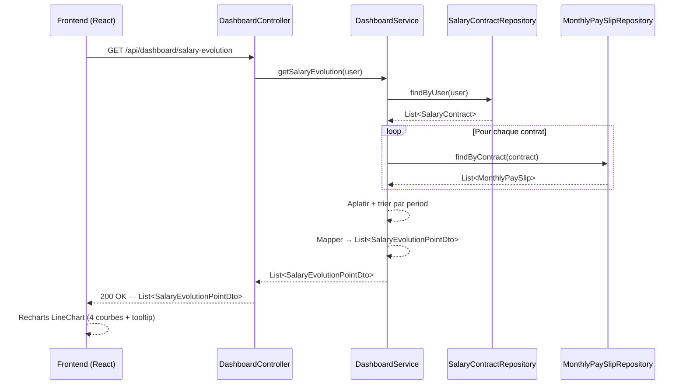
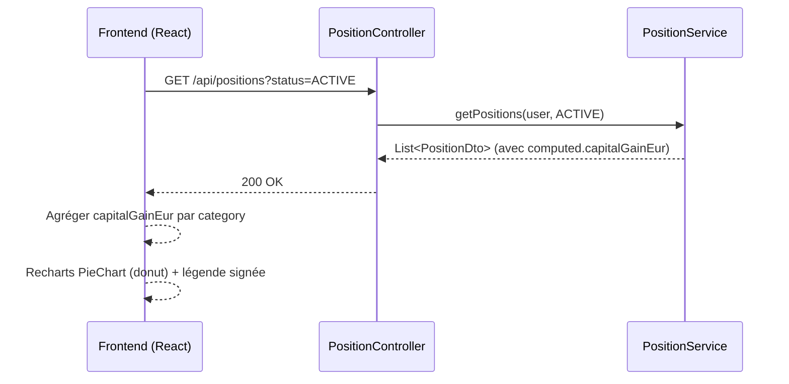

# Tableau de bord

## Vue d'ensemble

Le tableau de bord est la page d'accueil de l'application après connexion. Il offre une vision synthétique et temporelle des finances de l'utilisateur, sous forme de graphiques.

---

## 1. Graphique d'évolution salariale — `SalaryEvolutionChart`

### Objectif

Visualiser l'évolution dans le temps des quatre indicateurs issus des **bulletins de paie réels** (`MonthlyPaySlip`) de l'utilisateur :

| Indicateur | Champ source | Description |
|---|---|---|
| Salaire brut | `grossSalary` | Salaire brut mensuel |
| Net fiscal | `taxableNetSalary` | Revenu net après cotisations sociales, avant impôt |
| Net versé | `netSalary` | Montant effectivement reçu sur le compte |
| Prélèvement à la source | `incomeTaxWithholding` | Impôt prélevé sur le bulletin |

### Pourquoi MonthlyPaySlip et non les projections contrat ?

Les projections (`SalaryContractDto`) sont calculées à la volée avec les paramètres fiscaux **actuels** (PASS 2025, taux de cotisations 2025, barème IRPP 2025). Appliquer ces paramètres à des salaires historiques de 2012 ou 2018 produirait des valeurs fiscales fausses.

`MonthlyPaySlip` contient les **vraies valeurs du bulletin de paie** : les montants saisis reflètent ce qui a été réellement perçu, quel que soit le contexte fiscal de l'époque.

### Source de données

Un utilisateur peut avoir **plusieurs contrats** successifs dans le temps (changements d'employeur). Chaque contrat possède ses propres bulletins. Le graphique **agrège tous les bulletins de tous les contrats** de l'utilisateur, triés chronologiquement par `period`.

```
Contrat A (2022-01 → 2025-01)          Contrat B (2025-01 → en cours)
  bulletins : Jan 2022 … Déc 2024         bulletins : Jan 2025 … aujourd'hui
                     ↓                              ↓
              ────────────────────────────────────────────▶ temps
              Jan 22  …  Déc 24  Jan 25  …  aujourd'hui
```

Le nom de l'entreprise (`companyName`) est inclus dans chaque point pour permettre un affichage dans le tooltip ou un marqueur de changement d'employeur.

### Règles métier

- Seuls les mois ayant un bulletin saisi apparaissent sur le graphique (pas d'interpolation).
- Si l'utilisateur n'a aucun bulletin saisi, le graphique est vide (message d'invitation à saisir des bulletins).
- Les bulletins sont triés par `period` croissante, tous contrats confondus.
- En cas de chevauchement temporel entre deux contrats (cas anormal), les deux bulletins apparaissent.

### Composant frontend

**Fichier :** `frontend/src/components/dashboard/SalaryEvolutionChart.jsx`

**Librairie :** Recharts (`LineChart`)

**Courbes affichées :**

| Courbe | Couleur suggérée | Champ |
|---|---|---|
| Brut | indigo | `grossSalary` |
| Net fiscal | violet | `taxableNetSalary` |
| Net versé | vert | `netSalary` |
| Prélèvement à la source | orange | `incomeTaxWithholding` |

**Axes :**
- X : `period` (format `MMM YYYY`, ex : `Jan 2024`)
- Y : montant en € (axe gauche)

**Tooltip :** affiche les 4 valeurs + le nom de l'entreprise pour le mois survolé.

**Insights visuels attendus :**
- L'écart entre brut et net fiscal représente les cotisations sociales (~20-22 %)
- L'écart entre net fiscal et net versé représente le PAS
- Les primes et 13ème mois apparaissent comme des pics sur le brut
- Les changements d'employeur sont visibles par des sauts de salaire

### DTO backend

**`SalaryEvolutionPointDto`** — record Java, non persisté :

```java
record SalaryEvolutionPointDto(
    LocalDate period,
    String companyName,
    Float grossSalary,
    Float taxableNetSalary,
    Float netSalary,
    Float incomeTaxWithholding
) {}
```

### Flux de données



---

## 2. Graphique des plus-values par catégorie — `CapitalGainsByCategoryChart`

### Objectif

Visualiser la **répartition des plus-values latentes** du portefeuille de l'utilisateur par catégorie d'actif, sous forme de camembert (donut chart).

### Source de données

Le composant appelle directement `GET /api/positions?status=ACTIVE` (endpoint patrimoine existant) et agrège côté frontend le champ `computed.capitalGainEur` par catégorie.

```
plus-value catégorie = Σ position.computed.capitalGainEur  (pour toutes les positions actives de la catégorie)
```

Aucun endpoint dashboard dédié n'est nécessaire — les données proviennent du module patrimoine.

### Règles d'affichage

- Seules les catégories ayant une plus-value absolue > 0,01 € apparaissent dans le graphique.
- Les tranches du camembert représentent la **valeur absolue** de la plus-value (pour permettre l'affichage des catégories en perte).
- Les catégories en perte sont affichées avec une opacité réduite (0,45) et un label "en perte" dans la légende.
- La légende affiche la valeur réelle signée (+/−) en vert (`text-emerald-700`) pour les gains, rouge (`text-red-600`) pour les pertes.
- Un total général est affiché en bas de la légende.
- Si aucune position active n'existe (ou toutes à zéro), un message d'invitation s'affiche à la place.

### Couleurs par catégorie

Les couleurs sont cohérentes avec les badges de `PatrimoinePage` (même palette Tailwind, valeur hex utilisée pour Recharts) :

| Catégorie | Hex | Tailwind équivalent |
|---|---|---|
| `BOURSE` | `#2563eb` | `blue-600` |
| `CRYPTO` | `#7c3aed` | `violet-700` |
| `IMMO_PAPIER` | `#ea580c` | `orange-600` |
| `IMMO_PHYSIQUE` | `#dc2626` | `red-600` |
| `LIVRET` | `#06b6d4` | `cyan-500` (distinct de BOURSE) |
| `LIQUIDITE` | `#d97706` | `amber-600` |

> `LIVRET` utilise cyan plutôt que bleu pour le distinguer visuellement de `BOURSE` dans le camembert, les deux partageant `blue-700` dans les badges.

### Composant frontend

**Fichier :** `frontend/src/components/dashboard/CapitalGainsByCategoryChart.jsx`

**Librairie :** Recharts (`PieChart` + `Pie` + `Cell` + `Tooltip`)

**Layout :** camembert (donut, `innerRadius=58`, `outerRadius=96`) à gauche + légende personnalisée à droite, en `flex-col md:flex-row`.

**Largeur sur le dashboard :** `w-1/4` — la carte occupe un quart de la largeur disponible.

### Flux de données



---

---

## 3. Graphique d'évolution salariale annuelle — `SalaryAnnualBarChart`

### Objectif

Visualiser l'évolution du salaire **par année** sous forme de barres empilées, en distinguant les charges sociales, l'impôt estimé et le net d'impôt.

### Source de données

Le composant appelle `GET /api/salary-contracts` puis `GET /api/salary-contracts/{id}/revisions` pour chaque contrat. Le calcul est entièrement **côté frontend**.

### Algorithme de construction

Pour chaque année couverte par au moins un contrat :

1. Sélectionner le contrat actif au 31 décembre de l'année (le plus récent si chevauchement).
2. Identifier la révision salariale active au 31 décembre (`MAX(effectiveDate ≤ 31/12/année)`).
3. Appliquer le salaire brut de la révision ; à défaut, celui du contrat de base.
4. Extrapoler `netImposable` et `netAfterTax` par proportionnalité (les ratios du contrat de base sont appliqués au brut révisé).

### Segments empilés

| Segment | Couleur | Calcul |
|---------|---------|--------|
| Net d'impôt (`segBase`) | `#059669` vert | `netAfterTax` |
| Impôt estimé (`segImpot`) | `#f97316` orange | `netImposable − netAfterTax` |
| Charges sociales (`segCharges`) | `#d1d5db` gris | `brut − netImposable` |

> Si le profil fiscal de l'utilisateur est incomplet (`netAfterTax = null`), seuls deux niveaux sont affichés : net imposable (violet) et charges sociales (gris).

### Composant frontend

**Fichier :** `frontend/src/components/dashboard/SalaryAnnualBarChart.jsx`

**Librairie :** Recharts (`BarChart`, barres empilées via `stackId`)

**Axes :**
- X : année (`year`)
- Y : montant en k€

**Tooltip :** affiche brut, net imposable, net d'impôt + nom de l'entreprise pour l'année survolée.

---

## 4. Répartition du patrimoine par catégorie — `PatrimoineByCategoryChart`

### Objectif

Visualiser la **répartition de la valeur actuelle** du portefeuille par catégorie d'actif. Utilisé en deux variantes sur le dashboard :
- **Patrimoine brut** : toutes catégories confondues.
- **Patrimoine financier** (`financierOnly = true`) : hors `IMMO_PHYSIQUE` et `IMMO_PAPIER`.

### Source de données

Appelle `GET /api/positions?status=ACTIVE` et agrège `computed.currentValueEur` par catégorie côté frontend.

### Règles d'affichage

- Seules les catégories avec une valeur > 0,01 € apparaissent.
- Les couleurs sont celles de `CATEGORY_META.chartColor` défini dans `constants.js`.
- La légende affiche le pourcentage et le montant pour chaque catégorie + un total en pied.

### Composant frontend

**Fichier :** `frontend/src/components/dashboard/PatrimoineByCategoryChart.jsx`

**Librairie :** Recharts (`PieChart` donut, `innerRadius=42`, `outerRadius=72`)

**Props :**

| Prop | Type | Défaut | Description |
|------|------|--------|-------------|
| `financierOnly` | `boolean` | `false` | Si `true`, exclut `IMMO_PHYSIQUE` et `IMMO_PAPIER` |

---

## 5. Répartition du patrimoine par enveloppe fiscale — `PatrimoineByEnvelopeChart`

### Objectif

Visualiser la **répartition du patrimoine brut par enveloppe fiscale** (AV, PEA, CTO, Hors enveloppe…).

### Source de données

Appelle `GET /api/positions?status=ACTIVE` et agrège `computed.currentValueEur` par `fiscalEnvelope` côté frontend. Les positions sans enveloppe (`null`) sont comptabilisées sous `NONE`.

### Règles d'affichage

- Seules les enveloppes avec une valeur > 0,01 € apparaissent.
- Les couleurs proviennent de `FISCAL_ENVELOPE_LABELS.chartColor` défini dans `constants.js`.
- La légende affiche le pourcentage et le montant + un total en pied.

### Composant frontend

**Fichier :** `frontend/src/components/dashboard/PatrimoineByEnvelopeChart.jsx`

**Librairie :** Recharts (`PieChart` donut, `innerRadius=42`, `outerRadius=72`)

---

## 6. Répartition des dépenses par catégorie — `ExpensesByCategoryChart`

### Objectif

Visualiser la **répartition des dépenses mensuelles récurrentes** par catégorie, ainsi que la capacité d'épargne résiduelle.

### Source de données

Appelle `GET /api/recurring-expenses/summary` (endpoint dépenses existant) qui retourne :
- `byCategory[]` : liste des catégories avec `monthlyAmount`
- `totalMonthlyExpenses` : total mensuel
- `savingsCapacity` : capacité d'épargne (net mensuel − dépenses)
- `savingsRate` : taux d'épargne en %

### Règles d'affichage

- Seules les catégories avec un montant > 0,01 €/mois apparaissent.
- Catégories triées par montant décroissant.
- La légende affiche le % et le montant mensuel par catégorie.
- En pied : total mensuel + capacité d'épargne (vert si ≥ 0, rouge si négatif).
- La capacité d'épargne n'est affichée que si `savingsRate != null`.

### Couleurs par catégorie

| Catégorie | Hex |
|-----------|-----|
| `LOGEMENT` | `#60a5fa` bleu clair |
| `TRANSPORT` | `#fb923c` orange |
| `ASSURANCES` | `#f87171` rouge clair |
| `ABONNEMENTS` | `#a78bfa` violet clair |
| `SANTE` | `#4ade80` vert |
| `FAMILLE` | `#f472b6` rose |
| `ALIMENTATION` | `#facc15` jaune |
| `EPARGNE` | `#2dd4bf` teal |
| `AUTRE` | `#9ca3af` gris |

### Composant frontend

**Fichier :** `frontend/src/components/dashboard/ExpensesByCategoryChart.jsx`

**Librairie :** Recharts (`PieChart` donut, `innerRadius=42`, `outerRadius=72`)

---

## 7. Répartition des passifs par catégorie — `PassifsByCategoryChart`

### Objectif

Visualiser la **valeur actuelle estimée des grandes possessions** (passifs) par catégorie, et rappeler la décote cumulée depuis l'achat.

### Positionnement sur le dashboard

Sur la même ligne que « Détail mensuel par bulletins » (`SalaryEvolutionChart`) : le graphique salarial occupe **2/3** de la largeur, ce chart **1/3** — layout `grid-cols-3`, même principe que la ligne « Évolution salariale annuelle » + « Répartition des dépenses ».

### Source de données

Appelle `GET /api/possessions/summary` (endpoint passifs) qui retourne :
- `byCategory[]` : liste des catégories avec `totalEffectiveValue`, `totalPurchasePrice`, `totalDepreciation`
- `totalEffectiveValue` : valeur actuelle totale
- `totalDepreciation` : décote cumulée totale (€)
- `globalDepreciationRate` : taux de décote global (%)

### Règles d'affichage

- Seules les catégories avec une `totalEffectiveValue` > 0,01 € apparaissent.
- Catégories triées par valeur actuelle décroissante.
- La légende affiche le % (part dans la valeur actuelle totale) et la valeur actuelle par catégorie.
- En pied : valeur actuelle totale + décote cumulée en rouge (montant et %).
- La décote n'est affichée que si elle est > 0.
- Le tooltip détaille pour chaque tranche : valeur actuelle, % et décote cumulée de la catégorie.

### Couleurs par catégorie

| Catégorie | Hex | Note |
|-----------|-----|------|
| `VEHICULE` | `#818cf8` | indigo-400 |
| `INFORMATIQUE` | `#22d3ee` | cyan-400 |
| `ELECTROMENAGER` | `#fbbf24` | amber-400 |
| `MOBILIER` | `#84cc16` | lime-400 |
| `COLLECTION` | `#f472b6` | pink-400 |
| `LOISIRS` | `#2dd4bf` | teal-400 |
| `AUTRE` | `#9ca3af` | gray-400 |

> Les couleurs sont cohérentes avec les badges de `PossessionPage` (`CATEGORY_META`).

### Composant frontend

**Fichier :** `frontend/src/components/dashboard/PassifsByCategoryChart.jsx`

**Librairie :** Recharts (`PieChart` donut, `innerRadius=42`, `outerRadius=72`)
