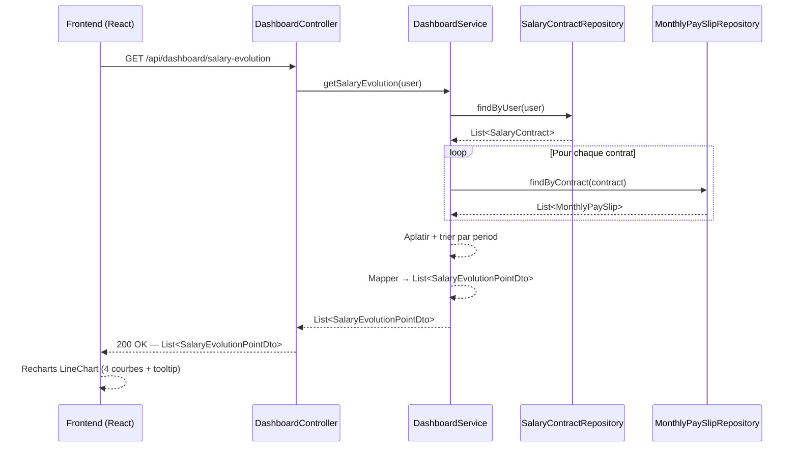

# Tableau de bord

## Vue d'ensemble

Le tableau de bord est la page d'accueil de l'application après connexion. Il offre une vision synthétique et temporelle des finances de l'utilisateur, sous forme de graphiques.

---

## 1. Graphique d'évolution salariale — `SalaryEvolutionChart`

### Objectif

Visualiser l'évolution dans le temps des quatre indicateurs issus des **bulletins de paie réels** (`MonthlyPaySlip`) de l'utilisateur :

| Indicateur | Champ source | Description |
|---|---|---|
| Salaire brut | `grossSalary` | Salaire brut mensuel |
| Net fiscal | `taxableNetSalary` | Revenu net après cotisations sociales, avant impôt |
| Net versé | `netSalary` | Montant effectivement reçu sur le compte |
| Prélèvement à la source | `incomeTaxWithholding` | Impôt prélevé sur le bulletin |

### Pourquoi MonthlyPaySlip et non les projections contrat ?

Les projections (`SalaryContractDto`) sont calculées à la volée avec les paramètres fiscaux **actuels** (PASS 2025, taux de cotisations 2025, barème IRPP 2025). Appliquer ces paramètres à des salaires historiques de 2012 ou 2018 produirait des valeurs fiscales fausses.

`MonthlyPaySlip` contient les **vraies valeurs du bulletin de paie** : les montants saisis reflètent ce qui a été réellement perçu, quel que soit le contexte fiscal de l'époque.

### Source de données

Un utilisateur peut avoir **plusieurs contrats** successifs dans le temps (changements d'employeur). Chaque contrat possède ses propres bulletins. Le graphique **agrège tous les bulletins de tous les contrats** de l'utilisateur, triés chronologiquement par `period`.

```
Contrat A (2022-01 → 2025-01)          Contrat B (2025-01 → en cours)
  bulletins : Jan 2022 … Déc 2024         bulletins : Jan 2025 … aujourd'hui
                     ↓                              ↓
              ────────────────────────────────────────────▶ temps
              Jan 22  …  Déc 24  Jan 25  …  aujourd'hui
```

Le nom de l'entreprise (`companyName`) est inclus dans chaque point pour permettre un affichage dans le tooltip ou un marqueur de changement d'employeur.

### Règles métier

- Seuls les mois ayant un bulletin saisi apparaissent sur le graphique (pas d'interpolation).
- Si l'utilisateur n'a aucun bulletin saisi, le graphique est vide (message d'invitation à saisir des bulletins).
- Les bulletins sont triés par `period` croissante, tous contrats confondus.
- En cas de chevauchement temporel entre deux contrats (cas anormal), les deux bulletins apparaissent.

### Composant frontend

**Fichier :** `frontend/src/components/dashboard/SalaryEvolutionChart.jsx`

**Librairie :** Recharts (`LineChart`)

**Courbes affichées :**

| Courbe | Couleur suggérée | Champ |
|---|---|---|
| Brut | indigo | `grossSalary` |
| Net fiscal | violet | `taxableNetSalary` |
| Net versé | vert | `netSalary` |
| Prélèvement à la source | orange | `incomeTaxWithholding` |

**Axes :**
- X : `period` (format `MMM YYYY`, ex : `Jan 2024`)
- Y : montant en € (axe gauche)

**Tooltip :** affiche les 4 valeurs + le nom de l'entreprise pour le mois survolé.

**Insights visuels attendus :**
- L'écart entre brut et net fiscal représente les cotisations sociales (~20-22 %)
- L'écart entre net fiscal et net versé représente le PAS
- Les primes et 13ème mois apparaissent comme des pics sur le brut
- Les changements d'employeur sont visibles par des sauts de salaire

### DTO backend

**`SalaryEvolutionPointDto`** — record Java, non persisté :

```java
record SalaryEvolutionPointDto(
    LocalDate period,
    String companyName,
    Float grossSalary,
    Float taxableNetSalary,
    Float netSalary,
    Float incomeTaxWithholding
) {}
```

### Flux de données



---

## À venir

- Graphique patrimoine brut / net
- Graphique plus-values
- Graphique diversification sectorielle / géographique
- Graphique suivi revenus et dépenses
