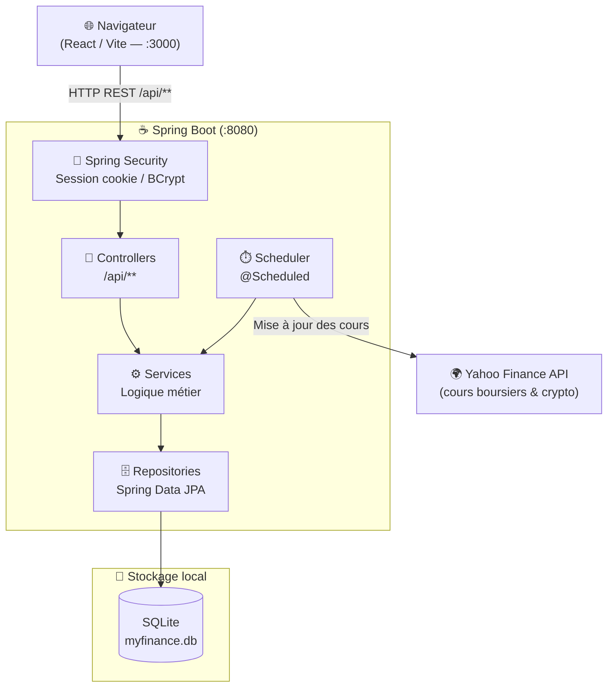
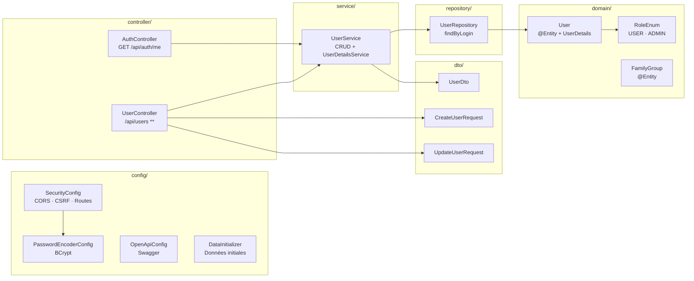
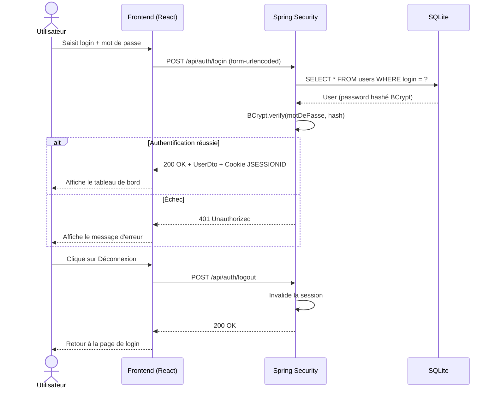

# ADR-001 — Architecture générale : monorepo, stack et patterns

| | |
|---|---|
| **Statut** | Accepté |
| **Date** | 2026-04-07 |
| **Auteur** | Neogost |

---

## Contexte

MyFinance est une application personnelle de gestion d'investissements hébergée sur un NAS QNAP
en réseau local. Les contraintes sont les suivantes :

- Usage **mono-utilisateur** (+ regroupement familial optionnel)
- Hébergement **local uniquement** — pas d'exposition publique
- Mise à jour automatique des cours boursiers et crypto via **Yahoo Finance**
- Besoin d'une interface graphique claire pour consulter et saisir des positions

---

## Décision

### 1. Structure du projet : monorepo

Le projet est organisé en monorepo avec séparation claire des responsabilités :

```
MyFinance/
├── backend/    Java / Spring Boot
├── frontend/   React / Vite
└── docs/       Documentation et ADR
```

### 2. Stack technique

| Couche | Technologie | Justification |
|--------|------------|---------------|
| Backend | Java 17 + Spring Boot 3.5 | Écosystème mature, Spring Security intégré |
| Base de données | SQLite | Zéro configuration, fichier local, adapté au mono-utilisateur |
| Frontend | React + Vite | Réactivité UI, écosystème riche (Recharts pour les graphiques) |
| Styles | Tailwind CSS v4 (`@tailwindcss/vite`) | Utilitaires inline, pas de fichier CSS custom à maintenir — voir ADR-002 |
| ORM | Spring Data JPA + Hibernate (dialect SQLite) | Abstraction de la base, pas de SQL manuel |
| Authentification | Spring Security (session cookie + BCrypt) | Simple, sans JWT ni SSO |
| Documentation API | springdoc-openapi (Swagger UI) | Génération automatique depuis les annotations |

### 3. Pattern architectural

- **REST** : le backend expose `/api/**`, le frontend consomme via HTTP
- **Layered architecture** : Controller → Service → Repository → Domain
- **DTO pattern** : les entités JPA ne sont jamais retournées directement
- **Sécurité par rôle** : `@PreAuthorize("hasRole('ADMIN')")` sur les endpoints sensibles

---

## Diagrammes

### Vue d'ensemble du système



### Architecture interne du backend



### Flux d'authentification



---

## Conséquences

### Avantages
- **Simplicité** : SQLite élimine tout besoin d'un serveur de base de données
- **Sécurité suffisante** : session cookie + BCrypt adapté à un usage local
- **Maintenabilité** : séparation claire des couches, aucune logique dans les controllers
- **Documentation vivante** : Swagger UI généré automatiquement depuis le code

### Limites acceptées
- SQLite ne supporte pas la concurrence massive — acceptable en mono-utilisateur
- Pas de SSO ni JWT — hors scope pour une app locale
- Pas de migration de schéma gérée (Flyway/Liquibase) — `ddl-auto=update` en dev, `validate` en prod

### Décisions futures à prendre (hors scope ADR-001)
- Gestion des regroupements familiaux (`FamilyGroup`)
- Stratégie de migration de schéma si le modèle évolue significativement
- Containerisation Docker pour le déploiement NAS
