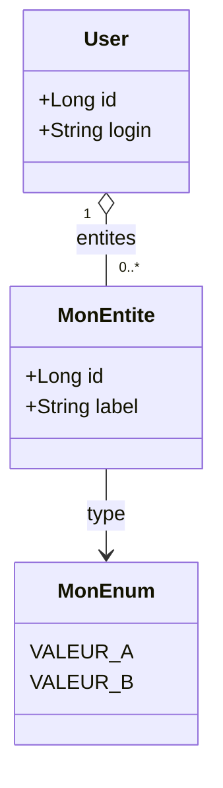
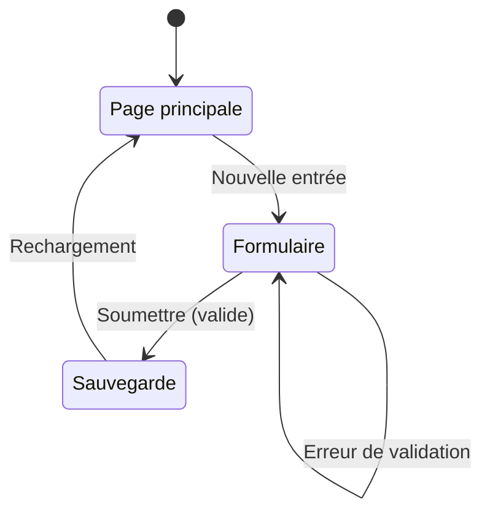

# Patterns de documentation — Architecture & API

Référence de démarrage rapide pour documenter un nouveau module.
Tous les exemples sont tirés de la documentation existante et représentent les conventions du projet.

Chaque module produit **deux fichiers** :
- `docs/architecture/<module>.md` — contexte, modèle de données, calculs, frontend, règles métier
- `docs/api/<module>.md` — référence complète des endpoints HTTP

---

## 1. Fichier architecture — `docs/architecture/<module>.md`

### Structure type

```markdown
# <Titre du module> — Architecture

Courte description du module (1-2 phrases, objectif fonctionnel).

---

## Vue d'ensemble

Paragraphe expliquant le problème résolu et la formule clé si applicable.

```
Formule ou règle centrale = A + B − C
```

---

## 1. <Première notion métier>

Tableau ou liste si besoin.

> **Choix de conception :** Explication d'un choix non évident.

---

## 2. Modèle de données

### 2.1 Entité — `NomEntite`

| Champ | Type Java | Colonne SQLite | Description |
|-------|-----------|----------------|-------------|
| `id` | `Long` | `id` | Identifiant auto-incrémenté |
| `user` | `User` | `user_id` (FK) | Propriétaire |
| `monChamp` | `String` | `mon_champ` | Description |
| `montantNullable` | `Float` | `montant` | Description (nullable) |

**Règle :** contrainte métier importante sur cette entité.

### 2.2 Enums

```java
public enum MonEnum {
    VALEUR_A,
    VALEUR_B
}
```

### 2.3 Diagramme de classes



---

## 3. Calculs

Formules calculées à la volée dans le DTO (jamais persistées) :

```
champ1 = valeur1 × (part / 100)
champ2 = champ1 × 12            (si fréquence = MONTHLY)
champ2 = champ1 / 12            (si fréquence = ANNUAL)
```

> **Remarque :** cas particulier ou précision sur un calcul edge case.

---

## 4. API REST

Préfixe : `/api/<module>`  
Accès : <Authentifié / ADMIN>

| Méthode | URL | Description |
|---------|-----|-------------|
| `GET` | `/api/<module>` | Liste les éléments de l'utilisateur |
| `POST` | `/api/<module>` | Créer un élément |
| `PUT` | `/api/<module>/{id}` | Modifier un élément (ownership vérifié) |
| `DELETE` | `/api/<module>/{id}` | Supprimer un élément (ownership vérifié) |
| `GET` | `/api/<module>/summary` | Synthèse calculée |

---

## 5. Architecture backend

```
com.myfinance
├── domain/
│   ├── MonEntite.java             (@Entity)
│   └── MonEnum.java
├── repository/
│   └── MonEntiteRepository.java
├── service/
│   └── MonEntiteService.java
├── controller/
│   └── MonEntiteController.java
└── dto/
    ├── MonEntiteDto.java          (record)
    ├── CreateMonEntiteRequest.java (record)
    └── UpdateMonEntiteRequest.java (record)
```

`MonEntiteService` injecte :
- `MonEntiteRepository`
- (autres dépendances si le service lit d'autres tables pour ses calculs)

---

## 6. Architecture frontend

```
frontend/src/
├── api/
│   └── monModule.js               # Appels API /api/<module>
└── components/
    └── monModule/
        ├── MonModulePage.jsx       # Page principale
        └── MonModuleForm.jsx       # Modal création / édition
```

### 6.1 Navigation

Position dans la barre de navigation :

```
Dashboard | ... | Mon module | ... | [ADMIN] Gestion des relevés | Mon profil
```

### 6.2 Page principale

Description des zones de la page :

1. **Résumé / KPIs** — X indicateurs clés
2. **Liste / Tableau** — comportement et tri
3. **Formulaire modal** — conditions d'ouverture

### 6.3 Formulaire — `MonModuleForm`

Champs exposés et comportement conditionnel.

---

## 7. Flux



---

## 8. Règles métier

1. **Ownership** : un utilisateur ne peut voir/modifier/supprimer que ses propres éléments.
2. **Contrainte 2** : description de la règle.
3. **Contrainte 3** : description de la règle.

---

## 9. Tests unitaires

| Classe de test | Contenu |
|----------------|---------|
| `MonEntiteServiceTest` | CRUD, calculs, ownership, cas limites |
| `MonEntiteControllerTest` | Endpoints, authentification, validation DTOs |

---

## 10. Évolutions futures envisagées

| Évolution | Description |
|-----------|-------------|
| **Fonctionnalité A** | Description courte |
| **Fonctionnalité B** | Description courte |
```

---

## 2. Fichier API — `docs/api/<module>.md`

### Structure type

```markdown
# API — <Nom du module>

Base URL : `http://localhost:8080`

Swagger UI interactif disponible sur : `http://localhost:8080/swagger-ui.html`

Tous les endpoints nécessitent d'être **authentifié** (cookie `JSESSIONID`).
<Contrainte d'accès supplémentaire si applicable.>

---

## <METHOD> /api/<chemin>

Description courte de l'endpoint (1 phrase).

**Accès** : <authentifié / ADMIN / propriétaire>

```http
<METHOD> /api/<chemin>
Content-Type: application/json   ← seulement si corps attendu
```

### Corps de la requête    ← section présente uniquement pour POST et PUT

```json
{
  "champ1": "valeur",
  "champ2": 100.0,
  "champNullable": null
}
```

| Champ | Type | Obligatoire | Contraintes |
|-------|------|-------------|-------------|
| `champ1` | `String` | ✓ | Non vide |
| `champ2` | `Float` | ✓ | > 0 |
| `champNullable` | `LocalDate` | — | Format `YYYY-MM-DD` |

### Réponse — <Code> <Statut>   ← une sous-section par code retourné

```json
{
  "id": 1,
  "champ1": "valeur",
  "champ2": 100.0,
  "champCalcule": 1200.0
}
```

| Champ | Description |    ← tableau uniquement si les champs ne sont pas auto-explicatifs
|-------|-------------|
| `champCalcule` | Description du champ calculé |

### Réponses    ← alternative courte si pas de JSON à détailler

**200 OK** — succès
**400 Bad Request** — validation échouée
**403 Forbidden** — non propriétaire
**404 Not Found** — élément introuvable

---
```

### Règles de nommage des sections

- Une section `##` par endpoint : `## GET /api/...`, `## POST /api/...`, `## PUT /api/.../{id}`, `## DELETE /api/.../{id}`
- Sous-sections `###` : `### Corps de la requête`, `### Réponse — 200 OK`, `### Réponses`
- Séparateurs `---` entre chaque endpoint

---

## 3. Mise à jour de CLAUDE.md

Après création des deux fichiers, mettre à jour **3 endroits** dans `CLAUDE.md` :

### 3.1 Section "Documentation associée"

```markdown
- Nom du module (architecture) : `docs/architecture/<module>.md`
- API nom du module : `docs/api/<module>.md`
```

### 3.2 Section "Endpoints backend existants"

Ajouter un tableau avec les nouveaux endpoints (copier le format des tableaux existants).

### 3.3 Section "Statut du projet"

Déplacer la fonctionnalité de "À venir" vers "Implémenté" une fois livrée, avec un résumé des points clés.

---

## 4. Conventions transversales

| Convention | Règle |
|------------|-------|
| Langue | Tout en **français** (titres, descriptions, commentaires, règles métier) |
| Nommage | Entités Java en `PascalCase`, colonnes SQLite en `snake_case` |
| Champs nullable | Colonne "nullable" dans le tableau de l'entité — pas d'annotation `@Column` en Java si nullable |
| Formules | Toujours dans un bloc de code `` ` ``` ` `` sans langage déclaré |
| Exemples JSON | Toujours des valeurs réalistes, pas de placeholders `"string"` ou `0` |
| Tableau de champs | Toujours les colonnes : `Champ` · `Type` · `Obligatoire` · `Contraintes` pour les requêtes, `Champ` · `Type Java` · `Colonne SQLite` · `Description` pour les entités |
| Choix de conception | Bloc `> **Choix de conception :**` pour tout choix non évident |
| Codes HTTP | Toujours documenter 200/201/204 nominal + 400 validation + 401 non auth + 403 ownership + 404 not found (selon ce qui s'applique) |
