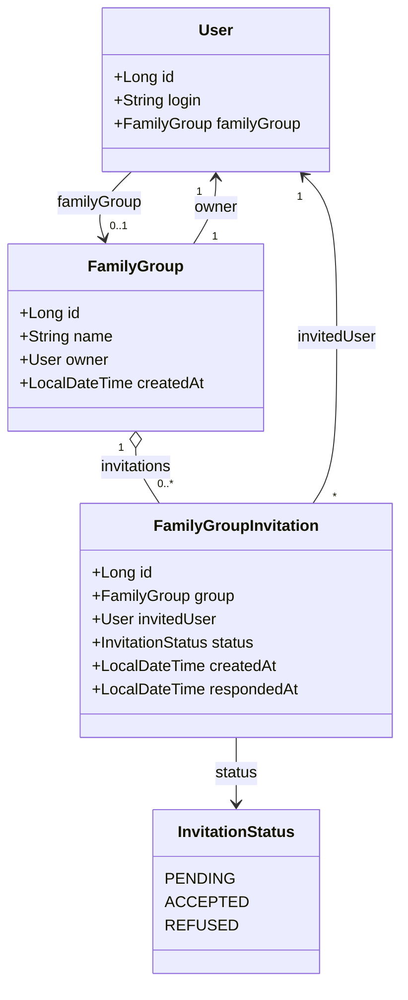
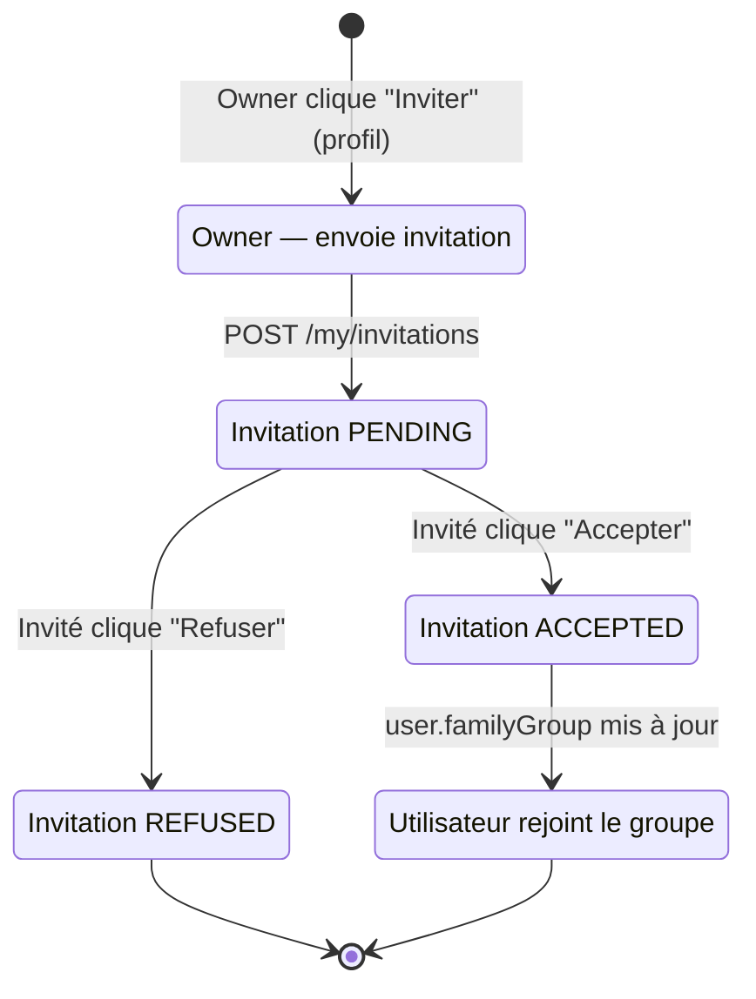
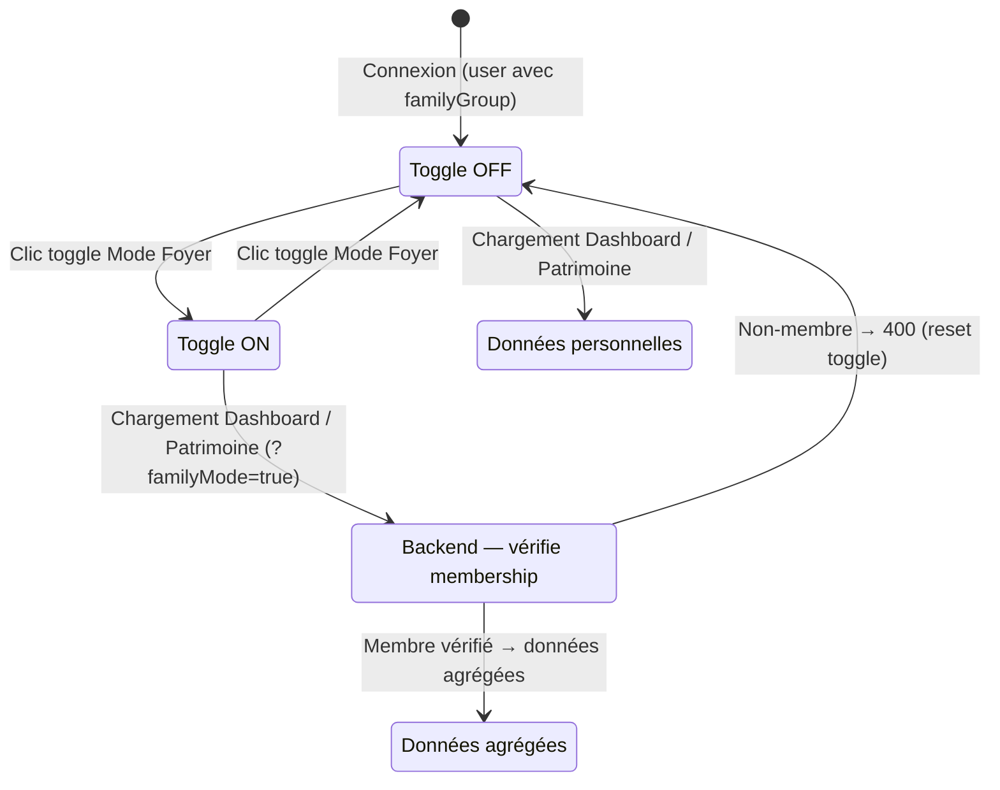

# Regroupement Familial — Architecture

Fonctionnalité permettant à plusieurs utilisateurs de former un groupe (foyer) afin de visualiser leur patrimoine et leurs données financières de manière agrégée.

---

## Vue d'ensemble

Un utilisateur peut appartenir à un `FamilyGroup`. Quand le **mode foyer** est activé (toggle de session), les vues **Tableau de bord** et **Patrimoine** agrègent les données de tous les membres du groupe. Le **Simulateur d'emprunt** restreint la recherche de co-emprunteur aux membres du groupe.

```
Patrimoine agrégé = Σ positions de chaque membre du groupe
```

> **Choix de conception :** Le mode foyer est un état de session (non persisté). Il n'affecte pas les données stockées — seule la lecture est agrégée. Cela évite toute confusion sur l'appartenance réelle des actifs.

---

## 1. Périmètre fonctionnel

| Vue | Comportement en mode foyer |
|-----|---------------------------|
| **Tableau de bord** | Données agrégées (salaires, plus-values, snapshots) + bannière indicatrice |
| **Patrimoine** | Positions agrégées avec sous-lignes dépliables par membre |
| **Simulateur d'emprunt** | Recherche de co-emprunteur limitée aux membres du groupe |
| **Autres vues** | Non impactées (revenus, dépenses, passifs, simulateurs restent personnels) |

---

## 2. Modèle de données

### 2.1 Entité — `FamilyGroup`

| Champ | Type Java | Colonne SQLite | Description |
|-------|-----------|----------------|-------------|
| `id` | `Long` | `id` | Identifiant auto-incrémenté |
| `name` | `String` | `name` | Nom du groupe (ex. "Famille Desmay") |
| `owner` | `User` | `owner_id` (FK) | Créateur et administrateur du groupe |
| `createdAt` | `LocalDateTime` | `created_at` | Date de création |

**Règle :** seul le `owner` peut dissoudre le groupe, en modifier le nom, ou envoyer des invitations.

### 2.2 Entité — `FamilyGroupInvitation`

| Champ | Type Java | Colonne SQLite | Description |
|-------|-----------|----------------|-------------|
| `id` | `Long` | `id` | Identifiant auto-incrémenté |
| `group` | `FamilyGroup` | `group_id` (FK) | Groupe concerné |
| `invitedUser` | `User` | `invited_user_id` (FK) | Utilisateur invité |
| `status` | `InvitationStatus` | `status` | `PENDING`, `ACCEPTED`, `REFUSED` |
| `createdAt` | `LocalDateTime` | `created_at` | Date d'envoi de l'invitation |
| `respondedAt` | `LocalDateTime` | `responded_at` | Date de réponse (nullable) |

**Règle :** une invitation `PENDING` ne peut être envoyée que si l'utilisateur cible n'est pas déjà membre d'un groupe. Une seule invitation `PENDING` par utilisateur cible à la fois.

### 2.3 Modification de `User`

| Champ ajouté | Type Java | Colonne SQLite | Description |
|--------------|-----------|----------------|-------------|
| `familyGroup` | `FamilyGroup` | `family_group_id` (FK, nullable) | Groupe d'appartenance — `null` si aucun groupe |

**Règle :** un utilisateur appartient à **0 ou 1** groupe à la fois.

`UserDto` expose un champ `familyGroupId` (`Long`, nullable) pour permettre au frontend de savoir si l'utilisateur est membre d'un groupe sans charger le groupe complet. Ce champ est également inclus dans la réponse de `POST /api/auth/login` et `GET /api/auth/me`.

### 2.4 Enum — `InvitationStatus`

```java
public enum InvitationStatus {
    PENDING,   // en attente de réponse
    ACCEPTED,  // acceptée → l'utilisateur a rejoint le groupe
    REFUSED    // refusée → l'utilisateur reste sans groupe
}
```

### 2.5 Migration SQLite

```sql
CREATE TABLE family_group (
    id         INTEGER PRIMARY KEY AUTOINCREMENT,
    name       TEXT    NOT NULL,
    owner_id   INTEGER NOT NULL REFERENCES user(id),
    created_at TEXT    NOT NULL
);

CREATE TABLE family_group_invitation (
    id               INTEGER PRIMARY KEY AUTOINCREMENT,
    group_id         INTEGER NOT NULL REFERENCES family_group(id),
    invited_user_id  INTEGER NOT NULL REFERENCES user(id),
    status           TEXT    NOT NULL DEFAULT 'PENDING',
    created_at       TEXT    NOT NULL,
    responded_at     TEXT
);

ALTER TABLE user ADD COLUMN family_group_id INTEGER REFERENCES family_group(id);
```

### 2.6 Diagramme de classes



---

## 3. Agrégation des données

L'agrégation est réalisée **côté frontend** : le frontend récupère les positions de chaque membre individuellement via `GET /api/family-groups/my/members/{memberId}/positions`, puis les fusionne en mémoire.

### 3.1 Vue Patrimoine

Le frontend affiche d'abord les positions de l'utilisateur connecté (via `GET /api/positions`), puis ajoute une section par membre avec ses propres positions (via `GET /api/family-groups/my/members/{memberId}/positions`). Chaque section est rendue avec `PatrimoineGroupedView` en mode `readOnly`.

```
Positions affichées = positions propres + sections membres (readOnly)
```

Le filtre "Afficher les positions fermées" s'applique à toutes les sections (propres et membres).

### 3.2 Vue Tableau de bord

Le frontend charge en parallèle `GET /api/positions` (propres) et `GET /api/family-groups/my/members/{memberId}/positions` pour chaque membre, puis concatène tous les tableaux. Le tableau résultant est transmis aux composants graphiques via leur prop `positions`.

```js
familyPositions = [...ownPositions, ...memberPositions.flat()]
```

Les graphiques concernés : `PatrimoineByCategoryChart`, `PatrimoineByEnvelopeChart`, `CapitalGainsByCategoryChart`.

### 3.3 Calcul INSEE (référentiel patrimoine brut)

En mode foyer, le patrimoine brut agrégé est divisé par le nombre de membres du groupe avant comparaison avec les déciles INSEE, pour obtenir la part moyenne par personne.

```
patrimoineComparaison = patrimoineBrut / nbMembres
```

### 3.4 Règle de sécurité

Le backend vérifie pour chaque appel à `GET /api/family-groups/my/members/{memberId}/positions` que l'utilisateur connecté et le membre cible appartiennent au même groupe. Un accès hors groupe retourne `403 Forbidden`.

---

## 4. API REST

### 4.1 Endpoints utilisateur (self-service)

Préfixe : `/api/family-groups`  
Accès : Authentifié

| Méthode | URL | Description |
|---------|-----|-------------|
| `GET` | `/api/family-groups/my` | Groupe de l'utilisateur connecté avec liste des membres (null si aucun groupe) |
| `GET` | `/api/family-groups/my/members` | Membres du groupe hors soi-même (pour co-emprunteur) |
| `GET` | `/api/family-groups/my/members/{memberId}/positions` | Positions d'un membre du groupe (agrégation Mode Foyer) |
| `POST` | `/api/family-groups` | Créer un groupe (l'appelant devient owner) |
| `PUT` | `/api/family-groups/my` | Renommer son groupe (owner uniquement) |
| `DELETE` | `/api/family-groups/my` | Dissoudre son groupe (owner uniquement) |
| `POST` | `/api/family-groups/my/invitations` | Envoyer une invitation à un utilisateur (owner uniquement) |
| `DELETE` | `/api/family-groups/my/members/{userId}` | Retirer un membre de son groupe (owner uniquement) |
| `GET` | `/api/family-groups/invitations/pending` | Invitations en attente reçues par l'utilisateur connecté |
| `POST` | `/api/family-groups/invitations/{id}/accept` | Accepter une invitation |
| `POST` | `/api/family-groups/invitations/{id}/refuse` | Refuser une invitation |
| `DELETE` | `/api/family-groups/my` (quitter) | Quitter le groupe dont on est membre (non-owner) |

### 4.2 Endpoints admin

Préfixe : `/api/admin/family-groups`  
Accès : ADMIN

| Méthode | URL | Description |
|---------|-----|-------------|
| `GET` | `/api/admin/family-groups` | Liste tous les groupes avec leurs membres |
| `GET` | `/api/admin/family-groups/{id}` | Détail d'un groupe (membres + invitations en cours) |
| `DELETE` | `/api/admin/family-groups/{id}` | Supprimer un groupe (force) |
| `DELETE` | `/api/admin/family-groups/{id}/members/{userId}` | Retirer un membre d'un groupe (force) |

---

## 5. Architecture backend

```
com.myfinance
├── domain/
│   ├── FamilyGroup.java                  (@Entity)
│   ├── FamilyGroupInvitation.java        (@Entity)
│   └── InvitationStatus.java             (enum)
├── repository/
│   ├── FamilyGroupRepository.java
│   └── FamilyGroupInvitationRepository.java
├── service/
│   └── FamilyGroupService.java
├── controller/
│   ├── FamilyGroupController.java        (/api/family-groups)
│   └── AdminFamilyGroupController.java   (/api/admin/family-groups)
└── dto/
    ├── FamilyGroupDto.java               (record — id, name, owner, members)
    ├── FamilyMemberDto.java              (record — id, firstName, lastName, login)
    ├── FamilyGroupInvitationDto.java     (record — id, groupName, ownerName, status, createdAt)
    ├── CreateFamilyGroupRequest.java     (record — name)
    ├── UpdateFamilyGroupRequest.java     (record — name)
    └── SendInvitationRequest.java        (record — login de l'utilisateur cible)
```

`FamilyGroupService` injecte :
- `FamilyGroupRepository`
- `FamilyGroupInvitationRepository`
- `UserRepository` (recherche par login pour les invitations)

Les services `PositionService` et `DashboardService` sont modifiés pour accepter un paramètre `boolean familyMode` et agréger les données du groupe si activé.

---

## 6. Architecture frontend

```
frontend/src/
├── api/
│   └── familyGroup.js                   # Appels API /api/family-groups
└── components/
    ├── profile/
    │   └── FamilyGroupPanel.jsx          # Section "Regroupement familial" dans Mon Profil
    └── admin/
        └── AdminFamilyGroupPage.jsx      # Vue admin — tous les groupes
```

### 6.1 Toggle dans la navigation

Position dans la barre de navigation, à côté de l'icône œil (masquer les montants) :

```
[👁 Masquer montants]  [🏠 Mode Foyer]  |  Kévin D.  [Déconnexion]
```

- Visible uniquement si `user.familyGroup !== null`
- État `familyMode` (boolean) dans le state global `App.jsx` — **non persisté** (session uniquement)
- Quand actif : icône colorée (indigo) + tooltip "Vue foyer activée — données agrégées avec [prénom des autres membres]"

### 6.2 Section "Regroupement familial" dans Mon Profil

Dans `ProfilePage` (ou équivalent), ajout d'un panneau `FamilyGroupPanel` :

**Cas 1 — Aucun groupe :**
- Bouton "Créer un regroupement familial" → formulaire inline (saisie du nom du groupe)
- Liste des invitations `PENDING` reçues avec boutons Accepter / Refuser

**Cas 2 — Membre d'un groupe (non owner) :**
- Nom du groupe + nom du owner
- Liste des membres (prénom, nom)
- Bouton "Quitter le groupe"
- Liste des invitations `PENDING` reçues (un utilisateur peut recevoir une invitation même s'il est dans un groupe — mais ne peut l'accepter qu'après avoir quitté le sien)

**Cas 3 — Owner du groupe :**
- Nom du groupe (éditable inline)
- Liste des membres avec bouton "Retirer" par membre
- Formulaire "Inviter un utilisateur" (recherche par login)
- Historique des invitations envoyées (statut PENDING / ACCEPTED / REFUSED)
- Bouton "Dissoudre le groupe" (confirmation requise)

### 6.3 Tableau de bord en mode foyer

- Bannière discrète sous le titre :

  ```
  🏠 Vue foyer — données agrégées avec Sarah M.
  ```

- Tous les appels API dashboard reçoivent `?familyMode=true`

### 6.4 Vue Patrimoine — sous-lignes dépliables

Chaque ligne du tableau peut être dépliée pour voir la répartition par membre :

```
▶ ETF World (SaxoBank)   1 500 €   [clic pour déplier]
  ↳ Kévin                1 000 €
  ↳ Sarah                  500 €

▶ Livret A               3 200 €
  ↳ Kévin                2 000 €
  ↳ Sarah                1 200 €
```

- `▶` si plusieurs contributeurs, `—` si un seul membre contribue
- Fond légèrement atténué et indentation sur les sous-lignes
- Badge de couleur fixe par membre (couleur déterminée par son `id` dans le groupe)
- State local par ligne (`expandedRows` — Set d'ids)

> **Choix de conception :** sous-lignes dépliables plutôt que tooltip, car la répartition est une information clé (pas anecdotique) et les tooltips ne fonctionnent pas sur mobile.

### 6.5 Simulateur d'emprunt — co-emprunteur

Dans `LoanSimulatorPage.jsx`, le bouton "Depuis un utilisateur" (section co-emprunteurs) :

- **Si l'utilisateur a un groupe** → charge uniquement `GET /api/family-groups/my/members`
- **Sinon** → comportement actuel (liste tous les utilisateurs, ADMIN seulement)

### 6.6 Page admin — Gestion des groupes

Page `AdminFamilyGroupPage` accessible depuis le menu Administration (ADMIN) :

- Tableau de tous les groupes : nom, owner, nombre de membres, date de création
- Dépliage par groupe : liste des membres + invitations en cours
- Bouton "Supprimer le groupe" (confirmation requise)
- Bouton "Retirer" par membre (confirmation requise)

---

## 7. Flux — cycle de vie d'une invitation



---

## 8. Flux — activation du mode foyer



---

## 9. Règles métier

1. **Appartenance unique** : un utilisateur appartient à 0 ou 1 groupe à la fois. Accepter une invitation quand on est déjà membre d'un groupe est refusé (`400`) — il faut d'abord quitter l'ancien.
2. **Système d'invitation** : rejoindre un groupe nécessite une invitation explicite du owner. Il est impossible d'ajouter quelqu'un sans son accord.
3. **Owner** : le créateur est `owner`. Il gère les invitations, peut retirer des membres et peut dissoudre le groupe. Il ne peut pas quitter son propre groupe sans le dissoudre d'abord.
4. **Mode session** : le toggle Mode Foyer ne persiste pas entre connexions.
5. **Consentement implicite** : accepter une invitation signifie accepter que les autres membres voient ses montants agrégés. Aucun mécanisme de masquage partiel prévu.
6. **Isolation stricte** : un non-membre ne peut jamais accéder aux données d'un groupe, même en passant `familyMode=true` manuellement.
7. **Dissolution** : supprimer un groupe met `family_group_id = null` sur tous les membres. Les invitations `PENDING` associées sont supprimées en cascade.
8. **Périmètre de l'agrégation** : seules les vues Tableau de bord et Patrimoine sont agrégées. Les autres modules restent strictement personnels.
9. **Admin — droit de modération** : l'admin peut supprimer n'importe quel groupe ou en retirer n'importe quel membre, mais ne crée pas et n'invite pas (ces actions restent du ressort du owner).

---

## 10. Tests unitaires

| Classe de test | Contenu |
|----------------|---------|
| `FamilyGroupServiceTest` | Création, invitation, acceptation/refus, retrait membre, dissolution, règles owner, isolation non-membres |
| `FamilyGroupControllerTest` | Endpoints self-service, accès owner vs membre vs non-membre |
| `AdminFamilyGroupControllerTest` | Endpoints admin, accès ADMIN uniquement |
| `PositionServiceTest` (extension) | Mode agrégé : somme correcte, isolation si non-membre |
| `DashboardServiceTest` (extension) | Mode agrégé : évolution salariale consolidée |

---

## 11. Évolutions futures envisagées

| Évolution | Description |
|-----------|-------------|
| **Partage sélectif** | Permettre à un membre de masquer certaines positions au groupe |
| **Droits différenciés** | Membre "lecture seule" vs membre "lecture-écriture" |
| **Transfert de ownership** | Le owner peut déléguer son rôle à un autre membre |
