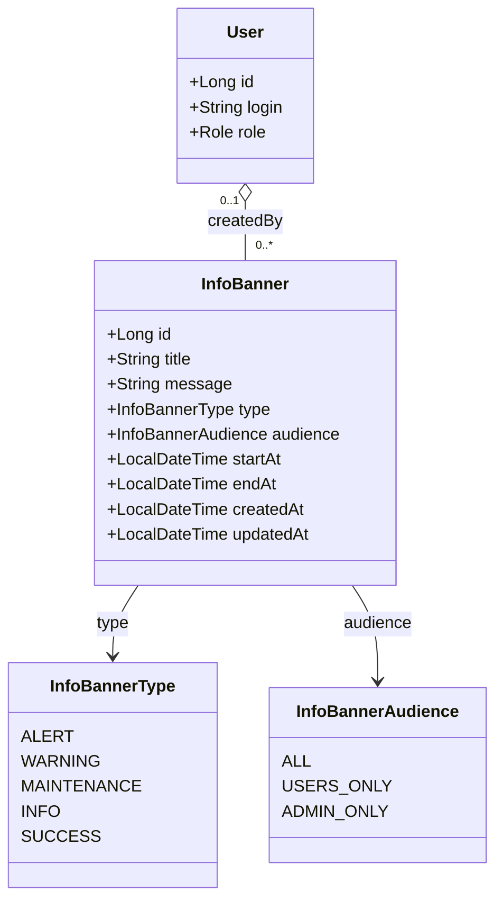

# Bannières d'information — Architecture

Outil de communication permettant à l'administrateur de diffuser des messages
(information, maintenance, alerte…) visibles en haut de toutes les pages de l'application.

---

## Vue d'ensemble

L'administrateur saisit une **bannière** caractérisée par un type (qui détermine
la couleur et l'icône), une plage temporelle d'affichage, un message en Markdown
et une audience cible. Pendant la fenêtre d'activité, la bannière est servie à
tous les utilisateurs concernés et affichée en haut de page sous la navigation.

L'utilisateur peut **fermer** une bannière : elle disparaît pour le reste de sa
session courante, et réapparaît à la prochaine connexion si elle est toujours
active.

```
Bannière active ⇔ startAt ≤ maintenant ET (endAt EST NULL OU maintenant ≤ endAt)
                  ET audience couvre le rôle de l'utilisateur courant
```

---

## 1. Types et priorités

| Type | Couleur | Icône (Lucide) | Usage typique |
|------|---------|----------------|---------------|
| `ALERT` | rouge | `AlertOctagon` | Incident, sécurité, action critique requise |
| `WARNING` | orange | `AlertTriangle` | Attention requise, dégradation possible |
| `MAINTENANCE` | gris | `Wrench` | Fenêtre de maintenance planifiée |
| `INFO` | bleu | `Info` | Information générale, communication |
| `SUCCESS` | vert | `CheckCircle2` | Annonce positive, nouvelle fonctionnalité |

**Ordre d'empilement** : quand plusieurs bannières sont actives, elles sont
toutes affichées, triées par priorité décroissante :

```
ALERT  >  WARNING  >  MAINTENANCE  >  INFO  >  SUCCESS
```

À priorité égale, la plus récente (`createdAt` desc) passe en premier.

> **Choix de conception :** pas de priorité numérique stockée — le `type` la
> détermine entièrement. Cela garde l'admin simple (1 champ au lieu de 2) et
> évite les incohérences entre type et priorité.

---

## 2. Audience

| Valeur | Cible |
|--------|-------|
| `ALL` | Tous les utilisateurs authentifiés (USER + ADMIN) |
| `USERS_ONLY` | Comptes USER uniquement (les ADMIN ne la voient pas) |
| `ADMIN_ONLY` | Comptes ADMIN uniquement (communication interne) |

Le filtrage par audience est effectué **côté backend** dans la requête
`GET /api/info-banners/active` — le frontend ne reçoit jamais une bannière
qui ne le concerne pas.

> **Choix de conception :** pas d'affichage sur la page de login (avant
> authentification). Une bannière de maintenance pour un service inaccessible
> est inutile puisque l'utilisateur ne pourra de toute façon pas se connecter ;
> et exposer publiquement les messages aux non-authentifiés ouvrirait une
> surface d'attaque inutile.

---

## 3. Modèle de données

### 3.1 Entité — `InfoBanner`

Table : `info_banners`

| Champ | Type Java | Colonne SQLite | Description |
|-------|-----------|----------------|-------------|
| `id` | `Long` | `id` (PK) | Identifiant auto-incrémenté |
| `title` | `String` | `title` | Titre court (nullable, max 120 caractères) |
| `message` | `String` | `message` | Corps du message en **Markdown** (max 2000 caractères) |
| `type` | `InfoBannerType` | `type` | Type — détermine couleur et icône |
| `audience` | `InfoBannerAudience` | `audience` | Cible de diffusion |
| `startAt` | `LocalDateTime` | `start_at` | Début d'affichage (inclus) |
| `endAt` | `LocalDateTime` | `end_at` | Fin d'affichage (incluse) — nullable = sans expiration |
| `createdAt` | `LocalDateTime` | `created_at` | Horodatage de création |
| `updatedAt` | `LocalDateTime` | `updated_at` | Horodatage de dernière modification |
| `createdBy` | `User` | `created_by` (FK) | Administrateur ayant créé la bannière |

**Règles :**
- `title` est optionnel — si absent, seul le `message` (rendu Markdown) est affiché.
- `message` est obligatoire et non vide.
- `endAt`, s'il est renseigné, doit être **strictement postérieur** à `startAt`.
- `createdBy` n'est jamais effacé même si l'admin est supprimé (FK avec `ON DELETE SET NULL`) — l'historique reste consultable.

### 3.2 Enums

```java
public enum InfoBannerType {
    ALERT,
    WARNING,
    MAINTENANCE,
    INFO,
    SUCCESS
}

public enum InfoBannerAudience {
    ALL,
    USERS_ONLY,
    ADMIN_ONLY
}
```

### 3.3 Diagramme de classes



---

## 4. Calcul du statut

Le statut d'une bannière est dérivé à la volée (jamais persisté) pour la vue admin :

```
SCHEDULED  ⇔  maintenant < startAt
ACTIVE     ⇔  startAt ≤ maintenant ET (endAt EST NULL OU maintenant ≤ endAt)
EXPIRED    ⇔  endAt EST NON NULL ET maintenant > endAt
```

Exposé dans le DTO admin sous `status` (énum `InfoBannerStatus`).

---

## 5. API REST

Préfixe utilisateur : `/api/info-banners`  
Préfixe admin : `/api/admin/info-banners`

| Méthode | URL | Accès | Description |
|---------|-----|-------|-------------|
| `GET` | `/api/info-banners/active` | Authentifié | Liste des bannières actives pour l'utilisateur courant (triées par priorité) |
| `GET` | `/api/admin/info-banners` | ADMIN | Liste complète (avec statut SCHEDULED / ACTIVE / EXPIRED) |
| `GET` | `/api/admin/info-banners/{id}` | ADMIN | Détail d'une bannière |
| `POST` | `/api/admin/info-banners` | ADMIN | Créer une bannière |
| `PUT` | `/api/admin/info-banners/{id}` | ADMIN | Modifier une bannière |
| `DELETE` | `/api/admin/info-banners/{id}` | ADMIN | Supprimer une bannière |

Détails complets : [`docs/api/info-banners.md`](../api/info-banners.md)

---

## 6. Architecture backend

```
com.myfinance
├── domain/
│   ├── InfoBanner.java             (@Entity)
│   ├── InfoBannerType.java
│   └── InfoBannerAudience.java
├── repository/
│   └── InfoBannerRepository.java
├── service/
│   └── InfoBannerService.java
├── controller/
│   ├── InfoBannerController.java          (endpoints utilisateur)
│   └── AdminInfoBannerController.java     (endpoints admin)
└── dto/
    ├── InfoBannerDto.java                  (record, exposé côté user)
    ├── InfoBannerAdminDto.java             (record, avec status + createdAt + createdBy)
    ├── CreateInfoBannerRequest.java        (record)
    └── UpdateInfoBannerRequest.java        (record)
```

`InfoBannerService` injecte uniquement `InfoBannerRepository`. La logique de
filtrage par audience et plage temporelle est implémentée via une query
dérivée Spring Data :

```java
List<InfoBanner> findActiveForAudience(LocalDateTime now, Set<InfoBannerAudience> audiences);
```

où `audiences = { ALL, USERS_ONLY }` pour un USER, `{ ALL, ADMIN_ONLY }` pour un ADMIN.

> **Choix de conception :** deux DTOs distincts (user vs admin) pour ne pas
> exposer `createdBy`, `createdAt` ni le `status` calculé côté utilisateur.
> Le DTO user est minimal : id, title, message, type.

---

## 7. Architecture frontend

```
frontend/src/
├── api/
│   ├── infoBanners.js              # getActiveBanners()
│   └── adminInfoBanners.js         # CRUD admin
└── components/
    ├── platform/
    │   ├── InfoBannerStack.jsx     # Pile affichée en haut de l'app
    │   └── InfoBannerItem.jsx      # Une bannière individuelle (avec X de fermeture)
    └── admin/
        ├── InfoBannerAdminPage.jsx # Liste admin (SCHEDULED / ACTIVE / EXPIRED)
        └── InfoBannerForm.jsx      # Modal création / édition (avec aperçu Markdown)
```

### 7.1 Navigation

Position dans la barre de navigation (sous-menu Administration) :

```
[ADMIN] Administration ▾
  ├── Gestion des utilisateurs
  ├── ...
  └── Bannières d'information   ← nouveau
```

### 7.2 Affichage côté utilisateur — `InfoBannerStack`

Composant monté **une seule fois** dans `App.jsx`, juste sous `Navigation`,
visible sur **toutes les pages authentifiées**. Pas d'affichage sur le
`LoginForm`.

**Cycle de vie :**

1. Au montage (après login), `GET /api/info-banners/active` → liste des bannières.
2. Filtrage : on retire celles dont l'id est présent dans `sessionStorage["dismissedBannerIds"]` (JSON array).
3. Tri par priorité décroissante (cf. table ci-dessus).
4. Rendu de chaque bannière avec :
   - Bandeau pleine largeur, couleur de fond + bord gauche épais selon le type
   - Icône du type à gauche
   - Titre (gras) si présent + message (Markdown rendu via `react-markdown`)
   - Bouton croix `✕` à droite
5. Clic sur la croix → ajout de l'id dans `sessionStorage["dismissedBannerIds"]` + suppression du DOM.

**Rendu Markdown :** dépendance `react-markdown` (à ajouter), pas de plugin
HTML brut — interdit pour éviter toute XSS. Sous-ensemble supporté : titres,
gras/italique, listes, liens, code inline. Les liens externes s'ouvrent dans
un nouvel onglet (`target="_blank" rel="noopener noreferrer"`).

**Responsive mobile (≤ 640 px) :**
- Padding réduit, taille de police inchangée
- Icône + titre sur une ligne, message en dessous
- Croix de fermeture toujours visible en haut à droite

### 7.3 Page admin — `InfoBannerAdminPage`

Trois sections empilées avec compteurs :

1. **Bannières actives** — affichées actuellement aux utilisateurs (tri : priorité desc)
2. **Bannières programmées** — `startAt` futur (tri : `startAt` asc)
3. **Bannières expirées** — `endAt` passé (tri : `endAt` desc, max 50 dernières)

Pour chaque bannière, affichage tabulaire : type (badge coloré), titre,
audience, plage temporelle, statut, actions (Modifier / Supprimer).

Bouton **« + Nouvelle bannière »** en haut à droite ouvre `InfoBannerForm`
en création.

### 7.4 Formulaire — `InfoBannerForm`

Modal (responsive bottom drawer mobile) avec :

| Champ | Type | Validation |
|-------|------|------------|
| Type | radio buttons colorés (5 valeurs) | obligatoire |
| Audience | radio buttons (ALL / USERS_ONLY / ADMIN_ONLY) | obligatoire, défaut `ALL` |
| Titre | input texte | optionnel, max 120 caractères |
| Message | textarea + aperçu Markdown live | obligatoire, max 2000 caractères |
| Début d'affichage | input `datetime-local` | obligatoire, défaut « maintenant » |
| Fin d'affichage | input `datetime-local` + checkbox « Sans expiration » | optionnel, doit être > début si renseignée |

L'**aperçu** affiche en temps réel la bannière telle qu'elle apparaîtra à
l'utilisateur (même composant `InfoBannerItem`, sans la croix de fermeture).

---

## 8. Règles métier

1. **Ownership** : les bannières sont globales — pas de notion d'ownership
   utilisateur. Seuls les ADMIN peuvent les créer, modifier ou supprimer.
2. **Plage temporelle** : `endAt` doit être strictement postérieur à `startAt`
   si renseigné. Une bannière sans `endAt` est valide et reste active
   indéfiniment.
3. **Fermeture utilisateur** : la fermeture est purement côté client
   (sessionStorage). Aucune information de fermeture n'est persistée backend.
4. **Audience** : un ADMIN ne voit jamais les bannières `USERS_ONLY`, et
   inversement. Les bannières `ALL` sont visibles par tous.
5. **Modification d'une bannière active** : la modification d'une bannière
   en cours d'affichage met à jour le contenu pour les futures sessions —
   les utilisateurs qui l'ont déjà fermée ne la reverront qu'à leur prochaine
   connexion.
6. **Suppression** : la suppression est définitive (pas de soft-delete).
   Une bannière expirée peut être supprimée pour faire le ménage.
7. **Markdown** : le rendu est sandboxé (pas de HTML brut), pas d'images, pas
   de scripts. Seuls les liens externes sont autorisés.

---

## 9. Tests unitaires

| Classe de test | Contenu |
|----------------|---------|
| `InfoBannerServiceTest` | CRUD, filtrage actif par audience + dates, validation `endAt > startAt`, calcul du statut |
| `InfoBannerControllerTest` | `/api/info-banners/active` selon rôle (USER vs ADMIN), filtrage audience |
| `AdminInfoBannerControllerTest` | CRUD admin, contrôle d'accès (403 si non ADMIN), validation des requêtes |

---

## 10. Évolutions futures envisagées

| Évolution | Description |
|-----------|-------------|
| **Ciblage fin** | Cibler un utilisateur précis ou un groupe familial (au-delà du rôle) |
| **Historique de lecture** | Persistance backend des `dismissed_at` pour stats de lecture |
| **Templates** | Bannières pré-définies réutilisables (maintenance hebdomadaire récurrente, par ex.) |
| **Push notification** | Pour les bannières `ALERT`, déclencher aussi une notification navigateur |
| **Programmation récurrente** | Bannière de maintenance qui apparaît tous les premiers dimanches du mois |
