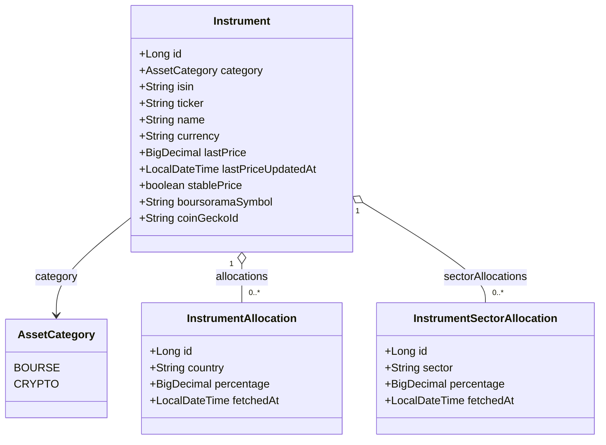
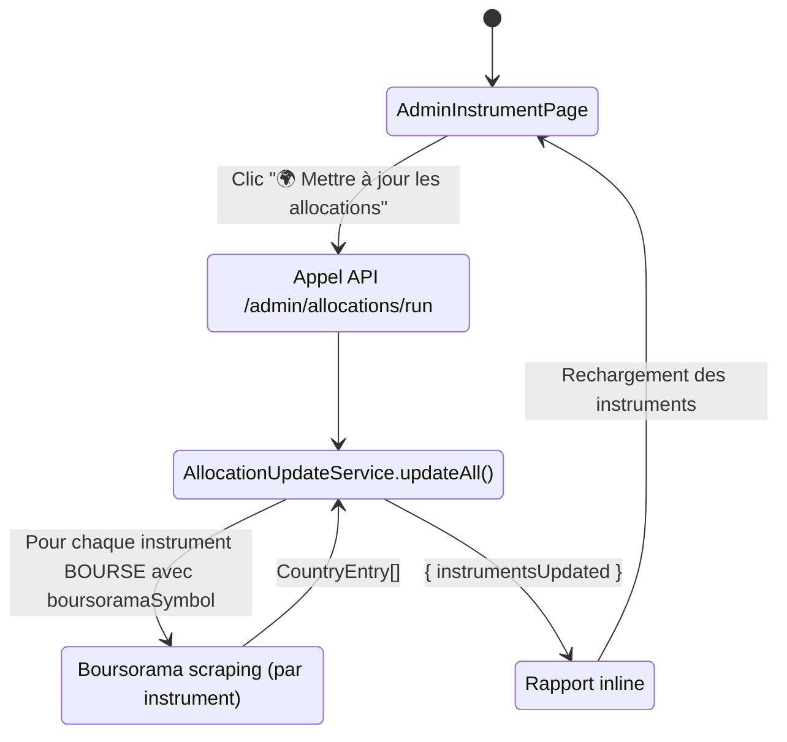

# Gestion des instruments financiers — Architecture

Référentiel partagé des instruments financiers (actions, ETF, crypto) permettant de valoriser les positions du portefeuille. Un instrument est indépendant de l'utilisateur : il est créé par l'admin et partagé entre tous les utilisateurs.

---

## Vue d'ensemble

Un `Instrument` représente un titre financier identifiable (ISIN pour la bourse, ticker pour la crypto). Il porte le dernier cours connu (`lastPrice`) et deux tables de composition optionnelles : **allocation géographique** (`InstrumentAllocation`) et **allocation sectorielle** (`InstrumentSectorAllocation`). Ces allocations sont utilisées par le scoring patrimonial.

```
Instrument
  ├── lastPrice / lastPriceUpdatedAt  ← mis à jour automatiquement ou manuellement
  ├── stablePrice                      ← prix fixe (fonds euros, stablecoins)
  ├── boursoramaSymbol / coinGeckoId   ← sources de prix automatiques
  ├── InstrumentAllocation (0..*)      ← répartition géographique en %
  └── InstrumentSectorAllocation (0..*)← répartition sectorielle en %
```

> **Choix de conception :** l'instrument est un référentiel global, non lié à un utilisateur. Plusieurs utilisateurs peuvent posséder des positions sur le même instrument — les cours sont mis à jour une seule fois pour tous.

---

## 1. Catégories d'instruments

Un instrument appartient à l'une des deux catégories de l'enum `AssetCategory` utilisées pour les instruments :

| Valeur | Description | Identifiant unique | Source de prix |
|--------|-----------|--------------------|----------------|
| `BOURSE` | Actions, ETF, fonds | ISIN (obligatoire, unique) | Boursorama (symbole `boursoramaSymbol`) |
| `CRYPTO` | Cryptomonnaies | Ticker (obligatoire, unique) | CoinGecko (identifiant `coinGeckoId`) |

> **Remarque :** les autres valeurs de `AssetCategory` (IMMO_PAPIER, IMMO_PHYSIQUE, LIVRET, LIQUIDITE) s'appliquent aux positions mais ne nécessitent pas d'instrument.

---

## 2. Modèle de données

### 2.1 Entité — `Instrument`

Table SQLite : `instruments`

| Champ | Type Java | Colonne SQLite | Description |
|-------|-----------|----------------|-------------|
| `id` | `Long` | `id` | Identifiant auto-incrémenté |
| `category` | `AssetCategory` | `category` | BOURSE ou CRYPTO |
| `isin` | `String` | `isin` | Code ISIN (nullable, unique) — obligatoire pour BOURSE |
| `ticker` | `String` | `ticker` | Symbole / trigramme (nullable, unique) — obligatoire pour CRYPTO |
| `name` | `String` | `name` | Nom affiché (non null) |
| `currency` | `String` | `currency` | Devise native ISO (ex : `EUR`, `USD`) |
| `lastPrice` | `BigDecimal` | `last_price` | Dernier cours connu (nullable) |
| `lastPriceUpdatedAt` | `LocalDateTime` | `last_price_updated_at` | Date de mise à jour du cours (nullable) |
| `stablePrice` | `boolean` | `stable_price` | Vrai si le prix est fixe (défaut : false) |
| `marketSymbol` | `String` | `market_symbol` | Symbole Twelve Data — résolu automatiquement, BOURSE uniquement (nullable) |
| `coinGeckoId` | `String` | `coin_gecko_id` | Identifiant CoinGecko — résolu automatiquement depuis le ticker, CRYPTO uniquement (nullable) |
| `boursoramaSymbol` | `String` | `boursorama_symbol` | Symbole Boursorama — saisi manuellement par l'admin, BOURSE uniquement (nullable) |

**Règles :**
- `isin` est unique parmi tous les instruments BOURSE.
- `ticker` est unique parmi tous les instruments CRYPTO.
- `stablePrice = true` désactive les indicateurs d'obsolescence et la mise à jour automatique pour cet instrument (utilisé pour les fonds euros et les stablecoins).

---

### 2.2 Entité — `InstrumentAllocation`

Table SQLite : `instrument_allocations`

Allocation géographique d'un instrument (ex : 60 % États-Unis, 15 % Europe…).

| Champ | Type Java | Colonne SQLite | Description |
|-------|-----------|----------------|-------------|
| `id` | `Long` | `id` | Identifiant auto-incrémenté |
| `instrument` | `Instrument` | `instrument_id` (FK) | Instrument parent |
| `country` | `String` | `country` | Nom du pays (non null) |
| `percentage` | `BigDecimal` | `percentage` | Pourcentage (precision 5, scale 2) |
| `fetchedAt` | `LocalDateTime` | `fetched_at` | Date de récupération des données |

**Règle :** lors de chaque mise à jour, toutes les lignes existantes pour l'instrument sont supprimées avant insertion (replace complet).

---

### 2.3 Entité — `InstrumentSectorAllocation`

Table SQLite : `instrument_sector_allocations`

Allocation sectorielle d'un instrument (ex : 30 % Technologie, 20 % Finance…).

| Champ | Type Java | Colonne SQLite | Description |
|-------|-----------|----------------|-------------|
| `id` | `Long` | `id` | Identifiant auto-incrémenté |
| `instrument` | `Instrument` | `instrument_id` (FK) | Instrument parent |
| `sector` | `String` | `sector` | Nom du secteur (non null) |
| `percentage` | `BigDecimal` | `percentage` | Pourcentage (precision 5, scale 2) |
| `fetchedAt` | `LocalDateTime` | `fetched_at` | Date de récupération des données |

---

### 2.4 Diagramme de classes



---

## 3. DTOs

### `InstrumentDto`

Record retourné par tous les endpoints de lecture. Les champs `countryAllocation` et `sectorAllocation` sont inclus uniquement lors des appels passant par `withAllocations()` (GET liste et GET par id) ; ils sont vides (`[]`) lors des réponses de mise à jour de prix.

| Champ | Type | Description |
|-------|------|-------------|
| `id` | `Long` | Identifiant |
| `category` | `AssetCategory` | BOURSE ou CRYPTO |
| `isin` | `String` | nullable |
| `ticker` | `String` | nullable |
| `name` | `String` | Nom affiché |
| `currency` | `String` | Devise native |
| `lastPrice` | `BigDecimal` | nullable avant première mise à jour |
| `lastPriceUpdatedAt` | `LocalDateTime` | nullable |
| `stablePrice` | `boolean` | Prix fixe |
| `marketSymbol` | `String` | nullable |
| `coinGeckoId` | `String` | nullable |
| `boursoramaSymbol` | `String` | nullable |
| `countryAllocation` | `List<InstrumentAllocationDto>` | Répartition géographique (peut être vide) |
| `sectorAllocation` | `List<InstrumentSectorAllocationDto>` | Répartition sectorielle (peut être vide) |

### `InstrumentAllocationDto`

Record : `{ country: String, percentage: BigDecimal }`

### `InstrumentSectorAllocationDto`

Record : `{ sector: String, percentage: BigDecimal }`

### `CreateInstrumentRequest`

| Champ | Type | Obligatoire | Contraintes |
|-------|------|-------------|-------------|
| `category` | `AssetCategory` | ✓ | `@NotNull` |
| `name` | `String` | ✓ | `@NotBlank` |
| `currency` | `String` | ✓ | `@NotBlank` |
| `isin` | `String` | — | Obligatoire si `category = BOURSE`, doit être unique |
| `ticker` | `String` | — | Obligatoire si `category = CRYPTO`, doit être unique |
| `stablePrice` | `Boolean` | — | Défaut `false` si absent |
| `boursoramaSymbol` | `String` | — | BOURSE uniquement |

### `UpdateInstrumentPriceRequest`

| Champ | Type | Contrainte |
|-------|------|------------|
| `instrumentId` | `Long` | Obligatoire |
| `lastPrice` | `BigDecimal` | Obligatoire, strictement positif |

### `UpdateStablePriceRequest`

| Champ | Type | Contrainte |
|-------|------|------------|
| `stablePrice` | `Boolean` | `@NotNull` |

---

## 4. API REST

Préfixe : `/api/instruments`

| Méthode | URL | Rôle | Description |
|---------|-----|------|-------------|
| `GET` | `/api/instruments` | Authentifié | Liste avec recherche libre (`q`) et filtre `category` |
| `GET` | `/api/instruments/{id}` | Authentifié | Détail d'un instrument |
| `POST` | `/api/instruments` | Authentifié | Créer un instrument |
| `PUT` | `/api/instruments/{id}` | Authentifié | Modifier un instrument |
| `GET` | `/api/instruments/active` | ADMIN | Instruments liés à au moins une position ACTIVE |
| `PUT` | `/api/instruments/prices` | ADMIN | Mise à jour groupée des cours |
| `PATCH` | `/api/instruments/{id}/stable-price` | ADMIN | Activer / désactiver le prix fixe |
| `PUT` | `/api/instruments/{id}/allocations` | ADMIN | Remplacer l'allocation géographique |
| `PUT` | `/api/instruments/{id}/sector-allocations` | ADMIN | Remplacer l'allocation sectorielle |
| `POST` | `/api/admin/allocations/run` | ADMIN | Déclencher la mise à jour automatique des allocations |

---

## 5. Architecture backend

```
com.myfinance
├── domain/
│   ├── Instrument.java                    (@Entity)
│   ├── InstrumentAllocation.java          (@Entity)
│   └── InstrumentSectorAllocation.java    (@Entity)
├── repository/
│   ├── InstrumentRepository.java
│   ├── InstrumentAllocationRepository.java
│   └── InstrumentSectorAllocationRepository.java
├── service/
│   ├── InstrumentService.java
│   └── AllocationUpdateService.java
├── controller/
│   ├── InstrumentController.java
│   └── AllocationController.java
├── scheduler/
│   └── AllocationScheduler.java
└── dto/
    ├── InstrumentDto.java                 (record)
    ├── InstrumentAllocationDto.java       (record)
    ├── InstrumentSectorAllocationDto.java (record)
    ├── CreateInstrumentRequest.java       (record)
    ├── UpdateInstrumentPriceRequest.java  (record)
    └── UpdateStablePriceRequest.java      (record)
```

### `InstrumentService`

Injecte :
- `InstrumentRepository`
- `InstrumentAllocationRepository`
- `InstrumentSectorAllocationRepository`

Méthodes principales :

| Méthode | Description |
|---------|-------------|
| `findAll(q, category)` | Recherche filtrée avec chargement des allocations |
| `findById(id)` | Détail avec allocations |
| `create(request)` | Création avec validation (ISIN unique pour BOURSE, ticker unique pour CRYPTO) |
| `update(id, request)` | Modification avec contrôle d'unicité en excluant l'instrument courant |
| `updateStablePrice(id, stable)` | Bascule le prix fixe |
| `findActiveInstruments()` | Instruments liés à des positions actives |
| `updatePrices(requests)` | Mise à jour groupée des cours |
| `updateAllocations(id, entries)` | Replace complet de l'allocation géographique |
| `updateSectorAllocations(id, entries)` | Replace complet de l'allocation sectorielle |
| `loadAllocationsForScore(instrumentIds)` | Charge les allocations en batch pour le scoring patrimonial |

### `AllocationUpdateService`

Récupère automatiquement la répartition géographique depuis Boursorama via `BoursoramaClient.getCountryAllocation()`. Ne traite que les instruments BOURSE avec `stablePrice = false` et `boursoramaSymbol` renseigné.

### `AllocationScheduler`

Déclenche `AllocationUpdateService.updateAll()` le 1er de chaque mois à **3h00** (1h après `MarketDataScheduler`). Désactivé en profil `dev` via `scheduler.enabled=false`.

---

## 6. Architecture frontend

```
frontend/src/
├── api/
│   └── patrimoine.js                  # getInstruments, createInstrument, updateInstrument,
│                                      # updateInstrumentAllocations, updateInstrumentSectorAllocations,
│                                      # runAllocationUpdate
└── components/
    ├── admin/
    │   ├── AdminInstrumentPage.jsx    # Page admin principale
    │   ├── AdminInstrumentForm.jsx    # Modal création / édition
    │   ├── AdminAllocationModal.jsx   # Édition allocation géographique
    │   └── AdminSectorAllocationModal.jsx  # Édition allocation sectorielle
    └── patrimoine/
        └── InstrumentPriceUpdateModal.jsx  # Mise à jour groupée des cours
```

### 6.1 Navigation

```
Administration → Instruments financiers → AdminInstrumentPage
```

Accessible uniquement pour le rôle ADMIN.

### 6.2 `AdminInstrumentPage`

La page affiche deux tableaux séparés : **BOURSE** et **CRYPTO**.

Colonnes de chaque tableau :

| Colonne | Description |
|---------|-------------|
| Nom | Nom tronqué avec tooltip d'allocations au survol (si données disponibles) + boutons 🌍 et 🏭 |
| ISIN / Ticker | Identifiant unique selon la catégorie |
| Boursorama / CoinGecko ID | Symbole de la source de prix automatique |
| Prix actuel | `lastPrice` formaté avec devise |
| Mis à jour | `lastPriceUpdatedAt` — affiché en orange si > 30 jours (`⚠`) |
| Prix fixe | Badge 🔒 Fixe si `stablePrice = true` |
| Action | Bouton "Modifier" ouvrant `AdminInstrumentForm` |

En-tête de la page :
- Bouton **"🌍 Mettre à jour les allocations"** → `POST /api/admin/allocations/run` + rapport inline
- Bouton **"⟳ Mettre à jour les cours"** → `POST /api/admin/market-data/run` + rapport inline
- Bouton **"+ Ajouter"** → ouvre `AdminInstrumentForm` en création

### 6.3 Tooltip d'allocations

Au survol du nom d'un instrument disposant d'allocations, un panneau flottant (position fixed) affiche :
- Section **Géographique** : liste pays + pourcentage
- Section **Sectorielle** : liste secteur + pourcentage

### 6.4 `AdminAllocationModal`

Modal de saisie de l'allocation géographique. Affiche une liste de lignes `pays / %`, avec indicateur de total (vert si = 100 %, orange sinon). L'enregistrement remplace toutes les allocations existantes via `PUT /api/instruments/{id}/allocations`.

### 6.5 `AdminSectorAllocationModal`

Identique à `AdminAllocationModal`, mais pour les secteurs. Appelle `PUT /api/instruments/{id}/sector-allocations`.

---

## 7. Flux — mise à jour des allocations



---

## 8. Règles métier

1. **Unicité ISIN** : deux instruments BOURSE ne peuvent pas avoir le même ISIN. Contrôle effectué à la création et à la modification (exclusion de l'instrument courant en modification).
2. **Unicité ticker** : deux instruments CRYPTO ne peuvent pas avoir le même ticker.
3. **Prix fixe** : `stablePrice = true` exclut l'instrument de toute mise à jour de cours (scheduler ou manuelle via le modal). L'indicateur d'obsolescence est masqué.
4. **Replace complet des allocations** : `PUT /api/instruments/{id}/allocations` supprime toutes les lignes existantes avant insertion — il n'y a pas de merge partiel.
5. **Lignes vides ignorées** : les entrées dont `country` (ou `sector`) est null ou vide ne sont pas persistées.
6. **Instruments actifs** : `GET /api/instruments/active` ne retourne que les instruments référencés par au moins une position `ACTIVE` — utilisé pour la mise à jour manuelle des cours depuis `PatrimoinePage`.

---

## 9. Tests unitaires

| Classe de test | Contenu |
|----------------|---------|
| `InstrumentServiceTest` | CRUD, validation ISIN/ticker, mise à jour des prix, allocations |
| `InstrumentControllerTest` | Endpoints, authentification, contrôle rôle ADMIN |
| `AllocationUpdateServiceTest` | Mise à jour automatique, comportement en cas d'échec Boursorama |

---

## 10. Évolutions futures envisagées

| Évolution | Description |
|-----------|-------------|
| **Allocation sectorielle automatique** | Scraping Boursorama pour la répartition sectorielle (analogue à l'allocation géographique) |
| **Résolution automatique du boursoramaSymbol** | Recherche depuis l'ISIN via l'API Boursorama |
