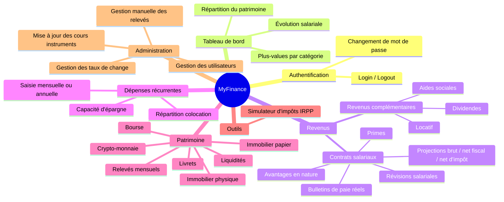

# Architecture MyFinance

Vue d'ensemble de l'application **MyFinance** et index de la documentation.

---

## 1. Description générale

Application web personnelle de gestion financière personnelle, hébergée sur NAS QNAP en réseau local.

| Composant | Technologie |
|-----------|-------------|
| Frontend | React 19 + Vite + Tailwind CSS v4 + Recharts |
| Backend | Spring Boot 3.5 / Java 17 + Spring Security |
| Base de données | SQLite (fichier local) |
| Documentation API | Springdoc OpenAPI — Swagger UI : `/swagger-ui.html` |
| Authentification | Session cookie HTTP (BCrypt, pas de JWT) |

---

## 2. Carte fonctionnelle

---

## 3. Modules

### 3.1 Authentification & gestion des utilisateurs

Authentification par session cookie. Deux rôles : `USER` (accès à ses propres données) et `ADMIN` (accès global + fonctionnalités d'administration).

| Documentation | Lien |
|---------------|------|
| Architecture | [`docs/architecture/userManagement.md`](userManagement.md) |
| API authentification | [`docs/api/authentication.md`](../api/authentication.md) |
| API utilisateurs | [`docs/api/users.md`](../api/users.md) |

---

### 3.2 Tableau de bord

Page d'accueil après connexion. Synthèse visuelle des finances sous forme de graphiques (Recharts) : évolution salariale sur les bulletins réels, valorisation du patrimoine par enveloppe et par catégorie, plus-values YTD.

| Documentation | Lien |
|---------------|------|
| Architecture | [`docs/architecture/dashboard.md`](dashboard.md) |
| API | [`docs/api/dashboard.md`](../api/dashboard.md) |

---

### 3.3 Revenus

Deux sous-modules accessibles depuis le menu **Revenus**.

#### Revenus salariaux

Un contrat salarial stocke les conditions d'emploi et génère des **projections automatiques** sur quatre niveaux : super brut → brut → net imposable → net d'impôt. Des bulletins de paie réels permettent de comparer réel et théorique. L'historique salarial est suivi via les révisions de contrat.

#### Revenus complémentaires

Tout revenu hors salaire (locatif, dividendes, aides sociales, autre), utilisé dans le simulateur d'impôts et la capacité d'épargne.

| Documentation | Lien |
|---------------|------|
| Architecture | [`docs/architecture/salary.md`](salary.md) |
| API contrats & bulletins | [`docs/api/salary-contracts.md`](../api/salary-contracts.md) |
| API revenus complémentaires | [`docs/api/other-incomes.md`](../api/other-incomes.md) |

---

### 3.4 Dépenses récurrentes

Saisie des charges fixes ou périodiques (loyer, abonnements, assurances…) en fréquence mensuelle ou annuelle. Le système projette automatiquement le montant manquant (mensuel ↔ annuel). Une répartition en pourcentage permet de modéliser les dépenses partagées en colocation. La synthèse calcule la **capacité d'épargne mensuelle** (revenus nets − total dépenses).

| Documentation | Lien |
|---------------|------|
| Architecture | [`docs/architecture/recurring-expenses.md`](recurring-expenses.md) |

---

### 3.5 Patrimoine

Suivi de l'ensemble des actifs financiers, organisés en six catégories. Repose sur un modèle **Position → Ordres** : chaque position agrège les transactions successives pour calculer la valorisation en temps réel. Un relevé mensuel historise la valeur du patrimoine mois par mois.

| Catégorie | Mécanisme de valorisation |
|-----------|--------------------------|
| Bourse, Crypto | Quantité × prix marché (Yahoo Finance / CoinGecko) |
| Livret, Immo papier | Montant investi + intérêts cumulés |
| Immo physique | Valeur estimée saisie manuellement |
| Liquidités | Solde saisi manuellement |

| Documentation | Lien |
|---------------|------|
| Architecture | [`docs/architecture/patrimoine.md`](patrimoine.md) |
| API | [`docs/api/patrimoine.md`](../api/patrimoine.md) |

---

### 3.6 Outils

#### Simulateur d'impôts (IRPP)

Estimation de l'impôt sur le revenu à partir du profil fiscal de l'utilisateur (parts, abattement). Choix de la source salariale (projection contrat ou bulletins réels) et sélection des revenus complémentaires à inclure.

| Documentation | Lien |
|---------------|------|
| Architecture | [`docs/architecture/tax-simulator.md`](tax-simulator.md) |
| API | [`docs/api/tax-simulator.md`](../api/tax-simulator.md) |

---

### 3.7 Fonctionnalités d'administration

Accessibles uniquement au rôle `ADMIN`.

#### Mise à jour manuelle des cours

Mécanisme de secours pour mettre à jour le `lastPrice` des instruments actifs lorsque la mise à jour automatique n'est pas disponible ou retourne une valeur incorrecte.

→ [`docs/architecture/instrument-price-update.md`](instrument-price-update.md)

#### Gestion des taux de change

Saisie et maintenance des taux de change (USD, GBP, CHF…) pour convertir correctement en EUR les positions BOURSE et CRYPTO libellées en devise étrangère.

→ [`docs/architecture/exchange-rates.md`](exchange-rates.md) — API : [`docs/api/exchange-rates.md`](../api/exchange-rates.md)

#### Gestion manuelle des relevés

CRUD complet sur les relevés de patrimoine de n'importe quel utilisateur. Utilisé pour corriger des snapshots incorrects ou reconstituer un historique.

→ [`docs/architecture/admin-snapshot-management.md`](admin-snapshot-management.md) — API : [`docs/api/admin-snapshots.md`](../api/admin-snapshots.md)

---

## 4. Décisions d'architecture (ADR)

Les décisions techniques structurantes sont documentées dans [`docs/architecture/decisions/`](decisions/README.md).

| ADR | Sujet |
|-----|-------|
| [ADR-001](decisions/ADR-001-architecture-generale.md) | Architecture générale (monorepo, SQLite, session cookie) |
| [ADR-002](decisions/ADR-002-tailwind-css.md) | Choix de Tailwind CSS v4 |
