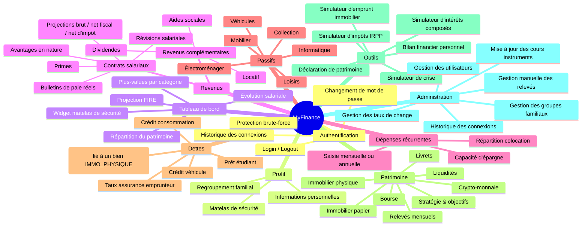

# Architecture MyFinance

Vue d'ensemble de l'application **MyFinance** et index de la documentation.

---

## 1. Description générale

Application web personnelle de gestion financière, hébergée sur NAS QNAP en réseau local.

| Composant | Technologie |
|-----------|-------------|
| Frontend | React 19 + Vite + Tailwind CSS v4 + Recharts |
| Backend | Spring Boot 3.5 / Java 17 + Spring Security |
| Base de données | SQLite (fichier local) |
| Documentation API | Springdoc OpenAPI — Swagger UI : `/swagger-ui.html` |
| Authentification | Session cookie HTTP (BCrypt, pas de JWT) |

---

## 2. Carte fonctionnelle

---

## 3. Modules

### 3.1 Authentification & gestion des utilisateurs

Authentification par session cookie. Deux rôles : `USER` (accès à ses propres données) et `ADMIN` (accès global + fonctionnalités d'administration). Protection brute-force avec durée de blocage exponentielle.

| Documentation | Lien |
|---------------|------|
| Architecture | [`docs/architecture/userManagement.md`](userManagement.md) |
| API authentification | [`docs/api/authentication.md`](../api/authentication.md) |
| API utilisateurs | [`docs/api/users.md`](../api/users.md) |

---

### 3.2 Profil utilisateur

#### Matelas de sécurité

Réserve de liquidités que l'utilisateur configure selon trois modes : montant fixe, N mois de dépenses, ou N mois de salaire. Visualisé via un widget tableau de bord et un indicateur sur les cartes LIVRET/LIQUIDITE du patrimoine.

→ [`docs/architecture/safety-net.md`](safety-net.md)

#### Regroupement familial

Permet à plusieurs utilisateurs de former un foyer pour visualiser leur patrimoine et leurs données de manière agrégée. Système d'invitations owner → membre, toggle "Mode Foyer" dans la navigation.

→ [`docs/architecture/family-group.md`](family-group.md) — API : [`docs/api/family-group.md`](../api/family-group.md)

---

### 3.3 Tableau de bord

Page d'accueil après connexion. Synthèse visuelle des finances : évolution salariale, valorisation du patrimoine par catégorie et par devise, plus-values YTD, widget matelas de sécurité, projection FIRE (règle des 4 %).

| Documentation | Lien |
|---------------|------|
| Architecture | [`docs/architecture/dashboard.md`](dashboard.md) |
| API | [`docs/api/dashboard.md`](../api/dashboard.md) |

---

### 3.4 Revenus

Deux sous-modules accessibles depuis le menu **Revenus**.

#### Revenus salariaux

Un contrat salarial génère des **projections automatiques** sur quatre niveaux : super brut → brut → net imposable → net d'impôt. Des bulletins de paie réels permettent de comparer réel et théorique. L'historique salarial est suivi via les révisions de contrat.

#### Revenus complémentaires

Tout revenu hors salaire (locatif, dividendes, aides sociales, autre), utilisé dans le simulateur d'impôts et la capacité d'épargne.

| Documentation | Lien |
|---------------|------|
| Architecture | [`docs/architecture/salary.md`](salary.md) |
| API contrats & bulletins | [`docs/api/salary-contracts.md`](../api/salary-contracts.md) |
| API revenus complémentaires | [`docs/api/other-incomes.md`](../api/other-incomes.md) |

---

### 3.5 Dépenses récurrentes

Saisie des charges fixes ou périodiques en fréquence mensuelle ou annuelle. Répartition en pourcentage pour les dépenses partagées (colocation). La synthèse calcule la **capacité d'épargne mensuelle** (revenus nets − total dépenses).

| Documentation | Lien |
|---------------|------|
| Architecture | [`docs/architecture/recurring-expenses.md`](recurring-expenses.md) |
| API | [`docs/api/recurring-expenses.md`](../api/recurring-expenses.md) |

---

### 3.6 Passifs (Grandes possessions)

Recensement des biens matériels (voiture, informatique, mobilier…). Décote exponentielle automatique par catégorie ou valeur saisie manuellement. Contribue au **patrimoine net** dans le bilan et la déclaration.

| Documentation | Lien |
|---------------|------|
| Architecture | [`docs/architecture/passifs.md`](passifs.md) |
| API | [`docs/api/possessions.md`](../api/possessions.md) |

---

### 3.6b Dettes

Recensement des dettes financières (emprunt immobilier, prêt étudiant, crédit véhicule, crédit à la consommation). Chaque dette porte un taux d'intérêt annuel et un **taux d'assurance emprunteur** pour calculer le coût mensuel total. Un emprunt immobilier peut être **lié à une position `IMMO_PHYSIQUE`** pour afficher la valeur nette du bien (valeur estimée − capital restant dû). Le total des dettes entre dans le calcul du **patrimoine net**, du **bilan financier** et du **simulateur de crise**.

| Documentation | Lien |
|---------------|------|
| Architecture | [`docs/architecture/dettes.md`](dettes.md) |
| API | [`docs/api/debts.md`](../api/debts.md) |

---

### 3.7 Patrimoine

Suivi de l'ensemble des actifs financiers en six catégories. Modèle **Position → Ordres** avec valorisation en temps réel. Relevés mensuels pour historiser l'évolution.

| Catégorie | Mécanisme de valorisation |
|-----------|--------------------------|
| Bourse, Crypto | Quantité × prix marché |
| Livret, Immo papier | Montant investi + intérêts cumulés |
| Immo physique | Valeur estimée saisie manuellement |
| Liquidités | Solde saisi manuellement |

#### Stratégie & objectifs patrimoniaux

Objectifs cibles par catégorie persistés en base. Barres de progression sur chaque carte de résumé (en cours / atteint / dépassé).

| Documentation | Lien |
|---------------|------|
| Architecture | [`docs/architecture/patrimoine.md`](patrimoine.md) |
| Stratégie | [`docs/architecture/patrimoine-strategy.md`](patrimoine-strategy.md) |
| API | [`docs/api/patrimoine.md`](../api/patrimoine.md) |

---

### 3.8 Outils

#### Simulateur d'impôts (IRPP)

Estimation de l'impôt sur le revenu à partir du profil fiscal. Choix de la source salariale et sélection des revenus complémentaires.

→ [`docs/architecture/tax-simulator.md`](tax-simulator.md) — API : [`docs/api/tax-simulator.md`](../api/tax-simulator.md)

#### Bilan financier personnel

Vue synthétique calquée sur un compte de résultat d'entreprise. Revenus, dépenses, actifs, passifs, taux d'épargne, ratio de couverture patrimoniale et projection FIRE côte à côte.

→ [`docs/architecture/bilan-financier.md`](bilan-financier.md)

#### Simulateur d'intérêts composés

Projection de la croissance d'un capital avec versements périodiques, inflation, frais, fiscalité PFU et mode inversé (calcul des paramètres pour atteindre un objectif).

→ [`docs/architecture/compound-interest-simulator.md`](compound-interest-simulator.md)

#### Simulateur d'emprunt immobilier

Simulation complète d'un crédit immobilier : mensualité, coût total, tableau d'amortissement. Prend en compte frais de notaire, frais d'agence, assurance, PTZ et remboursement anticipé.

→ [`docs/architecture/loan-simulator.md`](loan-simulator.md)

#### Déclaration de patrimoine

Document officiel exportable en PDF synthétisant l'identité civile, le patrimoine net, les revenus et le détail des actifs par catégorie (avec enveloppe fiscale pour BOURSE/IMMO_PAPIER).

→ [`docs/architecture/patrimoine-declaration.md`](patrimoine-declaration.md)

#### Simulateur de crise

Applique les taux de chute historiques de crises majeures (2008, dot-com, COVID, 2022) au patrimoine actuel. Montre l'impact par catégorie, la couverture du matelas de sécurité post-crise et une estimation du temps de récupération selon le taux d'épargne.

→ [`docs/architecture/crisis-simulator.md`](crisis-simulator.md)

---

### 3.9 Fonctionnalités d'administration

Accessibles uniquement au rôle `ADMIN`.

#### Mise à jour manuelle des cours

Mise à jour du `lastPrice` des instruments actifs. Toggle prix fixe pour les instruments à cours stable.

→ [`docs/architecture/instrument-price-update.md`](instrument-price-update.md)

#### Gestion des taux de change

Saisie et maintenance des taux de change (USD, GBP, CHF…) pour la conversion EUR des positions en devise étrangère.

→ [`docs/architecture/exchange-rates.md`](exchange-rates.md) — API : [`docs/api/exchange-rates.md`](../api/exchange-rates.md)

#### Gestion manuelle des relevés

CRUD complet sur les relevés de patrimoine de n'importe quel utilisateur. Utilisé pour corriger des snapshots ou reconstituer un historique.

→ [`docs/architecture/admin-snapshot-management.md`](admin-snapshot-management.md) — API : [`docs/api/admin-snapshots.md`](../api/admin-snapshots.md)

#### Historique des connexions

Consultation paginée des événements de connexion (SUCCESS / FAILURE / BLOCKED) avec filtres par login, type et date. Permet de détecter les tentatives d'intrusion.

→ [`docs/architecture/login-history.md`](login-history.md) — API : [`docs/api/login-history.md`](../api/login-history.md)

#### Gestion des groupes familiaux

Consultation et modération des groupes familiaux (dissolution, retrait de membres).

→ [`docs/architecture/family-group.md`](family-group.md) — API : [`docs/api/family-group.md`](../api/family-group.md)

---

## 4. Décisions d'architecture (ADR)

Les décisions techniques structurantes sont documentées dans [`docs/architecture/decisions/`](decisions/README.md).

| ADR | Sujet |
|-----|-------|
| [ADR-001](decisions/ADR-001-architecture-generale.md) | Architecture générale (monorepo, SQLite, session cookie) |
| [ADR-002](decisions/ADR-002-tailwind-css.md) | Choix de Tailwind CSS v4 |
