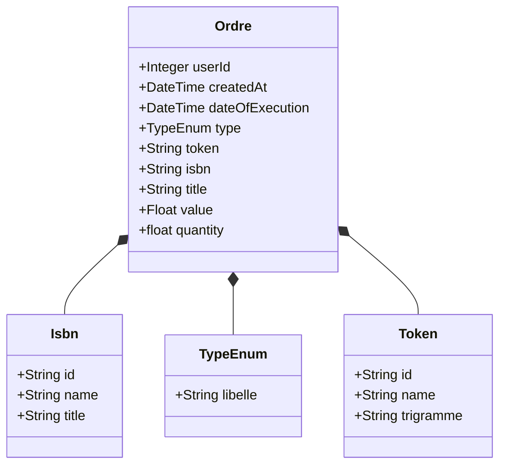
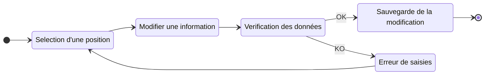
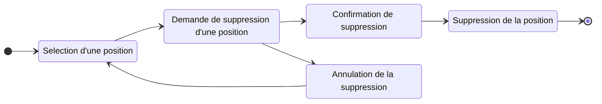
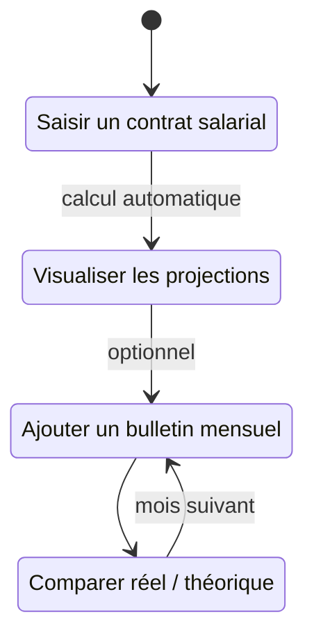
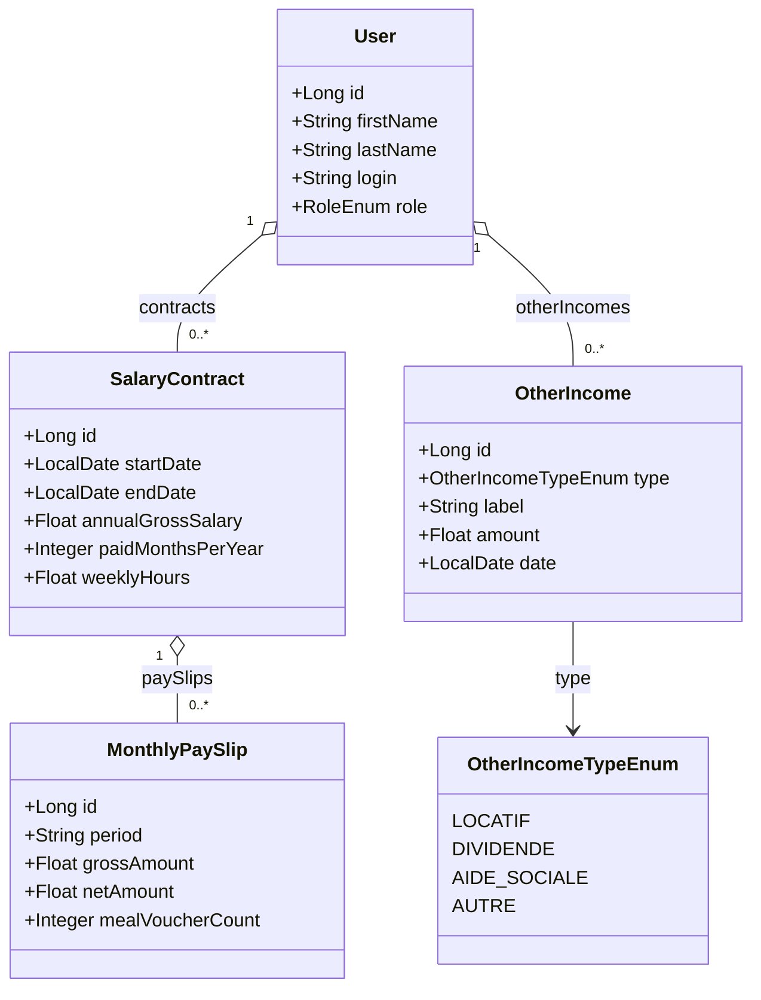

# Architecture Investment Tracker

Cette page décrit l’architecture de l’application **MyFinance** et de ses fonctionnalités

## 1. Description générale

- Application web personnelle pour gérer un portefeuille d’investissements.
- Frontend en **React 19**.
- Backend en **Spring Boot 3.5 / Java 17**.
- Base de données **SQLite** locale.
- Scheduler pour mise à jour automatique des données boursière et crypto-currency

## 2. Diagramme d’architecture

Le diagramme suivant décrit la structure et logique applicative de MyFinance.

```mermaid
%% Contenu copié depuis docs/architecture/diagram/activity-diagram.mmd
mindmap
  root((MyFinance))
    Gestion des utilisateurs
        Créer un utilisateur
        Modifier un utilisateur
        Supprimer un utilisateur
        Créer un regroupement famillial
    Gestion du patrimoine
        Choisir la consultation personnelle ou de regroupement famillial
        Actualisation manuelle d'une position
            Modification d'une position existante
            Création d'une position
            Fermeture d'une position
        Ajouter une source de revenue
    Gestion des automatisation
        Saisir une position a suivre
            Crypto-monnaie
            Bourse
        Suivi automatisé
            Analyse des cours de crypto-monnaie
            Analyse des cours de bourses
    Consultation des positions
        Graphique du patrimoine brut
        Graphique du patrimoine net
        Graphique des plus value
        Graphique de la diversification par secteur de marché
        Graphique de diversification par secteur géographique
        Graphique du suivi des revenues
        Graphique du suivi des dépenses
    Importation de données
        Format Json
    Exportation de données
        Format Json
        Format Excel
````

## Description fonctionnelle

MyFinance à pour objectif de permettre a ses utilisateurs de gérer son patrimoine financier et toutes les actions associées.

### Gestion des utilisateurs

Les droits associés à chaque utilisateurs est décrit dans la section de [gestion des utilisateurs](/docs/architecture/userManagement.md).

### Gestion du patrimoine

Chaque utilisateur à la possibilité de gérer son patrmoine personnelle ou celui de son regroupement familial.

#### Actualisation manuel d'une position

Chaque utilisateurs ont la possibilité de saisir manuellement des ordres et positions pris. Ces positions sont ensuite intégré afin de calculé les impacts sur le patrimoine de l'utilisateur et sa valorisation.

Une Position est un ordre d'achat ou de vente sur une entité financière. Cette ordre peut etre créditeur ou débiteur.

##### Création d'une position

```mermaid
%% Contenu copié depuis docs/architecture/diagram/activity-asset-management-add-diagram.mmd
stateDiagram 
%% state
    state "Choisi un type de position" as chooseType
    state "Type de position" as if_typeOfPosition 

    state "Saisie un titre" as chooseTitle
    state "Saisie une valeur" as chooseValue
    state "Saisie une quantité" as chooseQuantity
    state "Liste des ISBN existants" as listOfExistingISBN
    state "Saisie un nouveau ISBN" as setISBN
    state "Liste des Token existants" as listOfExistingToken
    state "Saisie un nouveau Token" as setToken
    state "Date d'exécution" as chooseDateExecution
    state "Verification des données saisies" as verifyData
    state "Sauvegarde de la position" as saveData
    state "Erreur de saisies" as errorFromUser


    [*] --> chooseType
    chooseType --> if_typeOfPosition
    if_typeOfPosition --> listOfExistingISBN: type = Bourse
    listOfExistingISBN --> setISBN : Création d'un ISBN
    listOfExistingISBN --> chooseTitle : Réutilisation d'un ISBN existant
    setISBN --> chooseTitle

    if_typeOfPosition --> listOfExistingToken : type = Crypto-monnaie
    listOfExistingToken --> setToken : Création d'un Token
    listOfExistingToken --> chooseTitle : Réutilisation d'un Token existant
    setToken --> chooseTitle

    if_typeOfPosition --> chooseTitle : type = Autresx
    chooseTitle --> chooseValue
    chooseValue --> chooseQuantity
    chooseQuantity --> chooseDateExecution
    chooseDateExecution --> verifyData
    verifyData --> saveData : OK
    verifyData --> errorFromUser : KO
    
    
     saveData--> [*]
     errorFromUser--> chooseType
```


Structure d'une de position :


##### Modification d'une position

Les utilisateurs peuvent modifier une position prise a n'importe quel moment. Suite a ces modifications et la validation de celle-ci, le système réintegre les éléments calculé a partir de cette mise à jour.


##### Suppression d'une position

Les utilisateurs peuvent supprimer une position prise à n'importe quel moment. Suite a cette suppression, le systeme recalculs les données.



#### Gestion des revenus

Chaque utilisateur peut gérer deux types de revenus depuis le menu **Revenus** de l'application. La documentation détaillée (formules, règles métier, endpoints) est dans [`docs/architecture/salary.md`](salary.md).

##### Revenus salariaux

Un contrat salarial (`SalaryContract`) modélise les conditions d'un emploi. À partir du brut annuel, de la durée hebdomadaire et du nombre de mois payés, l'application calcule automatiquement des projections théoriques. Un seul contrat peut être actif à la fois (sans date de fin).

Des bulletins de paie mensuels réels (`MonthlyPaySlip`) peuvent être saisis pour chaque période afin de comparer le réel au théorique.



##### Revenus complémentaires

Les revenus complémentaires (`OtherIncome`) permettent de saisir tout revenu ponctuel ou récurrent hors salaire, classé par type.

| Type | Description |
|------|-------------|
| `LOCATIF` | Loyers perçus |
| `DIVIDENDE` | Dividendes d'actions ou parts sociales |
| `AIDE_SOCIALE` | CAF, allocations, aides diverses |
| `AUTRE` | Tout autre revenu |

##### Modèle de données



Les projections (net mensuel, journalier, horaire) sont calculées à la volée dans `SalaryContractDto` et ne sont jamais persistées en base.

