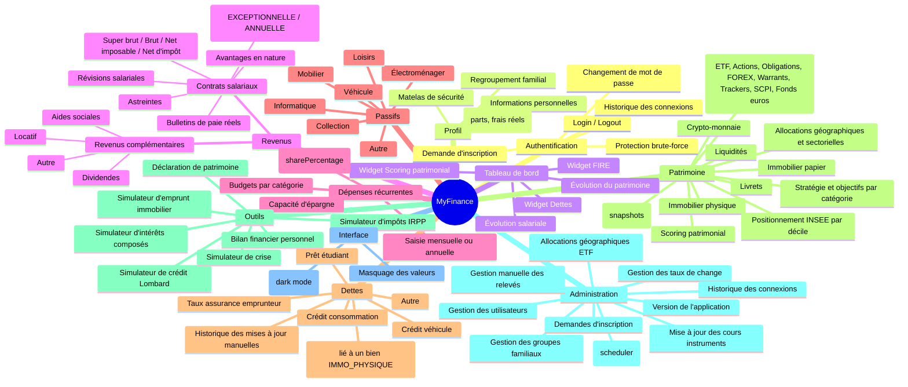

# Architecture MyFinance

Vue d'ensemble de l'application **MyFinance** et index de la documentation.

---

## 1. Description générale

Application web personnelle de gestion financière, hébergée sur NAS QNAP via Docker (accès HTTPS via proxy inverse myQNAPcloud).

| Composant | Technologie |
|-----------|-------------|
| Frontend | React 19 + Vite + Tailwind CSS v4 + Recharts |
| Backend | Spring Boot 3.5 / Java 17 + Spring Security |
| Base de données | SQLite (fichier local — profils `dev` et `docker`) |
| Documentation API | Springdoc OpenAPI — Swagger UI : `/swagger-ui.html` |
| Authentification | Session cookie HTTP (BCrypt, pas de JWT) |
| Déploiement | Docker multi-stage, profil `docker`, HTTPS via reverse proxy QNAP |

---

## 2. Carte fonctionnelle

---

## 3. Modules

### 3.1 Authentification & gestion des utilisateurs

Authentification par session cookie. Deux rôles : `USER` (accès à ses propres données) et `ADMIN` (accès global + fonctionnalités d'administration). Protection brute-force avec durée de blocage exponentielle. Système de demandes d'inscription soumis à validation admin.

| Documentation | Lien |
|---------------|------|
| Architecture | [`docs/architecture/user-management.md`](user-management.md) |
| Architecture sécurité | [`docs/architecture/security.md`](security.md) |
| API authentification | [`docs/api/authentication.md`](../api/authentication.md) |
| API utilisateurs | [`docs/api/users.md`](../api/users.md) |
| API inscriptions | [`docs/api/registration-requests.md`](../api/registration-requests.md) |

---

### 3.2 Profil utilisateur

#### Matelas de sécurité

Réserve de liquidités configurée selon trois modes : montant fixe (`FIXED_AMOUNT`), N mois de dépenses (`MONTHS_EXPENSES`), ou N mois de salaire (`MONTHS_SALARY`). Visualisé via un widget tableau de bord et un indicateur sur les cartes LIVRET/LIQUIDITE du patrimoine.

→ [`docs/architecture/user-management.md`](user-management.md) (section Matelas de sécurité)

#### Regroupement familial

Permet à plusieurs utilisateurs de former un foyer pour visualiser leur patrimoine de manière agrégée. Système d'invitations owner → membre, toggle "Mode Foyer" dans la navigation.

→ [`docs/architecture/family-group.md`](family-group.md) — API : [`docs/api/family-group.md`](../api/family-group.md)

---

### 3.3 Tableau de bord

Page d'accueil après connexion. Synthèse visuelle : évolution salariale, évolution du patrimoine en aires empilées par catégorie (avec point "Aujourd'hui"), widget FIRE (règle des 4 %), widget Dettes (KPIs + ratio endettement), widget Scoring patrimonial (6 axes).

| Documentation | Lien |
|---------------|------|
| Architecture | [`docs/architecture/dashboard.md`](dashboard.md) |
| API | [`docs/api/dashboard.md`](../api/dashboard.md) |

---

### 3.4 Revenus

Deux sous-modules accessibles depuis le menu **Revenus**.

#### Revenus salariaux

Un contrat salarial génère des **projections automatiques** sur quatre niveaux : super brut → brut → net imposable → net d'impôt. Des bulletins de paie réels permettent de comparer réel et théorique. L'historique salarial est suivi via les révisions de contrat. Les primes, avantages en nature et astreintes sont modélisés comme des éléments rattachés au contrat.

#### Revenus complémentaires

Tout revenu hors salariat (locatif, dividendes, aides sociales, autre), utilisé dans le simulateur d'impôts et la capacité d'épargne.

| Documentation | Lien |
|---------------|------|
| Architecture | [`docs/architecture/salary.md`](salary.md) |
| API contrats & bulletins | [`docs/api/salary-contracts.md`](../api/salary-contracts.md) |
| API revenus complémentaires | [`docs/api/other-incomes.md`](../api/other-incomes.md) |

---

### 3.5 Dépenses récurrentes

Saisie des charges fixes ou périodiques en fréquence mensuelle ou annuelle. Répartition en pourcentage pour les dépenses partagées (colocation). Budgets mensuels cibles par catégorie. La synthèse calcule la **capacité d'épargne mensuelle** (revenus nets − total dépenses).

| Documentation | Lien |
|---------------|------|
| Architecture | [`docs/architecture/recurring-expenses.md`](recurring-expenses.md) |
| API | [`docs/api/recurring-expenses.md`](../api/recurring-expenses.md) |

---

### 3.6 Passifs (Grandes possessions)

Recensement des biens matériels (voiture, informatique, mobilier…). Décote exponentielle automatique par catégorie ou valeur saisie manuellement (`estimatedCurrentValue` non nul → mode override). Contribue au **patrimoine net** dans le bilan et la déclaration.

| Documentation | Lien |
|---------------|------|
| Architecture | [`docs/architecture/passifs.md`](passifs.md) |
| API | [`docs/api/possessions.md`](../api/possessions.md) |

---

### 3.6b Dettes

Recensement des dettes financières (emprunt immobilier, prêt étudiant, crédit véhicule, crédit consommation). Deux modes de suivi du capital : projection automatique par formule d'amortissement, ou override manuel via l'historique des mises à jour (`DebtBalanceEntry`). Un emprunt immobilier peut être **lié à une position `IMMO_PHYSIQUE`** pour afficher la valeur nette du bien. Le total des dettes entre dans le patrimoine net, le bilan financier et le simulateur de crise.

| Documentation | Lien |
|---------------|------|
| Architecture | [`docs/architecture/dettes.md`](dettes.md) |
| API | [`docs/api/debts.md`](../api/debts.md) |

---

### 3.7 Patrimoine

Suivi de l'ensemble des actifs financiers en six catégories. Modèle **Position → Ordres** avec valorisation en temps réel. Allocations géographiques et sectorielles par instrument. Relevés mensuels pour historiser l'évolution. Positionnement par décile INSEE (Enquête Patrimoine 2021-2022).

| Catégorie | Mécanisme de valorisation |
|-----------|--------------------------|
| Bourse, Crypto | Quantité × prix marché (converti en EUR via taux de change) |
| Livret, Immo papier | Montant investi + intérêts/dividendes cumulés |
| Immo physique | Valeur estimée saisie manuellement |
| Liquidités | Solde saisi manuellement |

#### Stratégie & objectifs patrimoniaux

Objectifs cibles par catégorie persistés en base (`PatrimoineTarget`). Barres de progression sur chaque carte de résumé.

#### Scoring patrimonial

Score de cohérence calculé en 6 axes (Diversification, Matelas, Endettement, Épargne, Âge/risque, Progression) + bonus objectifs. Maximum 105 points. Profils : FRAGILE / PRUDENT / EQUILIBRE / DYNAMIQUE / OPTIMISE.

| Documentation | Lien |
|---------------|------|
| Architecture patrimoine | [`docs/architecture/patrimoine.md`](patrimoine.md) |
| Architecture instruments | [`docs/architecture/instruments.md`](instruments.md) |
| Architecture scoring | [`docs/architecture/patrimoine-scoring.md`](patrimoine-scoring.md) |
| Architecture stratégie | [`docs/architecture/patrimoine-strategy.md`](patrimoine-strategy.md) |
| API positions et ordres | [`docs/api/patrimoine-positions.md`](../api/patrimoine-positions.md) |
| API snapshots et marché | [`docs/api/patrimoine-snapshots.md`](../api/patrimoine-snapshots.md) |
| API outils (score, objectifs) | [`docs/api/patrimoine-outils.md`](../api/patrimoine-outils.md) |

---

### 3.8 Outils

#### Simulateur d'impôts (IRPP)

Estimation de l'impôt sur le revenu à partir du profil fiscal. Choix de la source salariale (`PROJECTION_CONTRAT` ou `BULLETINS_REELS`) et sélection des revenus complémentaires.

→ [`docs/architecture/tax-simulator.md`](tax-simulator.md) — API : [`docs/api/tax-simulator.md`](../api/tax-simulator.md)

#### Bilan financier personnel

Vue synthétique calquée sur un compte de résultat d'entreprise. Revenus, dépenses, actifs, passifs, taux d'épargne, ratio de couverture patrimoniale et projection FIRE côte à côte.

→ [`docs/architecture/tools/bilan-financier.md`](tools/bilan-financier.md)

#### Simulateur d'intérêts composés

Projection de la croissance d'un capital avec versements périodiques, inflation, frais, fiscalité PFU et mode inversé (calcul des paramètres pour atteindre un objectif).

→ [`docs/architecture/tools/compound-interest-simulator.md`](tools/compound-interest-simulator.md)

#### Simulateur d'emprunt immobilier

Simulation complète d'un crédit immobilier : mensualité, coût total, tableau d'amortissement. Prend en compte frais de notaire, frais d'agence, assurance, PTZ et remboursement anticipé.

→ [`docs/architecture/tools/loan-simulator.md`](tools/loan-simulator.md)

#### Déclaration de patrimoine

Document officiel exportable en PDF synthétisant l'identité civile, le patrimoine net, les revenus et le détail des actifs par catégorie (avec enveloppe fiscale pour BOURSE/IMMO_PAPIER).

→ [`docs/architecture/patrimoine-declaration.md`](patrimoine-declaration.md)

#### Simulateur de crise

Applique les taux de chute historiques de crises majeures (2008, dot-com, COVID, 2022) au patrimoine actuel. Montre l'impact par catégorie, la couverture du matelas de sécurité post-crise et une estimation du temps de récupération selon le taux d'épargne.

→ [`docs/architecture/tools/crisis-simulator.md`](tools/crisis-simulator.md)

#### Simulateur de crédit Lombard

Simule un emprunt garanti par le portefeuille de titres financiers (sans vente d'actifs). Trois scénarios LTV pré-définis (Prudent / Réaliste / Optimiste) + mode personnalisé éditable, modes In fine / Amortissable, calcul du seuil de margin call et chute tolérée. Effet de levier (réinvestissement à un rendement attendu) avec gain net après PFU vs coût des intérêts. Sensibilité aux variations EURIBOR (±3 pts). Comparaison parallèle des 3 scénarios LTV sur un même projet. Stress test couplé au levier (effet boule de neige révélé) réutilisant les `drawdowns` du simulateur de crise. Comparaison vente vs Lombard avec calcul d'imposition plus-value et manque à gagner.

→ [`docs/architecture/tools/lombard-credit-simulator.md`](tools/lombard-credit-simulator.md)

---

### 3.9 Fonctionnalités d'administration

Accessibles uniquement au rôle `ADMIN`.

#### Gestion des utilisateurs

CRUD complet sur les comptes utilisateurs. Validation des demandes d'inscription.

→ [`docs/architecture/user-management.md`](user-management.md) — API : [`docs/api/users.md`](../api/users.md)

#### Instruments, cours et taux de change

Mise à jour manuelle et automatique des cours (Boursorama BOURSE, CoinGecko CRYPTO), scheduler mensuel (1er du mois à 2h), taux de change ECB, snapshot patrimonial pour tous les utilisateurs. Toggle prix fixe par instrument. Allocations géographiques et sectorielles.

→ [`docs/architecture/instruments.md`](instruments.md) — API : [`docs/api/exchange-rates.md`](../api/exchange-rates.md)

#### Gestion manuelle des relevés

CRUD complet sur les relevés de patrimoine de n'importe quel utilisateur. Utilisé pour corriger des snapshots ou reconstituer un historique.

→ [`docs/architecture/admin-snapshot-management.md`](admin-snapshot-management.md) — API : [`docs/api/admin-snapshots.md`](../api/admin-snapshots.md)

#### Historique des connexions

Consultation paginée des événements de connexion (SUCCESS / FAILURE / BLOCKED) avec filtres par login, type et date.

→ [`docs/architecture/login-history.md`](login-history.md) — API : [`docs/api/login-history.md`](../api/login-history.md)

#### Gestion des groupes familiaux

Consultation et modération des groupes familiaux (dissolution, retrait de membres).

→ [`docs/architecture/family-group.md`](family-group.md) — API : [`docs/api/family-group.md`](../api/family-group.md)

---

### 3.10 Préférences d'interface

Deux préférences utilisateur persistées dans `localStorage`, activables depuis la barre de navigation (desktop et mobile).

#### Mode nuit

Bascule l'ensemble de l'interface en thème sombre via une classe `dark` posée sur `<html>`. Les couleurs sont définies par des variables CSS (`--color-*`) surchargées dans `html.dark` — aucun composant ne nécessite de modification. Initialisé depuis `localStorage` ou `prefers-color-scheme` si aucune préférence n'est sauvegardée. Un script inline dans `index.html` applique la classe avant le premier rendu React pour éviter le flash de blanc.

#### Masquage des valeurs

Classe `hide-values` sur le conteneur principal. Tous les éléments portant la classe `.amount` passent en `blur(6px)`, révélables au survol. Utilisé pour dissimuler les données financières à l'écran sans déconnecter.

---

## 4. Décisions d'architecture (ADR)

Les décisions techniques structurantes sont documentées dans [`docs/architecture/decisions/`](decisions/README.md).

| ADR | Sujet |
|-----|-------|
| [ADR-001](decisions/ADR-001-architecture-generale.md) | Architecture générale (monorepo, SQLite, session cookie) |
| [ADR-002](decisions/ADR-002-tailwind-css.md) | Choix de Tailwind CSS v4 |
| [ADR-003](decisions/ADR-003-logging-strategy.md) | Stratégie de logging |
| [ADR-004](decisions/ADR-004-responsive-mobile.md) | Responsive mobile |

---

## 5. Statut des fonctionnalités

| Fonctionnalité | Statut |
|----------------|--------|
| Authentification (session cookie, BCrypt, login/logout/me, password change) | Implémenté |
| Protection brute-force (blocage exponentiel, historique des connexions) | Implémenté |
| Demandes d'inscription (public → validation ADMIN) | Implémenté |
| Gestion des utilisateurs CRUD (ADMIN) | Implémenté |
| Profil utilisateur (informations personnelles, profil fiscal, frais réels détaillés) | Implémenté |
| Matelas de sécurité (FIXED_AMOUNT / MONTHS_EXPENSES / MONTHS_SALARY) | Implémenté |
| Regroupement familial (invitations, mode foyer, modération admin) | Implémenté |
| Tableau de bord (évolution salariale, patrimoine, FIRE, dettes, scoring) | Implémenté |
| Contrats salariaux (projections 4 niveaux, révisions, bulletins, primes, avantages, astreintes) | Implémenté |
| Revenus complémentaires (LOCATIF, DIVIDENDE, AIDE_SOCIALE, AUTRE) | Implémenté |
| Dépenses récurrentes (9 catégories, colocation, budgets) | Implémenté |
| Passifs / possessions (7 catégories, décote automatique, override) | Implémenté |
| Dettes (5 types, amortissement, override manuel, historique) | Implémenté |
| Patrimoine — positions et ordres (6 catégories, 8 types d'ordres) | Implémenté |
| Patrimoine — allocations géographiques et sectorielles | Implémenté |
| Patrimoine — taux de change (ADMIN) | Implémenté |
| Patrimoine — snapshots utilisateur et admin | Implémenté |
| Patrimoine — stratégie & objectifs par catégorie | Implémenté |
| Patrimoine — scoring (6 axes, 105 pts max) | Implémenté |
| Patrimoine — positionnement INSEE par décile | Implémenté |
| Mise à jour automatique des cours (Boursorama, CoinGecko, Frankfurter) | Implémenté |
| Simulateur d'impôts IRPP | Implémenté |
| Référentiel fiscal (barème kilométrique) | Implémenté |
| Bilan financier personnel | Implémenté |
| Simulateur d'intérêts composés | Implémenté |
| Simulateur d'emprunt immobilier | Implémenté |
| Déclaration de patrimoine (PDF) | Implémenté |
| Simulateur de crise | Implémenté |
| Simulateur de crédit Lombard (LTV, levier, stress test, sensibilité taux) | Implémenté |
| Déploiement Docker (NAS QNAP, reverse proxy HTTPS) | Implémenté |
| Simulations d'emprunt sauvegardées en base (GET/POST/DELETE `/api/loan-simulations`) | Implémenté |
| Mode nuit (dark mode, `localStorage` + `prefers-color-scheme`) | Implémenté |
| Masquage des valeurs financières (blur, révélable au survol) | Implémenté |
