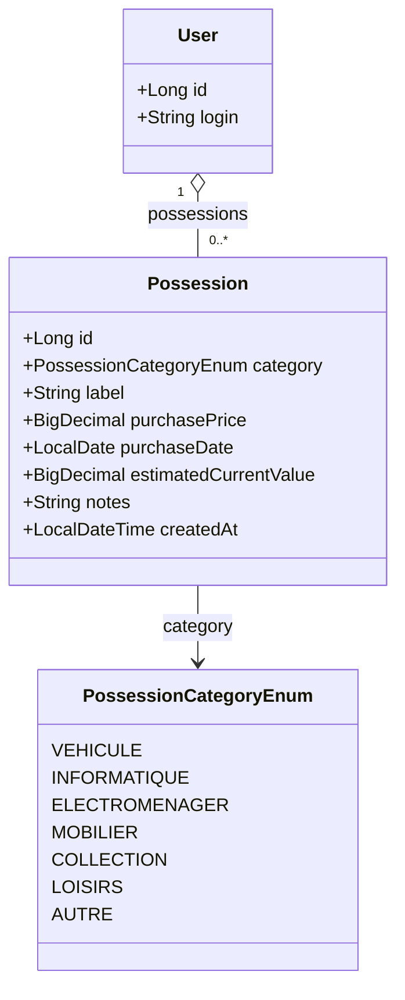
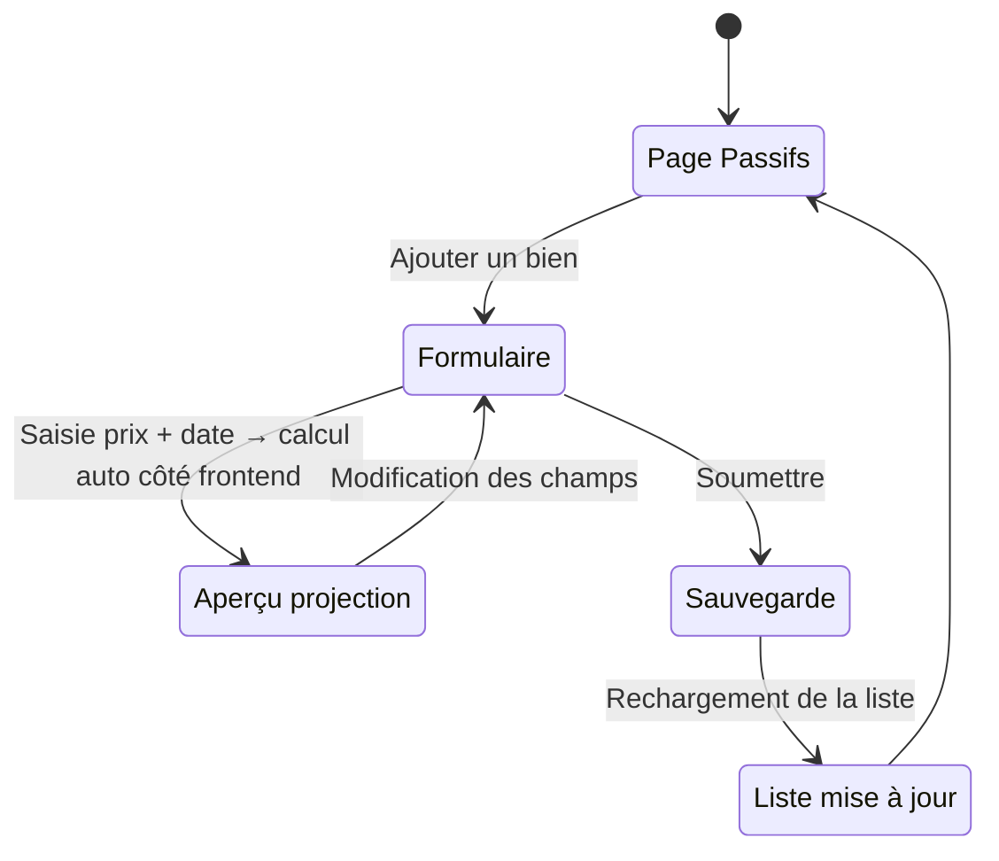

# Gestion des passifs (Grandes possessions)

## Vue d'ensemble

Le module **Passifs** permet à l'utilisateur de recenser ses biens matériels importants — voiture, équipements informatiques, collection, mobilier, etc. — et de suivre leur décote au fil du temps.

Ces biens sont qualifiés de **passifs** au sens de la finance personnelle : ils représentent de la valeur stockée mais ne génèrent pas de revenus. Leur valeur diminue progressivement (décote), contrairement aux actifs financiers suivis dans le module Patrimoine.

Ce module contribue à compléter le **bilan patrimonial de l'utilisateur** :

| Catégorie bilan | Module | Nature |
|-----------------|--------|--------|
| Revenus | Revenus salariaux + Complémentaires | Argent entrant |
| Dépenses | Dépenses récurrentes | Argent sortant |
| Actifs | Patrimoine | Capital qui travaille / s'apprécie |
| Passifs | **Ce module** | Capital qui dort / décote |

---

## 1. Catégories de possessions

Sept catégories couvrent l'essentiel des grandes possessions (`PossessionCategoryEnum`) :

| Catégorie | Enum | Exemples typiques |
|-----------|------|-------------------|
| Véhicule | `VEHICULE` | Voiture, moto, scooter, camping-car, bateau |
| Informatique & High-tech | `INFORMATIQUE` | Ordinateur, laptop, smartphone, tablette, console de jeux |
| Électroménager & Maison | `ELECTROMENAGER` | Lave-linge, réfrigérateur, télévision, robot culinaire |
| Mobilier & Décoration | `MOBILIER` | Canapé, table, armoire, cuisine équipée, objets déco |
| Collection | `COLLECTION` | Montres, bijoux, œuvres d'art, vin, cartes, timbres |
| Loisirs & Sport | `LOISIRS` | Vélo, équipements sportifs, instrument de musique, matériel photo |
| Autre | `AUTRE` | Toute possession ne rentrant pas dans les catégories précédentes |

> **Choix de conception :** La catégorie `COLLECTION` est volontairement incluse malgré que certains objets de collection puissent prendre de la valeur. Dans ce cas, l'utilisateur peut saisir manuellement la valeur actuelle estimée et désactiver la projection automatique.

---

## 2. Modèle de décote

### 2.1 Principe

La valeur actuelle estimée d'un bien est projetée automatiquement à partir du **prix d'achat**, de la **date d'acquisition** et d'un **taux de décote annuel** propre à chaque catégorie.

Le modèle retenu est une **décote exponentielle** (dégressive) :

```
valeurEstimée = prixAchat × (1 − tauxAnnuel)^annéesDepuisAcquisition
```

La valeur projetée ne peut pas descendre en dessous d'une **valeur résiduelle minimale** exprimée en % du prix d'achat.

### 2.2 Taux par catégorie

| Catégorie | Taux annuel | Valeur résiduelle min. | Remarque |
|-----------|-------------|------------------------|----------|
| `VEHICULE` | 15 % | 10 % | Une voiture neuve perd ~50 % en 3 ans |
| `INFORMATIQUE` | 30 % | 5 % | Obsolescence rapide |
| `ELECTROMENAGER` | 12 % | 8 % | Durée de vie 8-15 ans |
| `MOBILIER` | 8 % | 10 % | Dépréciation lente |
| `COLLECTION` | 0 % | 100 % | Pas de projection — saisie manuelle recommandée |
| `LOISIRS` | 15 % | 10 % | Matériel sportif et photo |
| `AUTRE` | 10 % | 10 % | Taux par défaut |

> Les taux sont indicatifs et stockés dans une constante frontend (`DEPRECIATION_RATES`). Ils peuvent évoluer sans impact sur les données persistées.

### 2.3 Override manuel

L'utilisateur peut à tout moment **remplacer la valeur projetée** par une estimation personnelle (résultat d'une cote Argus, d'une expertise, d'une offre de rachat, etc.). Un indicateur visuel distingue les valeurs projetées des valeurs saisies manuellement.

Lorsqu'un override est actif, la valeur projetée reste calculée en arrière-plan pour information mais n'est pas utilisée dans les totaux.

---

## 3. Modèle de données

### 3.1 Entité — `Possession`

Table : `possessions`

| Champ | Type Java | Colonne SQLite | Description |
|-------|-----------|----------------|-------------|
| `id` | `Long` | `id` | Identifiant auto-incrémenté |
| `user` | `User` | `user_id` (FK) | Propriétaire |
| `category` | `PossessionCategoryEnum` | `category` | Catégorie (voir § 1) |
| `label` | `String` | `label` | Libellé libre (ex : « Renault Clio 5 ») |
| `purchasePrice` | `BigDecimal` | `purchase_price` | Prix d'achat initial (en €) |
| `purchaseDate` | `LocalDate` | `purchase_date` | Date d'acquisition |
| `estimatedCurrentValue` | `BigDecimal` | `estimated_current_value` | Valeur actuelle saisie manuellement — `null` = projection automatique |
| `notes` | `String` | `notes` | Notes libres (nullable) |
| `createdAt` | `LocalDateTime` | `created_at` | Date de création de l'entrée |

**Règles :**
- `purchasePrice` > 0
- `purchaseDate` ≤ aujourd'hui
- Si `estimatedCurrentValue` est renseigné, il prend le pas sur la projection automatique
- `label` : 1 à 100 caractères

### 3.2 Enum

```java
public enum PossessionCategoryEnum {
    VEHICULE,
    INFORMATIQUE,
    ELECTROMENAGER,
    MOBILIER,
    COLLECTION,
    LOISIRS,
    AUTRE
}
```

### 3.3 Diagramme de classes



---

## 4. Calculs de projection

Tous les calculs sont effectués à la volée dans le DTO et ne sont pas persistés.

### 4.1 Valeur actuelle calculée

```
annéesDepuisAcquisition = (today − purchaseDate).days / 365.25

valeurCalculée = purchasePrice × (1 − tauxCatégorie)^annéesDepuisAcquisition

valeurCalculée = max(valeurCalculée, purchasePrice × résiduelMinCatégorie)
```

### 4.2 Valeur effective (utilisée dans les totaux)

```
si estimatedCurrentValue ≠ null :
    valeurEffective = estimatedCurrentValue
    isManualOverride = true
sinon :
    valeurEffective = valeurCalculée
    isManualOverride = false
```

### 4.3 Décote

```
décoteCumulée = purchasePrice − valeurEffective
décoteEn%     = décoteCumulée / purchasePrice × 100
```

### 4.4 Synthèse globale (`PossessionSummaryDto`)

```
totalPrixAchat    = Σ(purchasePrice)        pour toutes les possessions
totalValeurActuelle = Σ(valeurEffective)    pour toutes les possessions
totalDécote       = totalPrixAchat − totalValeurActuelle
tauxDécoteGlobal  = totalDécote / totalPrixAchat × 100
```

---

## 5. API REST

Préfixe : `/api/possessions`
Accès : Utilisateur authentifié (ses propres possessions uniquement)

| Méthode | URL | Description |
|---------|-----|-------------|
| `GET` | `/api/possessions` | Liste toutes les possessions (avec valeurs calculées) |
| `GET` | `/api/possessions/{id}` | Détail d'une possession |
| `POST` | `/api/possessions` | Créer une possession |
| `PUT` | `/api/possessions/{id}` | Modifier une possession (ownership vérifié) |
| `DELETE` | `/api/possessions/{id}` | Supprimer une possession (ownership vérifié) |
| `GET` | `/api/possessions/summary` | Synthèse : totaux globaux + répartition par catégorie |

### 5.1 Requête de création / modification

```json
{
  "category": "VEHICULE",
  "label": "Renault Clio 5 - 2022",
  "purchasePrice": 18500.00,
  "purchaseDate": "2022-03-15",
  "estimatedCurrentValue": null,
  "notes": "Achetée neuve, kilométrage 45 000 km"
}
```

> `estimatedCurrentValue` à `null` déclenche le calcul automatique par le serveur.

### 5.2 Réponse — `PossessionDto`

```json
{
  "id": 1,
  "category": "VEHICULE",
  "label": "Renault Clio 5 - 2022",
  "purchasePrice": 18500.00,
  "purchaseDate": "2022-03-15",
  "estimatedCurrentValue": null,
  "computedCurrentValue": 12350.00,
  "effectiveCurrentValue": 12350.00,
  "isManualOverride": false,
  "cumulatedDepreciation": 6150.00,
  "depreciationRate": 33.24,
  "yearsOwned": 4.08,
  "notes": "Achetée neuve, kilométrage 45 000 km",
  "createdAt": "2026-04-17T10:00:00"
}
```

| Champ | Description |
|-------|-------------|
| `computedCurrentValue` | Valeur projetée automatiquement par le modèle de décote |
| `effectiveCurrentValue` | Valeur utilisée dans les totaux (override si renseigné, sinon calculée) |
| `isManualOverride` | `true` si `estimatedCurrentValue` est renseigné manuellement |
| `cumulatedDepreciation` | `purchasePrice − effectiveCurrentValue` |
| `depreciationRate` | Décote en % depuis l'achat |
| `yearsOwned` | Ancienneté en années décimales |

### 5.3 Réponse — `PossessionSummaryDto`

```json
{
  "totalPurchasePrice": 32500.00,
  "totalEffectiveValue": 19800.00,
  "totalDepreciation": 12700.00,
  "globalDepreciationRate": 39.08,
  "byCategory": [
    {
      "category": "VEHICULE",
      "count": 1,
      "totalPurchasePrice": 18500.00,
      "totalEffectiveValue": 12350.00,
      "totalDepreciation": 6150.00
    },
    {
      "category": "INFORMATIQUE",
      "count": 2,
      "totalPurchasePrice": 4000.00,
      "totalEffectiveValue": 1450.00,
      "totalDepreciation": 2550.00
    }
  ]
}
```

---

## 6. Architecture backend

Suit les conventions du projet (voir `PATTERNS-backend.md`) :

```
com.myfinance
├── domain/
│   ├── Possession.java               (@Entity)
│   └── PossessionCategoryEnum.java
├── repository/
│   └── PossessionRepository.java
├── service/
│   └── PossessionService.java        (CRUD + calcul décote)
├── controller/
│   └── PossessionController.java
└── dto/
    ├── PossessionDto.java                (record — réponse enrichie avec calculs)
    ├── PossessionSummaryDto.java         (record — synthèse globale)
    ├── PossessionCategorySummaryDto.java (record — ligne du byCategory)
    ├── CreatePossessionRequest.java      (record — création)
    └── UpdatePossessionRequest.java      (record — modification)
```

`PossessionService` injecte :
- `PossessionRepository`

Les calculs de décote (`computedCurrentValue`, `cumulatedDepreciation`, `depreciationRate`) sont centralisés dans `PossessionDto.from(Possession)` et non dans le service, conformément aux patterns du projet.

Les taux de décote par catégorie (`DEPRECIATION_RATES`) sont définis comme une `Map<PossessionCategoryEnum, BigDecimal>` dans `PossessionDto`, évitant toute configuration YAML pour des constantes métier simples.

---

## 7. Architecture frontend

```
frontend/src/
├── api/
│   └── possessions.js                    # Appels API /api/possessions
└── components/
    └── possessions/
        ├── PossessionPage.jsx            # Page principale (KPIs, liste groupée)
        └── PossessionForm.jsx            # Modal création / édition
```

### 7.1 Navigation

Ajout d'une entrée **Passifs** dans la navigation, en dehors des dropdowns existants (niveau identique à Dépenses) :

```
Dashboard | Patrimoine | Revenus ▾ | Dépenses | Passifs | Outils ▾ | [ADMIN] | Mon profil | Déconnexion
```

### 7.2 Page principale — `PossessionPage`

La page se compose de deux zones :

**Zone 1 — KPIs (en-tête)**

Quatre tuiles de synthèse :
- **Valeur d'achat totale** — somme de tous les `purchasePrice`
- **Valeur actuelle estimée** — somme des `effectiveCurrentValue`
- **Décote cumulée** — différence en €
- **Taux de décote global** — différence en %

**Zone 2 — Liste groupée par catégorie**

Pour chaque catégorie possédée :
- En-tête de groupe : libellé catégorie + badge nombre d'items + total valeur actuelle du groupe
- Ligne par possession : libellé, prix d'achat, date d'achat, valeur actuelle (avec badge « Manuel » si override), décote, ancienneté
- Actions : modifier / supprimer

Colonne « Valeur actuelle » affichée en vert si la valeur est saisie manuellement, en gris sinon.

### 7.3 Formulaire — `PossessionForm`

Modal de création / édition avec les champs :
- **Catégorie** — select avec les 7 options
- **Libellé** — texte libre
- **Prix d'achat** (€) — numérique
- **Date d'acquisition** — date picker
- **Valeur actuelle estimée** (€) — numérique, optionnel
  - Si vide : aperçu de la valeur calculée automatiquement affiché en dessous
  - Si renseigné : badge « Override manuel » avec indication de la valeur calculée en comparaison
- **Notes** — texte libre, optionnel

> L'aperçu de la valeur projetée est calculé **entièrement côté frontend** à partir des constantes `DEPRECIATION_RATES`, sans appel API, pour une réactivité immédiate.

### 7.4 Constantes frontend

```javascript
// frontend/src/components/possessions/constants.js

export const POSSESSION_CATEGORIES = {
  VEHICULE:      { label: 'Véhicule',                annualRate: 0.15, residual: 0.10 },
  INFORMATIQUE:  { label: 'Informatique & High-tech', annualRate: 0.30, residual: 0.05 },
  ELECTROMENAGER:{ label: 'Électroménager & Maison',  annualRate: 0.12, residual: 0.08 },
  MOBILIER:      { label: 'Mobilier & Décoration',    annualRate: 0.08, residual: 0.10 },
  COLLECTION:    { label: 'Collection',               annualRate: 0.00, residual: 1.00 },
  LOISIRS:       { label: 'Loisirs & Sport',          annualRate: 0.15, residual: 0.10 },
  AUTRE:         { label: 'Autre',                    annualRate: 0.10, residual: 0.10 },
};

export const POSSESSION_CATEGORY_COLORS = {
  VEHICULE:       '#6366f1', // indigo
  INFORMATIQUE:   '#06b6d4', // cyan
  ELECTROMENAGER: '#f59e0b', // amber
  MOBILIER:       '#84cc16', // lime
  COLLECTION:     '#ec4899', // pink
  LOISIRS:        '#14b8a6', // teal
  AUTRE:          '#94a3b8', // slate
};
```

---

## 8. Flux de saisie



---

## 9. Règles métier

1. **Ownership strict** : un utilisateur ne peut voir, modifier ou supprimer que ses propres possessions. Le service vérifie `possession.user.id == currentUser.id` et lève une `ResponseStatusException(403)` sinon.
2. **Valeur effective** : si `estimatedCurrentValue` est renseigné (> 0), il est utilisé dans tous les calculs à la place de la projection automatique. Pour revenir à la projection, l'utilisateur doit effacer ce champ.
3. **Valeur résiduelle minimale** : la projection automatique ne descend jamais en dessous de `purchasePrice × residual[category]`. Cela évite d'afficher une valeur nulle ou négative pour des biens anciens.
4. **Catégorie `COLLECTION`** : le taux de décote est 0 % et la valeur résiduelle est 100 % du prix d'achat. La valeur projetée est donc toujours égale au prix d'achat. L'utilisateur est invité à saisir une valeur manuelle si la cote du bien a évolué.
5. **Prix d'achat** : strictement positif. La `purchaseDate` ne peut pas être dans le futur.

---

## 10. Lien avec le bilan patrimonial

Le module Passifs contribue au **bilan patrimonial complet** de l'utilisateur, qui pourra être présenté dans le tableau de bord :

| Dimension | Source | Indicateur |
|-----------|--------|------------|
| Revenus nets mensuels | `SalaryContract` + `OtherIncome` | Capacité à épargner |
| Dépenses mensuelles | `RecurringExpense` | Charges fixes |
| Actifs (valeur qui travaille) | `Position` (Patrimoine) | Valeur du portefeuille |
| Passifs (valeur qui décote) | `Possession` (ce module) | Valeur des grandes possessions |

> **Bilan net (approximatif)** : `totalActifs (Patrimoine) + totalPassifs (Possessions) − totalDettes`
> Les dettes (crédit auto, crédit conso) ne sont pas encore modélisées dans l'application.

---

## 11. Architecture backend — structure des packages

```
com.myfinance
├── domain/
│   ├── Possession.java
│   └── PossessionCategoryEnum.java
├── repository/
│   └── PossessionRepository.java
├── service/
│   └── PossessionService.java
├── controller/
│   └── PossessionController.java
└── dto/
    ├── PossessionDto.java
    ├── PossessionSummaryDto.java
    ├── PossessionCategorySummaryDto.java
    ├── CreatePossessionRequest.java
    └── UpdatePossessionRequest.java
```

---

## 12. Tests unitaires

| Classe de test | Contenu |
|----------------|---------|
| `PossessionServiceTest` | CRUD, vérification ownership, calcul décote (VEHICULE, INFORMATIQUE, COLLECTION), synthèse par catégorie |
| `PossessionControllerTest` | Tous les endpoints, authentification, validation DTOs |

---

## 13. Évolutions futures envisagées

| Évolution | Description |
|-----------|-------------|
| **Historique de valeur** | Permettre d'enregistrer des estimations successives pour voir l'évolution de la valeur d'un bien dans le temps |
| **Alertes de dépréciation** | Notifier l'utilisateur lorsqu'un bien a atteint une fraction définie de son prix d'achat |
| **Import Argus / cote** | Lier un bien à une source de données externe (Argus automobile, sites de vente entre particuliers) |
| **Dettes associées** | Associer un crédit en cours à une possession (ex : crédit auto) pour calculer la valeur nette réelle de la possession |
| **Intégration tableau de bord** | Afficher la valeur totale des passifs dans le bilan synthétique du dashboard |
