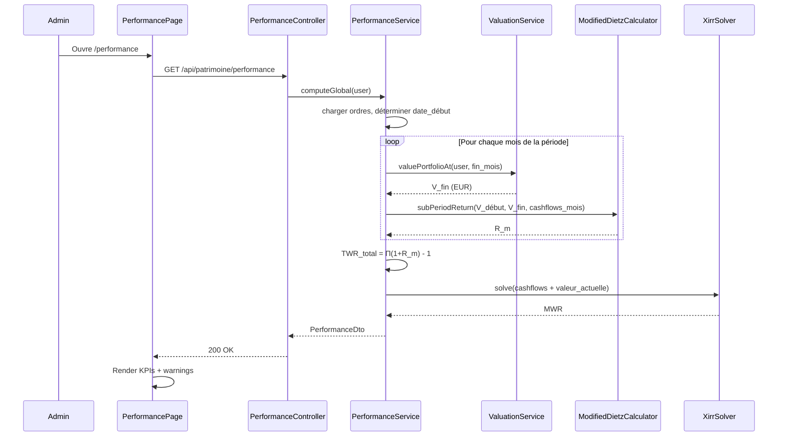

# Performance Patrimoniale (TWR / MWR) — Architecture V1 (refonte)

Calcul du **rendement annualisé** du patrimoine financier global, en neutralisant l'effet des versements et retraits.

> **Statut — Refonte en cours, ADMIN only.**
> La fonctionnalité est en cours de réécriture sur des bases plus fiables. Elle reste **réservée au rôle ADMIN** tant que la précision n'est pas validée par recoupement avec des sources externes (Excel `=XIRR(...)`, comparaison broker). Un bandeau orange « 🚧 Fonctionnalité en cours de validation — calculs en cours de fiabilisation » est affiché en permanence sur la page.

---

## Décisions structurantes V1

| Décision | Choix | Conséquence |
|----------|-------|-------------|
| **Algorithme TWR** | Modified Dietz, sous-périodes mensuelles | Tolère les données peu fréquentes, formule fermée, pas besoin de valoriser à chaque cashflow |
| **Algorithme MWR** | XIRR Newton-Raphson + fallback bissection | Standard de l'industrie (Excel, Google Sheets) |
| **Historique de prix d'instruments** | Nouvelle table `instrument_price_history` (daily) | Précondition à toute mesure fiable BOURSE/CRYPTO |
| **Historique de taux de change** | Nouvelle table `exchange_rate_history` (daily) | Permet la conversion EUR cohérente à toute date passée |
| **Convention devise** | Conversion au taux du **jour de l'évaluation** (cours et flux) | Élimine l'incohérence flux/snapshot ; isole vraiment la performance native |
| **Dividendes / intérêts / airdrops** | Considérés comme **gains internes**, réinvestis virtuellement à la date de versement | Ne rompent pas la sous-période TWR ; comptent au numérateur du rendement |
| **Périmètre UI V1** | Une seule page, vue **globale** (toutes catégories agrégées), période **depuis le premier ordre** | Pas de sélecteur, pas de YTD, pas de tableau par catégorie ni par position |
| **Benchmark** | Aucun en V1 | Sera ajouté quand on aura une série de prix d'un indice de référence (CW8 / MSCI World) |
| **Indicateurs affichés** | TWR + MWR côte à côte | Les deux racontent une histoire différente, on assume la pédagogie |

---

## Limites résiduelles assumées

Avec les choix ci-dessus, les limites structurelles diminuent fortement par rapport à la V0 mais ne disparaissent pas totalement.

1. **`PositionSnapshot` ne fige pas la catégorie.** Une recatégorisation rétroactive de position fausse l'historique. Hors périmètre V1 (pas de calcul par catégorie). À traiter avant d'introduire la V2 « par catégorie ».
2. **`IMMO_PAPIER` (SCPI) sans cours daily.** Valorisé à partir des snapshots mensuels manuels (interpolation linéaire entre deux relevés). C'est la catégorie la moins précise.
3. **`IMMO_PHYSIQUE` exclu.** Valeur estimée subjective.
4. **`LIQUIDITE` exclu.** Pas de rendement attendu.
5. **Frais non tracés.** Performance affichée *brute* de frais (courtage, gestion, TER d'ETF).
6. **Backfill BOURSE manuel.** Aucune source automatique fiable pour l'historique des cours BOURSE européens (Yahoo testé et écarté). L'admin doit importer un CSV par instrument pour disposer d'un calcul antérieur à la date de déploiement ; sinon le calcul démarre à la date du premier prix collecté forward, avec warning explicite.
7. **XIRR sensible aux cashflows extrêmes.** Si le solveur diverge, fallback bissection puis warning « MWR non calculable ».

---

## Vue d'ensemble

Le tableau de bord répond à « **combien j'ai ?** ». Cette page répond à « **est-ce que j'investis bien ?** » via deux métriques :

```
TWR (Time-Weighted Return)  → performance pure de l'actif, neutralise les cashflows
MWR (Money-Weighted Return) → performance réellement vécue, dépend du timing des versements
```

| Métrique | Question à laquelle elle répond |
|----------|--------------------------------|
| **TWR** | Quel rendement ont fait mes actifs, indépendamment de mes versements ? |
| **MWR** | Combien j'ai vraiment gagné par an, compte tenu de quand j'ai mis l'argent ? |

Les deux sont affichées côte à côte. Un tooltip explique la différence en une phrase.

---

## 1. Périmètre V1

### 1.1 Catégories couvertes

| Catégorie | Couverture | Source de valorisation à une date |
|-----------|-----------|-----------------------------------|
| `BOURSE` | TWR + MWR | `quantité × instrument_price_history(date)` × taux_change(date) |
| `CRYPTO` | TWR + MWR | Idem BOURSE |
| `LIVRET` | TWR + MWR | Solde reconstitué : `Σ cashflows + Σ intérêts capitalisés` (taux du livret paramétré sur la position) |
| `IMMO_PAPIER` | TWR + MWR (dégradé) | Interpolation linéaire entre `PositionSnapshot` mensuels |
| `LIQUIDITE` | Exclu | — |
| `IMMO_PHYSIQUE` | Exclu | — |

### 1.2 Période

**V1 : du premier `PositionOrder` jusqu'à aujourd'hui — non paramétrable.**

Aucun sélecteur, aucun preset (YTD, 1 an, etc.). Toute la complexité « inclusion d'un snapshot d'ouverture pour des périodes restreintes » est repoussée à plus tard.

---

## 2. Modèle de données

### 2.1 Nouvelles tables

#### `instrument_price_history`

| Colonne | Type | Description |
|---------|------|-------------|
| `id` | BIGINT (PK) | |
| `instrument_id` | BIGINT (FK) | Référence `instruments.id`, cascade DELETE |
| `price_date` | DATE | Date du cours |
| `price` | DECIMAL(18,6) | Cours de clôture en devise native |
| `source` | VARCHAR | `BOURSORAMA` (daily forward) / `COINGECKO` (crypto) / `MANUAL_CSV` (backfill admin) / `MANUAL` (saisie ponctuelle) |

Index unique : `(instrument_id, price_date)`.

#### `exchange_rate_history`

| Colonne | Type | Description |
|---------|------|-------------|
| `id` | BIGINT (PK) | |
| `currency` | VARCHAR(3) | Code ISO (USD, GBP, …) |
| `rate_date` | DATE | Date du taux |
| `rate` | DECIMAL(18,8) | Convention identique à `exchange_rates` : `amount_eur = amount_natif / rate` |
| `source` | VARCHAR | `ECB` / `FRANKFURTER` / `MANUAL` |

Index unique : `(currency, rate_date)`.

### 2.2 Stratégie d'alimentation

#### Forward (à partir du déploiement) — automatique

Extension du scheduler existant `MarketDataService` :
- Quotidien (jours ouvrés, soir) : insertion d'une ligne `instrument_price_history` pour chaque instrument actif et d'une ligne `exchange_rate_history` pour chaque devise utilisée par au moins une position.
- Mécanisme idempotent (UNIQUE constraint sur `(instrument_id, price_date)` et `(currency, rate_date)`).

| Catégorie | Source forward | Statut |
|-----------|---------------|--------|
| BOURSE | Boursorama (Jsoup, déjà en place pour `lastPrice`) | Cohérent avec l'existant |
| CRYPTO | CoinGecko API | Cohérent avec l'existant |
| Devises | Frankfurter / ECB | Cohérent avec l'existant |

#### Backfill (historique antérieur au déploiement) — semi-manuel

C'est le **point dur** de la V1. Les sources gratuites fiables sont rares pour le marché européen, et Yahoo Finance s'est révélé inutilisable en pratique (données incomplètes, instruments européens peu couverts). Stratégie retenue :

| Catégorie | Stratégie de backfill |
|-----------|----------------------|
| **CRYPTO** | Automatique — endpoint CoinGecko `market_chart?days=max` couvre tout l'historique d'une crypto. Déclenchement admin one-shot par instrument. |
| **Devises** | Automatique — endpoint Frankfurter `/{from}..{to}?from=EUR&to=USD,GBP,...` couvre depuis 1999. Déclenchement admin one-shot par devise. |
| **BOURSE** | **Import CSV manuel par l'admin**. Format minimal : `date;price` (UTF-8, séparateur `;`, devise implicite = devise de l'instrument). L'admin se procure les données depuis la source de son choix (export broker, copie manuelle Boursorama, JustETF, etc.) et les importe instrument par instrument. Source enregistrée : `MANUAL_CSV`. |
| **LIVRET** | Aucun backfill nécessaire — le solde est recalculé à partir des cashflows et du taux paramétré sur la `Position`. |
| **IMMO_PAPIER** | Aucun backfill nécessaire — on s'appuie sur les `PositionSnapshot` mensuels saisis manuellement (existant). |

Endpoints admin :

| Méthode | URL | Description |
|---------|-----|-------------|
| `POST` | `/api/admin/instruments/{id}/backfill-prices` | CRYPTO uniquement — déclenche le fetch CoinGecko sur tout l'historique |
| `POST` | `/api/admin/instruments/{id}/import-prices` (multipart CSV) | BOURSE — import d'un CSV `date;price` |
| `POST` | `/api/admin/exchange-rates/{currency}/backfill` | Déclenche le fetch Frankfurter depuis la date du premier ordre dans cette devise |

> **Conséquence sur la précision V1** : pour les positions BOURSE pour lesquelles aucun CSV n'a été importé, le calcul de performance démarre à la date du **premier prix collecté forward** (donc à partir du déploiement). C'est la principale dette assumée — un warning explicite est exposé pour chaque instrument concerné dans la réponse de `/api/patrimoine/performance`.

> **Piste à explorer ultérieurement** (hors V1) : la page graphique de Boursorama fait des appels JSON internes (style `/bourse/action/graph/ws/GetTicks`) qui pourraient permettre un backfill BOURSE automatique. URL non documentée et probablement fragile — à investiguer dans un spike dédié si la saisie CSV se révèle trop pénible à l'usage.

### 2.3 Données existantes réutilisées

| Source existante | Donnée fournie |
|------------------|---------------|
| `PositionOrder` | Cashflows datés en devise native + `exchangeRate` du jour de l'ordre (gardé pour traçabilité, plus utilisé pour la perf) |
| `Position` | Catégorie, statut, taux du livret pour LIVRET |
| `PositionSnapshot` | Valorisations mensuelles pour IMMO_PAPIER |

Aucune nouvelle entité côté domaine fonctionnel — uniquement les deux tables d'historique de prix/taux.

### 2.4 Classification des `OrderType`

```java
public enum OrderType {
    BUY,         // CASHFLOW_IN  (versement externe)
    SELL,        // CASHFLOW_OUT (retrait externe)
    DEPOSIT,     // CASHFLOW_IN
    WITHDRAWAL,  // CASHFLOW_OUT
    INTEREST,    // INTERNAL_GAIN (réinvesti virtuellement)
    DIVIDEND,    // INTERNAL_GAIN (réinvesti virtuellement)
    AIRDROP,     // INTERNAL_GAIN
    ABONDEMENT   // CASHFLOW_IN  (à reconsidérer en V2 — économiquement c'est un gain)
}
```

> **Règle critique** : `INTEREST`, `DIVIDEND`, `AIRDROP` ne rompent pas une sous-période TWR. Ils sont comptés comme une augmentation de la valeur de la position à leur date d'occurrence (réinvestissement virtuel).

---

## 3. Calculs

### 3.1 Valorisation d'une position à une date `d`

```
SI position.category == BOURSE | CRYPTO :
    quantite_a_d  = Σ ordres BUY/SELL/AIRDROP avec orderDate <= d (signés)
    prix_natif_d  = instrument_price_history(instrument_id, d)
                    (fallback : dernière valeur connue avant d)
    taux_change_d = exchange_rate_history(currency, d)
                    (fallback : dernière valeur connue avant d ; 1.0 si EUR)
    valeur_eur    = quantite_a_d * prix_natif_d / taux_change_d

SI position.category == LIVRET :
    valeur_eur = Σ DEPOSIT - Σ WITHDRAWAL + intérêts capitalisés au taux paramétré
                 entre chaque cashflow et la date d (capitalisation quotidienne)

SI position.category == IMMO_PAPIER :
    valeur_eur = interpolation_linéaire(PositionSnapshot avant d, après d)
                 fallback : dernier snapshot connu si pas d'encadrement
```

### 3.2 TWR — Modified Dietz par sous-période mensuelle

Le TWR global est obtenu en chaînant le rendement Modified Dietz calculé sur chaque mois calendaire de la période.

**Pour un mois `m` donné :**

```
V_début = valeur_globale(dernier_jour_mois_précédent)
V_fin   = valeur_globale(dernier_jour_mois_m)
F_i     = cashflows externes du mois (BUY/SELL/DEPOSIT/WITHDRAWAL/ABONDEMENT)
          en EUR au taux du jour du cashflow
          signe : +montant si entrée (versement), -montant si sortie (retrait)

F_net   = Σ F_i

Pondération temporelle de chaque flux :
  w_i = (D - jour_i) / D
  où D = nb de jours du mois, jour_i = numéro du jour du flux

Rendement du mois :
  R_m = (V_fin - V_début - F_net) / (V_début + Σ w_i * F_i)
```

**Chaînage sur la période complète :**

```
TWR_total      = Π(1 + R_m) - 1   pour chaque mois m de la période
TWR_annualisé  = (1 + TWR_total)^(365 / jours_total) - 1
```

**Cas particuliers** :
- `V_début + Σ w_i * F_i == 0` (mois où la position démarre à zéro et reçoit un seul flux en fin de mois) → mois neutre, `R_m = 0`, à logger.
- Mois entièrement avant le premier ordre → exclu de la chaîne.
- Mois en cours (pas encore terminé) → `V_fin = valeur_globale(aujourd'hui)`, `D = jour_courant`.

### 3.3 MWR — XIRR Newton-Raphson

```
Pour toute la période :
  cashflows = liste de (date, montant signé en EUR au taux du jour)
    BUY/DEPOSIT/ABONDEMENT  → -montant  (sortie de poche utilisateur)
    SELL/WITHDRAWAL         → +montant  (entrée de poche utilisateur)
  + (aujourd'hui, +valeur_actuelle_globale_eur)  ← liquidation virtuelle

XIRR = taux r tel que Σ cashflow_i / (1+r)^((date_i - date_0)/365) = 0
```

Implémentation : Newton-Raphson, valeur initiale `r = 0.10`, tolérance `1e-7`, max 100 itérations. Fallback bissection sur `[-0.99, 10.0]` si divergence. Si la bissection ne trouve pas de changement de signe → MWR null + warning.

> Les `INTEREST` / `DIVIDEND` / `AIRDROP` **ne sont pas** dans la liste des cashflows MWR (ce sont des gains internes, déjà capturés dans la valeur actuelle).

---

## 4. API REST

**Un seul endpoint en V1.**

| Méthode | URL | Rôle | Description |
|---------|-----|------|-------------|
| `GET` | `/api/patrimoine/performance` | ADMIN | Performance globale (TWR + MWR) depuis le premier ordre |

### Réponse — `PerformanceDto`

```json
{
  "from": "2023-01-15",
  "to": "2026-05-02",
  "durationYears": 3.30,
  "twrAnnualized": 0.092,
  "mwrAnnualized": 0.078,
  "totalInvestedEur": 45200.00,
  "currentValueEur": 58900.00,
  "absoluteGainEur": 13700.00,
  "totalDividendsEur": 1240.00,
  "warnings": [
    "Historique BOURSE manquant pour 3 instruments (CW8, ESE, RS2K) — calcul démarré au 2026-05-01 au lieu du 2023-01-15. Importer un CSV via /api/admin/instruments/{id}/import-prices pour étendre la période."
  ]
}
```

| Champ | Description |
|-------|-------------|
| `from` | Date du premier ordre pris en compte (peut être > date premier ordre réel si backfill manquant) |
| `to` | Date du calcul (aujourd'hui) |
| `durationYears` | `(to - from) / 365.25` |
| `twrAnnualized` | TWR annualisé (décimal — `0.092` = 9,2 %/an), `null` si calcul impossible |
| `mwrAnnualized` | XIRR annualisé, `null` si non convergent |
| `totalInvestedEur` | `Σ` cashflows externes nets (versements - retraits) au taux du jour de chaque flux |
| `currentValueEur` | Valorisation globale actuelle |
| `absoluteGainEur` | `currentValueEur - totalInvestedEur` |
| `totalDividendsEur` | `Σ INTEREST + DIVIDEND + AIRDROP` sur la période |
| `warnings` | Liste de messages diagnostics (backfill manquant, MWR non convergent, IMMO_PAPIER avec moins de 3 snapshots, etc.) |

---

## 5. Architecture backend

```
com.myfinance
├── service/
│   ├── PerformanceService.java
│   │   └── computeGlobal(User) → PerformanceDto
│   ├── ValuationService.java
│   │   └── valuePositionAt(Position, LocalDate) → BigDecimal (EUR)
│   │   └── valuePortfolioAt(User, LocalDate) → BigDecimal (EUR)
│   ├── InstrumentPriceHistoryService.java
│   │   └── getPriceAt(Instrument, LocalDate) → BigDecimal (devise native)
│   │   └── backfill(Instrument, LocalDate from) → BackfillReport
│   └── ExchangeRateHistoryService.java
│       └── getRateAt(currency, LocalDate) → BigDecimal
│       └── backfill(currency, LocalDate from) → BackfillReport
├── service/math/
│   ├── ModifiedDietzCalculator.java   (stateless, public)
│   └── XirrSolver.java                (stateless, public)
├── controller/
│   └── PerformanceController.java
├── domain/
│   ├── InstrumentPriceHistory.java
│   └── ExchangeRateHistory.java
└── dto/
    └── PerformanceDto.java            (record)
```

**Choix de conception** : `ModifiedDietzCalculator` et `XirrSolver` sont stateless, publics, et **ne dépendent que de structures Java pures** (listes, BigDecimal, LocalDate). Cela permet de les tester avec des cas reproductibles indépendamment de la base.

---

## 6. Architecture frontend

```
frontend/src/
├── api/
│   └── performance.js               # GET /api/patrimoine/performance
└── components/
    └── performance/
        └── PerformancePage.jsx      # Page unique
```

### Page unique — `PerformancePage`

```
┌─ 🚧 Fonctionnalité en cours de validation ────────────────────┐
│ Calculs en cours de fiabilisation — accès ADMIN uniquement   │
└──────────────────────────────────────────────────────────────┘

┌─ Performance globale du patrimoine ──────────────────────────┐
│                                                              │
│   TWR annualisé             MWR annualisé                   │
│   +9,2 %/an                 +7,8 %/an                       │
│   ⓘ Performance pure        ⓘ Performance vécue             │
│                                                              │
│   Période : 15 janv. 2023 → aujourd'hui (3,3 ans)           │
│   Versé : 45 200 €  ·  Valeur : 58 900 €  ·  PV : +13,7k    │
│   Dividendes encaissés : 1 240 €                            │
│                                                              │
│   ⚠ 1 avertissement                                          │
│      Backfill manquant pour 3 instruments...                │
└──────────────────────────────────────────────────────────────┘
```

Pas de graphique, pas de tableau, pas de sélecteur en V1. **L'objectif est de valider que les chiffres sont justes** avant de construire la couche visuelle.

### Navigation

Menu Admin → « Performance (en travaux) ». Pas de lien depuis le menu Outils utilisateur tant qu'on est ADMIN-only.

---

## 7. Flux



---

## 8. Règles métier

1. **Ownership** : un utilisateur ne consulte que sa propre performance (V1 : ADMIN voit la sienne, pas celle des autres).
2. **Catégories exclues** : `IMMO_PHYSIQUE` et `LIQUIDITE` filtrées en amont — n'entrent ni dans `currentValueEur`, ni dans les cashflows, ni dans les dividendes.
3. **Cashflows internes vs externes** : `INTEREST/DIVIDEND/AIRDROP` ne sont pas des cashflows pour le TWR ni pour le MWR. Ils contribuent à `totalDividendsEur` et sont capturés implicitement dans la valeur actuelle.
4. **Conversion devise** : tous les flux sont reconvertis au taux du jour du flux via `exchange_rate_history` (et non plus via `PositionOrder.exchangeRate`). Si le taux historique manque pour la date exacte → dernière valeur connue avant cette date.
5. **Position fermée** : reste dans le calcul historique (ses ordres restent comptés sur leur période d'activité).
6. **Cas limites** :
   - Aucun ordre éligible → `twr/mwr = null`, `warnings = ["Aucune position éligible au calcul"]`
   - Période < 30 jours → calcul effectué mais `warnings` mentionne la non-fiabilité de l'annualisation
   - Mois sans aucune position active → exclu de la chaîne TWR
   - XIRR non convergent → `mwrAnnualized = null` + warning, le TWR reste calculé

---

## 9. Tests

L'objectif **principal** de cette V1 est la **validation des calculs**. Les tests unitaires sont donc centrés sur des cas reproductibles et vérifiables par recoupement externe.

| Classe de test | Contenu |
|----------------|---------|
| `XirrSolverTest` | Cas Excel `=XIRR(...)` de référence (3, 5, 10 cashflows) ; période 1 an exacte avec gain x % → MWR ≈ x % ; divergence forcée → fallback bissection ; absence de solution → null |
| `ModifiedDietzCalculatorTest` | Cas du papier de référence (Dietz 1968) ; sous-période sans cashflow → R = (V_fin/V_début - 1) ; cashflow en début de mois → poids ≈ 1 ; cashflow en fin de mois → poids ≈ 0 ; V_début + flux pondéré = 0 → cas neutre |
| `ValuationServiceTest` | LIVRET 3 % capitalisé annuellement sur 2 ans → solde attendu connu ; BOURSE quantité × prix historique × taux historique avec fallback ; IMMO_PAPIER interpolation linéaire entre snapshots |
| `PerformanceServiceTest` | Scénario synthétique LIVRET pur (taux fixe) : TWR ≈ taux livret, MWR ≈ taux livret ; scénario versement unique + plus-value : TWR == MWR ; scénario versements échelonnés : TWR ≠ MWR (l'écart a le bon signe) ; exclusion IMMO_PHYSIQUE/LIQUIDITE ; warnings sur backfill manquant |
| `PerformanceControllerTest` | Endpoint, 401 non auth, 403 non-admin, format `PerformanceDto` |

**Validation manuelle complémentaire** (à exécuter avant d'envisager une ouverture aux utilisateurs) :
- Comparaison TWR / MWR avec la même série de cashflows entrée dans Excel ou Google Sheets.
- Comparaison avec le rapport de performance d'un broker réel (Boursorama / Trade Republic / Bourse Direct) sur un compte titres simple.
- Cas dégénérés : un seul ordre ; un retrait total ; une plus-value de 0 % exactement.

Cibles de couverture : conformes au seuil JaCoCo du projet (70 % lignes / 60 % branches).

---

## 10. Évolutions futures (V2+)

Volontairement *hors V1* — à n'aborder qu'après validation des calculs sur la vue globale.

| Évolution | Description | Prérequis |
|-----------|-------------|-----------|
| **Sélecteur de période** | Globale / YTD / 1 an / 3 ans / 5 ans / Personnalisée | Inclusion d'un snapshot d'ouverture quand `from` > date du premier ordre |
| **Performance par catégorie** | TWR + MWR par BOURSE / CRYPTO / LIVRET / IMMO_PAPIER | Figer la catégorie dans `PositionSnapshot` (migration) pour immuniser l'historique aux recatégorisations |
| **Performance par position** | Top / Flop par TWR | Idem ci-dessus |
| **Graphique TWR cumulé** | Courbe base 100 sur la période | Nécessite de calculer la série mensuelle déjà disponible côté backend (la chaîne `R_m`) — relativement bon marché une fois la V1 stabilisée |
| **Benchmark CW8 / S&P 500** | Comparaison à un indice de référence | Stocker un `Instrument` benchmark + alimenter `instrument_price_history` ; appliquer le même algo TWR sur cashflows hypothétiques |
| **Tracking des frais** | Soustraction des frais bruts (courtage, gestion, TER) | Nouvelle entité `PositionFee` ou champ `feeEur` sur `PositionOrder` |
| **Performance IMMO_PHYSIQUE** | Inférence depuis les variations de `estimatedValue` saisies | Néant — peut être ajouté dès que la V1 est validée |
| **Décomposition rendement** | Capital gain vs flux (dividendes/intérêts) | Néant |
| **Volatilité, ratio de Sharpe** | Sur série mensuelle | Série temporelle déjà disponible une fois le graphique en place |
| **Widget tableau de bord** | KPI compact `TWR 1 an` | Sélecteur de période fonctionnel |
| **Badge sur `PositionCard`** | Mention `+9 %/an` à côté de la PV € | Performance par position |
| **Export PDF** | Rapport de performance annuel | Performance par catégorie + graphique |
| **Levée du flag ADMIN** | Ouverture aux utilisateurs réguliers | Validation manuelle réussie sur ≥ 3 portefeuilles types ; affichage clair de la date de début effective et des warnings « historique manquant » côté UI utilisateur. Le backfill BOURSE complet n'est pas un prérequis — il reste à la main de chaque utilisateur si une source d'import CSV est ouverte côté self-service en V2. |
