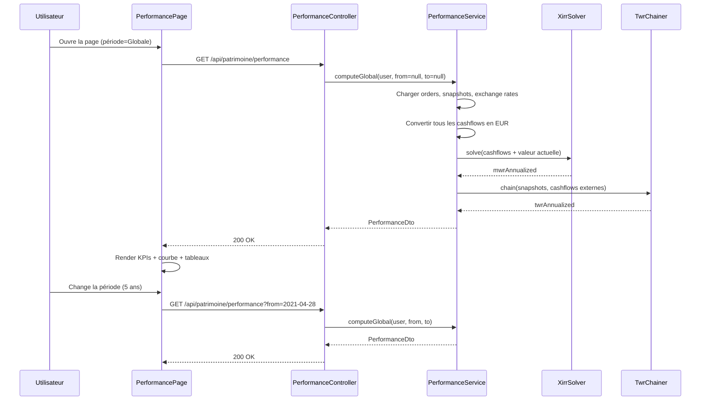

# Performance Patrimoniale (TWR / MWR) — Architecture

Calcul et affichage du **rendement annualisé** du patrimoine financier, en neutralisant l'effet des versements et retraits.

> **Statut — En travaux, ADMIN only.**
> La fonctionnalité est implémentée mais **réservée au rôle ADMIN** tant que les limites structurelles ne sont pas levées. Un bandeau orange « 🚧 Fonctionnalité en cours de développement » est affiché en permanence sur la page. Les utilisateurs réguliers n'y ont pas accès (ni dans le menu, ni via l'API : `@PreAuthorize("hasRole('ADMIN')")` sur `PerformanceController`).
>
> Voir la section [Limites assumées](#limites-assum%C3%A9es) ci-dessous pour les blocages structurels et la section [Évolutions futures](#10-%C3%A9volutions-futures-envisag%C3%A9es) pour le plan d'industrialisation requis avant ouverture aux utilisateurs.

---

## Limites assumées

La précision du calcul est intrinsèquement bornée par la nature des données disponibles dans MyFinance. Plutôt que de prétendre à une exactitude qui n'est pas atteignable, la V1 expose ces limites de façon transparente à l'utilisateur via un bandeau permanent et un repli visuel sur les valeurs improbables.

### Limites structurelles

1. **Granularité mensuelle des snapshots.** Le TWR utilise la méthode Modified Dietz entre relevés mensuels — c'est une approximation qui suppose les cashflows uniformément répartis dans la sous-période. L'erreur peut atteindre quelques points si un gros versement intervient en début ou fin de mois.
2. **Catégorie mutable rétroactivement.** `PositionSnapshot` ne stocke pas la catégorie de la position au moment du relevé : il référence l'entité `Position` dont la catégorie peut être modifiée après coup. Conséquence : si une position passe de `LIVRET` à `LIQUIDITE`, l'historique TWR de la catégorie `LIVRET` devient incohérent. Un fix propre nécessiterait une migration de schéma (cf. évolutions futures).
3. **`IMMO_PHYSIQUE` et `LIQUIDITE` exclus.** Le premier est valorisé manuellement (subjectif), le second n'est pas producteur de rendement.
4. **Frais non tracés.** Aucun mécanisme dans le modèle pour les frais de courtage, frais de gestion, TER d'ETF, etc. La performance affichée est donc *brute* de frais.
5. **Conversion devise figée.** Les ordres en USD/GBP/etc. sont convertis en EUR au taux de la date d'ordre (`PositionOrder.exchangeRate`). Une appréciation forex ultérieure n'est pas captée par les flux mais l'est par les snapshots — légère incohérence entre les deux mesures.
6. **XIRR sensible aux cashflows extrêmes.** Pour des séries de flux très déséquilibrées, le solveur Newton-Raphson peut converger vers un taux peu interprétable.

### Garde-fous V1

| Garde-fou | Mise en œuvre |
|-----------|---------------|
| Bandeau « Indicateur directionnel » | Toujours visible en haut de la page, avec tooltip détaillant les limites |
| Valeurs sans décimale | `pct0(v)` à la place de `pct(v, 2)` partout dans l'UI |
| Détection valeurs improbables | `isImplausible(value, category)` selon plages réalistes par catégorie |
| Affichage barré + tooltip | Pour les valeurs hors plage (ex. Livret -72 %/an) |
| Distinction période MWR / TWR | Header affiche les deux dates de début quand elles diffèrent |

### Plages réalistes par catégorie (V1)

```javascript
const REALISTIC_TWR_BOUNDS = {
  LIVRET:      { min: -0.05, max: 0.10 },  // produit régulé
  IMMO_PAPIER: { min: -0.25, max: 0.25 },  // SCPI typiquement 3-6 %
  BOURSE:      { min: -0.70, max: 1.50 },  // crashes / super années
  // CRYPTO non borné — volatilité extrême réelle
}
```

Une valeur hors de ces bornes est marquée comme artefact probable (recatégorisation, snapshot manquant) plutôt que comme une vraie performance.

---

## Vue d'ensemble

Le tableau de bord et la page Patrimoine répondent aujourd'hui à la question « **combien j'ai ?** » (valeur, plus-value cumulée, plus-value YTD). Aucun écran ne répond à « **est-ce que j'investis bien ?** ».

Pour y répondre il faut un **taux de rendement annualisé** qui neutralise les versements et retraits — sinon une grosse position récente écrase artificiellement la performance affichée.

Deux métriques complémentaires sont calculées :

```
TWR (Time-Weighted Return)  → performance pure de l'actif, neutralise les cashflows
MWR (Money-Weighted Return) → performance réellement vécue, dépend du timing des versements
```

| Métrique | Question à laquelle elle répond |
|----------|--------------------------------|
| **TWR** | Mes ETF battent-ils un benchmark passif (CW8, S&P 500) ? |
| **MWR** | Combien j'ai vraiment gagné par an, compte tenu de quand j'ai mis l'argent ? |

> **Choix de conception :** afficher les deux côte à côte, jamais une seule. Elles racontent deux histoires différentes et un investisseur averti consulte l'une ou l'autre selon le contexte.

---

## 1. Périmètre

### 1.1 Catégories couvertes

| Catégorie | Couverture | Justification |
|-----------|-----------|---------------|
| `BOURSE` | Complète (TWR + MWR) | Cashflows BUY/SELL/DIVIDEND traçables, prix marché disponible |
| `CRYPTO` | Complète (TWR + MWR) | Cashflows BUY/SELL/AIRDROP traçables, prix marché disponible |
| `IMMO_PAPIER` | Complète (TWR + MWR) | Cashflows DEPOSIT + revenus DIVIDEND/INTEREST |
| `LIVRET` | Complète (TWR + MWR) | Cashflows DEPOSIT/WITHDRAWAL + INTEREST |
| `LIQUIDITE` | Exclu | Pas de rendement attendu, capital « dormant » |
| `IMMO_PHYSIQUE` | Exclu V1 | Valeur estimée subjective, pas d'historique de prix marché |

> **Choix de conception :** `IMMO_PHYSIQUE` peut être ajouté en V2 avec une mention « estimation manuelle — performance indicative » ; on s'appuierait sur les variations successives de `estimatedValue` saisies par l'utilisateur.

### 1.2 Périodes de calcul

L'utilisateur peut consulter la performance sur :
- **Globale** (depuis le premier ordre)
- **YTD** (1er janvier de l'année en cours → aujourd'hui)
- **1 an glissant**, **3 ans glissants**, **5 ans glissants**
- **Personnalisée** (date de début et de fin saisies)

---

## 2. Modèle de données

**Aucune nouvelle entité n'est créée.** Toutes les données nécessaires sont déjà en base :

| Source | Donnée fournie |
|--------|---------------|
| `PositionOrder` | Cashflows datés, montants en EUR via `exchangeRate` |
| `Position` | Catégorie, statut, valeur estimée IMMO_PHYSIQUE |
| `Instrument.lastPrice` | Valorisation actuelle BOURSE/CRYPTO |
| `PortfolioSnapshot` + `PositionSnapshot` | Valorisations intermédiaires mensuelles |
| `ExchangeRate` | Conversion vers EUR |

### 2.1 Classification des `OrderType` pour les calculs

```java
public enum OrderType {
    BUY,         // CASHFLOW_IN  (versement externe)
    SELL,        // CASHFLOW_OUT (retrait externe)
    DEPOSIT,     // CASHFLOW_IN
    WITHDRAWAL,  // CASHFLOW_OUT
    INTEREST,    // INTERNAL_GAIN (rendement, pas un cashflow externe)
    DIVIDEND,    // INTERNAL_GAIN
    AIRDROP,     // INTERNAL_GAIN
    ABONDEMENT   // CASHFLOW_IN  (abondement employeur traité comme versement)
}
```

> **Règle critique :** `INTEREST`, `DIVIDEND` et `AIRDROP` **ne sont pas** des cashflows externes — ce sont des gains internes qui doivent être comptés dans le rendement, sinon le TWR est sous-estimé.

---

## 3. Calculs

### 3.1 MWR / XIRR (Money-Weighted Return)

Algorithme : **XIRR par Newton-Raphson** sur la séquence de cashflows datés.

```
Pour chaque position incluse :
  cashflows = liste de (date, montant signé en EUR)
    BUY/DEPOSIT/ABONDEMENT  → -montant  (sortie de poche utilisateur)
    SELL/WITHDRAWAL         → +montant  (entrée de poche utilisateur)
  + (date_fin, +valeur_actuelle_eur)  ← liquidation virtuelle

XIRR = taux r tel que Σ cashflow_i / (1+r)^((date_i - date_0)/365) = 0
```

Implémentation : Newton-Raphson avec valeur initiale `r = 0.10`, tolérance `1e-7`, max 100 itérations. Fallback bissection si divergence.

> **Bibliothèque :** Apache Commons Math est déjà disponible indirectement, sinon implémentation maison (~50 lignes).

### 3.2 TWR (Time-Weighted Return)

Algorithme : **chaînage des sous-périodes** délimitées par chaque cashflow externe.

```
Découper [date_début, date_fin] en sous-périodes [t_i, t_{i+1}]
  où chaque t_i est la date d'un cashflow externe (BUY/SELL/DEPOSIT/WITHDRAWAL/ABONDEMENT)

Pour chaque sous-période :
  V_début = valeur de la position juste APRÈS le cashflow en t_i
  V_fin   = valeur de la position juste AVANT le cashflow en t_{i+1}
  r_i = (V_fin - V_début + dividendes_internes) / V_début

TWR_total = Π (1 + r_i) - 1
TWR_annualisé = (1 + TWR_total)^(365 / jours_total) - 1
```

#### Source des valorisations intermédiaires

Pour évaluer `V_début` et `V_fin` sans avoir un prix quotidien :
1. Si un `PortfolioSnapshot` existe à la date exacte → utiliser sa valeur
2. Sinon, **interpoler linéairement** entre les deux snapshots les plus proches
3. Si aucun snapshot n'encadre la date (cashflow trop récent) → utiliser `Instrument.lastPrice` actuel pour la borne droite

> **Limite assumée :** la précision dépend de la régularité des snapshots mensuels. Si l'utilisateur a < 6 snapshots, afficher un avertissement « Performance estimée — historique limité ».

### 3.3 Performance par catégorie

```
Pour chaque catégorie BOURSE/CRYPTO/IMMO_PAPIER/LIVRET :
  Concaténer les cashflows et valorisations de toutes les positions de la catégorie
  Appliquer XIRR et chaînage TWR sur l'agrégat
```

### 3.4 Performance globale

Idem 3.3 mais sur l'union de toutes les catégories incluses (cf. 1.1).

### 3.5 Comparaison benchmark (V1 simplifiée)

V1 : l'utilisateur saisit un **rendement de référence constant** (ex. `8 %/an` pour une simulation CW8 historique) — pas de dépendance à un fournisseur de données externe.

> **V2 envisagée :** stocker un `Instrument` benchmark dédié (ex. ISIN CW8) + historique de prix fetché mensuellement, et appliquer le même algorithme TWR sur la série théorique « si j'avais investi les mêmes cashflows sur ce benchmark ».

---

## 4. API REST

Préfixe : `/api/patrimoine/performance`
Accès : Authentifié

| Méthode | URL | Description |
|---------|-----|-------------|
| `GET` | `/api/patrimoine/performance` | Performance globale (TWR + MWR) sur la période demandée |
| `GET` | `/api/patrimoine/performance/categories` | Détail par catégorie (BOURSE, CRYPTO, IMMO_PAPIER, LIVRET) |
| `GET` | `/api/patrimoine/performance/positions/{id}` | Performance d'une position individuelle |

### Paramètres de requête communs

| Param | Type | Obligatoire | Description |
|-------|------|-------------|-------------|
| `from` | `LocalDate` | — | Date de début (défaut : date du premier ordre) |
| `to` | `LocalDate` | — | Date de fin (défaut : aujourd'hui) |
| `benchmarkRate` | `Float` | — | Rendement annuel de référence en % (ex. `8.0`) |

### Réponse — `PerformanceDto`

```json
{
  "from": "2023-01-15",
  "to": "2026-04-28",
  "durationYears": 3.28,
  "twrAnnualized": 0.092,
  "mwrAnnualized": 0.078,
  "totalInvestedEur": 45200.00,
  "currentValueEur": 58900.00,
  "absoluteGainEur": 13700.00,
  "totalDividendsEur": 1240.00,
  "benchmarkRate": 0.08,
  "benchmarkOutperformance": 0.012,
  "warning": null
}
```

| Champ | Description |
|-------|-------------|
| `twrAnnualized` | TWR annualisé (décimal, ex. `0.092` = 9,2 %/an) |
| `mwrAnnualized` | MWR / XIRR annualisé |
| `totalDividendsEur` | Somme des `INTEREST + DIVIDEND + AIRDROP` sur la période |
| `benchmarkOutperformance` | `twrAnnualized - benchmarkRate` (positif = surperformance) |
| `warning` | Message si calcul dégradé (ex. `"Historique limité — 4 snapshots disponibles"`) |

---

## 5. Architecture backend

```
com.myfinance
├── service/
│   └── PerformanceService.java
│       └── computeGlobal(User, LocalDate from, LocalDate to)        → PerformanceDto
│       └── computeByCategory(User, LocalDate from, LocalDate to)    → Map<AssetCategory, PerformanceDto>
│       └── computePosition(Long positionId, LocalDate from, LocalDate to) → PerformanceDto
├── controller/
│   └── PerformanceController.java
└── dto/
    ├── PerformanceDto.java                (record)
    └── CategoryPerformanceDto.java        (record)
```

### 5.1 Dépendances injectées dans `PerformanceService`

- `PositionRepository` + `PositionOrderRepository` — sources des cashflows
- `PortfolioSnapshotRepository` + `PositionSnapshotRepository` — valorisations intermédiaires
- `InstrumentRepository` — `lastPrice` pour la borne actuelle
- `ExchangeRateService` — conversion des montants vers EUR

### 5.2 Algorithmes en classes utilitaires (package `service.math`)

- `XirrSolver` — Newton-Raphson + fallback bissection
- `TwrChainer` — découpage en sous-périodes et chaînage

> **Choix de conception :** ces classes sont stateless et publiques pour être testables unitairement avec des cas d'école (ex. exemples Excel `=XIRR(...)`).

---

## 6. Architecture frontend

```
frontend/src/
├── api/
│   └── performance.js               # GET /api/patrimoine/performance/*
└── components/
    └── performance/
        ├── PerformancePage.jsx       # Page dédiée
        ├── PerformanceHeader.jsx     # KPIs globaux (TWR, MWR, période, gain)
        ├── PerformanceChart.jsx      # Courbe TWR vs benchmark (Recharts LineChart)
        ├── CategoryPerformanceTable.jsx  # Tableau par catégorie
        └── PositionPerformanceTable.jsx  # Tri par TWR — top/flop
```

### 6.1 Navigation

Position dans la barre de navigation, sous **Outils** :

```
Dashboard | Revenus | Dépenses | Patrimoine | Outils ▼ | ...
                                              ├── Bilan financier
                                              ├── Performance ⬅ NOUVEAU
                                              ├── Simulateur d'impôts
                                              ├── ...
```

> **Note :** pourra être déplacé/dupliqué en widget dans `PatrimoinePage` ou `DashboardPage` après validation visuelle de la page dédiée — c'est l'objectif de cette V1 (page autonome avant intégration).

### 6.2 Page principale — `PerformancePage`

#### Bandeau d'en-tête

```
┌─ Performance globale ──────────────────────────────────┐
│ TWR annualisé : +9,2 %      MWR annualisé : +7,8 %    │
│ Période : 15 janv. 2023 → aujourd'hui (3,3 ans)       │
│ Versé : 45 200 €  ·  Valeur : 58 900 €  ·  PV : +13,7k│
│ Dividendes encaissés : 1 240 €                         │
│                                                        │
│ Benchmark de référence : [ 8 % /an  ▼]                │
│ Surperformance : +1,2 pt vs benchmark                 │
└────────────────────────────────────────────────────────┘
```

Sélecteur de période en haut à droite : `Globale / YTD / 1 an / 3 ans / 5 ans / Personnalisée`.

#### Graphique principal

Courbe d'évolution du TWR cumulé (base 100 à `from`) vs courbe benchmark (rendement constant capitalisé). Tooltip Recharts au survol avec valeurs aux dates de snapshot.

#### Tableau par catégorie

```
Catégorie       TWR/an    MWR/an   Investi    Valeur    Dividendes
BOURSE          +11,3 %   +9,8 %   28 400 €   38 200 €   620 €    ████████
CRYPTO          -4,1 %    -12,2 %   8 000 €    6 100 €     0 €    ▌
IMMO_PAPIER     +4,2 %    +4,0 %    6 800 €    7 400 €   240 €    ████
LIVRET          +3,0 %    +3,0 %    2 000 €    2 100 €    60 €    ███
```

#### Tableau par position (tri sur TWR)

Top 5 / Flop 5 par défaut, dépliable pour voir l'ensemble. Une ligne par `Position` active.

### 6.3 Indicateur sur `PositionCard`

Sur la page `PatrimoinePage` (intégration ultérieure, hors V1) : badge `+9,2 %/an` à côté de la plus-value en €.

---

## 7. Flux



---

## 8. Règles métier

1. **Ownership** : un utilisateur ne peut consulter que sa propre performance. `GET /performance/positions/{id}` vérifie `position.user.id == currentUser.id`.
2. **Périmètre `IMMO_PHYSIQUE` exclu** : les positions de cette catégorie sont systématiquement filtrées du calcul global et n'apparaissent pas dans le tableau par catégorie en V1.
3. **Liquidités exclues** : `LIQUIDITE` n'a pas de rendement attendu, exclu du calcul global, listé séparément avec mention « Hors calcul de performance ».
4. **Cashflows internes vs externes** : `INTEREST`, `DIVIDEND`, `AIRDROP` comptent en rendement et **ne** rompent **pas** la sous-période TWR. Seuls `BUY/SELL/DEPOSIT/WITHDRAWAL/ABONDEMENT` sont des cashflows externes.
5. **Conversion devise** : tous les montants sont convertis en EUR au taux du jour de l'ordre (`PositionOrder.exchangeRate`) — cohérent avec le reste de l'application.
6. **Position fermée** : reste consultable dans la performance historique sur la période où elle était active.
7. **Cas limites** :
   - Aucun ordre sur la période → réponse avec `warning: "Aucun cashflow sur la période"` et tous les taux à `null`
   - Période < 30 jours → MWR retourné mais TWR avec warning « période trop courte pour annualisation fiable »
   - Snapshots manquants → interpolation appliquée + warning si moins de 3 snapshots dans la période
8. **Devise du benchmark** : le benchmark V1 est un taux abstrait (% annuel), donc indépendant de la devise.

---

## 9. Tests unitaires prévus

| Classe de test | Contenu |
|----------------|---------|
| `XirrSolverTest` | Cas Excel de référence (séries 3/5/10 cashflows), divergence forcée → fallback bissection, période 1 an exacte → MWR == taux nominal |
| `TwrChainerTest` | Sous-période unique, plusieurs sous-périodes avec cashflows, dividendes internes non rupteurs, période sans cashflow externe |
| `PerformanceServiceTest` | Calcul global, par catégorie, par position, ownership, exclusion IMMO_PHYSIQUE/LIQUIDITE, périodes vides, conversion devise |
| `PerformanceControllerTest` | Endpoints, params `from`/`to`/`benchmarkRate`, 401 non auth, 403 ownership position, 404 position introuvable |

Cibles de couverture : conformes au seuil JaCoCo du projet (70 % lignes / 60 % branches).

---

## 10. Évolutions futures envisagées

### Industrialisation (passer d'« indicateur directionnel » à « mesure fiable »)

Ces évolutions traitent les limites structurelles de la V1 et permettraient d'enlever le bandeau directionnel.

| Évolution | Description | Coût |
|-----------|-------------|------|
| **Catégorie figée dans `PositionSnapshot`** | Ajouter colonnes `category`, `subType`, `currency` snapshotées au moment du relevé. Les calculs historiques deviennent immunisés aux recatégorisations. | Migration SQLite + recalcul historique |
| **Inclusion du snapshot d'ouverture dans la série TWR** | Pour une période restreinte, intégrer le snapshot le plus proche avant `from` comme premier point de la série, pour que le TWR commence vraiment à `from`. | Faible |
| **Tracking des frais** | Nouvelle entité `PositionFee` (courtage, gestion, TER) ou champ `feeEur` sur `PositionOrder`. Soustraction de la performance brute. | Modèle + UI saisie |
| **Snapshots quotidiens optionnels** | Pour les positions BOURSE/CRYPTO avec cours marché, calculer un snapshot quotidien depuis l'historique des prix d'instruments. | Stockage + scheduler |

### Enrichissements fonctionnels

| Évolution | Description |
|-----------|-------------|
| **Benchmark réel** | Stocker un `Instrument` benchmark (CW8, S&P 500) avec historique de prix mensuel ; appliquer TWR sur cashflows hypothétiques pour comparaison fidèle |
| **Performance IMMO_PHYSIQUE** | Inférer la performance à partir des variations successives de `estimatedValue` saisies manuellement |
| **Décomposition rendement** | Distinguer rendement « cours » (capital gain) et rendement « flux » (dividendes/intérêts) |
| **Volatilité** | Écart-type annualisé des rendements mensuels par position et catégorie |
| **Ratio de Sharpe** | Calculé sur la base d'un taux sans risque configurable (Livret A par défaut) |
| **Widget tableau de bord** | KPI compact « TWR 1 an » dans `DashboardPage` après validation de la page dédiée |
| **Badge sur `PositionCard`** | Mention `+9 %/an` à côté de la plus-value €, intégré dans `PatrimoinePage` |
| **Export PDF** | Rapport de performance annuel avec graphes et tableaux, similaire à la déclaration de patrimoine |
