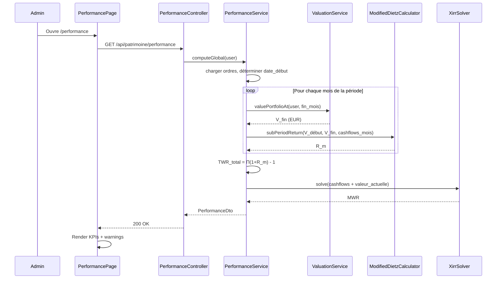

# Performance Patrimoniale (TWR / MWR) — Architecture V1 (refonte)

## Pourquoi cette fonctionnalité

MyFinance trace aujourd'hui la **valeur** du patrimoine (combien j'ai, ventilé par catégorie, plus-value cumulée, plus-value YTD). Ces chiffres sont utiles mais ne disent rien sur la **qualité de l'allocation** : un patrimoine qui croît de 50 000 € en un an peut être le résultat de versements massifs sur un actif médiocre, ou d'une vraie performance des marchés sur un capital stable. La distinction est invisible avec les indicateurs actuels.

Cette fonctionnalité ajoute une mesure du **rendement annualisé** du patrimoine financier, en neutralisant l'effet des versements et retraits. Elle répond à des questions que l'utilisateur ne peut pas se poser aujourd'hui :

- *Est-ce que mes actifs performent réellement, ou est-ce que je fais juste épargne ?*
- *Si je laisse mon argent où il est aujourd'hui, à quel rythme va-t-il croître ?*
- *Mes choix de timing de versement (DCA vs lump sum) ont-ils été pertinents ?*
- *Mon allocation actuelle bat-elle ce que ferait un placement passif équivalent ?* (V2, avec benchmark)

Deux mesures complémentaires sont calculées et affichées côte à côte :

- **TWR (Time-Weighted Return)** : performance pure des actifs, indépendante du timing et du volume des versements. C'est la métrique standard pour comparer un portefeuille à un benchmark (CW8, S&P 500, …) ou pour juger si un produit financier tient ses promesses.
- **MWR (Money-Weighted Return)** : performance réellement vécue par l'utilisateur, qui intègre le fait que l'argent placé tôt a plus pesé que l'argent placé tard. C'est la métrique honnête de « combien ai-je gagné par an, en moyenne, avec mes choix d'investissement ».

L'écart entre les deux est lui-même un signal : un MWR très inférieur au TWR signifie que les gros versements sont arrivés au mauvais moment ; un MWR supérieur au TWR signifie au contraire que le timing a été favorable.

## Périmètre fonctionnel V1

La V1 livre une **vue globale unique**, accessible aux administrateurs uniquement, le temps de valider la fiabilité des calculs sur des cas réels. Pas de filtre de période, pas de ventilation par catégorie ou par position, pas de comparaison à un benchmark, pas de graphique. Juste deux chiffres et leurs hypothèses, exposés en transparence.

Le périmètre couvre les catégories productrices de rendement (BOURSE, CRYPTO, LIVRET, IMMO_PAPIER) et exclut les catégories non-rémunératrices ou subjectives (LIQUIDITE, IMMO_PHYSIQUE).

L'industrialisation (ouverture aux utilisateurs, ventilation par catégorie, graphique, benchmark, etc.) est documentée en [section 12](#12-évolutions-futures-v2) et conditionnée à la validation des calculs. Tant que cette validation n'est pas faite (recoupement Excel `=XIRR(...)` + comparaison broker sur ≥ 3 portefeuilles types), un bandeau orange « 🚧 Fonctionnalité en cours de validation — calculs en cours de fiabilisation » reste affiché en permanence sur la page.

---

## Pré-requis V1 (à traiter avant le calcul TWR/MWR proprement dit)

Trois chantiers techniques doivent être terminés **avant** d'attaquer le calcul de performance — ils sont des préalables, pas des dépendances optionnelles.

### Pré-requis 1 — Tables d'historique de prix et de taux

Création des tables `instrument_price_history` (cours quotidien par instrument) et `exchange_rate_history` (taux quotidien par devise). Schéma détaillé en [section 2.1](#21-nouvelles-tables). Alimentation forward greffée sur le scheduler quotidien existant `MarketDataScheduler` (`0 0 2 * * *`).

### Pré-requis 2 — Fix de la conversion devise sur `PositionOrder`

**Bug existant** : aujourd'hui, `PositionService.createOrder()` et `updateOrder()` font `order.setAmountEur(request.amount())` sans appliquer le taux de change. Pour les positions en devise étrangère (USD, GBP, CHF, etc.), `amountEur` contient en réalité le montant en **devise native**, pas en EUR.

**Modèle conceptuel cible** :
- `Position.currency` = devise de la position (source de vérité).
- `PositionOrder.amount` = montant en devise native de la position (ce que l'utilisateur saisit).
- `PositionOrder.amountEur` = **dénormalisation** calculée à la création/modification de l'ordre via `amount / exchange_rate_history(Position.currency, orderDate)`. Si le taux exact n'existe pas dans l'historique → fallback sur le dernier taux connu *strictement antérieur*.

> **Pourquoi garder `amountEur` plutôt que recalculer à la lecture ?** Le champ est lu fréquemment (toutes les vues patrimoine, tous les snapshots). Le recalcul à la lecture impliquerait une jointure systématique avec `exchange_rate_history`. La dénormalisation est cohérente avec le reste du modèle (`PositionSnapshot.unitPriceEur` suit la même logique).

#### Migration des ordres existants

Endpoint admin one-shot dédié : `POST /api/admin/orders/migrate-amount-eur?dryRun={true|false}`.

Comportement :
1. Parcourt tous les `PositionOrder` dont `Position.currency != 'EUR'`.
2. Pour chacun, recalcule `amountEur = amount / exchange_rate_history(currency, orderDate)`.
3. Si le taux historique manque pour cette date : fallback sur le dernier taux antérieur ; si aucun, fallback sur le taux courant `ExchangeRate.rate` (avec entrée dans le rapport « ordre #X migré avec taux courant faute d'historique »).
4. **Idempotent** : peut être rejoué sans risque (le résultat est déterministe à partir des données d'entrée).
5. **Dry-run** par défaut : retourne un rapport `{ "ordersExamined": N, "ordersToUpdate": M, "fallbacksCurrentRate": K, "samples": [...] }` sans rien modifier.
6. Le run réel (`dryRun=false`) applique la migration et retourne le même rapport avec `ordersUpdated`.

> **Sans ce fix**, les flux EUR utilisés en entrée du calcul de performance seraient incorrects pour toute position non-EUR — résultats indéterminés.

### Pré-requis 3 — `closedDate` sur `Position`

Ajout d'un champ `closedDate` (`LocalDate`, nullable) sur l'entité `Position`. Renseigné automatiquement à `LocalDate.now()` lors de l'appel à `PositionService.close()`. Modifiable via le formulaire d'édition d'une position fermée (utile si l'utilisateur ferme rétroactivement une position vendue il y a 6 mois). Ce champ permet :
- d'identifier précisément la fin de la période de contribution d'une position au TWR ;
- d'exclure proprement les mois où la position n'a plus d'activité ni de valeur.

Migration : `ALTER TABLE positions ADD COLUMN closed_date DATE`. Backfill optionnel : pour les positions déjà `CLOSED`, on peut prendre `MAX(orderDate)` parmi leurs ordres comme valeur initiale, ou laisser `NULL` (le calcul tombera alors en fallback sur la dernière date d'activité).

---

## Décisions structurantes V1

| Décision | Choix | Conséquence |
|----------|-------|-------------|
| **Algorithme TWR** | Modified Dietz, sous-périodes mensuelles | Tolère les données peu fréquentes, formule fermée, pas besoin de valoriser à chaque cashflow |
| **Algorithme MWR** | XIRR Newton-Raphson + fallback bissection | Standard de l'industrie (Excel, Google Sheets) |
| **Historique de prix d'instruments** | Nouvelle table `instrument_price_history` (daily) | Précondition à toute mesure fiable BOURSE/CRYPTO |
| **Historique de taux de change** | Nouvelle table `exchange_rate_history` (daily) | Permet la conversion EUR cohérente à toute date passée |
| **Convention devise** | Conversion au taux du **jour de l'évaluation** (cours et flux) | Élimine l'incohérence flux/snapshot ; isole vraiment la performance native |
| **Dividendes / intérêts / airdrops** | Considérés comme **gains internes**, réinvestis virtuellement à la date de versement | Ne rompent pas la sous-période TWR ; comptent au numérateur du rendement |
| **Périmètre UI V1** | Une seule page, vue **globale** (toutes catégories agrégées), période **depuis le premier ordre** | Pas de sélecteur, pas de YTD, pas de tableau par catégorie ni par position |
| **Benchmark** | Aucun en V1 | Sera ajouté quand on aura une série de prix d'un indice de référence (CW8 / MSCI World) |
| **Indicateurs affichés** | TWR + MWR côte à côte | Les deux racontent une histoire différente, on assume la pédagogie |
| **Précision arithmétique** | BigDecimal aux frontières, double dans les solveurs | Évite l'import d'Apache Commons Math pour l'exponentiation fractionnaire ; perte de précision invisible (`< 1e-15`) à l'échelle d'un taux affiché à 4 décimales |
| **Capitalisation LIVRET** | Quotidienne simple : `(1 + annualRate)^(1/365) - 1` | Approximation par rapport à la règle bancaire réelle (capitalisation par quinzaine) — écart de quelques euros sur l'année, acceptable en V1 |
| **Convention temporelle Modified Dietz** | Poids `(D - j) / D` (flux en début de journée — standard CFA Institute) | Fixe pour pouvoir écrire des tests reproductibles |

---

## Limites résiduelles assumées

Avec les choix ci-dessus, les limites structurelles diminuent fortement par rapport à la V0 mais ne disparaissent pas totalement.

1. **`PositionSnapshot` ne fige pas la catégorie.** Une recatégorisation rétroactive de position fausse l'historique. Hors périmètre V1 (pas de calcul par catégorie). À traiter avant d'introduire la V2 « par catégorie ».
2. **`IMMO_PAPIER` (SCPI) sans cours daily.** Valorisé à partir des snapshots mensuels manuels (interpolation linéaire entre deux relevés). C'est la catégorie la moins précise.
3. **`IMMO_PHYSIQUE` exclu.** Valeur estimée subjective.
4. **`LIQUIDITE` exclu.** Pas de rendement attendu.
5. **Frais non tracés.** Performance affichée *brute* de frais (courtage, gestion, TER d'ETF).
6. **Backfill BOURSE manuel.** Aucune source automatique fiable pour l'historique des cours BOURSE européens (Yahoo testé et écarté). Pour chaque instrument BOURSE sans CSV importé, le calcul de performance ne peut commencer qu'à partir de la première date où un prix est disponible (au plus tôt = date de déploiement). La position concernée émet un warning explicite et reste **exclue** du calcul jusqu'à cette date — la **date de début effective globale** (cf. règle métier #7) peut donc être décalée si certaines positions sans historique sont parmi les plus anciennes.
7. **XIRR sensible aux cashflows extrêmes.** Si le solveur diverge, fallback bissection puis warning « MWR non calculable ».

---

## 1. Périmètre V1

### 1.1 Catégories couvertes

| Catégorie | Couverture | Source de valorisation à une date |
|-----------|-----------|-----------------------------------|
| `BOURSE` | TWR + MWR | `quantité × instrument_price_history(date)` × taux_change(date) |
| `CRYPTO` | TWR + MWR | Idem BOURSE |
| `LIVRET` | TWR + MWR | Solde reconstitué : `Σ cashflows + Σ intérêts capitalisés` (taux du livret paramétré sur la position) |
| `IMMO_PAPIER` | TWR + MWR (dégradé) | Interpolation linéaire entre `PositionSnapshot` mensuels |
| `LIQUIDITE` | Exclu | — |
| `IMMO_PHYSIQUE` | Exclu | — |

### 1.2 Période

**V1 : du premier `PositionOrder` jusqu'à aujourd'hui — non paramétrable.**

Aucun sélecteur, aucun preset (YTD, 1 an, etc.). Toute la complexité « inclusion d'un snapshot d'ouverture pour des périodes restreintes » est repoussée à plus tard.

---

## 2. Modèle de données

### 2.1 Nouvelles tables

#### `instrument_price_history`

| Colonne | Type | Description |
|---------|------|-------------|
| `id` | BIGINT (PK) | |
| `instrument_id` | BIGINT (FK) | Référence `instruments.id`, cascade DELETE |
| `price_date` | DATE | Date du cours |
| `price` | DECIMAL(18,6) | Cours de clôture en devise native |
| `source` | VARCHAR | `BOURSORAMA` (daily forward) / `COINGECKO` (crypto) / `MANUAL_CSV` (backfill admin) / `MANUAL` (saisie ponctuelle) |

Index unique : `(instrument_id, price_date)`.

#### `exchange_rate_history`

| Colonne | Type | Description |
|---------|------|-------------|
| `id` | BIGINT (PK) | |
| `currency` | VARCHAR(3) | Code ISO (USD, GBP, …) |
| `rate_date` | DATE | Date du taux |
| `rate` | DECIMAL(18,8) | Convention identique à `exchange_rates` : `amount_eur = amount_natif / rate` |
| `source` | VARCHAR | `ECB` / `FRANKFURTER` / `MANUAL` |

Index unique : `(currency, rate_date)`.

### 2.2 Stratégie d'alimentation

#### Forward (à partir du déploiement) — automatique

Extension du scheduler existant `MarketDataService` :
- Quotidien (jours ouvrés, soir) : insertion d'une ligne `instrument_price_history` pour chaque instrument actif et d'une ligne `exchange_rate_history` pour chaque devise utilisée par au moins une position.
- Mécanisme idempotent (UNIQUE constraint sur `(instrument_id, price_date)` et `(currency, rate_date)`).

| Catégorie | Source forward | Statut |
|-----------|---------------|--------|
| BOURSE | Boursorama (Jsoup, déjà en place pour `lastPrice`) | Cohérent avec l'existant |
| CRYPTO | CoinGecko API | Cohérent avec l'existant |
| Devises | Frankfurter / ECB | Cohérent avec l'existant |

#### Backfill (historique antérieur au déploiement) — semi-manuel

C'est le **point dur** de la V1. Les sources gratuites fiables sont rares pour le marché européen, et Yahoo Finance s'est révélé inutilisable en pratique (données incomplètes, instruments européens peu couverts). Stratégie retenue :

| Catégorie | Stratégie de backfill |
|-----------|----------------------|
| **CRYPTO** | Automatique — endpoint CoinGecko `market_chart?days=max` couvre tout l'historique d'une crypto. Déclenchement admin one-shot par instrument. |
| **Devises** | Automatique — endpoint Frankfurter `/{from}..{to}?from=EUR&to=USD,GBP,...` couvre depuis 1999. Déclenchement admin one-shot par devise. |
| **BOURSE** | **Import CSV manuel par l'admin**. Format détaillé en [section 2.3](#23-format-csv-dimport-bourse). L'admin se procure les données depuis la source de son choix (export broker, copie manuelle Boursorama, JustETF, etc.) et les importe instrument par instrument. Source enregistrée : `MANUAL_CSV`. |
| **LIVRET** | Aucun backfill nécessaire — le solde est recalculé à partir des cashflows et du taux paramétré sur la `Position`. |
| **IMMO_PAPIER** | Aucun backfill nécessaire — on s'appuie sur les `PositionSnapshot` mensuels saisis manuellement (existant). |

Endpoints admin :

| Méthode | URL | Description |
|---------|-----|-------------|
| `POST` | `/api/admin/instruments/{id}/backfill-prices` | CRYPTO uniquement — déclenche le fetch CoinGecko sur tout l'historique |
| `POST` | `/api/admin/instruments/{id}/import-prices` (multipart CSV) | BOURSE — import d'un CSV `date;price` |
| `POST` | `/api/admin/exchange-rates/{currency}/backfill` | Déclenche le fetch Frankfurter depuis la date du premier ordre dans cette devise |

> **Conséquence sur la précision V1** : pour les positions BOURSE pour lesquelles aucun CSV n'a été importé, le calcul de performance démarre à la date du **premier prix collecté forward** (donc à partir du déploiement). C'est la principale dette assumée — un warning explicite est exposé pour chaque instrument concerné dans la réponse de `/api/patrimoine/performance`.

> **Pistes Boursorama investiguées et écartées (mai 2026)** :
> - **Page d'historique HTML statique** : pour les OPCVM (`/bourse/opcvm/cours/historique/MP-XXX`), le HTML contient un tableau de **1 mois (~21 lignes daily)** dans la réponse statique. Les paramètres `historic_search[duration]` et `historic_search[startDate]` passés dans l'URL sont ignorés par le serveur — toujours 1 mois retourné. Pour les ETF (`/bourse/trackers/cours/historique/SYM`), **aucun tableau** n'est rendu côté serveur (chargement JS post-rendu). Inutilisable pour reconstituer un historique de plusieurs années.
> - **Endpoint AJAX `/_formulaire-periode/page-1?symbol=...&historic_search[duration]=3Y&...`** : référencé dans le HTML de la page parent (`data-refreshable-url`) mais retourne **HTTP 404 systématique** via curl, quels que soient les headers (`Referer`, `X-Requested-With`, `Turbo-Frame`, cookies, méthode GET ou POST). Probable token CSRF dynamique injecté côté JavaScript, ou anti-bot Cloudflare. Non exploitable sans un headless browser.
> - **Aucun bouton d'export CSV** dans l'UI Boursorama.
>
> **Conclusion** : pas de backfill BOURSE automatique possible via Boursorama avec un simple HTTP client. Les seules pistes viables seraient un headless browser (Playwright) — coûteux et fragile — ou explorer une API tierce (JustETF, Morningstar) pour les ETF européens. À investiguer dans un spike dédié si la saisie CSV manuelle se révèle trop pénible à l'usage.

### 2.3 Format CSV d'import BOURSE

Format permissif sur la date pour faciliter le copier/coller depuis les sources françaises (Boursorama, brokers FR). Erreur de parsing → ligne ignorée et listée dans le `BackfillReport`, le reste du fichier est traité.

**Exemple de fichier** (les deux formats de date sont acceptés dans le même fichier si besoin) :

```
# Instrument: Amundi MSCI World UCITS ETF (CW8)
# Currency: EUR
# Source: Boursorama
date;price
29/04/2026;267,35
28/04/2026;267,79
2024-01-04;430,87
```

**Spécifications** :

| Aspect | Règle |
|--------|-------|
| Encoding | UTF-8 (BOM toléré) |
| Séparateur de champs | `;` (point-virgule) |
| Séparateur décimal | `,` (virgule) ou `.` (point) — détecté automatiquement |
| Format de date | **Deux formats acceptés** : ISO 8601 `YYYY-MM-DD` ou français `DD/MM/YYYY`. Le parser détecte automatiquement le format ligne par ligne. |
| Header obligatoire | Ligne `date;price` (insensible à la casse) |
| Lignes de commentaire | Préfixées par `#` — ignorées par le parser, **utiles pour l'admin** afin d'identifier le contenu (nom de l'instrument, devise, source) lors de la préparation du fichier |
| Doublons sur `(instrument_id, price_date)` | **Écrasement** silencieux (le dernier prix du fichier l'emporte) |
| Lignes invalides (date mal formée, prix non numérique) | **Skip** + entrée détaillée dans `errors[]` du rapport |
| Taille max du fichier | 10 Mo |
| Nombre max de lignes | 50 000 (largement supérieur à 130 ans de cours daily, garde-fou anti-DoS) |

**À noter** : les lignes `# Instrument:` et `# Currency:` sont **purement informatives** — l'instrument cible est identifié par l'URL (`/api/admin/instruments/{id}/import-prices`), et la devise par `Instrument.currency`. Elles servent à éviter à l'admin d'envoyer le mauvais CSV au mauvais endpoint.

**Workflow type** depuis Boursorama :
1. Ouvrir la page historique de l'instrument (ex : `/bourse/opcvm/cours/historique/MP-805108`)
2. Copier le tableau (colonnes Date et Dernier suffisent — les autres sont ignorées)
3. Coller dans un fichier `.csv` au format `date;price` (DD/MM/YYYY accepté)
4. Uploader via `POST /api/admin/instruments/{id}/import-prices`

### 2.4 Contrat `BackfillReport`

Format unique retourné par tous les endpoints de backfill (CoinGecko, Frankfurter, CSV).

```json
{
  "scope": "INSTRUMENT_PRICES",
  "targetId": "42",
  "targetLabel": "Amundi MSCI World (CW8)",
  "fromDate": "2020-01-02",
  "toDate": "2026-05-02",
  "linesInserted": 1854,
  "linesUpdated": 23,
  "linesSkipped": 5,
  "errors": [
    "Ligne 1247 : date '2024-02-30' invalide",
    "Ligne 1893 : prix 'N/A' non numérique"
  ],
  "durationMs": 412
}
```

| Champ | Description |
|-------|-------------|
| `scope` | `INSTRUMENT_PRICES` ou `EXCHANGE_RATES` |
| `targetId` | ID de l'instrument ou code ISO de la devise |
| `targetLabel` | Libellé lisible (nom instrument ou devise) — utile pour l'UI |
| `fromDate` / `toDate` | Plage temporelle effectivement traitée |
| `linesInserted` | Nouvelles lignes créées dans la table d'historique |
| `linesUpdated` | Lignes existantes écrasées (cas du re-import) |
| `linesSkipped` | Lignes ignorées (erreur, ou source ne renvoie rien) |
| `errors` | Liste des erreurs ligne par ligne (max 50 entrées, troncature au-delà) |
| `durationMs` | Temps d'exécution côté serveur |

### 2.5 Données existantes réutilisées

| Source existante | Donnée fournie |
|------------------|---------------|
| `PositionOrder` | Cashflows datés en devise native (`amount`) + `amountEur` (dénormalisation calculée à la création/modification via `exchange_rate_history`, cf. pré-requis 2) |
| `Position` | Catégorie, statut, taux du livret pour LIVRET |
| `PositionSnapshot` | Valorisations mensuelles pour IMMO_PAPIER |

Aucune nouvelle entité côté domaine fonctionnel — uniquement les deux tables d'historique de prix/taux.

### 2.6 Classification des `OrderType`

```java
public enum OrderType {
    BUY,         // CASHFLOW_IN  (versement externe)
    SELL,        // CASHFLOW_OUT (retrait externe)
    DEPOSIT,     // CASHFLOW_IN
    WITHDRAWAL,  // CASHFLOW_OUT
    INTEREST,    // INTERNAL_GAIN (réinvesti virtuellement)
    DIVIDEND,    // INTERNAL_GAIN (réinvesti virtuellement)
    AIRDROP,     // INTERNAL_GAIN
    ABONDEMENT   // CASHFLOW_IN  (à reconsidérer en V2 — économiquement c'est un gain)
}
```

> **Règle critique** : `INTEREST`, `DIVIDEND`, `AIRDROP` ne rompent pas une sous-période TWR. Ils sont comptés comme une augmentation de la valeur de la position à leur date d'occurrence (réinvestissement virtuel).

---

## 3. Calculs

### 3.1 Valorisation d'une position à une date `d`

```
SI position.category == BOURSE | CRYPTO :
    quantite_a_d  = Σ ordres (BUY + AIRDROP + ABONDEMENT) - Σ SELL
                    avec orderDate <= d (en quantité)
    prix_natif_d  = instrument_price_history(instrument_id, d)
                    fallback : dernière valeur connue STRICTEMENT antérieure à d
                    si aucune valeur connue avant d → position EXCLUE + warning
                    (interdiction d'extrapoler dans le passé)
    taux_change_d = exchange_rate_history(currency, d)
                    fallback : dernière valeur connue STRICTEMENT antérieure à d
                    si aucune valeur connue avant d → position EXCLUE + warning
                    (1.0 si currency == EUR)
    valeur_eur    = quantite_a_d * prix_natif_d / taux_change_d

SI position.category == LIVRET :
    Capitalisation quotidienne simple au taux paramétré annualRate :
      taux_journalier = (1 + annualRate)^(1/365) - 1
    valeur_eur(d) reconstruite jour par jour :
      pour chaque jour entre la création de la position et d :
        - appliquer les cashflows DEPOSIT/WITHDRAWAL/INTEREST/DIVIDEND du jour
        - capitaliser le solde au taux journalier
    Note : approximation par rapport à la règle bancaire réelle (capitalisation
    par quinzaine), erreur de l'ordre de quelques euros sur l'année.

SI position.category == IMMO_PAPIER :
    valeur_eur = interpolation_linéaire(PositionSnapshot avant d, après d)
                 fallback : dernier snapshot connu si pas d'encadrement
                 si aucun snapshot avant d → position EXCLUE + warning
```

> **Position fermée** : si `closedDate` est renseignée et `d > closedDate`, la position est valorisée à `0`. Si `d <= closedDate`, elle est valorisée normalement (ses ordres jusqu'à `closedDate` sont pris en compte).

### 3.2 TWR — Modified Dietz par sous-période mensuelle

Le TWR global est obtenu en chaînant le rendement Modified Dietz calculé sur chaque mois calendaire de la période.

**Conventions actées V1 :**

- **Date de début effective** = `min(orderDate)` parmi les ordres des positions éligibles (BOURSE / CRYPTO / LIVRET / IMMO_PAPIER). Si pour cette date un instrument n'a aucun prix historique disponible, on décale au premier mois où **toutes** les positions ayant déjà émis un ordre sont valorisables — les positions partiellement valorisables émettent un warning.
- **Premier mois du chaînage** = le mois calendaire qui **suit** le premier versement. Le mois du premier versement n'est pas inclus (`V_début` serait à 0, formule instable). L'utilisateur en est informé via un warning explicite.
- **Cashflows du même jour** : nettés algébriquement par date avant calcul (ex : BUY +500 EUR et SELL -300 EUR le même jour → un seul flux net de +200 EUR).
- **Convention temporelle Modified Dietz** (CFA Institute standard) : poids d'un flux le jour `j` d'un mois de `D` jours = `(D - j) / D`. Le flux opère donc « en début de journée ».

**Pour un mois `m` donné :**

```
V_début = valuePortfolioAt(user, dernier_jour_mois_précédent)
V_fin   = valuePortfolioAt(user, dernier_jour_mois_m)
F_i     = cashflows externes du mois (BUY/SELL/DEPOSIT/WITHDRAWAL/ABONDEMENT)
          NETTÉS par date, en EUR au taux du jour du cashflow
          signe : +montant si entrée externe (versement)
                  -montant si sortie externe (retrait)

F_net   = Σ F_i

Poids temporel de chaque flux net :
  w_i = (D - jour_i) / D
  où D = nb de jours du mois, jour_i = numéro du jour du flux

Rendement du mois :
  R_m = (V_fin - V_début - F_net) / (V_début + Σ w_i * F_i)
```

**Chaînage sur la période complète :**

```
TWR_total      = Π(1 + R_m) - 1   pour chaque mois m de la période
TWR_annualisé  = (1 + TWR_total)^(365 / jours_total) - 1
```

**Traitement explicite des cas particuliers :**

| Cas | Comportement |
|-----|-------------|
| Mois entièrement avant la date de début effective | Exclu de la chaîne |
| Mois sans aucune position éligible et sans cashflow | Exclu de la chaîne (facteur 1) |
| Mois en cours (pas encore terminé) | `V_fin = valuePortfolioAt(user, LocalDate.now(Europe/Paris))`, `D = jour_courant`, le mois est inclus mais marqué comme `"partial": true` dans `monthlyBreakdown`. **Conséquence assumée** : `R_m` du mois en cours évolue naturellement entre deux appels au cours du même mois (le poids `w_i` d'un cashflow change avec `D`). C'est déterministe — pas un bug. La valeur stabilisée du mois est obtenue le 1er du mois suivant. |
| `V_début + Σ w_i × F_i ≤ 0` (retrait total puis nouveau versement, ou rare combinaison de timing) | Sous-période clôturée au jour précédant le retrait total, nouvelle sous-période ouverte au prochain versement, le "trou" est exclu. Warning émis. |
| Portefeuille à valeur nulle pendant ≥ 1 mois puis nouveau versement | Mois neutres exclus (facteur 1), reprise du chaînage avec le mois du nouveau versement comme premier mois (cf. règle « mois suivant le versement ») |
| Position fermée en milieu de mois | Valorisée normalement jusqu'au `closedDate`, valorisée à 0 ensuite. Les ordres de fermeture (SELL final / WITHDRAWAL) entrent dans `F_i` du mois |

### 3.3 MWR — XIRR Newton-Raphson

```
Pour toute la période :
  cashflows = liste de (date, montant signé en EUR au taux du jour de la date)
    BUY/DEPOSIT/ABONDEMENT  → -montant  (sortie de poche utilisateur)
    SELL/WITHDRAWAL         → +montant  (entrée de poche utilisateur)
    Cashflows même jour    → nettés algébriquement (cohérent avec TWR)
  + (LocalDate.now(), +valuePortfolioAt(user, LocalDate.now()))
    ← liquidation virtuelle à la valeur actuelle calculée par ValuationService

XIRR = taux r tel que Σ cashflow_i / (1+r)^((date_i - date_0)/365) = 0
```

Implémentation : Newton-Raphson, valeur initiale `r = 0.10`, tolérance `1e-7`, max 100 itérations. Fallback bissection sur `[-0.99, 10.0]` si divergence. Si la bissection ne trouve pas de changement de signe → `mwrAnnualized = null` + warning.

> Les `INTEREST` / `DIVIDEND` / `AIRDROP` **ne sont pas** dans la liste des cashflows MWR (ce sont des gains internes, déjà capturés dans la valeur actuelle).

### 3.4 Précision arithmétique

**Convention V1** : `BigDecimal` aux frontières (entité JPA, DTO API, persistance), `double` à l'intérieur des solveurs `ModifiedDietzCalculator` et `XirrSolver`.

Justification : `java.math.BigDecimal` ne propose pas d'exponentiation native à exposant fractionnaire (besoin pour `(1+r)^(jours/365)` dans Newton-Raphson et l'annualisation TWR). Travailler en `double` à l'intérieur du solveur évite une dépendance externe (Apache Commons Math) et reste largement précis : la perte de précision est de l'ordre de `1e-15`, totalement invisible une fois le résultat arrondi à 4 décimales pour l'affichage (`9,2 %` = `0.0920`).

Conversions :
- `BigDecimal → double` à l'entrée du solveur via `BigDecimal.doubleValue()`.
- `double → BigDecimal` à la sortie via `BigDecimal.valueOf(d).setScale(6, HALF_UP)` — **6 décimales** car on garde 2 décimales de marge par rapport à la précision d'affichage cible (4 décimales = `0,01 %` sur le taux), pour absorber les arrondis intermédiaires lors de calculs dérivés (gain absolu, comparaisons).

Pour les divisions BigDecimal hors solveur (notamment `amountEur = amount.divide(rate, …)` dans le pré-requis 2) : **scale explicite obligatoire**, sinon `ArithmeticException` quand le résultat n'a pas de représentation décimale finie (cas fréquent : `100 / 1.08`). Convention V1 : `divide(rate, 4, HALF_UP)` pour les conversions devise (4 décimales = précision au centime sur des montants jusqu'à 1 million d'euros).

Tolérances Newton-Raphson : `epsilon = 1e-7`, `maxIterations = 100`, fallback bissection sur `[-0.99, 10.0]`.

### 3.5 Fuseau horaire

`LocalDate.now()` en Java retourne la date selon le fuseau du serveur. Sur un déploiement Docker, le conteneur tourne fréquemment en UTC alors que les utilisateurs français sont en `Europe/Paris` — résultat : entre 00h00 et 02h00 heure française, `LocalDate.now()` retourne la veille (UTC).

**Convention V1** : tous les appels à `LocalDate.now()` dans le code de performance utilisent **`LocalDate.now(ZoneId.of("Europe/Paris"))`**. Plus robuste que de paramétrer le `TZ` du conteneur (qui peut être oublié ou écrasé) et explicite dans le code. À acter dans `PerformanceService`, `ValuationService`, et tous les calculs de date relatifs.

> Cohérent avec le `MarketDataScheduler` existant qui tourne déjà à 2h heure locale (`0 0 2 * * *`).

---

## 4. API REST

**Un seul endpoint en V1.**

| Méthode | URL | Rôle | Description |
|---------|-----|------|-------------|
| `GET` | `/api/patrimoine/performance` | ADMIN | Performance globale (TWR + MWR) depuis le premier ordre |

### Réponse — `PerformanceDto`

```json
{
  "computedAt": "2026-05-02T14:32:18Z",
  "from": "2023-02-01",
  "to": "2026-05-02",
  "durationYears": 3.25,
  "twrAnnualized": 0.092,
  "mwrAnnualized": 0.078,
  "totalInvestedEur": 45200.00,
  "currentValueEur": 58900.00,
  "absoluteGainEur": 13700.00,
  "totalDividendsEur": 1240.00,
  "warnings": [
    "Historique BOURSE manquant pour 3 instruments (CW8, ESE, RS2K) — calcul démarré au 2023-08-01 au lieu du 2023-01-15. Importer un CSV via /api/admin/instruments/{id}/import-prices pour étendre la période.",
    "Mois de janvier 2023 exclu du chaînage TWR : c'est le mois du premier versement (V_début = 0, formule instable)."
  ],
  "monthlyBreakdown": [
    {
      "month": "2023-02",
      "valueStart": 1000.00,
      "valueEnd": 1015.50,
      "cashflowsNetEur": 0.00,
      "weightedCashflowsEur": 0.00,
      "monthlyReturn": 0.0155,
      "included": true,
      "partial": false
    },
    {
      "month": "2023-03",
      "valueStart": 1015.50,
      "valueEnd": 2030.00,
      "cashflowsNetEur": 1000.00,
      "weightedCashflowsEur": 516.13,
      "monthlyReturn": 0.0091,
      "included": true,
      "partial": false
    },
    {
      "month": "2023-04",
      "included": false,
      "reason": "Aucune position éligible ce mois-ci (toutes IMMO_PHYSIQUE)"
    },
    {
      "month": "2026-05",
      "valueStart": 58200.00,
      "valueEnd": 58900.00,
      "cashflowsNetEur": 0.00,
      "weightedCashflowsEur": 0.00,
      "monthlyReturn": 0.0120,
      "included": true,
      "partial": true
    }
  ]
}
```

| Champ | Description |
|-------|-------------|
| `computedAt` | Horodatage UTC du calcul (`Instant`) — utile pour debug et pour un éventuel cache futur |
| `from` | Date de début effective du chaînage TWR (1er du mois suivant le premier versement, cf. règle métier #8) — peut être > date premier ordre réel si backfill manquant |
| `to` | Date du calcul, fuseau Europe/Paris |
| `durationYears` | `(to - from) / 365.25` |
| `twrAnnualized` | TWR annualisé (décimal — `0.092` = 9,2 %/an), `null` si calcul impossible |
| `mwrAnnualized` | XIRR annualisé, `null` si non convergent |
| `totalInvestedEur` | `Σ` cashflows externes nets (versements - retraits) au taux du jour de chaque flux |
| `currentValueEur` | Valorisation globale actuelle |
| `absoluteGainEur` | `currentValueEur - totalInvestedEur` |
| `totalDividendsEur` | `Σ INTEREST + DIVIDEND + AIRDROP` sur la période |
| `warnings` | Liste de messages diagnostics (backfill manquant, MWR non convergent, IMMO_PAPIER avec moins de 3 snapshots, mois exclus, etc.) |
| `monthlyBreakdown` | Décomposition mois par mois du chaînage TWR. **Champ destiné à la validation** : permet à l'admin de comparer chaque sous-période avec un calcul Excel et d'identifier où ça diverge. Pour un mois inclus : `valueStart`, `valueEnd`, `cashflowsNetEur`, `weightedCashflowsEur` (Σ w_i × F_i), `monthlyReturn` (R_m), `partial` (true pour le mois en cours). Pour un mois exclu : `included = false` + `reason` explicatif. |

---

## 5. Architecture backend

```
com.myfinance
├── service/
│   ├── PerformanceService.java
│   │   └── computeGlobal(User) → PerformanceDto
│   ├── ValuationService.java
│   │   └── valuePositionAt(Position, LocalDate) → BigDecimal (EUR)
│   │   └── valuePortfolioAt(User, LocalDate) → BigDecimal (EUR)
│   ├── InstrumentPriceHistoryService.java
│   │   └── getPriceAt(Instrument, LocalDate) → BigDecimal (devise native)
│   │   └── backfill(Instrument, LocalDate from) → BackfillReport
│   └── ExchangeRateHistoryService.java
│       └── getRateAt(currency, LocalDate) → BigDecimal
│       └── backfill(currency, LocalDate from) → BackfillReport
├── service/math/
│   ├── ModifiedDietzCalculator.java   (stateless, public)
│   └── XirrSolver.java                (stateless, public)
├── controller/
│   └── PerformanceController.java
├── domain/
│   ├── InstrumentPriceHistory.java
│   └── ExchangeRateHistory.java
└── dto/
    └── PerformanceDto.java            (record)
```

**Choix de conception** : `ModifiedDietzCalculator` et `XirrSolver` sont stateless, publics, et **ne dépendent que de structures Java pures** (listes, BigDecimal, LocalDate). Cela permet de les tester avec des cas reproductibles indépendamment de la base.

**Stratégie de chargement batch** (anti N+1) :

Un calcul de perf sur 5 ans = 60 mois × N positions × 2 valorisations potentielles. Sans précaution, on génère des centaines de queries `SELECT … FROM instrument_price_history WHERE instrument_id = ? AND price_date <= ?`. Pour éviter ça :

1. Au début de `computeGlobal(user)`, le `PerformanceService` détermine la plage `[from, to]` et la liste des instruments / devises concernés.
2. **Une seule query** pour les prix : `findByInstrumentInAndPriceDateBetween(instruments, from, to)` → matérialisée dans une `Map<(instrumentId, date), price>` locale au calcul.
3. **Une seule query** pour les taux : `findByCurrencyInAndRateDateBetween(currencies, from, to)` → idem `Map<(currency, date), rate>`.
4. `ValuationService.valuePositionAt()` lit ces maps en mémoire — aucun aller-retour DB pendant le chaînage TWR.
5. Les maps sont **locales à l'appel** et libérées en sortie (pas de cache long-terme côté serveur — contrainte ressources NAS).

Ordre de grandeur attendu : pour un user avec 15 instruments × 5 ans × 1825 jours × 8 octets ≈ **220 Ko en mémoire** par calcul. Acceptable.

> Pas de cache applicatif (Redis, Caffeine) en V1. Le calcul est rare (< 1 fois/jour) et le coût mémoire au repos serait disproportionné.

---

## 6. Architecture frontend

```
frontend/src/
├── api/
│   └── performance.js               # GET /api/patrimoine/performance
└── components/
    └── performance/
        └── PerformancePage.jsx      # Page unique
```

### Page unique — `PerformancePage`

```
┌─ 🚧 Fonctionnalité en cours de validation ────────────────────┐
│ Calculs en cours de fiabilisation — accès ADMIN uniquement   │
└──────────────────────────────────────────────────────────────┘

┌─ Performance globale du patrimoine ──────────────────────────┐
│                                                              │
│   TWR annualisé             MWR annualisé                   │
│   +9,2 %/an                 +7,8 %/an                       │
│   ⓘ Performance pure        ⓘ Performance vécue             │
│                                                              │
│   Période : 1er févr. 2023 → aujourd'hui (3,25 ans) ⓘ       │
│   Versé : 45 200 €  ·  Valeur : 58 900 €  ·  PV : +13,7k ⓘ  │
│   Dividendes encaissés : 1 240 €                            │
│                                                              │
│   ⚠ 2 avertissements                                         │
│      Backfill manquant pour 3 instruments...                │
│      Mois de janvier 2023 exclu du chaînage TWR...          │
│                                                              │
│   ▸ Voir le détail du calcul (mois par mois)                 │
└──────────────────────────────────────────────────────────────┘
```

Pas de graphique, pas de tableau de positions, pas de sélecteur en V1. **L'objectif est de valider que les chiffres sont justes** avant de construire la couche visuelle.

### 6.1 Tooltips pédagogiques

Composant standard `Tooltip` du projet (cf. `frontend/src/components/patrimoine/utils.js`). Tous les indicateurs et libellés ambigus portent un `ⓘ` survolable.

| Élément | Contenu du tooltip |
|---------|---------------------|
| **TWR annualisé** | « Time-Weighted Return — mesure la performance pure de vos actifs, indépendamment du timing et du volume de vos versements. C'est la métrique standard pour comparer un portefeuille à un benchmark (CW8, S&P 500). Un TWR de 9 %/an signifie que 1 € investi au début aurait gagné en moyenne 9 % par an. » |
| **MWR annualisé** | « Money-Weighted Return — mesure la performance que vous avez réellement vécue, qui intègre le fait que l'argent placé tôt a plus pesé que l'argent placé tard. C'est la réponse honnête à "combien j'ai gagné par an, en moyenne, avec mes choix d'investissement". Calculé comme un XIRR sur l'ensemble de vos cashflows. » |
| **Écart TWR vs MWR** (affiché si > 1 pt) | « Un MWR inférieur au TWR signifie que vos gros versements sont arrivés à un moment moins favorable que la moyenne. Un MWR supérieur signifie que votre timing a été chanceux ou pertinent. » |
| **Période** | « Date de début effective du chaînage TWR : le 1er du mois suivant votre premier versement (le mois du premier versement n'est pas inclus car la formule est instable avec une valeur de départ nulle). Si certains instruments BOURSE n'ont pas d'historique de prix, la date peut être encore plus récente. » |
| **Versé / Valeur / PV** | « Versé = somme nette de vos versements en EUR (au taux du jour de chaque versement). Valeur = valorisation actuelle de votre patrimoine éligible. PV = Valeur − Versé. La PV peut différer de la performance % à cause du timing : 10 000 € versés il y a 10 ans ont eu plus de temps pour croître que 10 000 € versés l'an dernier. » |
| **Dividendes encaissés** | « Total des INTEREST, DIVIDEND et AIRDROP perçus sur la période, comptés en EUR. Ces flux ne sont pas des cashflows externes — ils sont déjà inclus dans la valeur actuelle (réinvestissement virtuel) et contribuent au TWR. » |
| **⚠ avertissements** | Cliquable → modal détaillant chaque warning avec contexte et action recommandée |

### 6.2 Détail du calcul (validation visuelle)

Section dépliable « ▸ Voir le détail du calcul (mois par mois) » qui affiche un tableau lisible du `monthlyBreakdown` retourné par l'API. **C'est le mécanisme principal de validation** : l'admin peut comparer chaque ligne avec un calcul Excel, et identifier instantanément où ça diverge.

Format proposé :

```
Mois      V_début      V_fin       Flux net   Σ w·F      R_m      Inclus
────────────────────────────────────────────────────────────────────────────
2023-02     1 000 €    1 015 €      0 €         0 €      +1,55 %   ✓
2023-03     1 015 €    2 030 €    +1 000 €    +516 €     +0,91 %   ✓
2023-04        —          —          —           —         —       ✗ Aucune position éligible
…
2026-05    58 200 €   58 900 €      0 €         0 €      +1,20 %   ✓ (partiel, jour 2)
────────────────────────────────────────────────────────────────────────────
TWR cumulé (Π(1+R_m) - 1) :  +0,3247  →  TWR annualisé : +9,2 %/an
```

Tooltip sur chaque colonne pour expliquer la formule. Tooltip sur la ligne TWR cumulé pour rappeler le chaînage et l'annualisation.

### 6.3 Navigation

Menu Admin → « Performance (en travaux) ». Pas de lien depuis le menu Outils utilisateur tant qu'on est ADMIN-only.

---

## 7. Flux



---

## 8. Règles métier

1. **Ownership** : un utilisateur ne consulte que sa propre performance (V1 : ADMIN voit la sienne, pas celle des autres).
2. **Catégories exclues** : `IMMO_PHYSIQUE` et `LIQUIDITE` filtrées en amont — n'entrent ni dans `currentValueEur`, ni dans les cashflows, ni dans les dividendes.
3. **Cashflows internes vs externes** : `INTEREST/DIVIDEND/AIRDROP` ne sont pas des cashflows pour le TWR ni pour le MWR. Ils contribuent à `totalDividendsEur` et sont capturés implicitement dans la valeur actuelle.
4. **Conversion devise** : tous les flux sont (re)convertis au taux du jour du flux via `exchange_rate_history` (et non plus via `PositionOrder.amountEur` qui est aujourd'hui buggé — cf. pré-requis 2). Si le taux historique manque pour la date exacte → dernière valeur connue *strictement antérieure*. Aucune extrapolation dans le passé.
5. **Position fermée** : valorisée normalement jusqu'à `closedDate` (cf. pré-requis 3), valorisée à 0 ensuite. Ses ordres restent comptés sur leur période d'activité.
6. **Cashflows du même jour** : nettés algébriquement (par signe et valeur) avant d'entrer dans Modified Dietz et XIRR. Une seule entrée par date dans la liste finale des flux.
7. **Date de début effective** : `min(orderDate)` parmi les ordres des positions éligibles. Si un instrument BOURSE n'a aucun prix historique disponible à cette date, on décale au premier mois où *toutes* les positions sont valorisables (warning émis).
8. **Premier mois du chaînage TWR** : le mois calendaire qui *suit* le premier versement. Le mois du premier versement n'est jamais inclus (formule Modified Dietz instable avec V_début = 0).
9. **Précision arithmétique** : BigDecimal aux frontières, double dans les solveurs internes (cf. section 3.4).
10. **Cas limites** :
    - Aucun ordre éligible → `twr/mwr = null`, `warnings = ["Aucune position éligible au calcul"]`
    - Période < 30 jours → calcul effectué mais `warnings` mentionne la non-fiabilité de l'annualisation
    - Mois sans aucune position active ni cashflow → exclu de la chaîne TWR (facteur 1)
    - XIRR non convergent → `mwrAnnualized = null` + warning, le TWR reste calculé
    - Retrait total puis reprise après ≥ 1 mois → mois "à vide" exclus, chaînage repris au mois suivant le nouveau versement

---

## 9. Tests

L'objectif **principal** de cette V1 est la **validation des calculs**. La stratégie : approche **TDD avec golden tests** — chaque scénario test est construit à partir d'un calcul à la main documenté dans le test lui-même, et l'implémentation doit reproduire le résultat exact (à `epsilon = 1e-6` près).

### 9.1 Pourquoi des golden tests ?

Pour ce type de calcul financier, le risque principal n'est pas le crash : c'est l'**erreur silencieuse** (résultat plausible mais faux d'un facteur 2, d'un signe, ou d'une convention de pondération). Un test du genre « TWR > 0 quand le portefeuille a gagné de la valeur » ne détecte rien. Un test du genre « pour ce scénario précis, TWR doit valoir exactement 0,1025 (calculé à la main ci-dessous), tolérance 1e-6 » détecte tout.

Chaque test golden doit donc :
1. Décrire le scénario en commentaire (dates, flux, valeurs).
2. **Calculer le résultat attendu à la main** dans le commentaire (formule développée + valeur numérique).
3. Asserter égalité stricte à epsilon près.

### 9.2 Cas de test golden (V1 minimum)

#### `XirrSolverTest` — résultats reproductibles dans Excel `=XIRR(values, dates)`

| # | Scénario | Cashflows | Résultat attendu | Vérification |
|---|----------|-----------|-----------------|--------------|
| 1 | Versement unique + plus-value 10 % sur 1 an exact | `(2024-01-01, -1000)`, `(2025-01-01, +1100)` | `XIRR = 0.1` exactement | Calcul direct : `1100 / 1000 - 1 = 0.10` |
| 2 | Versement unique + plus-value 21 % sur 2 ans exacts | `(2024-01-01, -1000)`, `(2026-01-01, +1210)` | `XIRR = 0.10` exactement | `(1210/1000)^(1/2) - 1 = 0.10` |
| 3 | Deux versements + valeur finale | `(2024-01-01, -1000)`, `(2024-07-01, -1000)`, `(2025-01-01, +2100)` | `XIRR ≈ 0.0673` | Reproduit dans Excel `=XIRR()` |
| 4 | Perte totale | `(2024-01-01, -1000)`, `(2025-01-01, +500)` | `XIRR = -0.50` | `500/1000 - 1 = -0.50` |
| 5 | Plus-value de 0 % exactement | `(2024-01-01, -1000)`, `(2025-01-01, +1000)` | `XIRR = 0.0` | Cas dégénéré, doit converger sans planter |
| 6 | Cashflows incohérents (que des entrées) | `(2024-01-01, +1000)`, `(2025-01-01, +500)` | `XIRR = null` + log | Pas de solution réelle, fallback bissection échoue |
| 7 | Cashflow en jour bissextile | `(2024-02-29, -1000)`, `(2025-02-28, +1100)` | Comportement défini, comparé à Excel | Vérifie la gestion des durées exactes |

#### `ModifiedDietzCalculatorTest` — sous-période unique

| # | Scénario | Entrées | Résultat attendu | Calcul à la main |
|---|----------|---------|-----------------|------------------|
| 1 | Aucun cashflow, plus-value 10 % | `V_début=1000, V_fin=1100, F=[]` | `R = 0.10` | `(1100 - 1000 - 0) / (1000 + 0) = 0.10` |
| 2 | Cashflow le 1er jour du mois (poids ≈ 1) | `V_début=1000, V_fin=2100, F=[(jour=1, +1000)]`, mois 30 jours | `R ≈ 0.0508` | `w₁ = (30-1)/30 ≈ 0.9667` ; `(2100 - 1000 - 1000) / (1000 + 0.9667 × 1000) = 100 / 1966.67 ≈ 0.0508` |
| 3 | Cashflow le dernier jour du mois (poids ≈ 0) | `V_début=1000, V_fin=2100, F=[(jour=30, +1000)]`, mois 30 jours | `R ≈ 0.10` | `w₁ = 0` ; `(2100 - 1000 - 1000) / (1000 + 0) = 0.10` |
| 4 | Cashflow milieu de mois | `V_début=1000, V_fin=2100, F=[(jour=15, +1000)]`, mois 30 jours | `R ≈ 0.0667` | `w₁ = 15/30 = 0.5` ; `100 / (1000 + 500) = 0.0667` |
| 5 | Plusieurs cashflows | `V_début=1000, V_fin=3000, F=[(jour=10, +1000), (jour=20, +500)]`, mois 30 jours | À calculer à la main avant d'écrire le test | — |
| 6 | Sortie nette (retrait) | `V_début=2000, V_fin=900, F=[(jour=15, -1000)]`, mois 30 jours | `R ≈ -0.0667` | `w₁ = 0.5` ; `(900 - 2000 + 1000) / (2000 - 500) = -100 / 1500` |
| 7 | Dénominateur ≤ 0 (retrait > V_début) | `V_début=500, V_fin=0, F=[(jour=1, -1000)]` | Sous-période clôturée, warning émis | Cf. règle métier |

#### `ModifiedDietzCalculatorTest` — chaînage et annualisation

| # | Scénario | Résultat attendu | Calcul à la main |
|---|----------|-----------------|------------------|
| 8 | Chaînage 2 mois consécutifs à +5 % chacun | `TWR_total = 0.1025` | `(1.05)² - 1 = 0.1025` |
| 9 | Annualisation sur 2 ans avec TWR_total = 21 % | `TWR_annualisé = 0.10` | `(1.21)^(365/730) - 1 ≈ 0.10` |
| 10 | Annualisation sur 6 mois (182 jours) avec TWR_total = 5 % | `TWR_annualisé ≈ 0.1025` | `(1.05)^(365/182) - 1 ≈ 0.1025` |

#### `ValuationServiceTest`

| # | Scénario | Résultat attendu | Calcul à la main |
|---|----------|-----------------|------------------|
| 1 | LIVRET 3 %, principal 1000 €, après 365 jours | `valeur ≈ 1030.00 €` | `1000 × (1.03)^(365/365) = 1030` |
| 2 | LIVRET 3 %, principal 1000 €, après 730 jours | `valeur ≈ 1060.90 €` | `1000 × (1.03)² = 1060.90` |
| 3 | LIVRET 3 %, deux versements de 1000 € à 6 mois d'écart, valeur après 1 an | À calculer à la main avant le test | — |
| 4 | BOURSE EUR : 100 actions à 50 € le 2024-06-01, valorisé au 2024-12-01 (prix 55 €) | `valeur = 5500 €` | `100 × 55 / 1.0` |
| 5 | BOURSE USD : 100 actions à 50 USD le 2024-06-01, valorisé au 2024-12-01 (prix 55 USD, taux 1.10 USD/EUR ce jour-là) | `valeur = 5000 €` | `100 × 55 / 1.10` |
| 6 | Position fermée le 2024-09-01, valorisée au 2024-10-01 | `valeur = 0 €` | Règle métier #5 |
| 7 | BOURSE sans prix avant la date demandée | `null` + warning « extrapolation passée interdite » | Règle métier #4 |
| 8 | IMMO_PAPIER interpolation entre snapshot 2024-01-01 (10000 €) et 2024-07-01 (11000 €), valorisé au 2024-04-01 | `valeur ≈ 10500 €` | Interpolation linéaire sur 90 jours entre 2 points |

#### `PerformanceServiceTest` — scénarios end-to-end

| # | Scénario | TWR attendu | MWR attendu | Justification |
|---|----------|-------------|-------------|---------------|
| 1 | LIVRET pur 3 %, versement unique 1000 € il y a 365 jours, aucun autre flux | `≈ 0.03` | `≈ 0.03` | Capitalisation seule → TWR = MWR = taux du livret |
| 2 | BOURSE EUR, 1 BUY de 1000 € il y a 365 jours, valeur actuelle 1100 € | `0.10` | `0.10` | Versement unique → TWR = MWR exactement |
| 3 | DCA mensuel : 12 versements de 100 €, valeur finale 1300 € après 1 an | TWR à calculer (≠ MWR) | MWR à calculer (Excel `=XIRR`) | Versements échelonnés → TWR ≠ MWR ; on vérifie l'écart attendu |
| 4 | Versement initial 1000 € + retrait total à 6 mois après plus-value 10 % | `≈ 0.10` (annualisé) | `≈ 0.21` (perçu) | TWR neutralise le retrait, MWR le reflète |
| 5 | Premier versement le 15/01 → mois de janvier exclu du chaînage TWR | TWR calculé à partir de février | warnings contiennent l'info | Règle métier #8 |
| 6 | Deux ordres opposés le même jour (BUY +500, SELL -300) | Un seul flux net +200 dans la chaîne | Idem MWR | Règle métier #6 |
| 7 | Retrait total mai + nouveau versement août → trou exclu | Mois sans activité ignorés (facteur 1) | Cashflows continus | Règle métier #10 |
| 8 | Position IMMO_PHYSIQUE présente mais ignorée | Calculé sans elle | Idem | Règle métier #2 |
| 9 | Ordres en USD : conversion via `exchange_rate_history` au taux du jour de l'ordre | Comparable au cas EUR équivalent | Idem | Pré-requis 2 + règle #4 |

#### `PerformanceControllerTest`

Tests d'API pure (pas de calcul) : 401 non auth, 403 non-admin, format `PerformanceDto`, sérialisation JSON correcte des `null` et des `warnings[]`.

### 9.3 Validation manuelle complémentaire

À exécuter avant d'envisager une ouverture aux utilisateurs (levée du flag ADMIN) :
- Comparaison TWR / MWR avec la même série de cashflows entrée dans Excel ou Google Sheets (`=XIRR`).
- Comparaison avec le rapport de performance d'un broker réel (Boursorama / Trade Republic / Bourse Direct) sur un compte titres simple.
- Au moins 3 portefeuilles types audités manuellement.

### 9.4 Couverture

Cibles : conformes au seuil JaCoCo du projet (70 % lignes / 60 % branches). Les classes math (`ModifiedDietzCalculator`, `XirrSolver`) doivent viser **100 %** lignes & branches — c'est faisable sans dépendances et c'est là que les golden tests assoient toute la confiance.

---

## 10. Observabilité

### 10.1 Logging

Convention : logger SLF4J injecté via Lombok (`@Slf4j`), messages en français, format avec placeholders `{}`.

| Niveau | Quand | Contenu |
|--------|-------|---------|
| `INFO` | Entrée et sortie de `PerformanceService.computeGlobal(user)` | `[user:{id}] Calcul performance démarré` puis `[user:{id}] Calcul performance terminé en {ms} ms — TWR={twr}, MWR={mwr}, période=[{from} → {to}], {nbWarnings} warning(s)` |
| `INFO` | Entrée et sortie de chaque endpoint admin de backfill | Cible, durée, nb lignes traitées |
| `WARN` | Pour chaque entrée ajoutée à `warnings[]` du DTO | Le message exact qui apparaîtra côté UI, préfixé par `[user:{id}]` |
| `WARN` | Migration `amountEur` : ordre converti via taux courant faute d'historique | `[migration] Ordre #{orderId} (position #{posId}, devise {currency}, date {orderDate}) : amountEur recalculé via taux courant — historique manquant` |
| `DEBUG` | Pour chaque mois `m` du chaînage TWR | `[user:{id}] Mois {YYYY-MM} : V_début={x}, V_fin={y}, F_net={z}, R_m={r}` — utile pour reproduire un bug rapporté |
| `DEBUG` | Pour chaque itération Newton-Raphson de `XirrSolver` | `Iteration {n} : r={r}, f(r)={f}, f'(r)={fp}` — activable ponctuellement pour investiguer une non-convergence |
| `ERROR` | Exception inattendue capturée dans le `PerformanceService` | Stack trace complète + contexte `[user:{id}, period={from}→{to}]` |

Pas de PII (Personally Identifiable Information) dans les logs au-delà de l'`userId` numérique.

### 10.2 Analytics

Cohérent avec le système d'analytics existant (cf. `docs/architecture/analytics.md`). Convention de nommage `module.feature.action` (snake_case, 3 segments).

| Type | Event name | Quand | Metadata |
|------|-----------|-------|----------|
| `PAGE_VIEW` | `tools.performance.view` | Ouverture de `PerformancePage` | — |
| `FEATURE_USE` | `tools.performance.compute` | Réception réussie du `PerformanceDto` | `{ "durationMs": N, "twrAvailable": bool, "mwrAvailable": bool, "warningsCount": N }` |
| `FEATURE_USE` | `admin.instrument.backfill_csv` | Import CSV réussi | `{ "instrumentId": N, "linesInserted": N, "linesSkipped": N }` |
| `FEATURE_USE` | `admin.instrument.backfill_coingecko` | Backfill CRYPTO réussi | `{ "instrumentId": N, "linesInserted": N }` |
| `FEATURE_USE` | `admin.exchange_rate.backfill` | Backfill devise réussi | `{ "currency": "USD", "linesInserted": N }` |
| `FEATURE_USE` | `admin.orders.migrate_amount_eur` | Migration `amountEur` exécutée (réelle, pas dry-run) | `{ "ordersUpdated": N, "fallbacksCurrentRate": N }` |

Pas de tracking sur les boutons internes (toggle, tooltip) en V1 — la page est trop simple pour générer un signal exploitable.

---

## 11. Checklist d'implémentation

### PR1 — Pré-requis
- [x] Migration SQLite `015_add_price_history_tables.sql` (tables `instrument_price_history` + `exchange_rate_history` + index UNIQUE) — commit aa13b36
- [x] Migration SQLite `017_add_closed_date_to_positions.sql` (colonne `closed_date` + backfill MAX(orderDate) sur CLOSED) — commit 246a218
- [x] Entités JPA + repositories (avec méthodes batch `findByXxxInAndDateBetween`) — commit aa13b36
- [x] `InstrumentPriceHistoryService` + `ExchangeRateHistoryService` (forward + backfill API) — commit aa13b36
- [x] Branchement du forward dans `MarketDataService.runFullUpdate()` — commit aa13b36
- [x] Fix `PositionService.createOrder()` / `updateOrder()` (recalcul `amountEur` via historique avec `divide(rate, 4, HALF_UP)`) — commit c7b1a0e
- [x] Renseignement automatique de `closedDate` dans `PositionService.close()` (`LocalDate.now(Europe/Paris)`) — commit 246a218
- [x] Modification du formulaire d'édition position pour permettre la saisie/modification de `closedDate` sur les positions fermées — commit 246a218
- [x] Endpoint admin `POST /api/admin/orders/migrate-amount-eur?dryRun=true|false` — commit c7b1a0e
- [x] Tests unitaires (pré-requis 1, 2, 3) — commits aa13b36, c7b1a0e, 246a218
- [x] **⚠ Exécuter la migration en dev** — effectué : 39 ordres USD corrigés, 0 fallback — commit c7b1a0e
- [ ] **⚠ Exécuter la migration en prod** : `python3 backend/migrations/016_backfill_usd_eur_exchange_rate_history.py /path/prod.db` puis `POST /api/admin/orders/migrate-amount-eur?dryRun=false`
- [ ] **⚠ Supprimer le code de migration** (après exécution prod) : `AdminMigrationController`, `MigrateAmountEurService`, `MigrateAmountEurReport`, `MigrateAmountEurServiceTest`
- [x] **Mise à jour des diagrammes** : `docs/architecture/diagram/er-diagram.mmd` et `class-diagram.mmd`
- [x] Mise à jour `CLAUDE.md` (endpoints + statut + lien doc)
- [x] Mise à jour `readme.md` (compteur de tests : 819)
- [x] Doc `docs/architecture/instruments.md` enrichie (sections 2.5 InstrumentPriceHistory + 2.6 ExchangeRateHistory)

### PR2 — Backfill
- [x] Endpoint `POST /api/admin/instruments/{id}/backfill-prices` (CRYPTO via CoinGecko)
- [x] Endpoint `POST /api/admin/instruments/{id}/import-prices` (BOURSE via CSV multipart)
- [x] Endpoint `POST /api/admin/exchange-rates/{currency}/backfill` (Frankfurter)
- [x] Endpoint `GET /api/admin/instruments/price-history-summary` (résumé pour l'UI)
- [x] DTO `BackfillReport` + `PriceHistorySummaryDto`
- [x] **Parser CSV** : tests unitaires (17 cas — encoding UTF-8/BOM, séparateur `;`, dates ISO+FR, décimaux `,` et `.`, lignes commentaire `#`, doublons → écrasement, lignes invalides → skip + rapport, prix négatif refusé, séparateur de milliers FR/US, taille max 10 Mo, lignes max 50 000)
- [x] UI admin dans `AdminInstrumentPage` :
  - [x] Bouton « ↻ Backfill » par instrument CRYPTO + bouton « 📤 Import CSV » par instrument BOURSE (input file caché, file picker)
  - [x] **Colonne « Historique »** : nb de jours + plage `du Y au Z`
  - [x] Affichage du `BackfillReport` inline après chaque opération
- [x] UI admin backfill devises : colonne « ↻ Histo » dans `ExchangeRateUpdateModal`
- [x] Tests unitaires : `BoursePriceCsvParserTest` (17), `InstrumentBackfillServiceTest` (9), `ExchangeRateBackfillServiceTest` (5), `AdminBackfillControllerTest` (9) — total backend 859
- [x] Mise à jour `CLAUDE.md` (endpoints + section "Implémenté")
- [x] Mise à jour `readme.md` (compteur de tests : 859)
- [x] **Doc API dédiée** : `docs/api/patrimoine-performance-backfill.md` (4 endpoints + format CSV + format `BackfillReport`)

### PR3 — Calcul performance
- [x] `ModifiedDietzCalculator` + golden tests (12 tests : sous-période, chaînage, annualisation)
- [x] `XirrSolver` + golden tests (9 tests : Newton-Raphson, bissection, cas limites)
- [x] `ValuationService` + golden tests (9 tests : BOURSE EUR/USD, LIVRET capitalisation, IMMO_PAPIER interpolation, position fermée, LIQUIDITE exclue)
- [x] `PerformanceService` + golden tests (8 tests : aucune position, mois exclu, flux nettés, dividendes, totalInvested pré-calculé)
- [x] `PerformanceController` (`GET /api/patrimoine/performance`, ADMIN only — 4 tests : 200 ADMIN, null TWR/MWR sérialisé, 401, 403)
- [x] DTO `PerformanceDto` avec `computedAt` + `monthlyBreakdown`
- [x] DTO `MonthlyBreakdownDto` (factory `included()` / `excluded()`)
- [x] Page frontend `PerformancePage.jsx` :
  - [x] Bandeau orange « 🚧 En cours de validation »
  - [x] 2 KPIs principaux (TWR + MWR) avec tooltips pédagogiques
  - [x] Section synthèse (Période / Versé / Valeur / PV / Dividendes) avec tooltips
  - [x] Section warnings dépliable
  - [x] **Section dépliable « Détail du calcul »** affichant le `monthlyBreakdown`
- [x] Lien menu Admin → « Performance (en travaux) »
- [x] Logging selon section 10.1 (INFO entrée/sortie, WARN par warning, DEBUG mensuel)
- [x] Analytics selon section 10.2 (`tools.performance.view`, `tools.performance.compute`)
- [x] Tests frontend unitaires (10 tests : rendering, bandeau validation, KPIs, warnings, tableau mensuel dépliable, erreur API)
- [x] Mise à jour `CLAUDE.md` (endpoint + section « Implémenté »)
- [x] Mise à jour `readme.md` (compteur de tests : 933 frontend, 905 backend)
- [x] **Doc API dédiée** : `docs/api/patrimoine-performance.md` (endpoint, format réponse complet, algorithmes, cas particuliers)

---

## 12. Évolutions futures (V2+)

Volontairement *hors V1* — à n'aborder qu'après validation des calculs sur la vue globale.

| Évolution | Description | Prérequis |
|-----------|-------------|-----------|
| **Sélecteur de période** | Globale / YTD / 1 an / 3 ans / 5 ans / Personnalisée | Inclusion d'un snapshot d'ouverture quand `from` > date du premier ordre |
| **Performance par catégorie** | TWR + MWR par BOURSE / CRYPTO / LIVRET / IMMO_PAPIER | Figer la catégorie dans `PositionSnapshot` (migration) pour immuniser l'historique aux recatégorisations |
| **Performance par position** | Top / Flop par TWR | Idem ci-dessus |
| **Graphique TWR cumulé** | Courbe base 100 sur la période | Nécessite de calculer la série mensuelle déjà disponible côté backend (la chaîne `R_m`) — relativement bon marché une fois la V1 stabilisée |
| **Benchmark CW8 / S&P 500** | Comparaison à un indice de référence | Stocker un `Instrument` benchmark + alimenter `instrument_price_history` ; appliquer le même algo TWR sur cashflows hypothétiques |
| **Tracking des frais** | Soustraction des frais bruts (courtage, gestion, TER) | Nouvelle entité `PositionFee` ou champ `feeEur` sur `PositionOrder` |
| **Performance IMMO_PHYSIQUE** | Inférence depuis les variations de `estimatedValue` saisies | Néant — peut être ajouté dès que la V1 est validée |
| **Décomposition rendement** | Capital gain vs flux (dividendes/intérêts) | Néant |
| **Volatilité, ratio de Sharpe** | Sur série mensuelle | Série temporelle déjà disponible une fois le graphique en place |
| **Widget tableau de bord** | KPI compact `TWR 1 an` | Sélecteur de période fonctionnel |
| **Badge sur `PositionCard`** | Mention `+9 %/an` à côté de la PV € | Performance par position |
| **Export PDF** | Rapport de performance annuel | Performance par catégorie + graphique |
| **Levée du flag ADMIN** | Ouverture aux utilisateurs réguliers | Validation manuelle réussie sur ≥ 3 portefeuilles types ; affichage clair de la date de début effective et des warnings « historique manquant » côté UI utilisateur. Le backfill BOURSE complet n'est pas un prérequis — il reste à la main de chaque utilisateur si une source d'import CSV est ouverte côté self-service en V2. |
