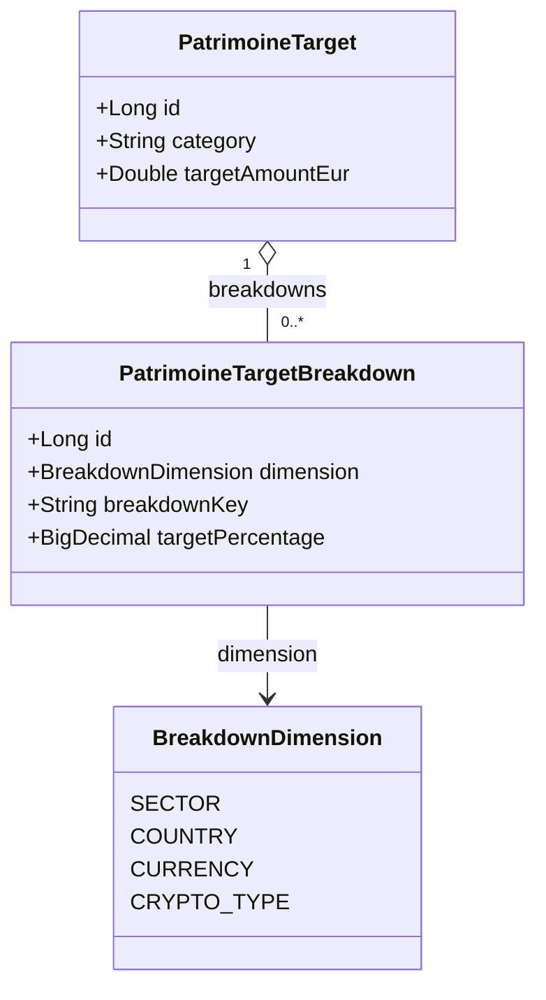

# Stratégie & Objectifs patrimoniaux

## Vue d'ensemble

La fonctionnalité **Stratégie patrimoniale** permet à l'utilisateur de définir un montant cible par catégorie d'actif. Chaque carte de résumé de la page Patrimoine affiche alors une barre de progression indiquant l'avancement vers l'objectif. La barre passe au rouge si la valeur courante dépasse la cible.

Les objectifs sont **persistés côté backend** (base SQLite) pour être retrouvés sur n'importe quel appareil.

---

## Flux UX

```
PatrimoinePage
  └─ Bouton "Stratégie & Objectifs"
       └─ Modal PatrimoineStrategyModal
            ├─ Un champ de saisie par catégorie (LIVRET, LIQUIDITE, BOURSE, …)
            ├─ Bouton "Enregistrer" → PUT /api/patrimoine/targets
            └─ Fermeture → refresh des barres de progression
```

Au chargement de `PatrimoinePage`, les objectifs sont récupérés via `GET /api/patrimoine/targets` et transmis aux cartes de résumé par catégorie.

---

## Modèle de données

### Entité `PatrimoineTarget`

Table : `patrimoine_targets`

| Colonne | Type SQLite | Contrainte | Description |
|---------|-------------|------------|-------------|
| `id` | INTEGER | PK, autoincrement | — |
| `user_id` | INTEGER | FK → `users(id)`, NOT NULL | Propriétaire de l'objectif |
| `category` | TEXT | NOT NULL | Valeur de `AssetCategory` (`BOURSE`, `LIVRET`, …) |
| `target_amount_eur` | REAL | NOT NULL | Montant cible en EUR |

**Contrainte d'unicité :** `UNIQUE(user_id, category)` — un seul objectif par catégorie et par utilisateur.

### DTO de réponse

```java
// GET /api/patrimoine/targets → Map<String, Double>
// Exemple :
{
  "BOURSE":        50000.0,
  "CRYPTO":        5000.0,
  "IMMO_PAPIER":   20000.0,
  "IMMO_PHYSIQUE": 300000.0,
  "LIVRET":        30000.0,
  "LIQUIDITE":     10000.0
}
```

La réponse est une `Map<String, Double>` : clé = nom de catégorie, valeur = montant cible. Les catégories sans objectif défini sont absentes de la map.

### DTO de requête (PUT)

```java
// PUT /api/patrimoine/targets — body :
// Map<String, Double>   (même format que la réponse)
// Les catégories absentes voient leur objectif supprimé.
// Une valeur nulle ou ≤ 0 supprime l'objectif de la catégorie.
```

---

## Backend

### Package et classes

```
com.myfinance
├── domain/
│   └── PatrimoineTarget.java          — @Entity, @Table("patrimoine_targets")
├── repository/
│   └── PatrimoineTargetRepository.java — findAllByUserId, deleteByUserIdAndCategory
├── service/
│   └── PatrimoineTargetService.java   — getTargets, saveTargets
├── controller/
│   └── PatrimoineTargetController.java — GET + PUT /api/patrimoine/targets
```

### `PatrimoineTarget` (entité)

```java
@Entity
@Table(name = "patrimoine_targets",
       uniqueConstraints = @UniqueConstraint(columnNames = {"user_id", "category"}))
@Data @Builder @NoArgsConstructor @AllArgsConstructor
public class PatrimoineTarget {
    @Id @GeneratedValue(strategy = GenerationType.IDENTITY)
    private Long id;

    @ManyToOne(fetch = FetchType.LAZY)
    @JoinColumn(name = "user_id", nullable = false)
    private User user;

    @Column(nullable = false)
    private String category;   // valeur de AssetCategory

    @Column(nullable = false)
    private Double targetAmountEur;
}
```

### `PatrimoineTargetService`

| Méthode | Signature | Description |
|---------|-----------|-------------|
| `getTargets` | `Map<String, Double> getTargets(Long userId)` | Retourne la map catégorie→montant pour l'utilisateur |
| `saveTargets` | `void saveTargets(Long userId, Map<String, Double> targets)` | Upsert complet : supprime les lignes manquantes, insère/met à jour les autres |

**Logique `saveTargets` :**
1. Supprimer toutes les lignes existantes de l'utilisateur (`deleteByUserId`)
2. Filtrer les entrées avec valeur > 0
3. Insérer les nouvelles lignes via `saveAll`

### Endpoints

| Méthode | URL | Rôle requis | Description |
|---------|-----|-------------|-------------|
| `GET` | `/api/patrimoine/targets` | Authentifié | Retourne les objectifs de l'utilisateur connecté |
| `PUT` | `/api/patrimoine/targets` | Authentifié | Remplace l'intégralité des objectifs (upsert) |

---

## Frontend

### API layer — `patrimoine.js`

```js
export const getPatrimoineTargets  = ()        => client.get('/api/patrimoine/targets').then(r => r.data)
export const savePatrimoineTargets = (targets) => client.put('/api/patrimoine/targets', targets).then(r => r.data)
```

### `PatrimoineStrategyModal`

Modal de saisie des objectifs par catégorie.

| Prop | Type | Description |
|------|------|-------------|
| `isOpen` | `boolean` | Contrôle la visibilité |
| `onClose` | `() => void` | Ferme la modal |
| `targets` | `Record<string, number\|null>` | Valeurs initiales (chargées depuis l'API) |
| `onSave` | `(targets) => void` | Callback après enregistrement réussi |

**Comportement :**
- Un `NumInput` (montant €) par catégorie, pré-rempli avec la valeur existante
- Icône et label de catégorie repris depuis `CATEGORY_META` (constants.js)
- "Enregistrer" : appelle `PUT /api/patrimoine/targets`, puis `onSave` avec la nouvelle map
- "Annuler" : ferme sans appel API
- État `saving` (booléen) pour désactiver le bouton pendant la requête

### `CategoryStrategyBar`

Barre de progression intégrée dans chaque carte de résumé de catégorie.

| Prop | Type | Description |
|------|------|-------------|
| `currentValue` | `number` | Valeur actuelle de la catégorie en EUR |
| `target` | `number\|null` | Objectif cible en EUR (`null` = barre masquée) |

**Logique d'affichage :**
```js
if (!target || target <= 0) return null

const pct      = Math.min(currentValue / target * 100, 100)  // plafonné pour la barre
const exceeded = currentValue > target
```

| État | Couleur de la barre | Texte sous la barre |
|------|---------------------|---------------------|
| Normal (`pct < 100`) | indigo-500 | `{pct} % · objectif {fmtEur(target)}` |
| Atteint (`pct === 100`) | emerald-500 | `Objectif atteint · {fmtEur(target)}` |
| Dépassé (`exceeded`) | red-500 | `Dépassé de {fmtEur(currentValue - target)}` |

La barre est toujours pleine à 100 % visuellement quand l'objectif est dépassé (l'excès est indiqué par le texte et la couleur rouge).

### Intégration dans `PatrimoinePage`

**Chargement au montage :**
```js
const [targets, setTargets] = useState({})

useEffect(() => {
  getPatrimoineTargets().then(setTargets).catch(() => {})
}, [])
```

**Sauvegarde :**
```js
async function handleSaveTargets(newTargets) {
  await savePatrimoineTargets(newTargets)
  setTargets(newTargets)
}
```

**Bouton d'accès :** ajouté dans l'en-tête de `PatrimoinePage`, à droite des boutons existants.

**Transmission aux cartes :** `targets[category]` passé à `CategoryStrategyBar` dans chaque carte de résumé.

---

## Structure des fichiers

```
backend/src/main/java/com/myfinance/
├── domain/PatrimoineTarget.java
├── repository/PatrimoineTargetRepository.java
├── service/PatrimoineTargetService.java
└── controller/PatrimoineTargetController.java

frontend/src/components/patrimoine/
├── PatrimoinePage.jsx              — ajout bouton + chargement API targets
├── PatrimoineStrategyModal.jsx     — NOUVEAU : modal de saisie
├── CategoryStrategyBar.jsx         — NOUVEAU : barre de progression
└── constants.js                    — inchangé (CATEGORY_META réutilisé)

frontend/src/api/
└── patrimoine.js                   — ajout getPatrimoineTargets / savePatrimoineTargets
```

---

## Tests

- `PatrimoineTargetServiceTest` : `getTargets` (vide, partiel, complet), `saveTargets` (insertion, mise à jour, suppression des absents)
- `PatrimoineTargetControllerTest` : GET 200, PUT 200, accès non authentifié → 401

---

## Non-requis (hors périmètre V1)

- Pas de date d'échéance ni d'historique des objectifs
- Pas de cumul inter-catégories ni d'objectif global
- Pas de mode famille : les objectifs sont personnels à l'utilisateur connecté

---

# V2 — Objectifs de diversification BOURSE multi-dimensions

> **Statut :** livré.
>
> Cette V2 étend la V1 en autorisant l'utilisateur à fixer, **en plus du montant cible global**, des objectifs de répartition sur 4 dimensions de la catégorie BOURSE : **secteur**, **pays**, **devise**, **type d'actif (ETF / Action / Obligation…)**. L'écart entre la répartition cible et la répartition réelle est calculé à la volée à partir des données déjà présentes dans le système (allocations sectorielles/géographiques des instruments, devise et sous-type des positions).
>
> La classification CRYPTO (stablecoin / token) reste prévue pour une itération ultérieure et **réutilisera le même modèle de données**.

## V2.1 Vue d'ensemble

L'utilisateur peut définir, sur sa catégorie BOURSE :

- un **montant cible** en € (déjà couvert par la V1)
- une **répartition cible** par dimension (en pourcentages, somme ≤ 100 % par dimension) sur :
  - **SECTOR** — secteurs (Technology, Healthcare…)
  - **COUNTRY** — pays (FR, US, JP…)
  - **CURRENCY** — devises ISO (EUR, USD…)
  - **ASSET_SUBTYPE** — types d'actif (ETF, ACTION, OBLIGATION, FOREX, WARRANT, FONDS_EUROS, TRACKERS, SCPI)

Sur la page Patrimoine, la carte BOURSE affiche en plus de la barre de progression V1, **un panel par dimension configurée** :

- la répartition **réelle** des positions (calculée à partir des données existantes)
- la répartition **cible**
- l'**écart** par bucket (en points de pourcentage, vert si dans la cible, orange si surpondéré, rouge si sous-pondéré au-delà d'un seuil)
- un **indicateur de couverture** sur SECTOR/COUNTRY uniquement (CURRENCY et ASSET_SUBTYPE sont à 100 % par construction)

## V2.2 Choix de conception

| Décision | Choix retenu | Justification |
|----------|--------------|---------------|
| Unité de l'objectif sous-catégorie | **Pourcentage** de la catégorie | La diversification est intrinsèquement relative ; les € absolus ne tiennent pas avec la croissance du portefeuille |
| Granularité du référentiel secteur | Liste libre dérivée des secteurs effectivement présents dans `InstrumentSectorAllocation` | Évite de figer une taxonomie ; les secteurs proviennent des sources externes alimentant la table |
| Stockage | **Nouvelle table** `patrimoine_target_breakdowns` liée à `PatrimoineTarget` | Permet d'ajouter pays / devise / token-type sans changer le schéma |
| Granularité du calcul | Au niveau **position** (qty × prix × allocation%) | Les `InstrumentSectorAllocation` sont par instrument ; on agrège côté backend en multipliant par la valeur de la position |
| Seuil d'alerte d'écart | ±5 points par défaut | Configurable plus tard ; en dur au début |
| Couverture minimale | Aucune (information seulement) | Si un instrument n'a pas de secteur, on l'ajoute à un bucket « Non classé » et on affiche le ratio non couvert |

## V2.3 Modèle de données

### V2.3.1 Nouvelle entité — `PatrimoineTargetBreakdown`

Table : `patrimoine_target_breakdowns`

| Champ | Type Java | Colonne SQLite | Description |
|-------|-----------|----------------|-------------|
| `id` | `Long` | `id` | PK auto-incrémentée |
| `target` | `PatrimoineTarget` | `patrimoine_target_id` (FK) | Objectif catégorie parent |
| `dimension` | `BreakdownDimension` (enum) | `dimension` | `SECTOR` en V2 ; `COUNTRY`, `CURRENCY`, `CRYPTO_TYPE` à venir |
| `breakdownKey` | `String` | `breakdown_key` | Clé (ex : `"Technology"`, `"FR"`, `"USD"`, `"STABLECOIN"`) |
| `targetPercentage` | `BigDecimal(5,2)` | `target_percentage` | Pourcentage cible 0–100 |

**Contrainte :** `UNIQUE(patrimoine_target_id, dimension, breakdown_key)`

**Cascade :** la suppression d'un `PatrimoineTarget` supprime ses `breakdowns`.

**Règle métier :** pour un même `(target, dimension)`, la somme des `targetPercentage` doit être ≤ 100. Validation côté service.

### V2.3.2 Enum `BreakdownDimension`

```java
public enum BreakdownDimension {
    SECTOR,         // BOURSE — via InstrumentSectorAllocation
    COUNTRY,        // BOURSE — via InstrumentAllocation
    CURRENCY,       // BOURSE — via Instrument.currency (couverture 100 %)
    ASSET_SUBTYPE,  // BOURSE — via Position.assetSubType (ETF/ACTION/OBLIGATION/...)
    CRYPTO_TYPE     // CRYPTO — à implémenter (nécessite un nouveau champ sur Instrument)
}
```

### V2.3.3 Diagramme



## V2.4 Calculs

`PatrimoineBreakdownService` expose un dispatcher unique :

```java
public PortfolioBreakdownDto getBreakdown(User user, BreakdownDimension dimension)
```

qui délègue à 4 stratégies internes selon la dimension. Toutes opèrent sur les positions ACTIVE de catégorie BOURSE de l'utilisateur. Deux familles d'agrégation :

| Famille | Dimensions concernées | Logique |
|---------|----------------------|---------|
| **Allocations pondérées** | SECTOR, COUNTRY | Un instrument peut contribuer à plusieurs buckets via `InstrumentSectorAllocation` ou `InstrumentAllocation` (totalisant idéalement 100 %). Le résidu (1 − Σ allocations) bascule en "Non classé". |
| **Champ direct** | CURRENCY, ASSET_SUBTYPE | Chaque position contribue à 100 % à un seul bucket (sa devise / son sous-type). Les positions sans valeur basculent en "Non classé". |

### V2.4.1 Répartition réelle du portefeuille BOURSE par secteur

Pour chaque position `p` ACTIVE de catégorie BOURSE de l'utilisateur :

```
valueEur(p) = quantité × dernier_prix × tauxChange(devise → EUR)
```

Pour chaque allocation `a` (`InstrumentSectorAllocation`) de l'instrument de `p` :

```
contribution(p, secteur) = valueEur(p) × (a.percentage / 100)
```

Agrégation finale :

```
actualBySector[secteur]   = Σ contribution(p, secteur)         pour toutes les positions BOURSE
totalBourseClassified     = Σ actualBySector
totalBourseUnclassified   = Σ valueEur(p) tel que aucune InstrumentSectorAllocation n'existe
totalBourse               = totalBourseClassified + totalBourseUnclassified
coverageRatio             = totalBourseClassified / totalBourse        (en %)
actualPctBySector[secteur]= actualBySector[secteur] / totalBourse × 100
```

> **Remarque :** on rapporte au **total BOURSE** (et non au seul classé) pour que le secteur « Non classé » apparaisse explicitement comme un poids dans la répartition.

### V2.4.2 Écart vs cible

Pour chaque secteur présent dans la cible OU dans le réel :

```
deviationPoints[secteur] = actualPctBySector[secteur] − targetPctBySector[secteur]
```

Code couleur d'affichage :

| `|deviation|` | Couleur | Sémantique |
|-------------|---------|------------|
| ≤ 2 pts | emerald-500 | Aligné |
| ≤ 5 pts | indigo-500 | Acceptable |
| > 5 pts | amber-500 | À rééquilibrer |
| > 10 pts | red-500 | Fort écart |

## V2.5 API REST

### V2.5.1 Endpoint enrichi — `GET /api/patrimoine/targets`

**Évolution de la réponse :** la réponse passe de `Map<String, Double>` à un DTO structuré, **rétrocompatible** côté frontend (le champ `targets` reste une map).

```json
{
  "targets": {
    "BOURSE": 50000.0,
    "CRYPTO": 5000.0
  },
  "breakdowns": {
    "BOURSE": [
      { "dimension": "SECTOR", "key": "Technology",        "targetPercentage": 30.0 },
      { "dimension": "SECTOR", "key": "Healthcare",        "targetPercentage": 20.0 },
      { "dimension": "SECTOR", "key": "Financial Services","targetPercentage": 15.0 }
    ]
  }
}
```

> Les catégories sans `breakdowns` configurés sont absentes de la map `breakdowns` (pas de tableau vide).

### V2.5.2 Endpoint enrichi — `PUT /api/patrimoine/targets`

Même structure en entrée que la sortie du GET. **Sémantique upsert complet** : les `breakdowns` non listés sont supprimés.

**Validations service :**

- somme des `targetPercentage` par `(category, dimension)` ≤ 100
- `dimension = SECTOR` autorisée uniquement pour `category = BOURSE` en V2
- `breakdownKey` non vide

### V2.5.3 Nouvel endpoint — `GET /api/patrimoine/breakdown/{dimension}`

Endpoint **unifié** retournant la répartition réelle pour une dimension donnée. Le path variable accepte `sector`, `country`, `currency`, `asset-subtype` (kebab-case → enum `ASSET_SUBTYPE`).

Réponse type (`PortfolioBreakdownDto`) :

```json
{
  "category": "BOURSE",
  "dimension": "SECTOR",
  "totalEur": 48230.55,
  "coverageRatio": 87.4,
  "unclassifiedEur": 6080.0,
  "breakdown": [
    { "key": "Technology",         "valueEur": 18450.20, "actualPercentage": 38.2 },
    { "key": "Healthcare",         "valueEur":  9012.80, "actualPercentage": 18.7 },
    { "key": "Financial Services", "valueEur":  6245.10, "actualPercentage": 12.9 },
    { "key": "Non classé",         "valueEur":  6080.00, "actualPercentage": 12.6 }
  ]
}
```

| Méthode | URL | Rôle requis | Description |
|---------|-----|-------------|-------------|
| `GET` | `/api/patrimoine/breakdown/{dimension}` | Authentifié | Répartition BOURSE par dimension (`sector`, `country`, `currency`, `asset-subtype`) |

> **Pourquoi un endpoint séparé du `GET /api/patrimoine/targets` ?** Le calcul d'agrégation est plus coûteux (jointure avec les allocations + iteration sur les positions) et n'est utile qu'à l'ouverture de la modal Stratégie ou dans le rendu des panels — pas à chaque chargement de `PatrimoinePage` quand l'utilisateur n'a pas configuré de sous-objectifs.

> **Pourquoi un seul endpoint avec path variable plutôt que 4 endpoints distincts ?** Logique partagée (load des positions BOURSE actives), tarification d'authn/autz mutualisée, ajout d'une 5e dimension futur (CRYPTO_TYPE) sans nouveau endpoint.

## V2.6 Backend

### V2.6.1 Nouveaux artefacts

```
com.myfinance
├── domain/
│   ├── PatrimoineTargetBreakdown.java          — NOUVEAU
│   └── BreakdownDimension.java                 — NOUVEAU (enum)
├── repository/
│   └── PatrimoineTargetBreakdownRepository.java — NOUVEAU
├── service/
│   ├── PatrimoineTargetService.java             — étendu (gestion breakdowns)
│   └── PatrimoineBreakdownService.java          — NOUVEAU (agrégation sectorielle)
├── controller/
│   ├── PatrimoineTargetController.java          — DTO de réponse modifié
│   └── PatrimoineBreakdownController.java       — NOUVEAU
└── dto/
    ├── PatrimoineTargetsDto.java                — NOUVEAU (record)
    ├── TargetBreakdownDto.java                  — NOUVEAU (record)
    ├── SaveTargetsRequest.java                  — NOUVEAU (record)
    └── SectorBreakdownDto.java                  — NOUVEAU (record)
```

### V2.6.2 `PatrimoineBreakdownService`

| Méthode | Signature | Description |
|---------|-----------|-------------|
| `getBreakdown` | `PortfolioBreakdownDto getBreakdown(User user, BreakdownDimension dimension)` | Dispatcher unique : SECTOR / COUNTRY / CURRENCY / ASSET_SUBTYPE. CRYPTO_TYPE → 400. |

**Étapes internes (cas SECTOR / COUNTRY) :**
1. Charger les positions ACTIVE de catégorie BOURSE de l'utilisateur
2. Pour chaque position, calculer `valueEur` (réutiliser la logique existante `PositionDto.computeBourseCrypto`)
3. Joindre `InstrumentSectorAllocation` ou `InstrumentAllocation` par `instrument_id`
4. Cumuler par bucket ; "Non classé" pour les positions sans allocation **ou pour le résidu** (1 − Σ allocations)
5. Calculer pourcentages et `coverageRatio`

**Étapes internes (cas CURRENCY / ASSET_SUBTYPE) :**
1. Charger les positions ACTIVE de catégorie BOURSE de l'utilisateur
2. Pour chaque position, extraire la clé : `instrument.currency` (ou `position.currency` en fallback) ou `position.assetSubType.name()`
3. Cumuler 100 % de `valueEur` dans le bucket correspondant ; "Non classé" si la clé est null
4. `coverageRatio` = 100 % par construction (sauf positions sans assetSubType)

### V2.6.3 `PatrimoineTargetService` — extensions

| Méthode | Signature | Évolution |
|---------|-----------|-----------|
| `getTargets` | `PatrimoineTargetsDto getTargets(Long userId)` | Renvoie targets + breakdowns groupés par catégorie |
| `saveTargets` | `void saveTargets(Long userId, SaveTargetsRequest request)` | Upsert complet incluant breakdowns ; validation somme ≤ 100 par dimension |

## V2.7 Frontend

### V2.7.1 API layer — `patrimoine.js`

```js
export const getPatrimoineTargets  = ()        => api.get('/api/patrimoine/targets').then(r => r.data)
export const savePatrimoineTargets = (payload) => api.put('/api/patrimoine/targets', payload).then(r => r.data)
export const getBreakdown          = (dim)     => api.get(`/api/patrimoine/breakdown/${dim}`).then(r => r.data)
// Alias rétro-compat
export const getSectorBreakdown    = ()        => getBreakdown('sector')
```

> ⚠ **Breaking change interne** : `savePatrimoineTargets` reçoit désormais `{ targets, breakdowns }` au lieu d'une map. Migrer les appelants en même temps.

### V2.7.2 `PatrimoineStrategyModal` — extensions

La modal V1 reste structurée par catégorie. Sous la ligne **BOURSE**, on déplie automatiquement les **4 dimensions** lorsqu'un montant est saisi :

- Sectoriel (SECTOR)
- Géographique (COUNTRY)
- Devise (CURRENCY)
- Type d'actif (ASSET_SUBTYPE)

Chaque dimension est un sous-composant `BreakdownDimensionEditor` réutilisable :

- Liste des entrées déjà saisies (input texte + input numérique 0–100 % + bouton « Supprimer »)
- Bouton « + Ajouter une entrée »
- Suggestions cliquables = clés présentes dans le portefeuille pour cette dimension (via `getBreakdown(dim)`) — masquées si déjà sélectionnées
- Compteur en bas : `Total : 75 % · 25 % non alloué` (rouge si > 100 %)
- Le bouton **Enregistrer** est désactivé si une dimension dépasse 100 %

À l'enregistrement, on aplatit toutes les dimensions dans `breakdowns.BOURSE = [...]` et on appelle `savePatrimoineTargets({ targets, breakdowns })`.

### V2.7.3 Nouveau composant générique — `BreakdownPanel`

Affiché dans la carte BOURSE de `PatrimoinePage`, sous la `CategoryStrategyBar` V1, **une fois par dimension configurée**. **Ne rend rien** si aucun objectif n'existe pour cette dimension.

| Prop | Type | Description |
|------|------|-------------|
| `dimension` | `'SECTOR'\|'COUNTRY'\|'CURRENCY'\|'ASSET_SUBTYPE'` | Dimension affichée |
| `title` | `string` | Titre de section (ex : "Diversification sectorielle") |
| `targetBreakdowns` | `TargetBreakdown[]` | Tous les sous-objectifs BOURSE — le composant filtre par `dimension` |
| `actual` | `PortfolioBreakdownDto` | Réel pour cette dimension (depuis `getBreakdown(dim)`) |
| `showCoverageWarning` | `boolean` (def. `true`) | Désactiver pour CURRENCY / ASSET_SUBTYPE (couverture 100 %) |

**Affichage :**

- Une barre par bucket (réel) avec marqueur vertical de la cible superposé
- Légende : `{key} · {actual %} / cible {target %} ({deviation ± pts})` colorisée selon la grille V2.4.2
- Bandeau d'avertissement (uniquement SECTOR/COUNTRY) si `coverageRatio < 80 %`

### V2.7.4 Intégration dans `PatrimoinePage`

```js
const [targets, setTargets] = useState({})
const [breakdowns, setBreakdowns] = useState({})
const [actualBreakdowns, setActualBreakdowns] = useState({})

useEffect(() => {
  Promise.all([
    getPatrimoineTargets(),
    getBreakdown('sector').catch(() => null),
    getBreakdown('country').catch(() => null),
    getBreakdown('currency').catch(() => null),
    getBreakdown('asset-subtype').catch(() => null),
  ]).then(([dto, sector, country, currency, assetSubType]) => {
    setTargets(dto?.targets ?? {})
    setBreakdowns(dto?.breakdowns ?? {})
    setActualBreakdowns({ sector, country, currency, assetSubType })
  })
}, [])
```

Sur la carte BOURSE, on rend les 4 `<BreakdownPanel>` à la suite ; chacun se masque tout seul s'il n'y a pas d'objectif sur sa dimension.

## V2.8 Migration SQLite

Fichier : `backend/migrations/010_add_patrimoine_target_breakdowns.sql`

```sql
CREATE TABLE patrimoine_target_breakdowns (
  id                    INTEGER PRIMARY KEY AUTOINCREMENT,
  patrimoine_target_id  INTEGER NOT NULL,
  dimension             TEXT NOT NULL CHECK (dimension IN ('SECTOR','COUNTRY','CURRENCY','ASSET_SUBTYPE','CRYPTO_TYPE')),
  breakdown_key         TEXT NOT NULL,
  target_percentage     REAL NOT NULL,
  UNIQUE (patrimoine_target_id, dimension, breakdown_key),
  FOREIGN KEY (patrimoine_target_id) REFERENCES patrimoine_targets(id) ON DELETE CASCADE
);

CREATE INDEX idx_target_breakdowns_target ON patrimoine_target_breakdowns(patrimoine_target_id);
```

## V2.9 Tests

- `PatrimoineTargetServiceTest` (12 tests) : saveTargets avec breakdowns, validation somme > 100, dimension non autorisée, doublons, acceptation des 4 dimensions BOURSE
- `PatrimoineBreakdownServiceTest` (10 tests) : couverture des 4 dimensions (allocation complète, résidu, bucket "Non classé"), CRYPTO_TYPE → 400, fallback `position.currency` si instrument null
- `PatrimoineTargetControllerTest` (10 tests) : GET/PUT sur le nouveau DTO, 401 anonyme, validations Bean Validation
- `PatrimoineBreakdownControllerTest` (6 tests) : un test par dimension + dimension inconnue → 400 + 401 anonyme

## V2.10 Préalable opérationnel

L'expérience dépend de la qualité des `InstrumentSectorAllocation`. Avant la mise en service de V2 :

- Vérifier la couverture sectorielle des instruments BOURSE actifs
- Lancer (ou planifier) le job d'enrichissement des allocations sectorielles
- Documenter dans `docs/architecture/instruments.md` la procédure d'alimentation manuelle des `InstrumentSectorAllocation` pour les instruments non couverts par la source automatique

## V2.11 Hors périmètre V2 (anticipé V3+)

- Classification CRYPTO **stablecoin / token / layer1** (`dimension = CRYPTO_TYPE`) — nécessite un nouveau champ `cryptoType` sur `Instrument` (enum) et une saisie manuelle ou semi-automatique
- Rééquilibrage suggéré (« vendez X € de Tech, achetez Y € de Healthcare ») — nécessite des règles métier supplémentaires hors scope V2
- Regroupement géographique au niveau **continent** (Europe, Amérique du Nord…) — actuellement la dimension COUNTRY utilise les codes pays bruts ; un mapping pays → continent côté frontend ou backend pourrait être ajouté
