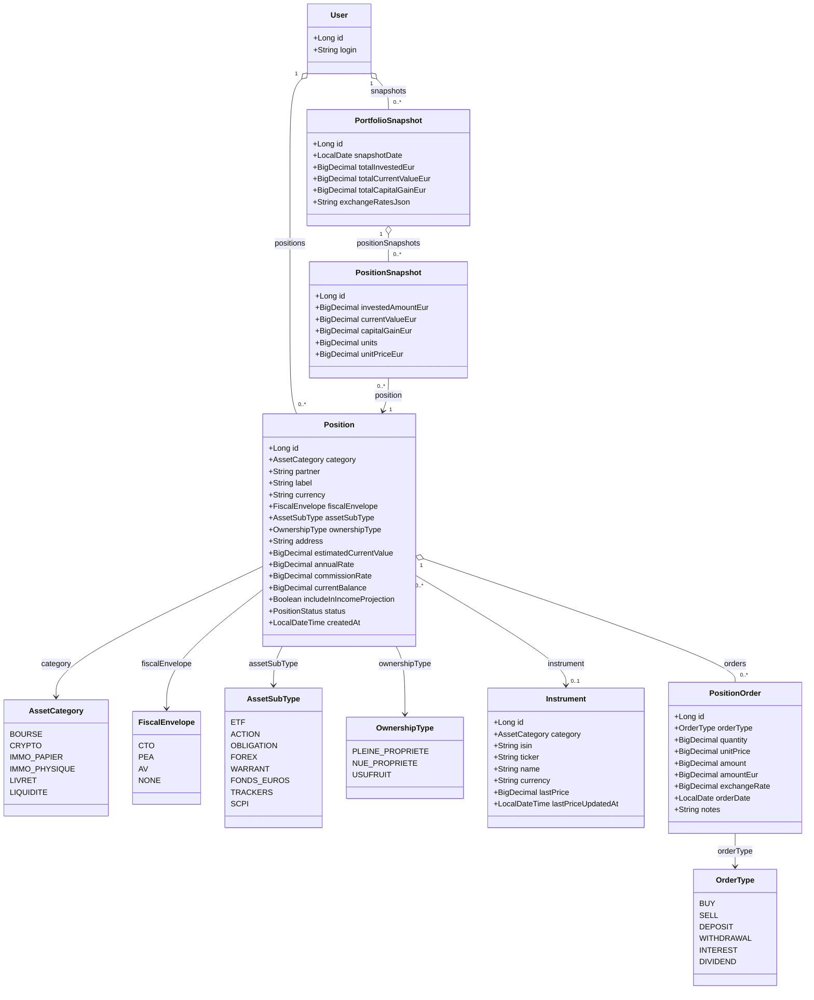

# Gestion du patrimoine

## Vue d'ensemble

La gestion du patrimoine permet de suivre l'ensemble des actifs financiers d'un utilisateur, organisés en **six catégories**, et d'historiser leur valorisation mois par mois.

Le modèle repose sur **trois niveaux complémentaires** :

| Niveau | Entité | Objectif |
|--------|--------|----------|
| Référentiel instruments | `Instrument` | Titre financier sous-jacent (ISIN, token crypto) avec prix marché |
| Position | `Position` | Une ligne de patrimoine pour un actif ou un compte |
| Mouvement | `PositionOrder` | Chaque achat, vente, dépôt ou retrait sur une position |
| Historisation | `PortfolioSnapshot` + `PositionSnapshot` | Photo mensuelle automatique du patrimoine valorisé |

> **Exception : Liquidités** — la catégorie `LIQUIDITE` (cash, tickets restaurant, chèques culture/vacances) ne produit pas d'ordres. Son solde est mis à jour manuellement via le champ `currentBalance` de la position.

---

## Catégories d'actifs

```
AssetCategory (enum)
  BOURSE        — actions, ETF, obligations, forex, warrants
  CRYPTO        — crypto-monnaies et tokens
  IMMO_PAPIER   — crowdfunding immobilier
  IMMO_PHYSIQUE — bien immobilier détenu en direct
  LIVRET        — livret d'épargne, compte rémunéré
  LIQUIDITE     — cash, tickets restaurant, chèques vacances/culture
```

---

## Enveloppes fiscales

```
FiscalEnvelope (enum)    — applicable à BOURSE, LIVRET, IMMO_PAPIER
  CTO   — Compte Titres Ordinaire
  PEA   — Plan d'Épargne en Actions
  AV    — Assurance Vie (inclut le fonds en euros)
  NONE  — pas d'enveloppe fiscale dédiée
```

| Enveloppe | Fiscalité applicable | Condition |
|-----------|----------------------|-----------|
| CTO | 30 % (PFU — flat tax) | Immédiate sur plus-values et dividendes |
| PEA | 17,2 % (prélèvements sociaux uniquement) | Après 5 ans de détention |
| AV | 7,5 % + 17,2 % PS (avec abattement 4 600 €/9 200 €) | Après 8 ans de détention |
| NONE | Variable selon le support | — |

---

## Sous-types d'actifs Bourse

```
AssetSubType (enum)    — applicable à BOURSE uniquement
  ETF
  ACTION
  OBLIGATION
  FOREX
  WARRANT
  FONDS_EUROS   — uniquement disponible avec FiscalEnvelope = AV
  TRACKERS
  SCPI
```

> Le sous-type `FONDS_EUROS` permet de distinguer la poche sécurisée d'un contrat d'assurance vie des unités de compte (UC). Les UC sont modélisées comme des positions `BOURSE` avec `fiscalEnvelope = AV` et un sous-type différent de `FONDS_EUROS`.

---

## Types de propriété immobilière

```
OwnershipType (enum)    — applicable à IMMO_PHYSIQUE uniquement
  PLEINE_PROPRIETE
  NUE_PROPRIETE
  USUFRUIT
```

---

## Types d'ordres

```
OrderType (enum)    — applicable à toutes les catégories sauf LIQUIDITE
  BUY         — achat / investissement
  SELL        — vente / cession
  DEPOSIT     — apport de fonds (ex : versement sur livret)
  WITHDRAWAL  — retrait de fonds
  INTEREST    — intérêts perçus (crediteur)
  DIVIDEND    — dividende perçu
```

---

## Modèle de données

### Instrument *(titre financier partagé entre utilisateurs)*

| Champ | Type | Description |
|-------|------|-------------|
| `id` | `Long` | Identifiant |
| `category` | `BOURSE` \| `CRYPTO` | Type d'instrument |
| `isin` | `String` | Code ISIN — renseigné pour BOURSE, nullable |
| `ticker` | `String` | Symbole / trigramme — renseigné pour CRYPTO, nullable |
| `name` | `String` | Nom complet de l'instrument |
| `currency` | `String` | Devise native (ex : `EUR`, `USD`) |
| `lastPrice` | `BigDecimal` | Dernier prix connu |
| `lastPriceUpdatedAt` | `LocalDateTime` | Date de la dernière mise à jour du prix |

**Contraintes :**
- `isin` est unique parmi les instruments de type `BOURSE`
- `ticker` est unique parmi les instruments de type `CRYPTO`
- Un `Instrument` est partagé entre tous les utilisateurs (référentiel commun)

---

### Position *(une ligne de patrimoine)*

| Champ | Type | Catégories concernées | Description |
|-------|------|-----------------------|-------------|
| `id` | `Long` | Toutes | Identifiant |
| `user` | `User` | Toutes | Propriétaire |
| `category` | `AssetCategory` | Toutes | Catégorie de l'actif |
| `partner` | `String` | Toutes sauf IMMO_PHYSIQUE | Plateforme ou établissement (ex : SaxoBank, Binance, Housers) |
| `label` | `String` | Toutes | Libellé personnalisé |
| `currency` | `String` | Toutes | Devise native de la position (défaut : `EUR`) |
| `fiscalEnvelope` | `FiscalEnvelope` | BOURSE, LIVRET, IMMO_PAPIER | Enveloppe fiscale |
| `assetSubType` | `AssetSubType` | BOURSE | Sous-type (ETF, Action, Fonds euros…) |
| `instrument` | `Instrument` | BOURSE, CRYPTO | Titre sous-jacent (ISIN ou token) |
| `ownershipType` | `OwnershipType` | IMMO_PHYSIQUE | Type de propriété |
| `address` | `String` | IMMO_PHYSIQUE | Adresse du bien |
| `estimatedCurrentValue` | `BigDecimal` | IMMO_PHYSIQUE | Valeur estimée actuelle — saisie manuellement |
| `annualRate` | `BigDecimal` | LIVRET | Taux d'intérêt annuel en % |
| `commissionRate` | `BigDecimal` | IMMO_PAPIER | Taux de commission de la plateforme en % |
| `currentBalance` | `BigDecimal` | LIQUIDITE | Solde actuel — mis à jour manuellement |
| `includeInIncomeProjection` | `Boolean` | Toutes | Si `true`, les intérêts projetés alimentent les Revenus Complémentaires |
| `status` | `ACTIVE` \| `CLOSED` | Toutes | Statut de la position |
| `createdAt` | `LocalDateTime` | Toutes | Date de création |

---

### PositionOrder *(chaque mouvement sur une position)*

> Non applicable à la catégorie `LIQUIDITE`.

| Champ | Type | Description |
|-------|------|-------------|
| `id` | `Long` | Identifiant |
| `position` | `Position` | Position concernée |
| `orderType` | `OrderType` | Type de mouvement |
| `quantity` | `BigDecimal` | Quantité de titres ou tokens — nullable (non pertinent pour LIVRET, IMMO_PAPIER) |
| `unitPrice` | `BigDecimal` | Prix unitaire dans la devise de la position — nullable |
| `amount` | `BigDecimal` | Montant total dans la devise de la position |
| `amountEur` | `BigDecimal` | Montant converti en EUR au moment de l'ordre |
| `exchangeRate` | `BigDecimal` | Taux de change appliqué — `null` si devise = EUR |
| `orderDate` | `LocalDate` | Date d'exécution de l'ordre |
| `notes` | `String` | Commentaire libre — nullable |

---

### PortfolioSnapshot *(photo mensuelle du patrimoine)*

| Champ | Type | Description |
|-------|------|-------------|
| `id` | `Long` | Identifiant |
| `user` | `User` | Propriétaire |
| `snapshotDate` | `LocalDate` | Date du snapshot (1er du mois) |
| `totalInvestedEur` | `BigDecimal` | Total investi tous actifs en EUR |
| `totalCurrentValueEur` | `BigDecimal` | Valorisation totale en EUR |
| `totalCapitalGainEur` | `BigDecimal` | Plus-value nette totale en EUR |
| `exchangeRatesJson` | `String` | Taux de change appliqués au moment du snapshot (JSON) |

---

### PositionSnapshot *(valeur d'une position au moment du snapshot)*

| Champ | Type | Description |
|-------|------|-------------|
| `id` | `Long` | Identifiant |
| `portfolioSnapshot` | `PortfolioSnapshot` | Snapshot parent |
| `position` | `Position` | Position valorisée |
| `investedAmountEur` | `BigDecimal` | Montant investi cumulé en EUR |
| `currentValueEur` | `BigDecimal` | Valeur de marché en EUR |
| `capitalGainEur` | `BigDecimal` | Plus-value (`currentValue - invested`) en EUR |
| `units` | `BigDecimal` | Nombre de parts/titres/tokens — nullable |
| `unitPriceEur` | `BigDecimal` | Prix unitaire en EUR — nullable |

---

## Règles de calcul par catégorie

### Montant investi cumulé (`investedAmountEur`)

```
investedAmountEur = Σ(BUY.amountEur)
                  + Σ(DEPOSIT.amountEur)
                  - Σ(SELL.amountEur)
                  - Σ(WITHDRAWAL.amountEur)
```

### Nombre de parts (`units`) — BOURSE et CRYPTO

```
units = Σ(BUY.quantity) - Σ(SELL.quantity)
```

### Valeur actuelle (`currentValueEur`)

| Catégorie | Formule |
|-----------|---------|
| BOURSE, CRYPTO | `units × instrument.lastPrice × exchangeRateToEur` |
| LIVRET | `investedAmountEur + Σ(INTEREST.amountEur)` |
| IMMO_PAPIER | `investedAmountEur + Σ(INTEREST.amountEur)` |
| IMMO_PHYSIQUE | `position.estimatedCurrentValue` (saisie manuelle) |
| LIQUIDITE | `position.currentBalance` (saisie manuelle, devise EUR) |

### Plus-value (`capitalGainEur`)

```
capitalGainEur = currentValueEur - investedAmountEur
```

> Pour `LIQUIDITE`, la notion de plus-value n'est pas applicable. `capitalGainEur = 0`.

### Projection de revenus mensuels (`monthlyIncomeProjection`)

Calculé à la volée, non persisté. Utilisé si `position.includeInIncomeProjection = true`.

| Catégorie | Formule |
|-----------|---------|
| LIVRET | `investedAmountEur × annualRate / 12` |
| IMMO_PAPIER | `investedAmountEur × taux_projet / 12` |
| BOURSE (dividende) | Basé sur les `DIVIDEND` reçus sur les 12 derniers mois / 12 |
| CRYPTO (staking) | Basé sur les `INTEREST` reçus sur les 12 derniers mois / 12 |

---

## Historisation mensuelle

### Mécanisme

Le snapshot mensuel est déclenché **automatiquement** le 1er de chaque mois à minuit via `@Scheduled(cron = "0 0 1 1 * *")`. Il peut également être recalculé manuellement via l'API.

### Algorithme du snapshot

```
1. Récupérer les taux de change EUR/devise (ECB data feed)
2. Pour chaque position ACTIVE de l'utilisateur :
   a. Calculer investedAmountEur depuis les ordres cumulés
   b. Récupérer le dernier prix marché (instrument.lastPrice) ou la valeur manuelle
   c. Calculer currentValueEur et capitalGainEur
   d. Créer un PositionSnapshot
3. Agréger les PositionSnapshot → créer PortfolioSnapshot
4. Persister exchangeRatesJson pour reproductibilité
```

### Recalcul

Un snapshot existant peut être recalculé (`PUT /api/portfolio/snapshots/{id}/recalculate`) pour prendre en compte une mise à jour manuelle de prix ou un ordre saisi a posteriori.

---

## Sources de données marché

| Type d'actif | API recommandée | Clé requise | Notes |
|--------------|-----------------|-------------|-------|
| Bourse / ETF (ISIN) | **Yahoo Finance** (endpoint JSON non officiel) | Non | Suffisant pour usage personnel |
| Bourse / ETF (robuste) | **Twelve Data** free tier (800 req/j) | Oui (gratuit) | Meilleure couverture ISIN européens |
| Crypto-monnaies | **CoinGecko** API v3 publique | Non | Très complet, pas de limite stricte en usage modéré |
| Taux de change | **ECB Data Portal** (Frankfurter.app) | Non | Taux officiels BCE, JSON REST |

Le scheduler de mise à jour des prix s'appuie sur `@Scheduled` Spring Boot, désactivé en profil `dev`.

---

## Flux de saisie d'une position (wizard en 3 étapes)

### Étape 1 — Choix de la catégorie

Sélection parmi les 6 catégories via des cartes avec icônes.

### Étape 2 — Saisie des informations de la position

Formulaire adaptatif selon la catégorie :

| Champ | BOURSE | CRYPTO | IMMO PAPIER | IMMO PHYSIQUE | LIVRET | LIQUIDITE |
|-------|:------:|:------:|:-----------:|:-------------:|:------:|:---------:|
| Partenaire | ✓ | ✓ | ✓ | — | ✓ | ✓ |
| Enveloppe fiscale | ✓ | — | ✓ | — | ✓ | — |
| Sous-type (ETF, Action…) | ✓ | — | — | — | — | — |
| Instrument (ISIN / ticker) | ✓ | ✓ | — | — | — | — |
| Libellé | ✓ | ✓ | ✓ | — | ✓ | ✓ |
| Adresse | — | — | — | ✓ | — | — |
| Type de propriété | — | — | — | ✓ | — | — |
| Taux annuel | — | — | — | — | ✓ | — |
| Commission | — | — | ✓ | — | — | — |
| Devise | ✓ | ✓ | — | — | — | — |
| Solde actuel | — | — | — | — | — | ✓ |
| Valeur estimée | — | — | — | ✓ | — | — |
| Projection revenus | ✓ | ✓ | ✓ | ✓ | ✓ | — |

### Étape 3 — Premier ordre (optionnel à la création)

Pour toutes les catégories sauf `LIQUIDITE` et `IMMO_PHYSIQUE` :
- Type d'ordre (BUY / DEPOSIT)
- Date d'exécution
- Quantité (si BOURSE / CRYPTO)
- Prix unitaire (si BOURSE / CRYPTO)
- Montant total
- Devise + taux de change (si non-EUR)

---

## Diagramme de classes



---

## Endpoints

### Instruments (référentiel)

| Méthode | URL | Description |
|---------|-----|-------------|
| `GET` | `/api/instruments` | Liste tous les instruments (recherche par ISIN ou ticker) |
| `GET` | `/api/instruments/{id}` | Détail d'un instrument + dernier prix |
| `POST` | `/api/instruments` | Créer un instrument manuellement |
| `PUT` | `/api/instruments/{id}` | Modifier un instrument |
| `POST` | `/api/instruments/{id}/refresh-price` | Forcer la mise à jour du prix marché |

### Positions

| Méthode | URL | Description |
|---------|-----|-------------|
| `GET` | `/api/positions` | Liste les positions de l'utilisateur (filtrable par `category`, `status`) |
| `GET` | `/api/positions/{id}` | Détail d'une position + totaux calculés |
| `POST` | `/api/positions` | Créer une position |
| `PUT` | `/api/positions/{id}` | Modifier une position |
| `DELETE` | `/api/positions/{id}` | Supprimer une position |
| `PUT` | `/api/positions/{id}/balance` | Mettre à jour le solde — LIQUIDITE uniquement |
| `PUT` | `/api/positions/{id}/estimated-value` | Mettre à jour la valeur estimée — IMMO_PHYSIQUE uniquement |
| `PUT` | `/api/positions/{id}/close` | Fermer une position (status → CLOSED) |

### Ordres

| Méthode | URL | Description |
|---------|-----|-------------|
| `GET` | `/api/positions/{id}/orders` | Liste des ordres d'une position |
| `POST` | `/api/positions/{id}/orders` | Ajouter un ordre |
| `PUT` | `/api/positions/{id}/orders/{orderId}` | Modifier un ordre |
| `DELETE` | `/api/positions/{id}/orders/{orderId}` | Supprimer un ordre |

### Snapshots

| Méthode | URL | Description |
|---------|-----|-------------|
| `GET` | `/api/portfolio/snapshots` | Liste des snapshots mensuels (ordre chronologique) |
| `GET` | `/api/portfolio/snapshots/{id}` | Détail d'un snapshot avec tous les `PositionSnapshot` |
| `POST` | `/api/portfolio/snapshots` | Déclencher manuellement un snapshot |
| `PUT` | `/api/portfolio/snapshots/{id}/recalculate` | Recalculer un snapshot existant |

---

## Droits d'accès

| Action | Rôle requis |
|--------|-------------|
| Gérer ses positions et ordres | USER, ADMIN |
| Consulter / déclencher ses snapshots | USER, ADMIN |
| Gérer le référentiel d'instruments | USER, ADMIN |
| Consulter les données d'un autre utilisateur | ADMIN uniquement |

---

## Lien avec les Revenus Complémentaires

Si `position.includeInIncomeProjection = true`, la projection mensuelle des intérêts de la position est rendue disponible pour alimenter le module **Revenus Complémentaires** (`OtherIncome`). Ce lien est optionnel et activable par position.

La logique de projection (calcul à la volée, non persisté) est documentée dans la section [Règles de calcul](#règles-de-calcul-par-catégorie).
