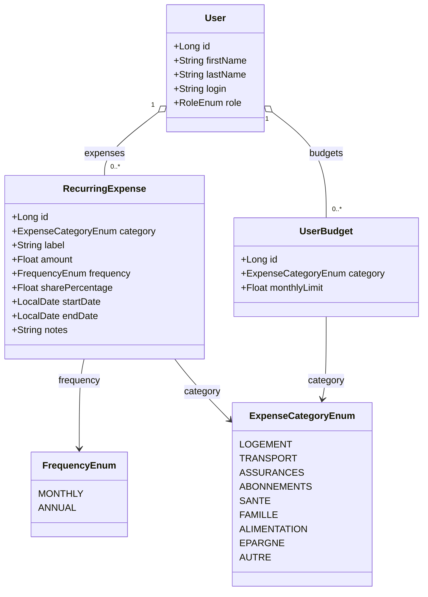
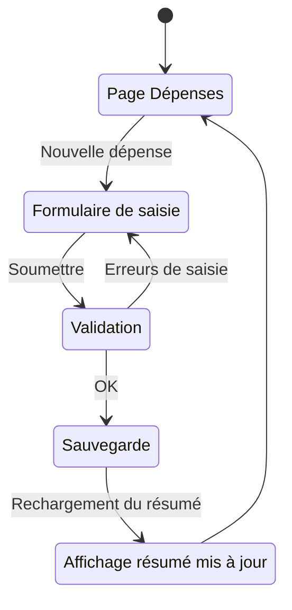

# Gestion des dépenses récurrentes

## Vue d'ensemble

La gestion des dépenses récurrentes permet à chaque utilisateur de saisir ses charges fixes ou périodiques afin de calculer sa **capacité d'épargne mensuelle**, définie comme :

```
Capacité d'épargne = Revenus nets mensuels − Total dépenses mensuelles projetées
```

Chaque dépense est saisie avec une **fréquence** (mensuelle ou annuelle). Le système effectue automatiquement la projection inverse :

| Fréquence saisie | Projection calculée |
|-----------------|---------------------|
| Mensuelle | × 12 → montant annuel projeté |
| Annuelle | ÷ 12 → montant mensuel projeté |

Dans le cadre d'une **colocation** ou d'une dépense partagée, l'utilisateur peut indiquer sa **part réelle** (en %) afin que seul son quote-part soit pris en compte dans le calcul. Exemple : loyer de 1 000 € partagé à 50 % → quote-part = 500 €/mois.

---

## 1. Catégories de dépenses

Les dépenses sont regroupées en huit catégories (`ExpenseCategoryEnum`) :

| Catégorie | Enum | Exemples typiques |
|-----------|------|-------------------|
| Logement | `LOGEMENT` | Loyer, remboursement prêt immobilier, charges de copropriété, assurance habitation, taxe foncière, électricité, gaz, eau, internet |
| Transport | `TRANSPORT` | Remboursement crédit auto / LOA / LLD, assurance véhicule, abonnement transports en commun, entretien véhicule |
| Assurances & Prévoyance | `ASSURANCES` | Mutuelle santé complémentaire, prévoyance / invalidité, assurance emprunteur |
| Abonnements & Numérique | `ABONNEMENTS` | Téléphone mobile, streaming vidéo (Netflix, Canal+…), streaming musique (Spotify…), cloud (iCloud, Google One…), presse numérique |
| Santé & Bien-être | `SANTE` | Salle de sport, activités sportives, soins réguliers non remboursés |
| Famille & Enfants | `FAMILLE` | Crèche, garde d'enfants, activités extra-scolaires, pension alimentaire, frais scolaires |
| Alimentation | `ALIMENTATION` | Courses alimentaires, abonnements de livraison de repas |
| Épargne programmée | `EPARGNE` | Virement automatique vers PEA / CTO, versement assurance-vie, versement livret (traité comme une charge sortante du courant) |
| Autre | `AUTRE` | Toute dépense récurrente non classifiable |

> **Choix de conception :** L'`EPARGNE` est volontairement une catégorie de dépense pour modéliser les virements automatiques vers les comptes d'investissement depuis le compte courant. Elle est distincte du module Patrimoine qui, lui, enregistre les positions et leur valorisation.

---

## 2. Modèle de données

### 2.1 Entité — `RecurringExpense`

| Champ | Type Java | Colonne SQLite | Description |
|-------|-----------|----------------|-------------|
| `id` | `Long` | `id` | Identifiant auto-incrémenté |
| `user` | `User` | `user_id` (FK) | Propriétaire de la dépense |
| `category` | `ExpenseCategoryEnum` | `category` | Catégorie (voir § 1) |
| `label` | `String` | `label` | Libellé libre (ex : "Loyer Paris") |
| `amount` | `Float` | `amount` | Montant brut saisi (en €) |
| `frequency` | `FrequencyEnum` | `frequency` | Fréquence de la dépense (`MONTHLY` / `ANNUAL`) |
| `sharePercentage` | `Float` | `share_percentage` | Part de l'utilisateur en % (défaut : 100.0). Utilisé pour la colocation |
| `startDate` | `LocalDate` | `start_date` | Date de début (nullable — si connue) |
| `endDate` | `LocalDate` | `end_date` | Date de fin (nullable = dépense en cours) |
| `notes` | `String` | `notes` | Notes libres (nullable) |

**Règle :** `sharePercentage` doit être compris entre 0.01 et 100.0.

### 2.2 Enums

```java
public enum FrequencyEnum {
    MONTHLY,   // Dépense mensuelle
    ANNUAL     // Dépense annuelle (ex : assurance, abonnement annuel)
}

public enum ExpenseCategoryEnum {
    LOGEMENT,
    TRANSPORT,
    ASSURANCES,
    ABONNEMENTS,
    SANTE,
    FAMILLE,
    ALIMENTATION,
    EPARGNE,
    AUTRE
}
```

### 2.3 Entité — `UserBudget`

Plafond mensuel défini par l'utilisateur pour une catégorie de dépense. Stocké en base et synchronisé entre tous ses appareils.

| Champ | Type Java | Colonne SQLite | Description |
|-------|-----------|----------------|-------------|
| `id` | `Long` | `id` | Identifiant auto-incrémenté |
| `user` | `User` | `user_id` (FK) | Propriétaire du budget |
| `category` | `ExpenseCategoryEnum` | `category` | Catégorie concernée |
| `monthlyLimit` | `Float` | `monthly_limit` | Plafond mensuel en € |

**Contrainte d'unicité :** `(user_id, category)` — un seul budget par catégorie et par utilisateur.

### 2.4 Diagramme de classes



---

## 3. Calculs de projection

Les montants projetés sont calculés à la volée dans le DTO (`RecurringExpenseDto`) et ne sont jamais persistés.

### 3.1 Formules de base

```
montantEffectif  = amount × (sharePercentage / 100)

si frequency = MONTHLY :
    monthlyAmount = montantEffectif
    annualAmount  = montantEffectif × 12

si frequency = ANNUAL :
    annualAmount  = montantEffectif
    monthlyAmount = montantEffectif / 12
```

### 3.2 Calcul de la capacité d'épargne

La capacité d'épargne est calculée dans un DTO de synthèse (`ExpenseSummaryDto`) qui agrège :

1. **Revenus nets mensuels** — issus du contrat salarial actif (`SalaryContract.endDate = null`) :
   - Source : `annualNetAfterTax / paidMonthsPerYear` (depuis `SalaryContractDto`)
   - Plus : revenus complémentaires mensualisés (`OtherIncome`)

2. **Total dépenses mensuelles projetées** — somme des `monthlyAmount` de toutes les dépenses actives (sans `endDate` ou dont `endDate` est dans le futur)

3. **Capacité d'épargne** :

```
capacitéÉpargne = revenuNetMensuel − totalDépensesMensuelles
```

> **Remarque :** Si l'utilisateur n'a pas de contrat salarial actif (ou si le profil fiscal est incomplet et que `netAfterTax` est `null`), la capacité d'épargne est affichée avec le `netImposable` comme revenu de référence, avec un avertissement.

### 3.3 Agrégation par catégorie

Le résumé expose aussi le total mensuel et annuel par catégorie, pour permettre une visualisation en graphique (camembert des charges ou barres empilées).

---

## 4. API REST

### 4.0 Dépenses récurrentes

Préfixe : `/api/recurring-expenses`  
Accès : Utilisateur authentifié (toutes ses propres dépenses uniquement)

| Méthode | URL | Description |
|---------|-----|-------------|
| `GET` | `/api/recurring-expenses` | Liste toutes les dépenses récurrentes de l'utilisateur connecté (avec `monthlyAmount` et `annualAmount` calculés) |
| `POST` | `/api/recurring-expenses` | Créer une dépense récurrente |
| `PUT` | `/api/recurring-expenses/{id}` | Modifier une dépense (ownership vérifié) |
| `DELETE` | `/api/recurring-expenses/{id}` | Supprimer une dépense (ownership vérifié) |
| `GET` | `/api/recurring-expenses/summary` | Résumé : total par catégorie + capacité d'épargne calculée |

### 4.0b Budgets par catégorie

Préfixe : `/api/expense-budgets`  
Accès : Utilisateur authentifié

| Méthode | URL | Description |
|---------|-----|-------------|
| `GET` | `/api/expense-budgets` | Retourne la map `{ catégorie → plafond mensuel }` de l'utilisateur |
| `PUT` | `/api/expense-budgets` | Remplace intégralement les budgets de l'utilisateur (delete-then-saveAll) |

Réponse (GET et PUT) :
```json
{ "LOGEMENT": 900.0, "TRANSPORT": 200.0, "ABONNEMENTS": 80.0 }
```

Requête PUT :
```json
{ "budgets": { "LOGEMENT": 900.0, "TRANSPORT": 200.0 } }
```

> Envoyer une map vide (`{}`) supprime tous les budgets de l'utilisateur. Les catégories absentes de la map sont traitées comme "sans budget".

### 4.1 Requête de création / modification

```json
{
  "category": "LOGEMENT",
  "label": "Loyer Paris 11e",
  "amount": 1000.00,
  "frequency": "MONTHLY",
  "sharePercentage": 50.0,
  "startDate": "2024-01-01",
  "endDate": null,
  "notes": "Colocation avec Thomas"
}
```

### 4.2 Réponse — `RecurringExpenseDto`

```json
{
  "id": 1,
  "category": "LOGEMENT",
  "label": "Loyer Paris 11e",
  "amount": 1000.00,
  "frequency": "MONTHLY",
  "sharePercentage": 50.0,
  "monthlyAmount": 500.00,
  "annualAmount": 6000.00,
  "startDate": "2024-01-01",
  "endDate": null,
  "notes": "Colocation avec Thomas"
}
```

### 4.3 Réponse — `ExpenseSummaryDto`

```json
{
  "monthlyNetIncome": 3200.00,
  "incomeSource": "NET_AFTER_TAX",
  "totalMonthlyExpenses": 1850.00,
  "totalAnnualExpenses": 22200.00,
  "savingsCapacity": 1350.00,
  "savingsRate": 42.19,
  "byCategory": [
    { "category": "LOGEMENT",    "monthlyAmount": 800.00,  "annualAmount": 9600.00  },
    { "category": "TRANSPORT",   "monthlyAmount": 350.00,  "annualAmount": 4200.00  },
    { "category": "ABONNEMENTS", "monthlyAmount": 150.00,  "annualAmount": 1800.00  },
    { "category": "ASSURANCES",  "monthlyAmount": 100.00,  "annualAmount": 1200.00  },
    { "category": "SANTE",       "monthlyAmount": 50.00,   "annualAmount":  600.00  },
    { "category": "EPARGNE",     "monthlyAmount": 400.00,  "annualAmount": 4800.00  }
  ]
}
```

Champs de `ExpenseSummaryDto` :

| Champ | Description |
|-------|-------------|
| `monthlyNetIncome` | Revenu net mensuel de référence (net d'impôt si disponible, net imposable sinon) |
| `incomeSource` | Source utilisée : `NET_AFTER_TAX` ou `NET_IMPOSABLE` (avertissement frontend si fallback) |
| `totalMonthlyExpenses` | Somme des `monthlyAmount` de toutes les dépenses actives |
| `totalAnnualExpenses` | Projection annuelle totale |
| `savingsCapacity` | `monthlyNetIncome − totalMonthlyExpenses` |
| `savingsRate` | `savingsCapacity / monthlyNetIncome × 100` (en %) |
| `byCategory` | Tableau agrégé par catégorie |

---

## 5. Architecture backend

Suit les mêmes conventions que les autres modules :

```
com.myfinance
├── domain/
│   ├── RecurringExpense.java       (@Entity)
│   ├── UserBudget.java             (@Entity, UNIQUE user_id+category)
│   └── ExpenseCategoryEnum.java
│   └── FrequencyEnum.java
├── repository/
│   ├── RecurringExpenseRepository.java
│   └── UserBudgetRepository.java          (findByUser, deleteByUser)
├── service/
│   ├── RecurringExpenseService.java
│   └── UserBudgetService.java             (getBudgets, upsertAll @Transactional)
├── controller/
│   ├── RecurringExpenseController.java
│   └── UserBudgetController.java
└── dto/
    ├── RecurringExpenseDto.java           (record)
    ├── ExpenseSummaryDto.java             (record)
    ├── ExpenseCategorySummaryDto.java     (record)
    ├── CreateRecurringExpenseRequest.java (record)
    ├── UpdateRecurringExpenseRequest.java (record)
    └── UpsertUserBudgetsRequest.java      (record — Map<ExpenseCategoryEnum, Float>)
```

`RecurringExpenseService` injecte :
- `RecurringExpenseRepository`
- `SalaryContractRepository` (ou `SalaryContractService`) → pour lire le revenu net du contrat actif
- `OtherIncomeRepository` → pour agréger les revenus complémentaires dans la synthèse

---

## 6. Architecture frontend

```
frontend/src/
├── api/
│   └── expenses.js                         # Appels API /api/recurring-expenses + /api/expense-budgets
└── components/
    └── expenses/
        ├── RecurringExpensePage.jsx         # Page principale (liste + résumé + éditeur de budgets)
        └── RecurringExpenseForm.jsx         # Modal création / édition
```

### 6.1 Navigation

Ajout d'un menu dédié **Dépenses** dans `Navigation.jsx`, au même niveau que Patrimoine et Revenus (bouton simple, sans dropdown dans un premier temps).

```
Dashboard | Patrimoine | Revenus ▾ | Dépenses | Outils ▾ | [ADMIN] | Mon profil | Déconnexion
```

### 6.2 Page principale — `RecurringExpensePage`

La page se compose de trois zones :

1. **Résumé capacité d'épargne** — en haut de page, 4 KPIs :
   - Revenus nets mensuels (avec tooltip de décomposition)
   - Total dépenses / mois
   - Capacité d'épargne (vert si ≥ 0, rouge sinon)
   - Taux d'épargne (vert ≥ 30 %, orange ≥ 10 %, rouge sinon)

2. **Répartition par catégorie** — barres horizontales avec **seuils de budget** :
   - Bouton **⚙ Budgets** : ouvre un éditeur inline pour définir un plafond mensuel par catégorie
   - Barres colorées selon le ratio dépenses réelles / plafond : vert (< 75 %), orange (75–100 %), rouge (> 100 %)
   - Les budgets sont persistés en base via `GET/PUT /api/expense-budgets` et synchronisés entre appareils
   - Mise à jour en temps réel lors de la saisie ; envoi explicite via le bouton **"Sauvegarder les budgets"**

3. **Liste des dépenses** — groupée par catégorie :
   - Affichage : libellé, montant saisi + fréquence, quote-part (si < 100 %), montant mensuel et annuel projeté
   - En-tête de catégorie : badge "⚠ Plafond dépassé" si budget défini et dépassé
   - Actions : modifier / supprimer

### 6.3 Formulaire — `RecurringExpenseForm`

Modal avec les champs :
- Catégorie (select avec les 8 catégories)
- Libellé (texte libre)
- Montant (numérique)
- Fréquence (toggle Mensuel / Annuel)
- Part (%) — champ conditionnel, affiché avec un indicateur "Mode colocation" et un aperçu du montant effectif
- Date de début (optionnel)
- Date de fin (optionnel — laisser vide = en cours)
- Notes (optionnel)

---

## 7. Flux de saisie



---

## 8. Règles métier

1. **Ownership strict** : un utilisateur ne peut voir, modifier ou supprimer que ses propres dépenses. Le service vérifie `expense.user.id == currentUser.id` et lève une `ResponseStatusException(403)` sinon.
2. **Dépense active** : une dépense est considérée active si `endDate == null` ou `endDate >= today`. Seules les dépenses actives sont prises en compte dans le résumé.
3. **Quote-part** : `sharePercentage` doit être dans `]0 ; 100]`. Une valeur de 100 % est équivalente à une dépense sans répartition.
4. **Absence de contrat salarial actif** : le calcul de la capacité d'épargne reste disponible mais affiche un avertissement ("Aucun revenu salarial actif — revenus = 0 €").
5. **Revenus complémentaires** : inclus dans le revenu mensuel de référence au prorata de leur fréquence (les `OtherIncome` annuels sont divisés par 12).

---

## 9. Tests unitaires

Suivent les conventions du projet :

| Classe de test | Contenu |
|----------------|---------|
| `RecurringExpenseServiceTest` | CRUD, calcul de projection, capacité d'épargne, vérification ownership, fallback `NET_IMPOSABLE` |
| `RecurringExpenseControllerTest` | Tous les endpoints, authentification, validation des DTOs |
| `UserBudgetServiceTest` | `getBudgets`, `upsertAll` (nominal, map vide, valeurs ≤ 0 ignorées) |
| `UserBudgetControllerTest` | GET/PUT 200, 401 sans auth, 400 corps invalide |

---

## 10. Évolutions futures envisagées

| Évolution | Description |
|-----------|-------------|
| **Graphique d'évolution** | Historisation mensuelle des dépenses pour visualiser leur évolution dans le tableau de bord |
| **Import automatique** | Import depuis un relevé bancaire (CSV/OFX) pour détecter les dépenses récurrentes |
| **Regroupements familiaux** | Partager une dépense entre plusieurs membres d'un groupe (future feature `FamilyGroup`) |
| **Catégories personnalisées** | Permettre à l'utilisateur de créer ses propres catégories |
