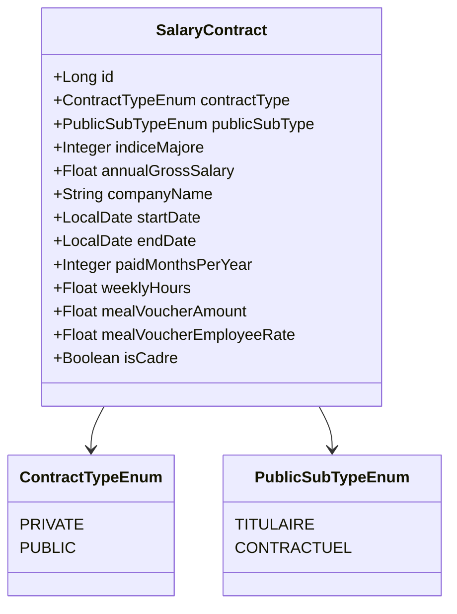

# Contrats fonction publique — Architecture

Extension de la gestion des contrats salariaux ([`salary.md`](salary.md)) pour permettre la saisie de contrats de **fonction publique** (titulaire ou contractuel) en complément des contrats du privé déjà gérés.

> **Statut :** implémenté (V1). Révisions salariales incluses (indice majoré).

---

## 1. Vue d'ensemble

En France, deux grandes catégories de contrats coexistent :

| Catégorie | Caractéristique principale |
|-----------|---------------------------|
| **Entreprise privée** | Salaire défini en brut annuel, cotisations régime général |
| **Fonction publique** | Salaire dérivé d'un **indice majoré** × valeur du point ; cotisations spécifiques (CNRACL, RAFP…) |

L'objectif est d'ajouter le support du second type sans casser l'existant.

---

## 2. Décisions de conception (validées)

| # | Question | Choix retenu |
|---|----------|--------------|
| A | Indice à saisir | **Indice Majoré** uniquement (l'IB n'est qu'un identifiant de grade, l'IM seul sert au calcul) |
| B | Cotisations sociales | **Section dédiée** `cotisations-public` dans `tax-parameters.yml` avec les vrais taux (titulaire et contractuel) |
| C | SFT, indemnité de résidence | **Hors scope V1** — l'utilisateur peut les saisir comme `ContractBonus ANNUELLE` en attendant |
| D | "Part salarié" | Désigne bien la part salarié des tickets resto → réutilise `mealVoucherEmployeeRate` existant |
| E | Heures sup IHTS | **Hors scope V1** (cohérent avec le privé qui n'a pas non plus de modélisation heures sup) |
| F | Migration des contrats existants | **Migration douce** (cf. § 9) |
| 2 | Référentiel valeur du point | Configuration YAML **avec historique** des revalorisations |
| G | Super brut pour PUBLIC | Non calculé (`monthlySuperGross = null`) — concept peu pertinent pour titulaire |
| H | `isCadre` pour PUBLIC | Forcé à `false`, masqué dans le formulaire — notion strictement privée |
| I | `paidMonthsPerYear` pour PUBLIC | Fixé à `12` et non modifiable — primes annuelles passent par `ContractBonus` |

---

## 3. Modèle de données

### 3.1 Évolution de `SalaryContract`

Deux nouveaux champs ajoutés sur l'entité existante :

| Champ Java | Colonne SQLite | Type | Nullable | Description |
|------------|----------------|------|----------|-------------|
| `contractType` | `contract_type` | `ContractTypeEnum` | ✓ (transition) | `PRIVATE` ou `PUBLIC`. Nullable temporairement pour la migration douce — traité comme `PRIVATE` si null. |
| `indiceMajore` | `indice_majore` | `Integer` | ✓ | Indice majoré (uniquement pour `PUBLIC`). Null pour `PRIVATE`. |
| `publicSubType` | `public_sub_type` | `PublicSubTypeEnum` | ✓ | `TITULAIRE` ou `CONTRACTUEL` (uniquement pour `PUBLIC`). Détermine le jeu de cotisations à appliquer. |

Le champ existant `annualGrossSalary` :
- Reste **requis** pour `PRIVATE` (saisi par l'utilisateur)
- Devient **calculé** pour `PUBLIC` : `annualGrossSalary = indiceMajore × valeurAnnuellePoint(referenceDate)`
- L'utilisateur ne le saisit pas pour `PUBLIC` — il est dérivé à la lecture

> **Choix de conception :** on garde `annualGrossSalary` comme valeur effective pour ne pas dupliquer les calculs en aval (projections, simulateur d'impôts, bilan…). Pour `PUBLIC`, il est recalculé à chaque lecture depuis `indiceMajore` et la valeur du point en vigueur.

### 3.2 Nouveaux enums

```java
public enum ContractTypeEnum {
    PRIVATE,
    PUBLIC
}

public enum PublicSubTypeEnum {
    TITULAIRE,
    CONTRACTUEL
}
```

### 3.3 Diagramme de classes



---

## 4. Calcul du brut depuis l'indice

### 4.1 Formule officielle

```
traitement_brut_annuel = indice_majoré × valeur_annuelle_du_point(date)
```

La **valeur du point** évolue dans le temps (revalorisations gouvernementales). On utilise la valeur en vigueur à une date de référence.

### 4.2 Date de référence pour le calcul

Pour les **projections** d'un contrat `PUBLIC` actif :
1. Si une `SalaryRevision` est active → utiliser la valeur du point à la `effectiveDate` de la révision
2. Sinon → utiliser la valeur du point à la `startDate` du contrat

Pour les **bulletins de paie réels** : non concerné, le bulletin contient déjà le brut effectivement versé.

### 4.3 Exemple

```
indice_majoré = 421
valeur_point_annuelle (1er juillet 2023) = 59,0734 €
→ traitement_brut_annuel = 421 × 59,0734 = 24 869,90 €
```

---

## 5. Configuration YAML

### 5.1 Valeur du point — historique

Stockée dans `tax-parameters.yml` (fichier déjà existant). Historique complet depuis 2002 — à compléter à chaque revalorisation gouvernementale.

**Source officielle** : https://www.fonction-publique.gouv.fr/etre-agent-public/ma-remuneration/connaitre-le-point-dindice

```yaml
fonction-publique:
  point-indice:
    # Triées par date croissante pour faciliter la lecture
    # (l'algorithme de lookup ne dépend pas de l'ordre)
    history:
      - effective-date: 2002-01-01
        annual-value: 51.8175
      - effective-date: 2002-03-01
        annual-value: 52.1284
      - effective-date: 2002-12-01
        annual-value: 52.4933
      - effective-date: 2004-01-01
        annual-value: 52.7558
      - effective-date: 2005-02-01
        annual-value: 53.0196
      - effective-date: 2005-07-01
        annual-value: 53.2847
      - effective-date: 2005-11-01
        annual-value: 53.7110
      - effective-date: 2006-07-01
        annual-value: 53.9795
      - effective-date: 2007-02-01
        annual-value: 54.4113
      - effective-date: 2008-03-01
        annual-value: 54.6834
      - effective-date: 2008-10-01
        annual-value: 54.8475
      - effective-date: 2009-07-01
        annual-value: 55.1217
      - effective-date: 2009-10-01
        annual-value: 55.2871
      - effective-date: 2010-07-01
        annual-value: 55.5635
      - effective-date: 2016-07-01
        annual-value: 55.8969
      - effective-date: 2017-02-01
        annual-value: 56.2323
      - effective-date: 2022-07-01
        annual-value: 58.2004
      - effective-date: 2023-07-01
        annual-value: 59.0734
      # À compléter à chaque revalorisation publiée
```

**Algorithme de lookup** : pour une date donnée, retourner la valeur dont `effective-date` est la plus grande tout en restant ≤ date demandée. Si la date demandée est antérieure à toutes les entrées (ex. avant 2002-01-01), retourner `null` ou la plus ancienne entrée selon le besoin métier — choix d'implémentation V1 : utiliser la plus ancienne (51,8175 €).

### 5.2 Cotisations sociales spécifiques fonction publique

Section `cotisations-public` ajoutée dans `tax-parameters.yml`. Valeurs renseignées avec un niveau de confiance variable — **à vérifier annuellement** car les taux évoluent.

> **Sources officielles** :
> - CSG / CRDS : https://www.urssaf.fr/portail/home/taux-et-baremes/taux-de-cotisations.html
> - Pension civile : https://www.cnracl.retraites.fr/employeur/cotisations-fonctionnaires
> - DGAFP : https://www.fonction-publique.gouv.fr/etre-agent-public/ma-remuneration

```yaml
cotisations-public:

  # ── TITULAIRE (fonctionnaire stagiaire ou titulaire) ─────────────
  titulaire:
    # Retraite — assise sur le traitement indiciaire brut (TIB)
    pension-civile: 0.1110         # 🟡 11,10 % depuis 2020 (était 10,10 % en 2017, montée progressive)
    rafp: 0.0500                   # 🟢 5 % — assise UNIQUEMENT sur les primes, plafonné à 20 % du TIB
                                   #         → impact ~0 sur traitement indiciaire seul (V1 : peut être ignoré)

    # Contribution exceptionnelle de solidarité (CES) — SUPPRIMÉE le 1er janvier 2018
    contribution-solidarite: 0.0000  # 🟢 0 % depuis 2018 (taux de 1 % aboli par la loi de finances 2018)

    # CSG / CRDS — assises sur 98,25 % du brut (abattement forfaitaire pour frais professionnels)
    # En V1, on applique directement les taux finaux (taux nominal × 0,9825)
    # Au-delà de 4 PASS annuels (~185 472 € en 2024), pas d'abattement — non géré en V1
    csg-deductible: 0.0668         # 🟢 6,80 % × 0,9825 = 6,68 % effectif
    csg-non-deductible: 0.0236     # 🟢 2,40 % × 0,9825 = 2,36 % effectif
    crds: 0.0049                   # 🟢 0,50 % × 0,9825 = 0,49 % effectif

    # Pas de cotisation chômage (titulaires non assurés)
    # Pas de cotisation maladie salariale (couverte par l'État employeur)
    # Pas de cotisation retraite complémentaire (la pension civile inclut le complément)

    # ── Total approximatif salarié titulaire : ~20,63 % du TIB ─────

  # ── CONTRACTUEL (CDD / CDI de droit public) ──────────────────────
  # Régime général de Sécurité sociale — taux quasi identiques au privé
  # Différence majeure : retraite complémentaire = IRCANTEC (au lieu d'Agirc-Arrco)
  contractuel:
    # ⚠ Pour V1 simple : reprendre les taux du privé.
    # Le bloc inherits ci-dessous est une convention documentaire ; côté code,
    # `PublicCotisationsProperties.contractuel` retournera les mêmes valeurs que `cotisations-private`
    # par défaut (pas d'override).
    inherits: cotisations-private

    # ── Si besoin d'override (V2) — structure miroir : ─────────────
    # securite-sociale-vieillesse-plafonnee: 0.069     # 6,90 % sur tranche 1 du PASS
    # securite-sociale-vieillesse-deplafonnee: 0.004   # 0,40 %
    # ircantec-tranche-a: 0.0280                       # 2,80 % sur tranche ≤ 1 PASS
    # ircantec-tranche-b: 0.0695                       # 6,95 % sur tranche > 1 PASS
    # csg-deductible: 0.0668                           # 6,68 % effectif
    # csg-non-deductible: 0.0236                       # 2,36 % effectif
    # crds: 0.0049                                     # 0,49 % effectif
    # chomage: 0.000                                   # 0 % côté salarié depuis 2018

    # ── Total approximatif salarié contractuel : ~22 % du brut ─────
```

> **Notes importantes** :
>
> 1. **RAFP négligeable en V1** : la cotisation RAFP (5 %) ne s'applique qu'aux primes, pas au traitement indiciaire. Pour un calcul V1 sur la base du TIB seul, on peut la mettre à `0` sans erreur significative.
> 2. **Abattement forfaitaire CSG** : les taux nominaux sont 6,80 / 2,40 / 0,50 mais l'assiette est de 98,25 % du brut. J'ai appliqué la multiplication `taux × 0,9825` directement pour simplifier le code. Au-delà de 4 PASS annuels (~185 k€), l'abattement disparaît — non géré en V1, impact négligeable pour la majorité des contrats.
> 3. **À vérifier avant chaque déploiement** : la pension civile (peut bouger de 0,1 pt par an) et les seuils PASS si l'app évolue vers une gestion fine des plafonds.
>
> Précision V1 visée : ±0,5 %, cohérent avec la précision globale du calcul fiscal de l'app.

### 5.3 Lecture côté Java

Nouvelle classe `@ConfigurationProperties("fonction-publique")` exposant :
- `List<PointValueEntry>` (avec `effectiveDate`, `annualValue`)
- Méthode `getValueAt(LocalDate date) : double`

Nouvelle section dans la classe `TaxParameters` existante (ou nouvelle `PublicTaxParameters`) pour les cotisations.

---

## 6. API REST

### 6.1 Endpoints — pas de nouveau

Les endpoints existants `/api/salary-contracts` sont conservés. Le DTO de création/modification accepte les nouveaux champs.

### 6.2 `CreateSalaryContractRequest`

```java
public record CreateSalaryContractRequest(
    ContractTypeEnum contractType,        // ✓ requis
    PublicSubTypeEnum publicSubType,      // requis si PUBLIC
    String companyName,
    LocalDate startDate,
    LocalDate endDate,
    Integer indiceMajore,                 // requis si PUBLIC
    Float annualGrossSalary,              // requis si PRIVATE, ignoré si PUBLIC
    Integer paidMonthsPerYear,
    Float weeklyHours,
    Float mealVoucherAmount,
    Float mealVoucherEmployeeRate,
    Boolean isCadre,
    Float employeePrevoyanceRate
) {}
```

Validation côté `SalaryContractService` :
```java
if (request.contractType() == PUBLIC) {
    requireNonNull(request.indiceMajore());
    requireNonNull(request.publicSubType());
    // annualGrossSalary ignoré
} else {
    requireNonNull(request.annualGrossSalary());
}
```

### 6.3 `SalaryContractDto` (réponse)

Ajout des champs :
- `ContractTypeEnum contractType`
- `PublicSubTypeEnum publicSubType`
- `Integer indiceMajore`
- `Float pointValueAnnualUsed` — la valeur du point utilisée pour le calcul (transparence)

Le calcul `annualGrossSalary` reste exposé : pour `PUBLIC`, il est recalculé via `indiceMajore × pointValue`.

---

## 7. Architecture frontend

### 7.1 Form en 2 steps

```
frontend/src/components/income/
├── SalaryContractForm.jsx          # Wrapper 2-step (réécrit)
├── SalaryContractTypeStep.jsx      # NEW — Step 1 : choix PRIVATE / PUBLIC
├── SalaryContractFormPrivate.jsx   # Step 2 PRIVATE (form actuel renommé)
└── SalaryContractFormPublic.jsx    # NEW — Step 2 PUBLIC
```

### 7.2 Step 1 — Choix du type

Deux radio cards visuelles côte à côte (icône + titre + description courte) :
- 🏢 **Entreprise privée** — Salaire en brut annuel, régime général
- 🏛️ **Fonction publique** — Indice majoré, régime CNRACL ou général selon statut

### 7.3 Step 2 PUBLIC — champs

Selon la spec utilisateur :

| Champ | Composant | Validation |
|-------|-----------|------------|
| Sous-type | Select `TITULAIRE` / `CONTRACTUEL` | Requis |
| Nom de l'entreprise (administration) | Input texte | Requis |
| Date de début | Date | Requis |
| Date de fin | Date | Optionnel |
| Indice majoré | Number | Requis, > 200 (sécurité) |
| Heures / semaine | Number step 0.5 | Requis, 1-60 |
| Valeur du ticket restaurant | Number step 0.01 | Optionnel |
| Part salarié (TR) | Number 0-100 | Optionnel |

**Aide visuelle** : sous le champ "Indice majoré", afficher en temps réel le brut annuel calculé :
```
Brut annuel calculé : 24 502 € (421 × 58,2004 € — valeur du point au 01/07/2023)
```

### 7.4 Édition d'un contrat existant

Le step 1 est **sauté** : on charge directement le step 2 correspondant au `contractType` du contrat. L'utilisateur ne peut pas changer le type d'un contrat existant (les implications fiscales sont trop différentes).

---

## 8. Calcul du net imposable pour PUBLIC

`SalaryContractDto.computeNetImposable()` est aiguillé selon `contractType` :

```java
if (contractType == PRIVATE) {
    // Logique actuelle inchangée
    netImposable = brut × (1 - tauxCotisationsPrivate);
} else {
    PublicCotisationRates rates = (publicSubType == TITULAIRE)
        ? params.getCotisationsPublic().getTitulaire()
        : params.getCotisationsPublic().getContractuel();
    netImposable = brut × (1 - rates.totalEmployee());
}
```

Le `TaxSimulatorService` (calcul de l'impôt à partir du net imposable) **ne change pas** — il prend du net imposable en entrée, peu importe son origine.

---

## 9. Migration douce — détail

Tu m'as demandé de détailler ce point. Voici la stratégie en trois phases pour ne casser aucun contrat existant et permettre une bascule progressive sans script SQL critique au déploiement.

### Phase 1 — Livraison V1 (déploiement initial)

**Objectif** : ajouter les nouvelles colonnes sans rendre l'app incompatible avec les données existantes.

1. Ajout des colonnes `contract_type`, `indice_majore`, `public_sub_type` **toutes nullables** sur la table `salary_contracts`.
2. Hibernate en `ddl-auto: update` exécute le `ALTER TABLE ADD COLUMN` automatiquement au démarrage.
3. Les contrats existants ont `contract_type = NULL` après la migration de schéma.
4. **Côté code** : un défaut implicite est appliqué :
   ```java
   public ContractTypeEnum getContractTypeOrDefault() {
       return contractType != null ? contractType : ContractTypeEnum.PRIVATE;
   }
   ```
   Tous les calculs et DTOs utilisent ce getter au lieu de `getContractType()` directement.
5. **Création de nouveaux contrats** : le DTO de création requiert `contractType` non null (validation Bean Validation `@NotNull`). Un nouveau contrat ne peut donc plus être créé sans type explicite.

→ **Résultat** : zéro régression sur les contrats existants, zéro script SQL nécessaire au déploiement, les nouveaux contrats sont déjà bien typés.

### Phase 2 — Backfill (qq jours / semaines après V1)

**Objectif** : aligner les contrats historiques sur la nouvelle structure.

Le script de backfill est livré dans le dossier `backend/migrations/` (convention existante du projet : fichiers numérotés `NNN_description.sql`).

**Fichier dédié** : `backend/migrations/006_backfill_contract_type_public_sector.sql`

```sql
-- Migration 006 — Backfill du champ contract_type pour la fonctionnalité
-- "Contrats fonction publique" (cf. docs/architecture/salary-public-sector.md)
--
-- Date de création   : <à dater à la livraison V1>
-- Date d'exécution   : à exécuter en Phase 2, quelques jours après le déploiement
--                      de la V1 et après vérification que tous les contrats existants
--                      sont bien des contrats du privé.
-- Idempotent         : oui (la clause WHERE protège contre une réexécution)
-- Bloquant           : non (transaction courte, pas de verrou long)
--
-- Vérification préalable (à exécuter avant le UPDATE) :
--   SELECT id, label, contract_type FROM salary_contracts WHERE contract_type IS NULL;
--   → revue manuelle pour confirmer que ce sont bien tous des contrats privés
--
-- Exécution :
UPDATE salary_contracts
SET contract_type = 'PRIVATE'
WHERE contract_type IS NULL;

-- Vérification post-exécution :
--   SELECT COUNT(*) FROM salary_contracts WHERE contract_type IS NULL;
--   → doit retourner 0
```

**Procédure d'exécution** (depuis le NAS QNAP en prod) :
```bash
# 1. Backup préventif
cp /share/Public/myfinance/myfinance.db /share/Public/myfinance/myfinance.backup.YYYY-MM-DD.db

# 2. Exécution du script
sqlite3 /share/Public/myfinance/myfinance.db < backend/migrations/006_backfill_contract_type_public_sector.sql

# 3. Vérification
sqlite3 /share/Public/myfinance/myfinance.db "SELECT COUNT(*) FROM salary_contracts WHERE contract_type IS NULL;"
# → doit afficher 0
```

→ Ce script est **idempotent** (rejouable sans danger grâce à `WHERE contract_type IS NULL`) et **non bloquant** (transaction courte sur une table de petite taille).

### Phase 3 — Cleanup (release suivante)

**Objectif** : retirer le code temporaire de fallback maintenant que toutes les lignes ont une valeur.

1. Ajout de l'annotation `@Column(nullable = false)` sur `contractType` dans l'entité Java.
2. Ajout d'une CHECK constraint SQLite : `contract_type IN ('PRIVATE', 'PUBLIC')`.
3. Suppression de la méthode `getContractTypeOrDefault()` — remplacement par `getContractType()` direct partout.
4. Documentation mise à jour (`salary.md`, `CLAUDE.md`) en retirant les mentions "transition".

→ À ce stade, le système est dans son état cible. Les autres champs (`indice_majore`, `public_sub_type`) restent nullables car ils sont optionnels par nature (uniquement pertinents pour PUBLIC).

### Pourquoi cette approche plutôt qu'une migration brutale ?

| Approche brutale | Migration douce |
|------------------|-----------------|
| Forcer `NOT NULL` dès la V1 nécessite un UPDATE avant le démarrage de Spring Boot | Aucun script bloquant au déploiement |
| Rollback compliqué si bug détecté après deploy | Rollback trivial : code Java compatible avec colonnes vides |
| Couplage fort entre code et données | Découplage : les phases sont indépendantes |
| Risque sur SQLite (ALTER TABLE limité) | ALTER TABLE ADD COLUMN nullable = supporté nativement |

---

## 10. Plan d'implémentation

Une fois cette spec validée, livraison en 7 étapes :

| Étape | Backend | Frontend |
|-------|---------|----------|
| 1. Modèle | Enums (`ContractTypeEnum`, `PublicSubTypeEnum`), champs entité (`contractType`, `indiceMajore`, `publicSubType` tous nullables), getter `getContractTypeOrDefault()` | — |
| 2. Configuration | Lecture YAML : `PointValueProperties` (historique avec lookup par date) et `PublicCotisationsProperties` (titulaire + contractuel) | — |
| 3. Calcul | `PointValueService.getValueAt(date)`, intégration dans `SalaryContractDto` : aiguillage `PRIVATE` / `PUBLIC` pour le calcul du net imposable, `monthlySuperGross = null` pour PUBLIC, `paidMonthsPerYear = 12` forcé pour PUBLIC | — |
| 4. API | Validation conditionnelle dans `CreateSalaryContractRequest` (indiceMajore requis si PUBLIC, annualGrossSalary requis si PRIVATE), exposition des champs dans le DTO de réponse | Mise à jour `income.js` |
| 5. UI | — | Form 2-step (`SalaryContractTypeStep` + 2 sous-formulaires), aperçu temps réel du brut calculé sous le champ indice, masquage de `isCadre` et de `paidMonthsPerYear` pour PUBLIC |
| 6. Migration | Création de `backend/migrations/006_backfill_contract_type_public_sector.sql` (à exécuter en Phase 2 après V1) | — |
| 7. Tests + Doc | Tests : `PointValueServiceTest`, mise à jour `SalaryContractServiceTest`, `SalaryContractControllerTest`. Doc : mise à jour `salary.md`, `CLAUDE.md` (endpoints inchangés mais champs DTO enrichis), `overview.md` | — |

**Couverture de tests visée** : taux JaCoCo actuel maintenu (70 % lignes, 60 % branches). Cibles spécifiques pour cette feature : 100 % de couverture sur `PointValueService` et la branche PUBLIC du calcul `SalaryContractDto`.

Couverture de tests visée : taux JaCoCo actuel maintenu (70 % lignes, 60 % branches).

---

## 11. Évolutions futures envisagées

| Évolution | Description |
|-----------|-------------|
| **SFT** | Saisie du nombre d'enfants → calcul automatique du Supplément Familial de Traitement |
| **Indemnité de résidence** | Champ "zone géographique" (0%, 1%, 3%) → ajout au brut |
| **Heures sup IHTS** | Modélisation des heures supplémentaires défiscalisées |
| **Grille indiciaire** | Reférentiel des grades / échelons → suggestion d'IM en fonction du grade saisi |
| **Revalorisations automatiques** | Notification utilisateur quand une nouvelle valeur du point est publiée et impacte ses contrats |
