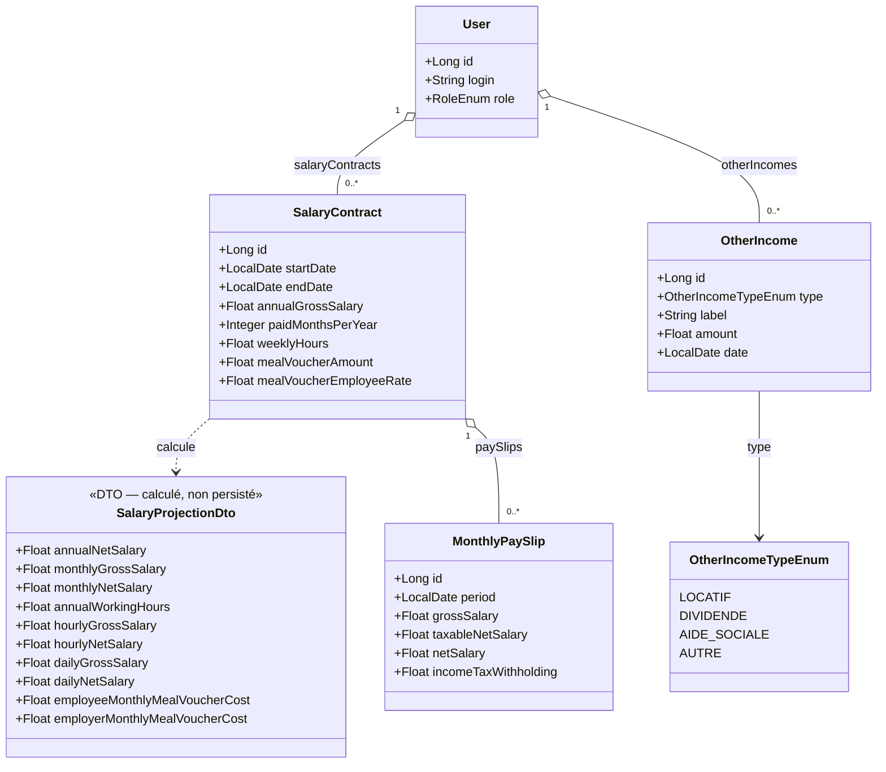

# Gestion des revenus

## Vue d'ensemble

La gestion des revenus repose sur **trois niveaux complémentaires** :

| Niveau | Entité | Objectif |
|--------|--------|----------|
| Vue théorique | `SalaryContract` | Projections à partir du contrat (brut annuel, tickets resto…) |
| Réel mensuel | `MonthlyPaySlip` | Bulletins de salaire saisis mois par mois |
| Revenus complémentaires | `OtherIncome` | Tout revenu hors salaire (locatif, dividendes, aides…) |

La **vue théorique** (`SalaryProjectionDto`) et les **bulletins réels** (`MonthlyPaySlip`) sont affichables côte à côte pour permettre à l'utilisateur de mesurer l'écart entre les projections et la réalité (primes, avantages en nature, variation de salaire).

---

## 1. Contrat salarial — `SalaryContract`

### Objectif

Stocker les informations contractuelles pour générer des **estimations** annuelles, mensuelles, journalières et horaires. Ces données constituent la **vision théorique** du revenu.

### Modèle persisté

| Champ | Type | Description |
|-------|------|-------------|
| `id` | `Long` | Identifiant |
| `startDate` | `LocalDate` | Date de début du contrat |
| `endDate` | `LocalDate` | Date de fin — `null` = contrat en cours |
| `annualGrossSalary` | `Float` | Salaire brut annuel (en €) |
| `paidMonthsPerYear` | `Integer` | Nombre de mois de paie (12 ou 13) |
| `weeklyHours` | `Float` | Heures travaillées par semaine |
| `mealVoucherAmount` | `Float` | Valeur faciale d'un ticket restaurant (en €) |
| `mealVoucherEmployeeRate` | `Float` | Part salarié du ticket restaurant (en %, ex : 50.0) |

**Règle** : un seul contrat peut avoir `endDate = null` par utilisateur (contrat actif).

### Projections calculées — `SalaryProjectionDto` (non persisté)

| Champ | Formule |
|-------|---------|
| `annualNetSalary` | `annualGrossSalary × 0,75` |
| `monthlyGrossSalary` | `annualGrossSalary ÷ paidMonthsPerYear` |
| `monthlyNetSalary` | `annualNetSalary ÷ paidMonthsPerYear` |
| `annualWorkingHours` | `weeklyHours × (228 ÷ 5)` |
| `hourlyGrossSalary` | `annualGrossSalary ÷ annualWorkingHours` |
| `hourlyNetSalary` | `annualNetSalary ÷ annualWorkingHours` |
| `dailyGrossSalary` | `annualGrossSalary ÷ 228` |
| `dailyNetSalary` | `annualNetSalary ÷ 228` |
| `employeeMonthlyMealVoucherCost` | `mealVoucherAmount × (employeeRate ÷ 100) × 19` |
| `employerMonthlyMealVoucherCost` | `mealVoucherAmount × ((100 − employeeRate) ÷ 100) × 19` |

### Constantes utilisées

| Constante | Valeur | Justification |
|-----------|--------|---------------|
| Ratio brut → net | `0,75` | Estimation forfaitaire des cotisations salariales françaises |
| Jours travaillés / an | `228` | Convention standard (tooltip explicatif prévu dans l'IHM) |
| Jours travaillés / mois | `19` | 228 ÷ 12, arrondi |
| Jours / semaine ouvrée | `5` | |

---

## 2. Bulletins de salaire mensuels — `MonthlyPaySlip`

### Objectif

Permettre la saisie des **données réelles** mois par mois, issues du bulletin de salaire. En combinant cette vue avec `SalaryProjectionDto`, l'utilisateur peut visualiser les écarts (prime, avantages en nature, variation de cotisations).

### Modèle persisté

| Champ | Type | Description |
|-------|------|-------------|
| `id` | `Long` | Identifiant |
| `period` | `LocalDate` | Mois concerné (ex : 2025-03-01 pour mars 2025) |
| `grossSalary` | `Float` | Revenu brut du mois |
| `taxableNetSalary` | `Float` | Revenu net fiscal (après cotisations sociales) |
| `netSalary` | `Float` | Revenu net net (montant effectivement versé) |
| `incomeTaxWithholding` | `Float` | Prélèvement à la source réel du mois |

### Relations

- Un `MonthlyPaySlip` est **rattaché à un `SalaryContract`** (le contrat actif au moment de la période)
- Une période donnée (`period`) ne peut avoir **qu'un seul bulletin** par contrat

### Vue comparée — Réel vs Théorique

```
Pour un mois M :

  SalaryProjectionDto.monthlyGrossSalary   ← théorique (SalaryContract)
  MonthlyPaySlip.grossSalary               ← réel (bulletin saisi)

  Écart = réel − théorique
  (positif = prime / avantage ; négatif = absence / retenue)
```

---

## 3. Revenus non salariés — `OtherIncome`

### Objectif

Enregistrer tout revenu hors salariat : revenu locatif, dividendes non liés au portefeuille suivi, aides sociales, etc. Cette vision permet d'avoir un tableau de bord complet des entrées financières.

### Modèle persisté

| Champ | Type | Description |
|-------|------|-------------|
| `id` | `Long` | Identifiant |
| `type` | `OtherIncomeTypeEnum` | Catégorie du revenu |
| `label` | `String` | Description libre (ex : "Loyer appartement Lyon") |
| `amount` | `Float` | Montant perçu (en €) |
| `date` | `LocalDate` | Date de perception |

### Types de revenus (`OtherIncomeTypeEnum`)

| Valeur | Description |
|--------|-------------|
| `LOCATIF` | Revenu locatif (loyers perçus, charges récupérées…) |
| `DIVIDENDE` | Dividendes hors portefeuille suivi dans l'application |
| `AIDE_SOCIALE` | Allocations, aides (CAF, Pôle Emploi, etc.) |
| `AUTRE` | Tout autre revenu non salarial (libellé libre) |

> **Note :** Les dividendes liés à une position du portefeuille sont gérés via l'entité `Dividend` (liée à `Isbn`). `OtherIncome` de type `DIVIDENDE` couvre les dividendes hors portefeuille.

> **Évolution future :** L'alimentation de `OtherIncome` pourra être automatisée (import bancaire, connexion à des API) sans modifier le modèle.

---

## Diagramme de classes — Revenus



---

## Endpoints prévus

### Contrats salariaux
| Méthode | URL | Description |
|---------|-----|-------------|
| `GET` | `/api/salary-contracts` | Liste des contrats de l'utilisateur connecté |
| `GET` | `/api/salary-contracts/{id}` | Détail + `SalaryProjectionDto` calculé |
| `POST` | `/api/salary-contracts` | Créer un contrat |
| `PUT` | `/api/salary-contracts/{id}` | Modifier un contrat |
| `DELETE` | `/api/salary-contracts/{id}` | Supprimer un contrat |

### Bulletins mensuels
| Méthode | URL | Description |
|---------|-----|-------------|
| `GET` | `/api/salary-contracts/{id}/pay-slips` | Liste des bulletins d'un contrat |
| `POST` | `/api/salary-contracts/{id}/pay-slips` | Ajouter un bulletin |
| `PUT` | `/api/salary-contracts/{id}/pay-slips/{slipId}` | Modifier un bulletin |
| `DELETE` | `/api/salary-contracts/{id}/pay-slips/{slipId}` | Supprimer un bulletin |

### Revenus complémentaires
| Méthode | URL | Description |
|---------|-----|-------------|
| `GET` | `/api/other-incomes` | Liste des revenus non salariés de l'utilisateur |
| `POST` | `/api/other-incomes` | Ajouter un revenu |
| `PUT` | `/api/other-incomes/{id}` | Modifier un revenu |
| `DELETE` | `/api/other-incomes/{id}` | Supprimer un revenu |

---

## Droits d'accès

| Action | Rôle requis |
|--------|------------|
| Gérer son contrat salarial | USER, ADMIN |
| Gérer ses bulletins mensuels | USER, ADMIN |
| Gérer ses revenus non salariés | USER, ADMIN |
| Consulter les données d'un autre utilisateur | ADMIN uniquement |

---

## Extension future — Calculateur d'impôts

À partir de `annualNetSalary` (SalaryProjectionDto) + `incomeTaxWithholding` cumulé (MonthlyPaySlip) + `OtherIncome`, il sera possible d'implémenter un calculateur d'IRPP théorique incluant :
- Quotient familial (nombre de parts)
- Tranches d'imposition en vigueur
- Abattements (10% frais professionnels, etc.)
- Comparaison prélèvement à la source versé vs impôt théorique
