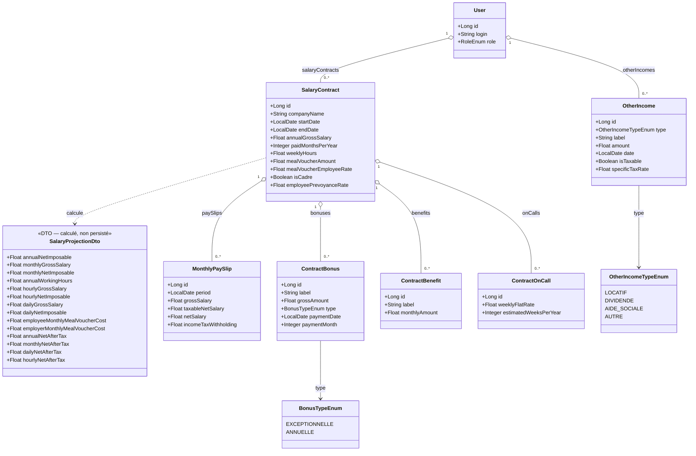

# Gestion des revenus

## Vue d'ensemble

La gestion des revenus repose sur **cinq niveaux complémentaires** :

| Niveau | Entité | Objectif |
|--------|--------|----------|
| Vue théorique | `SalaryContract` | Projections à partir du contrat (brut annuel, tickets resto…) |
| Historique salarial | `SalaryRevision` | Évolutions du salaire au sein d'un même contrat |
| Réel mensuel | `MonthlyPaySlip` | Bulletins de salaire saisis mois par mois |
| Primes | `ContractBonus` | Versements exceptionnels ou annuels rattachés à un contrat |
| Avantages en nature | `ContractBenefit` | Compléments mensuels nets (télétravail, téléphone…) rattachés à un contrat |
| Astreintes | `ContractOnCall` | Forfait hebdomadaire × estimation de semaines/an rattachés à un contrat |
| Revenus complémentaires | `OtherIncome` | Tout revenu hors salaire (locatif, dividendes, aides…) |

La **vue théorique** (`SalaryProjectionDto`) et les **bulletins réels** (`MonthlyPaySlip`) sont affichables côte à côte pour permettre à l'utilisateur de mesurer l'écart entre les projections et la réalité (primes, avantages en nature, variation de salaire).

> **Deux types de contrats sont supportés** : `PRIVATE` (entreprise privée — salaire brut annuel saisi) et `PUBLIC` (fonction publique — brut dérivé d'un indice majoré × valeur du point). La chaîne de calcul en aval (net imposable → net après impôt → projections) est commune ; seules les cotisations salariales diffèrent selon le type. Voir [`salary-public-sector.md`](salary-public-sector.md) pour le détail.

---

## 1. Contrat salarial — `SalaryContract`

### Objectif

Stocker les informations contractuelles pour générer des **estimations** annuelles, mensuelles, journalières et horaires. Ces données constituent la **vision théorique** du revenu.

### Modèle persisté

| Champ | Type | Description |
|-------|------|-------------|
| `id` | `Long` | Identifiant |
| `companyName` | `String` | Nom de l'entreprise — nullable |
| `startDate` | `LocalDate` | Date de début du contrat |
| `endDate` | `LocalDate` | Date de fin — `null` = contrat en cours |
| `annualGrossSalary` | `Float` | Salaire brut annuel (en €) |
| `paidMonthsPerYear` | `Integer` | Nombre de mois de paie (12 ou 13) |
| `weeklyHours` | `Float` | Heures travaillées par semaine |
| `mealVoucherAmount` | `Float` | Valeur faciale d'un ticket restaurant (en €) |
| `mealVoucherEmployeeRate` | `Float` | Part salarié du ticket restaurant (en %, ex : 50.0) |
| `isCadre` | `Boolean` | `true` = statut cadre (APEC applicable). `null` traité comme `false` |
| `employeePrevoyanceRate` | `Float` | Taux prévoyance/mutuelle salarié en décimal (ex : `0.015` = 1,5%). Nullable |

**Règle** : un seul contrat peut avoir `endDate = null` par utilisateur (contrat actif).

### Projections calculées — `SalaryProjectionDto` (non persisté)

Les projections distinguent quatre niveaux de rémunération :

```
Super brut (coût employeur)  →  Brut  →  Net imposable  →  Net d'impôt
```

- **Net imposable** : base de revenu après cotisations salariales déductibles, avant impôt. C'est la valeur transmise au Simulateur des impôts.
- **Net d'impôt** : montant réellement perçu après impôt estimé, en ajoutant les avantages en nature (qui ne sont pas dans l'assiette fiscale salariale).

#### Champs super brut (coût employeur)

Le **super brut** est une estimation du coût total employeur, calculée par application d'un taux forfaitaire de cotisations patronales sur le brut annuel.

> Il s'agit d'une **approximation indicative** — les cotisations patronales réelles dépendent de la taille de l'entreprise, de la convention collective, du niveau de salaire (passage du PASS) et du taux de prévoyance patronale. Un calcul détaillé pourrait être ajouté ultérieurement.

| Champ | Formule |
|-------|---------|
| `annualSuperGross` | `annualGrossSalary × (1 + EMPLOYER_FLAT_RATE)` |
| `monthlySuperGross` | `annualSuperGross ÷ paidMonthsPerYear` |
| `dailySuperGross` | `annualSuperGross ÷ 228` |
| `hourlySuperGross` | `annualSuperGross ÷ annualWorkingHours` |

**Constante** : `EMPLOYER_FLAT_RATE = 0.45` (45 % du brut) — externalisée dans `tax-parameters.yml` sous la clé `employer-flat-rate` pour permettre une mise à jour sans recompilation.

```yaml
tax:
  employer-flat-rate: 0.45
```

> **Exemple** : 45 000 € brut → super brut estimé ≈ 65 250 €

#### Champs bruts et net imposable

| Champ | Formule |
|-------|---------|
| `annualNetImposable` | `NetImposableCalculator.calculer(annualGrossSalary, isCadre, employeePrevoyanceRate, taxParams)` |
| `monthlyGrossSalary` | `annualGrossSalary ÷ paidMonthsPerYear` |
| `monthlyNetImposable` | `annualNetImposable ÷ paidMonthsPerYear` |
| `annualWorkingHours` | `weeklyHours × (228 ÷ 5)` |
| `hourlyGrossSalary` | `annualGrossSalary ÷ annualWorkingHours` |
| `hourlyNetImposable` | `annualNetImposable ÷ annualWorkingHours` |
| `dailyGrossSalary` | `annualGrossSalary ÷ 228` |
| `dailyNetImposable` | `annualNetImposable ÷ 228` |
| `employeeMonthlyMealVoucherCost` | `mealVoucherAmount × (employeeRate ÷ 100) × 19` |
| `employerMonthlyMealVoucherCost` | `mealVoucherAmount × ((100 − employeeRate) ÷ 100) × 19` |

#### Champs net d'impôt

| Champ | Formule |
|-------|---------|
| `annualNetAfterTax` | `annualNetImposable − estimatedTax + Σ(ContractBenefit.monthlyAmount × 12)` |
| `monthlyNetAfterTax` | `annualNetAfterTax ÷ paidMonthsPerYear` |
| `dailyNetAfterTax` | `annualNetAfterTax ÷ 228` |
| `hourlyNetAfterTax` | `annualNetAfterTax ÷ annualWorkingHours` |

> **`estimatedTax`** est calculé à partir du net imposable du contrat uniquement (sans autres revenus), en appliquant le profil fiscal de l'utilisateur (`fiscalParts`, `useFlatRateDeduction`, `customProfessionalDeduction`). La logique est identique aux étapes 3 à 7 du [Simulateur des impôts](tax-simulator.md).

> **Les avantages en nature** (`ContractBenefit`) sont ajoutés **après** la déduction fiscale, car ils représentent des compléments nets versés par l'employeur en dehors de l'assiette des cotisations salariales.

> Les champs `annualNetAfterTax` (et dérivés) sont `null` si l'utilisateur n'a pas renseigné son profil fiscal (`fiscalParts` manquant).

### Constantes utilisées

| Constante | Valeur | Justification |
|-----------|--------|---------------|
| PASS (Plafond Annuel SS) | `47 100 €` (2025) | Seuil de plafonnement des cotisations vieillesse et AGIRC-ARRCO T1 — externalisé dans `tax-parameters.yml` |
| Jours travaillés / an | `228` | Convention standard (tooltip explicatif prévu dans l'IHM) |
| Jours travaillés / mois | `19` | 228 ÷ 12, arrondi |
| Jours / semaine ouvrée | `5` | |

---

## 1bis. NetImposableCalculator — Calcul du net imposable

### Objectif

Calculer le **salaire net imposable** (revenu après cotisations salariales déductibles, avant CSG non déductible et CRDS) à partir du brut annuel, en appliquant les taux légaux français 2025.

> **Net imposable ≠ Net à payer** : la CSG non déductible (2,40 %) et la CRDS (0,50 %) sont prélevées sur le bulletin mais **ne sont pas déductibles** du revenu imposable. Elles ne rentrent donc pas dans le calcul du net imposable.

### Implémentation

Classe utilitaire pure `NetImposableCalculator` (méthode statique, pas de bean Spring) dans `com.myfinance.service`. Appellable depuis `SalaryContractDto.from()` (méthode statique) et depuis `TaxSimulatorService` (bean Spring).

### Cotisations salariales déductibles prises en compte

| Cotisation | Base de calcul | Taux 2025 |
|------------|----------------|-----------|
| Vieillesse plafonnée | `min(brut, PASS)` | 6,90 % |
| Vieillesse déplafonnée | `brut` | 0,40 % |
| CSG déductible | `brut × 98,25 %` | 6,80 % |
| AGIRC-ARRCO Tranche 1 | `min(brut, PASS)` | 3,15 % |
| CEG Tranche 1 | `min(brut, PASS)` | 0,86 % |
| AGIRC-ARRCO Tranche 2 | `max(0, min(brut, 8×PASS) − PASS)` | 8,64 % |
| CEG Tranche 2 | `max(0, min(brut, 8×PASS) − PASS)` | 1,08 % |
| APEC | `min(brut, 4×PASS)` | 0,024 % — **cadres uniquement** |
| Prévoyance/mutuelle | `brut` | variable (stocké dans `employeePrevoyanceRate`, nullable) |

### Formule

```
assietteCsg      = brut × 98,25 %
vieillessePlaf   = min(brut, PASS) × 6,90 %
vieillesseDeplaf = brut × 0,40 %
csgDeductible    = assietteCsg × 6,80 %
agircArrco       = min(brut, PASS) × 3,15 % + max(0, min(brut, 8×PASS) − PASS) × 8,64 %
ceg              = min(brut, PASS) × 0,86 % + max(0, min(brut, 8×PASS) − PASS) × 1,08 %
apec             = si cadre : min(brut, 4×PASS) × 0,024 %   sinon : 0
prevoyance       = si employeePrevoyanceRate renseigné : brut × taux   sinon : 0

totalDeductible  = vieillessePlaf + vieillesseDeplaf + csgDeductible + agircArrco + ceg + apec + prevoyance

netImposable     = max(0, brut − totalDeductible)
```

### Configuration externalisée

Tous les taux et le PASS sont externalisés dans `tax-parameters.yml` (même fichier que le barème IRPP), sous la clé `employee-contributions`. Ils peuvent être mis à jour chaque année sans recompilation.

```yaml
tax:
  pass: 47100.0
  employee-contributions:
    csg-base-rate: 0.9825
    csg-deductible-rate: 0.0680
    vieillesse-plafonne-rate: 0.0690
    vieillesse-de-plafonnee-rate: 0.0040
    agirc-arrco-t1-rate: 0.0315
    ceg-t1-rate: 0.0086
    agirc-arrco-t2-rate: 0.0864
    ceg-t2-rate: 0.0108
    apec-rate: 0.00024
```

---

## 1ter. Historique salarial — `SalaryRevision`

### Objectif

Permettre de **tracer les évolutions de salaire** au sein d'un même contrat, sans avoir à créer un nouveau contrat à chaque revalorisation. Chaque révision enregistre un nouveau salaire brut annuel et sa date d'entrée en vigueur.

### Modèle persisté

| Champ | Type | Description |
|-------|------|-------------|
| `id` | `Long` | Identifiant |
| `contract` | `SalaryContract` | Contrat auquel appartient cette révision |
| `effectiveDate` | `LocalDate` | Date d'entrée en vigueur du nouveau salaire |
| `annualGrossSalary` | `Float` | Salaire brut annuel révisé (en €) |
| `label` | `String` | Libellé libre, nullable (ex : "Augmentation annuelle 2025", "Promotion") |

### Contraintes

- La paire (`contract`, `effectiveDate`) est **unique** : deux révisions ne peuvent pas entrer en vigueur le même jour sur le même contrat.
- `effectiveDate` doit être **≥ `contract.startDate`**.

### Révision active

La **révision active** est celle dont la `effectiveDate` est la plus récente parmi toutes celles dont `effectiveDate ≤ today`.

```
revisionActive = MAX(effectiveDate) WHERE effectiveDate ≤ today
```

- Si aucune révision n'existe, ou si toutes les révisions ont une `effectiveDate` dans le futur, les projections utilisent le champ `SalaryContract.annualGrossSalary` comme valeur de repli.
- Le `SalaryContractDto` expose le champ `activeRevisionId` (`null` si le repli du contrat est utilisé) pour que le frontend puisse identifier quelle révision est active.

### Impact sur les projections

Quand une révision active est détectée, `SalaryContractDto.annualGrossSalary` reflète **le salaire de la révision active** (non le champ stocké sur `SalaryContract`). Toutes les projections dérivées (mensuel, journalier, horaire, net imposable, net d'impôt) sont recalculées à partir de ce salaire révisé.

### Relations

- Une `SalaryRevision` est **rattachée à un `SalaryContract`**
- Un contrat peut avoir **plusieurs révisions**, mais une seule est active à la fois
- Les révisions sont supprimées en **cascade** si le contrat est supprimé

---

## 2. Bulletins de salaire mensuels — `MonthlyPaySlip`

### Objectif

Permettre la saisie des **données réelles** mois par mois, issues du bulletin de salaire. En combinant cette vue avec `SalaryProjectionDto`, l'utilisateur peut visualiser les écarts (prime, avantages en nature, variation de cotisations).

### Modèle persisté

| Champ | Type | Description |
|-------|------|-------------|
| `id` | `Long` | Identifiant |
| `period` | `LocalDate` | Mois concerné (ex : 2025-03-01 pour mars 2025) |
| `grossSalary` | `Float` | Revenu brut du mois |
| `taxableNetSalary` | `Float` | Revenu net fiscal (après cotisations sociales) |
| `netSalary` | `Float` | Revenu net net (montant effectivement versé) |
| `incomeTaxWithholding` | `Float` | Prélèvement à la source réel du mois |

### Relations

- Un `MonthlyPaySlip` est **rattaché à un `SalaryContract`** (le contrat actif au moment de la période)
- Une période donnée (`period`) ne peut avoir **qu'un seul bulletin** par contrat

### Vue comparée — Réel vs Théorique

```
Pour un mois M :

  SalaryProjectionDto.monthlyGrossSalary   ← théorique (SalaryContract)
  MonthlyPaySlip.grossSalary               ← réel (bulletin saisi)

  Écart = réel − théorique
  (positif = prime / avantage ; négatif = absence / retenue)
```

---

## 3. Primes — `ContractBonus`

### Objectif

Enregistrer les **versements ponctuels ou récurrents** liés au contrat (13ème mois, prime de vacances, prime exceptionnelle, etc.) pour les distinguer du salaire mensuel de base et les intégrer dans la vision globale des revenus.

### Modèle persisté

| Champ | Type | Description |
|-------|------|-------------|
| `id` | `Long` | Identifiant |
| `label` | `String` | Nom de la prime (ex : "Prime Macron", "13ème mois") |
| `grossAmount` | `Float` | Montant brut en € |
| `type` | `BonusTypeEnum` | `EXCEPTIONNELLE` ou `ANNUELLE` |
| `paymentDate` | `LocalDate` | Premier jour du mois de versement — renseigné si `EXCEPTIONNELLE` |
| `paymentMonth` | `Integer` | Mois de versement (1–12) — renseigné si `ANNUELLE` |

### Types de primes (`BonusTypeEnum`)

| Valeur | Description | Champ associé |
|--------|-------------|---------------|
| `EXCEPTIONNELLE` | Prime versée à une date précise (usage unique ou ponctuel) | `paymentDate` (obligatoire) |
| `ANNUELLE` | Prime récurrente versée chaque année à un mois fixe | `paymentMonth` (obligatoire, 1–12) |

### Relations

- Un `ContractBonus` est **rattaché à un `SalaryContract`**
- Un contrat peut avoir **plusieurs primes**
- Les primes sont supprimées en **cascade** si le contrat est supprimé

---

## 4. Avantages en nature — `ContractBenefit`

### Objectif

Enregistrer les **compléments de rémunération mensuels** versés par l'employeur (frais de télétravail, forfait téléphone, mutuelle…). Contrairement aux primes, il s'agit de montants fixes et récurrents qui s'ajoutent directement au **net estimé** dans les projections — ils ne transitent pas par le brut et ne sont pas soumis aux cotisations salariales.

### Modèle persisté

| Champ | Type | Description |
|-------|------|-------------|
| `id` | `Long` | Identifiant |
| `label` | `String` | Type d'avantage (ex : "Frais de télétravail", "Forfait téléphone") |
| `monthlyAmount` | `Float` | Montant mensuel en € |

### Intégration dans les projections (frontend)

Les avantages en nature sont traités comme des **compléments nets exonérés** : ils ne font pas partie de l'assiette des cotisations salariales ni de la base fiscale. Ils s'ajoutent au **net d'impôt** (et non au net imposable) pour obtenir le revenu final perçu.

| Période | Calcul |
|---------|--------|
| Annuel | `monthlyAmount × 12` |
| Mensuel | `monthlyAmount` |
| Journalier | `monthlyAmount × 12 ÷ 228` |
| Horaire | `monthlyAmount × 12 ÷ 228 ÷ hoursPerDay` |

Chaque ligne d'avantage apparaît dans le tooltip du **"Net d'impôt"** correspondant.

> **Hypothèse simplificatrice :** tous les `ContractBenefit` sont considérés exonérés d'impôt (modèle adapté aux avantages courants type frais de télétravail, forfait téléphone). Les avantages réellement imposables (voiture de fonction, logement…) ne sont pas gérés dans ce modèle.

### Relations

- Un `ContractBenefit` est **rattaché à un `SalaryContract`**
- Un contrat peut avoir **plusieurs avantages**
- Les avantages sont supprimés en **cascade** si le contrat est supprimé

---

## 5. Astreintes — `ContractOnCall`

### Objectif

Enregistrer les périodes d'**astreinte contractuelle** afin d'intégrer leur rémunération forfaitaire dans la vision théorique du revenu annuel. Une astreinte représente une disponibilité hors horaires habituels, rémunérée par un forfait fixe par semaine.

### Modèle persisté

| Champ | Type | Description |
|-------|------|-------------|
| `id` | `Long` | Identifiant |
| `contract` | `SalaryContract` | Contrat auquel appartient cette astreinte |
| `weeklyFlatRate` | `Float` | Forfait hebdomadaire brut en € |
| `estimatedWeeksPerYear` | `Integer` | Nombre de semaines d'astreinte estimées par an (1–52) |

### Revenu annuel estimé (calculé, non persisté)

```
annualOnCallIncome = weeklyFlatRate × estimatedWeeksPerYear
```

Ce montant est calculé dans `ContractOnCallDto.from()` et retourné dans chaque réponse API.

### Intégration dans les projections (frontend)

Les astreintes sont chargées séparément du `SalaryContractDto` (via `GET /api/salary-contracts/{id}/on-calls`) et intégrées dans `ProjectionGrid` côté frontend, selon la même mécanique que les primes :

#### Brut

```
gross = salaireBrut + totalPrimes + totalAstreintes
```

#### Net imposable

Les astreintes étant soumises aux cotisations salariales, une approximation de 25 % est appliquée :

```
netImposableAstreintes = totalAnnualOnCalls × 0,75
```

#### Net d'impôt

Contrairement aux primes (approximation forfaitaire à 75 %), les astreintes font l'objet d'une **estimation d'impôt au taux moyen du salaire** :

```
tauxMoyen            = impôtSalaire / netImposableSalaire
netImposableAstreintes = totalAnnualOnCalls × 0,75
impôtAstreintes      = netImposableAstreintes × tauxMoyen
netAprèsImpôtAstreintes = netImposableAstreintes − impôtAstreintes
```

> **Pourquoi le taux moyen et non le taux marginal ?** Le simulateur fiscal est calculé côté backend sur le seul salaire ; les astreintes sont chargées indépendamment sans nouveau appel au simulateur. Appliquer le taux moyen (et non le taux marginal) sous-estime légèrement l'impôt sur les astreintes dans un barème progressif — c'est une approximation acceptable pour une estimation théorique.

Le tooltip du **"Net d'impôt"** dans la grille de projections détaille :
- Impôt sur salaire (calculé par le backend)
- Astreintes net imposable (≈75%)
- Impôt astreintes au taux moyen (avec le taux affiché en %)
- Total impôt estimé (somme des deux)

Un **bloc récapitulatif violet** est affiché sous la grille de projections, calqué sur le bloc tickets restaurant : une ligne par astreinte (`X sem. × Y €/sem. : +Z € / an`) et un total si plusieurs lignes existent.

### Relations

- Un `ContractOnCall` est **rattaché à un `SalaryContract`**
- Un contrat peut avoir **plusieurs configurations d'astreinte** (ex. : astreinte nationale + astreinte locale à des forfaits différents)
- Les astreintes sont supprimées en **cascade** si le contrat est supprimé

---

## 6. Revenus non salariés — `OtherIncome`

### Objectif

Enregistrer tout revenu hors salariat : revenu locatif, dividendes non liés au portefeuille suivi, aides sociales, etc. Cette vision permet d'avoir un tableau de bord complet des entrées financières.

### Modèle persisté

| Champ | Type | Description |
|-------|------|-------------|
| `id` | `Long` | Identifiant |
| `type` | `OtherIncomeTypeEnum` | Catégorie du revenu |
| `label` | `String` | Description libre (ex : "Loyer appartement Lyon") |
| `amount` | `Float` | Montant perçu (en €) |
| `date` | `LocalDate` | Date de perception |
| `isTaxable` | `Boolean` | Indique si ce revenu est soumis à l'impôt |
| `specificTaxRate` | `Float` | Taux d'imposition fixe en % (ex : 30.0 pour la flat tax). `null` = inclus dans le barème IRPP normal |

### Types de revenus (`OtherIncomeTypeEnum`)

| Valeur | Description | `isTaxable` suggéré | `specificTaxRate` suggéré |
|--------|-------------|---------------------|---------------------------|
| `LOCATIF` | Revenu locatif (loyers perçus, charges récupérées…) | `true` | `null` (barème IRPP) |
| `DIVIDENDE` | Dividendes hors portefeuille suivi dans l'application | `true` | `30.0` (flat tax PFU fréquente) |
| `AIDE_SOCIALE` | Allocations, aides (CAF, Pôle Emploi, etc.) | `false` | — |
| `AUTRE` | Tout autre revenu non salarial (libellé libre) | `true` | `null` |

> **Note :** Les dividendes liés à une position du portefeuille sont gérés via l'entité `Dividend` (liée à `Isbn`). `OtherIncome` de type `DIVIDENDE` couvre les dividendes hors portefeuille.

> **Note fiscale :** Les champs `isTaxable` et `specificTaxRate` sont utilisés par le Simulateur des impôts pour déterminer si ce revenu entre dans le calcul IRPP et à quel taux. Voir [`docs/architecture/tax-simulator.md`](tax-simulator.md).

---

## Diagramme de classes — Revenus



---

## Endpoints

### Contrats salariaux
| Méthode | URL | Description |
|---------|-----|-------------|
| `GET` | `/api/salary-contracts` | Liste des contrats de l'utilisateur connecté |
| `GET` | `/api/salary-contracts/{id}` | Détail + `SalaryProjectionDto` calculé |
| `POST` | `/api/salary-contracts` | Créer un contrat |
| `PUT` | `/api/salary-contracts/{id}` | Modifier un contrat |
| `DELETE` | `/api/salary-contracts/{id}` | Supprimer un contrat |

### Révisions salariales
| Méthode | URL | Description |
|---------|-----|-------------|
| `GET` | `/api/salary-contracts/{id}/revisions` | Liste des révisions d'un contrat (ordre chronologique inverse) |
| `POST` | `/api/salary-contracts/{id}/revisions` | Ajouter une révision |
| `PUT` | `/api/salary-contracts/{id}/revisions/{revId}` | Modifier une révision |
| `DELETE` | `/api/salary-contracts/{id}/revisions/{revId}` | Supprimer une révision |

### Bulletins mensuels
| Méthode | URL | Description |
|---------|-----|-------------|
| `GET` | `/api/salary-contracts/{id}/pay-slips` | Liste des bulletins d'un contrat |
| `POST` | `/api/salary-contracts/{id}/pay-slips` | Ajouter un bulletin |
| `PUT` | `/api/salary-contracts/{id}/pay-slips/{slipId}` | Modifier un bulletin |
| `DELETE` | `/api/salary-contracts/{id}/pay-slips/{slipId}` | Supprimer un bulletin |

### Primes
| Méthode | URL | Description |
|---------|-----|-------------|
| `GET` | `/api/salary-contracts/{id}/bonuses` | Liste des primes d'un contrat |
| `POST` | `/api/salary-contracts/{id}/bonuses` | Ajouter une prime |
| `PUT` | `/api/salary-contracts/{id}/bonuses/{bonusId}` | Modifier une prime |
| `DELETE` | `/api/salary-contracts/{id}/bonuses/{bonusId}` | Supprimer une prime |

### Avantages en nature
| Méthode | URL | Description |
|---------|-----|-------------|
| `GET` | `/api/salary-contracts/{id}/benefits` | Liste des avantages d'un contrat |
| `POST` | `/api/salary-contracts/{id}/benefits` | Ajouter un avantage |
| `PUT` | `/api/salary-contracts/{id}/benefits/{benefitId}` | Modifier un avantage |
| `DELETE` | `/api/salary-contracts/{id}/benefits/{benefitId}` | Supprimer un avantage |

### Astreintes
| Méthode | URL | Description |
|---------|-----|-------------|
| `GET` | `/api/salary-contracts/{id}/on-calls` | Liste des astreintes d'un contrat |
| `POST` | `/api/salary-contracts/{id}/on-calls` | Ajouter une astreinte |
| `PUT` | `/api/salary-contracts/{id}/on-calls/{onCallId}` | Modifier une astreinte |
| `DELETE` | `/api/salary-contracts/{id}/on-calls/{onCallId}` | Supprimer une astreinte |

### Revenus complémentaires
| Méthode | URL | Description |
|---------|-----|-------------|
| `GET` | `/api/other-incomes` | Liste des revenus non salariés de l'utilisateur |
| `POST` | `/api/other-incomes` | Ajouter un revenu |
| `PUT` | `/api/other-incomes/{id}` | Modifier un revenu |
| `DELETE` | `/api/other-incomes/{id}` | Supprimer un revenu |

---

## Droits d'accès

| Action | Rôle requis |
|--------|------------|
| Gérer son contrat salarial | USER, ADMIN |
| Gérer ses révisions salariales | USER, ADMIN |
| Gérer ses bulletins mensuels | USER, ADMIN |
| Gérer ses primes | USER, ADMIN |
| Gérer ses avantages en nature | USER, ADMIN |
| Gérer ses astreintes | USER, ADMIN |
| Gérer ses revenus non salariés | USER, ADMIN |
| Consulter les données d'un autre utilisateur | ADMIN uniquement |

---

## Lien avec le Simulateur des impôts

Les données de revenus salariaux et complémentaires alimentent le **Simulateur des impôts** :

- `MonthlyPaySlip.taxableNetSalary` → utilisé si l'option "Bulletins réels" est choisie
- `NetImposableCalculator.calculer(annualGrossSalary, isCadre, employeePrevoyanceRate, taxParams)` + `Σ(ContractOnCall.weeklyFlatRate × estimatedWeeksPerYear × 0,75)` → utilisé si l'option "Projection contrat" est choisie
- `OtherIncome.amount` (filtrés par `isTaxable` et `specificTaxRate`) → revenus complémentaires

La documentation complète du simulateur est dans [`docs/architecture/tax-simulator.md`](tax-simulator.md).

### Calcul du net d'impôt dans les projections contrat

Le champ `annualNetAfterTax` (et ses dérivés mensuel/journalier/horaire) utilise la même logique que le simulateur, mais appliquée **uniquement au salaire du contrat**, sans autres revenus :

```
// Identique aux étapes 3–7 du simulateur (source : PROJECTION_CONTRAT, aucun revenu complémentaire)
netImposable         = NetImposableCalculator.calculer(annualGrossSalary, ...)
abattement           = calculer selon useFlatRateDeduction (min/max sur salaire uniquement)
revenuNetImposable   = netImposable − abattement
impôtEstimé          = barème(revenuNetImposable / fiscalParts) × fiscalParts
benefitsAnnual       = Σ(ContractBenefit.monthlyAmount) × 12

annualNetAfterTax    = netImposable − impôtEstimé + benefitsAnnual
```

> Si le profil fiscal de l'utilisateur est incomplet (`fiscalParts` non renseigné), `annualNetAfterTax` et ses dérivés sont `null`.
