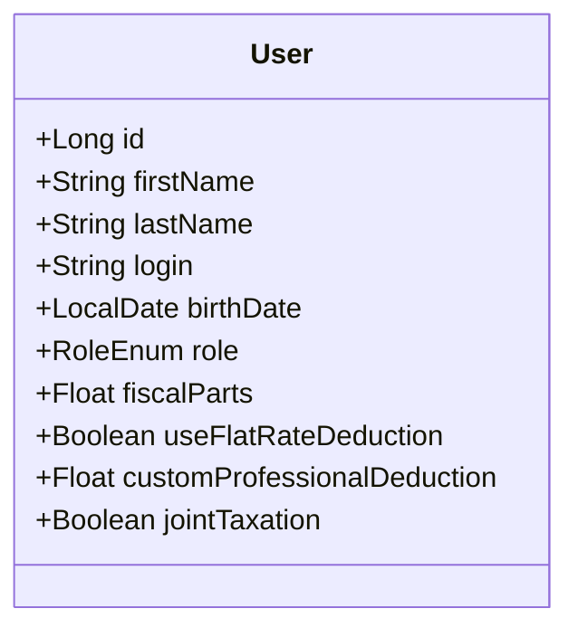
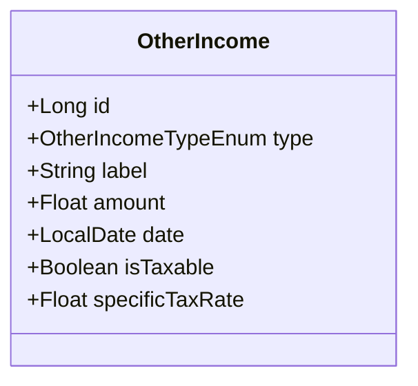
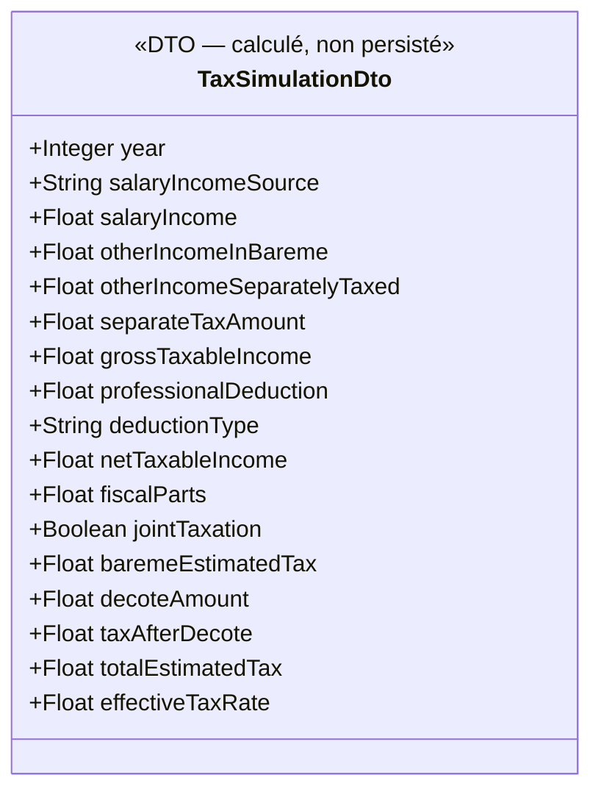

# Simulateur des impôts

## 1. Objectif

Permettre à chaque utilisateur d'estimer son **impôt sur le revenu (IRPP)** à partir des données de revenus déjà saisies dans l'application, en prenant en compte son quotient familial et son abattement pour frais professionnels.

Le simulateur est accessible depuis un menu **Outils** dédié et retourne :
- Le **montant d'impôt estimé** en euros
- Le **taux d'imposition effectif** en pourcentage

> Il s'agit d'une **estimation indicative**, non d'un calcul fiscal officiel.

---

## 2. Nouvelles données profil utilisateur

Plusieurs informations fiscales sont ajoutées à l'entité `User` :

| Champ | Type | Nullable | Description |
|-------|------|----------|-------------|
| `fiscalParts` | `Float` | Non | Nombre de parts fiscales (quotient familial) |
| `useFlatRateDeduction` | `Boolean` | Non | `true` = abattement forfaitaire 10% ; `false` = frais réels |
| `customProfessionalDeduction` | `Float` | Oui | Montant déclaré en € (renseigné uniquement si `useFlatRateDeduction = false`) |
| `jointTaxation` | `Boolean` | Non | `true` = marié·e ou pacsé·e en imposition commune (couple) ; `false` = célibataire, divorcé·e, veuf·ve, parent isolé (défaut). Utilisé pour la décote (§ 5 bis). |

### Exemples de `fiscalParts`

| Situation | Parts |
|-----------|-------|
| Célibataire sans enfant | 1.0 |
| Couple marié/pacsé sans enfant | 2.0 |
| Couple + 1 enfant | 2.5 |
| Couple + 2 enfants | 3.0 |
| Couple + 3 enfants | 4.0 |
| Célibataire + 1 enfant (parent isolé) | 2.0 |

### Règles de validation

- `fiscalParts` ≥ 0.5 (minimum légal)
- Si `useFlatRateDeduction = false`, alors `customProfessionalDeduction` est obligatoire et ≥ 0
- Si `useFlatRateDeduction = true`, `customProfessionalDeduction` est ignoré (et mis à `null`)

---

## 3. Revenus pris en compte

Le simulateur agrège les revenus de l'utilisateur pour une **année fiscale donnée** (paramètre de la requête, défaut : année en cours).

### 3.1 Revenus salariaux — choix de la source

L'utilisateur choisit explicitement la source à utiliser pour les revenus salariaux :

| Option | Données utilisées | Disponibilité |
|--------|-------------------|---------------|
| **Projection contrat** | `NetImposableCalculator.calculer(effectiveSalary, isCadre, employeePrevoyanceRate, taxParams)` + `Σ(weeklyFlatRate × estimatedWeeksPerYear × 0,75)` des astreintes du contrat actif | Toujours disponible si un contrat existe |
| **Bulletins réels** | Somme des `taxableNetSalary` des bulletins saisis pour l'année | Disponible uniquement si des bulletins existent pour l'année sélectionnée |

> **Révision active** : en mode "Projection contrat", le simulateur utilise automatiquement la `SalaryRevision` la plus récente dont la `effectiveDate ≤ today`. Si aucune révision n'est active, le `annualGrossSalary` du contrat sert de repli. Ce comportement est cohérent avec les projections affichées sur la page du contrat.

> **Astreintes** : en mode "Projection contrat", le net imposable des astreintes (`ContractOnCall`) est ajouté au net imposable salarial selon l'approximation `weeklyFlatRate × estimatedWeeksPerYear × 0,75` (charges salariales ≈ 25 %). Ce calcul est effectué dans `TaxSimulatorService.salaryIncomeFromContract()` via `ContractOnCallRepository`.

> **Cas typique :** en cours d'année, les bulletins sont incomplets. L'utilisateur peut simuler avec la projection (vision annuelle théorique) ou avec les bulletins réels déjà saisis (vision partielle de l'année).

> Les primes (`ContractBonus`) et avantages en nature (`ContractBenefit`) sont considérés comme **déjà inclus** dans les `taxableNetSalary` lorsque l'option "Bulletins réels" est choisie. En mode "Projection contrat", ils ne sont pas ajoutés pour éviter des doublons. Les astreintes (`ContractOnCall`) sont incluses en mode "Projection contrat" uniquement.

### 3.2 Revenus complémentaires — sélection et imposition

Chaque `OtherIncome` de l'année sélectionnée peut être **inclus ou exclu individuellement** du calcul via une case à cocher dans le simulateur (état de session uniquement, non persisté).

Deux nouveaux champs sont ajoutés à l'entité `OtherIncome` :

| Champ | Type | Nullable | Description |
|-------|------|----------|-------------|
| `isTaxable` | `Boolean` | Non | Indique si ce revenu est soumis à l'impôt (défaut : `true`) |
| `specificTaxRate` | `Float` | Oui | Taux d'imposition spécifique en % (ex : 30.0 pour la flat tax). `null` = inclus dans le barème IRPP normal |

#### Comportement dans le simulateur

| `isTaxable` | `specificTaxRate` | Traitement |
|-------------|-------------------|------------|
| `false` | — | Exclu du calcul |
| `true` | `null` | Inclus dans le revenu net imposable global (barème IRPP) |
| `true` | ex. 30.0 | Taxé séparément : `amount × specificTaxRate / 100` — s'ajoute à l'impôt final sans entrer dans le barème |

#### Valeurs par défaut suggérées à la saisie

| Type | `isTaxable` par défaut | `specificTaxRate` suggéré |
|------|------------------------|---------------------------|
| `LOCATIF` | `true` | `null` (barème IRPP) |
| `DIVIDENDE` | `true` | `30.0` (flat tax PFU fréquente) |
| `AIDE_SOCIALE` | `false` | — |
| `AUTRE` | `true` | `null` |

> Ce sont des suggestions pré-remplissables à la saisie — l'utilisateur reste libre de les modifier.

---

## 4. Algorithme de calcul

```
// Étape 1 — Revenus salariaux (selon choix de la source)
effectiveSalary  = revisionActive.annualGrossSalary  si revisionActive existe
                   sinon contract.annualGrossSalary

// option "Projection contrat"
salaryNetImposable  = NetImposableCalculator.calculer(effectiveSalary, isCadre, prevoyanceRate, taxParams)
onCallNetImposable  = Σ (weeklyFlatRate × estimatedWeeksPerYear × 0,75)  // astreintes du contrat
revenusSalariaux    = salaryNetImposable + onCallNetImposable

// option "Bulletins réels"
revenusSalariaux    = Σ taxableNetSalary (bulletins)  // astreintes déjà incluses dans les bulletins

// Étape 2 — Revenus complémentaires sélectionnés
revenusIRPP      = Σ amount  (OtherIncomes cochés, isTaxable=true, specificTaxRate=null)
revenusTaxésSéparément = Σ (amount × specificTaxRate / 100)
                         (OtherIncomes cochés, isTaxable=true, specificTaxRate!=null)

// Étape 3 — Abattement professionnel (sur les revenus salariaux uniquement)
si useFlatRateDeduction :
    abattement = min( max(revenusSalariaux × flatRateDeductionRate, DEDUCTION_MIN), DEDUCTION_MAX )
sinon :
    abattement = customProfessionalDeduction

// Étape 4 — Revenu net imposable au barème
revenuNetImposable = (revenusSalariaux - abattement) + revenusIRPP

// Étape 5 — Quotient familial
revenuParPart = revenuNetImposable / fiscalParts

// Étape 6 — Impôt sur une part (barème progressif — section 5)
impôtSurUnePart = calcul par tranches

// Étape 7 — Impôt brut au barème
impôtBarème = impôtSurUnePart × fiscalParts

// Étape 7 bis — Décote pour les bas revenus (cf. § 5 bis)
seuil   = (jointTaxation) ? decote.couple-threshold   : decote.single-threshold
plafond = (jointTaxation) ? decote.couple-cap         : decote.single-cap
si impôtBarème < seuil :
    décote = max(0, plafond - impôtBarème × decote.rate)
sinon :
    décote = 0
impôtAprèsDécote = max(0, impôtBarème - décote)

// Étape 8 — Impôt total
impôtTotal  = impôtAprèsDécote + revenusTaxésSéparément

// Étape 9 — Résultats
revenusBrutsGlobaux = revenusSalariaux + Σ amount (OtherIncomes cochés et imposables)
tauxEffectif = impôtTotal / revenusBrutsGlobaux × 100
```

---

## 5. Barème progressif de l'IRPP — Configuration externalisée

### Choix du format de configuration

Le barème de l'IRPP change chaque année (loi de finances). Pour permettre sa mise à jour sans modifier le code, les paramètres sont externalisés dans un **fichier YAML dédié** : `backend/src/main/resources/tax-parameters.yml`.

**Pourquoi un fichier YAML séparé plutôt qu'`application.properties` ?**

`application.properties` ne supporte pas nativement les structures imbriquées (listes d'objets). Représenter un barème en `.properties` serait verbeux et peu lisible :
```properties
# Peu lisible, fastidieux à maintenir
tax.brackets[0].from=0
tax.brackets[0].to=11497
tax.brackets[0].rate=0.00
```

Un fichier YAML dédié est **plus lisible, plus maintenable**, et Spring Boot le supporte nativement via `@ConfigurationProperties`. L'administrateur peut le modifier et redémarrer l'application sans toucher au code.

### Format de `tax-parameters.yml`

```yaml
tax:
  year: 2025
  income-period: "2024"
  flat-rate-deduction:
    rate: 0.10
    min: 504
    max: 13522
  brackets:
    - from: 0
      to: 11497
      rate: 0.00
    - from: 11497
      to: 29315
      rate: 0.11
    - from: 29315
      to: 83823
      rate: 0.30
    - from: 83823
      to: 180294
      rate: 0.41
    - from: 180294
      to: ~          # null = borne supérieure infinie
      rate: 0.45
```

### Valeurs en vigueur (barème 2025, revenus 2024)

| Tranche | Taux | De | À |
|---------|------|----|---|
| 1 | 0% | 0 € | 11 497 € |
| 2 | 11% | 11 497 € | 29 315 € |
| 3 | 30% | 29 315 € | 83 823 € |
| 4 | 41% | 83 823 € | 180 294 € |
| 5 | 45% | > 180 294 € | — |

> **Procédure de mise à jour annuelle :** Modifier `tax-parameters.yml` avec les nouveaux seuils publiés (généralement en décembre/janvier), puis redémarrer l'application. Aucune modification du code source n'est nécessaire.

### Formule de calcul de l'impôt sur une part

```
impôt = 0
pour chaque tranche [from, to, rate] :
    si revenuParPart > from :
        borneSup = si to != null alors min(revenuParPart, to) sinon revenuParPart
        impôt += (borneSup - from) × rate
```

---

## 5 bis. Décote pour les bas revenus

### Principe

La décote est une réduction automatique d'impôt pour les contribuables modestes — appliquée par l'administration **après le calcul du barème** mais **avant les crédits/réductions d'impôt**.

> Source : [economie.gouv.fr — Pouvez-vous bénéficier de la décote ?](https://www.economie.gouv.fr/particuliers/impots-et-fiscalite/gerer-mon-impot-sur-le-revenu/pouvez-vous-beneficier-de-la-decote-de-limpot-sur-le-revenu)

### Règles (déclaration 2025, revenus 2024)

| Situation officielle | Champ | Seuil d'éligibilité | Plafond | Formule |
|---|---|---|---|---|
| Célibataire, divorcé·e, veuf·ve, parent isolé | `jointTaxation = false` | impôtBarème < **1 964 €** | **889 €** | `décote = 889 − (impôtBarème × 45,25 %)` |
| Marié·e ou pacsé·e en imposition commune | `jointTaxation = true` | impôtBarème < **3 248 €** | **1 470 €** | `décote = 1 470 − (impôtBarème × 45,25 %)` |

> **Important** : la décote est basée sur le **statut matrimonial déclaré** (`jointTaxation`), **pas** sur le nombre de parts fiscales (`fiscalParts`). Un célibataire avec 2 enfants (2 parts) reste dans la catégorie « célibataire » pour la décote.

### Algorithme

```
si impôtBarème >= seuil (selon jointTaxation) :
    décote = 0                                    // pas éligible
sinon :
    décote = max(0, plafond - impôtBarème × 0.4525)
impôtAprèsDécote = max(0, impôtBarème - décote)
```

### Configuration externalisée — `tax-parameters.yml`

```yaml
tax:
  decote:
    rate: 0.4525                # taux de réduction proportionnelle
    single-threshold: 1964.0    # seuil d'éligibilité célibataire
    single-cap: 889.0           # plafond de décote célibataire
    couple-threshold: 3248.0    # seuil d'éligibilité couple
    couple-cap: 1470.0          # plafond de décote couple
```

> Mise à jour annuelle simple — modifier ces 5 valeurs et redémarrer l'application.

### Exemples chiffrés

| Cas | `jointTaxation` | Impôt brut | Calcul | Décote | Impôt final |
|-----|-----------------|------------|--------|--------|-------------|
| Célibataire, salaire modeste | `false` | 1 800 € | 889 − 1 800 × 0,4525 = **74,50 €** | 74,50 € | **1 725,50 €** |
| Célibataire, juste au seuil | `false` | 1 950 € | 889 − 1 950 × 0,4525 = **6,63 €** | 6,63 € | **1 943,37 €** |
| Célibataire, au-dessus du seuil | `false` | 2 100 € | 2 100 ≥ 1 964 → pas éligible | 0 € | **2 100 €** |
| Couple, revenus modestes | `true`  | 2 500 € | 1 470 − 2 500 × 0,4525 = **338,75 €** | 338,75 € | **2 161,25 €** |
| Couple, au-dessus du seuil | `true`  | 3 500 € | 3 500 ≥ 3 248 → pas éligible | 0 € | **3 500 €** |
| Couple, impôt très bas | `true`  | 600 €   | 1 470 − 600 × 0,4525 = **1 198,50 €** mais plafonné à l'impôt | 600 € | **0 €** |

### Validation

- `decote.rate`, `*-threshold`, `*-cap` : tous obligatoires, > 0
- Si la section `decote` est absente dans le YAML, la décote est désactivée (= 0) — comportement V0 préservé pour les anciennes configs

---

## 6. Résultats affichés

| Élément | Description |
|---------|-------------|
| Année fiscale simulée | Ex : "2024" |
| Source des revenus salariaux | "Projection contrat" ou "Bulletins réels (N bulletins)" |
| Revenus salariaux | Montant en € |
| Revenus complémentaires inclus | Montant en € + détail par source |
| Revenus taxés séparément | Montant d'impôt en € + détail par source et taux |
| Total revenus bruts retenus | Montant en € |
| Abattement appliqué | Montant en € + type (forfaitaire 10% ou frais réels) |
| Revenu net imposable au barème | Montant en € |
| Quotient familial | Nombre de parts |
| Impôt brut au barème | Montant en € (avant décote) |
| **Décote appliquée** | Montant en € (affiché en vert si > 0, sinon ligne masquée) |
| **Impôt estimé total** | **Montant annuel en €** |
| **Impôt mensuel estimé** | **Impôt annuel ÷ 12 — indicatif prélèvement à la source** |
| **Taux effectif** | **En %** |

---

## 7. Modèle de données — Impact

### Entité `User` (champs ajoutés)



### Entité `OtherIncome` (champs ajoutés)



Les nouveaux champs sont persistés (migrations de schéma requises sur les tables `users` et `other_incomes`).

---

## 8. DTO de simulation — `TaxSimulationDto` (non persisté)



- `salaryIncomeSource` : `"PROJECTION_CONTRAT"` ou `"BULLETINS_REELS"`
- `deductionType` : `"FORFAITAIRE_10_POURCENT"` ou `"FRAIS_REELS"`
- `baremeEstimatedTax` : impôt brut issu du barème, **avant décote**
- `decoteAmount` : décote appliquée (0 si non éligible)
- `taxAfterDecote` : `baremeEstimatedTax − decoteAmount`
- `totalEstimatedTax` : `taxAfterDecote + separateTaxAmount`

---

## 9. Droits d'accès

| Action | Rôle requis |
|--------|-------------|
| Lancer sa simulation | USER, ADMIN |
| Mettre à jour son profil fiscal | USER, ADMIN |
| Lancer la simulation d'un autre utilisateur | ADMIN uniquement |

---

## 10. Limites et hypothèses (v1)

- Pas de gestion du **plafonnement du quotient familial** (avantage max par demi-part limité — simplification)
- Le simulateur ne gère pas les crédits ou réductions d'impôts
- La simulation est **stateless** : les sélections (cases à cocher, choix de source) ne sont pas persistées
