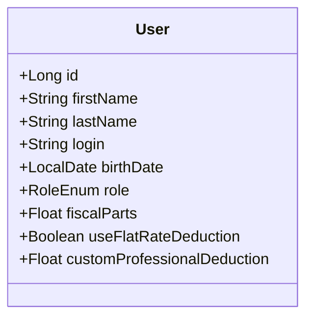
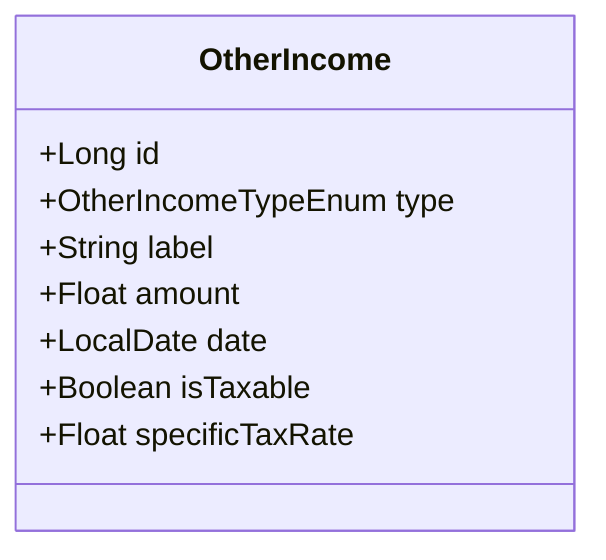
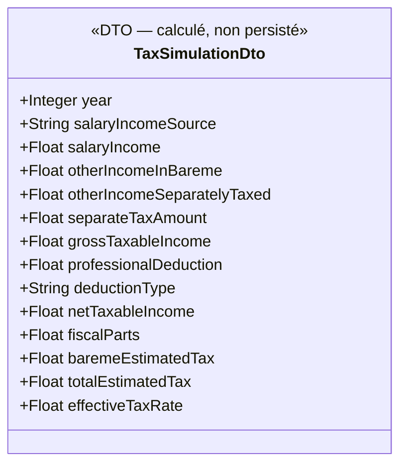

# Simulateur des impôts

## 1. Objectif

Permettre à chaque utilisateur d'estimer son **impôt sur le revenu (IRPP)** à partir des données de revenus déjà saisies dans l'application, en prenant en compte son quotient familial et son abattement pour frais professionnels.

Le simulateur est accessible depuis un menu **Outils** dédié et retourne :
- Le **montant d'impôt estimé** en euros
- Le **taux d'imposition effectif** en pourcentage

> Il s'agit d'une **estimation indicative**, non d'un calcul fiscal officiel.

---

## 2. Nouvelles données profil utilisateur

Deux informations fiscales sont ajoutées à l'entité `User` :

| Champ | Type | Nullable | Description |
|-------|------|----------|-------------|
| `fiscalParts` | `Float` | Non | Nombre de parts fiscales (quotient familial) |
| `useFlatRateDeduction` | `Boolean` | Non | `true` = abattement forfaitaire 10% ; `false` = frais réels |
| `customProfessionalDeduction` | `Float` | Oui | Montant déclaré en € (renseigné uniquement si `useFlatRateDeduction = false`) |

### Exemples de `fiscalParts`

| Situation | Parts |
|-----------|-------|
| Célibataire sans enfant | 1.0 |
| Couple marié/pacsé sans enfant | 2.0 |
| Couple + 1 enfant | 2.5 |
| Couple + 2 enfants | 3.0 |
| Couple + 3 enfants | 4.0 |
| Célibataire + 1 enfant (parent isolé) | 2.0 |

### Règles de validation

- `fiscalParts` ≥ 0.5 (minimum légal)
- Si `useFlatRateDeduction = false`, alors `customProfessionalDeduction` est obligatoire et ≥ 0
- Si `useFlatRateDeduction = true`, `customProfessionalDeduction` est ignoré (et mis à `null`)

---

## 3. Revenus pris en compte

Le simulateur agrège les revenus de l'utilisateur pour une **année fiscale donnée** (paramètre de la requête, défaut : année en cours).

### 3.1 Revenus salariaux — choix de la source

L'utilisateur choisit explicitement la source à utiliser pour les revenus salariaux :

| Option | Données utilisées | Disponibilité |
|--------|-------------------|---------------|
| **Projection contrat** | `annualGrossSalary × 0,75` du contrat actif | Toujours disponible si un contrat existe |
| **Bulletins réels** | Somme des `taxableNetSalary` des bulletins saisis pour l'année | Disponible uniquement si des bulletins existent pour l'année sélectionnée |

> **Cas typique :** en cours d'année, les bulletins sont incomplets. L'utilisateur peut simuler avec la projection (vision annuelle théorique) ou avec les bulletins réels déjà saisis (vision partielle de l'année).

> Les primes (`ContractBonus`) et avantages en nature (`ContractBenefit`) sont considérés comme **déjà inclus** dans les `taxableNetSalary` lorsque l'option "Bulletins réels" est choisie. En mode "Projection contrat", ils ne sont pas ajoutés pour éviter des doublons.

### 3.2 Revenus complémentaires — sélection et imposition

Chaque `OtherIncome` de l'année sélectionnée peut être **inclus ou exclu individuellement** du calcul via une case à cocher dans le simulateur (état de session uniquement, non persisté).

Deux nouveaux champs sont ajoutés à l'entité `OtherIncome` :

| Champ | Type | Nullable | Description |
|-------|------|----------|-------------|
| `isTaxable` | `Boolean` | Non | Indique si ce revenu est soumis à l'impôt (défaut : `true`) |
| `specificTaxRate` | `Float` | Oui | Taux d'imposition spécifique en % (ex : 30.0 pour la flat tax). `null` = inclus dans le barème IRPP normal |

#### Comportement dans le simulateur

| `isTaxable` | `specificTaxRate` | Traitement |
|-------------|-------------------|------------|
| `false` | — | Exclu du calcul |
| `true` | `null` | Inclus dans le revenu net imposable global (barème IRPP) |
| `true` | ex. 30.0 | Taxé séparément : `amount × specificTaxRate / 100` — s'ajoute à l'impôt final sans entrer dans le barème |

#### Valeurs par défaut suggérées à la saisie

| Type | `isTaxable` par défaut | `specificTaxRate` suggéré |
|------|------------------------|---------------------------|
| `LOCATIF` | `true` | `null` (barème IRPP) |
| `DIVIDENDE` | `true` | `30.0` (flat tax PFU fréquente) |
| `AIDE_SOCIALE` | `false` | — |
| `AUTRE` | `true` | `null` |

> Ce sont des suggestions pré-remplissables à la saisie — l'utilisateur reste libre de les modifier.

---

## 4. Algorithme de calcul

```
// Étape 1 — Revenus salariaux (selon choix de la source)
revenusSalariaux = annualGrossSalary × 0,75              // option "Projection contrat"
                   OU Σ taxableNetSalary (bulletins)      // option "Bulletins réels"

// Étape 2 — Revenus complémentaires sélectionnés
revenusIRPP      = Σ amount  (OtherIncomes cochés, isTaxable=true, specificTaxRate=null)
revenusTaxésSéparément = Σ (amount × specificTaxRate / 100)
                         (OtherIncomes cochés, isTaxable=true, specificTaxRate!=null)

// Étape 3 — Abattement professionnel (sur les revenus salariaux uniquement)
si useFlatRateDeduction :
    abattement = min( max(revenusSalariaux × flatRateDeductionRate, DEDUCTION_MIN), DEDUCTION_MAX )
sinon :
    abattement = customProfessionalDeduction

// Étape 4 — Revenu net imposable au barème
revenuNetImposable = (revenusSalariaux - abattement) + revenusIRPP

// Étape 5 — Quotient familial
revenuParPart = revenuNetImposable / fiscalParts

// Étape 6 — Impôt sur une part (barème progressif — section 5)
impôtSurUnePart = calcul par tranches

// Étape 7 — Impôt total
impôtBarème = impôtSurUnePart × fiscalParts
impôtTotal  = impôtBarème + revenusTaxésSéparément

// Étape 8 — Résultats
revenusBrutsGlobaux = revenusSalariaux + Σ amount (OtherIncomes cochés et imposables)
tauxEffectif = impôtTotal / revenusBrutsGlobaux × 100
```

---

## 5. Barème progressif de l'IRPP — Configuration externalisée

### Choix du format de configuration

Le barème de l'IRPP change chaque année (loi de finances). Pour permettre sa mise à jour sans modifier le code, les paramètres sont externalisés dans un **fichier YAML dédié** : `backend/src/main/resources/tax-parameters.yml`.

**Pourquoi un fichier YAML séparé plutôt qu'`application.properties` ?**

`application.properties` ne supporte pas nativement les structures imbriquées (listes d'objets). Représenter un barème en `.properties` serait verbeux et peu lisible :
```properties
# Peu lisible, fastidieux à maintenir
tax.brackets[0].from=0
tax.brackets[0].to=11497
tax.brackets[0].rate=0.00
```

Un fichier YAML dédié est **plus lisible, plus maintenable**, et Spring Boot le supporte nativement via `@ConfigurationProperties`. L'administrateur peut le modifier et redémarrer l'application sans toucher au code.

### Format de `tax-parameters.yml`

```yaml
tax:
  year: 2025
  income-period: "2024"
  flat-rate-deduction:
    rate: 0.10
    min: 504
    max: 13522
  brackets:
    - from: 0
      to: 11497
      rate: 0.00
    - from: 11497
      to: 29315
      rate: 0.11
    - from: 29315
      to: 83823
      rate: 0.30
    - from: 83823
      to: 180294
      rate: 0.41
    - from: 180294
      to: ~          # null = borne supérieure infinie
      rate: 0.45
```

### Valeurs en vigueur (barème 2025, revenus 2024)

| Tranche | Taux | De | À |
|---------|------|----|---|
| 1 | 0% | 0 € | 11 497 € |
| 2 | 11% | 11 497 € | 29 315 € |
| 3 | 30% | 29 315 € | 83 823 € |
| 4 | 41% | 83 823 € | 180 294 € |
| 5 | 45% | > 180 294 € | — |

> **Procédure de mise à jour annuelle :** Modifier `tax-parameters.yml` avec les nouveaux seuils publiés (généralement en décembre/janvier), puis redémarrer l'application. Aucune modification du code source n'est nécessaire.

### Formule de calcul de l'impôt sur une part

```
impôt = 0
pour chaque tranche [from, to, rate] :
    si revenuParPart > from :
        borneSup = si to != null alors min(revenuParPart, to) sinon revenuParPart
        impôt += (borneSup - from) × rate
```

---

## 6. Résultats affichés

| Élément | Description |
|---------|-------------|
| Année fiscale simulée | Ex : "2024" |
| Source des revenus salariaux | "Projection contrat" ou "Bulletins réels (N bulletins)" |
| Revenus salariaux | Montant en € |
| Revenus complémentaires inclus | Montant en € + détail par source |
| Revenus taxés séparément | Montant d'impôt en € + détail par source et taux |
| Total revenus bruts retenus | Montant en € |
| Abattement appliqué | Montant en € + type (forfaitaire 10% ou frais réels) |
| Revenu net imposable au barème | Montant en € |
| Quotient familial | Nombre de parts |
| **Impôt estimé total** | **Montant annuel en €** |
| **Impôt mensuel estimé** | **Impôt annuel ÷ 12 — indicatif prélèvement à la source** |
| **Taux effectif** | **En %** |

---

## 7. Modèle de données — Impact

### Entité `User` (champs ajoutés)



### Entité `OtherIncome` (champs ajoutés)



Les nouveaux champs sont persistés (migrations de schéma requises sur les tables `users` et `other_incomes`).

---

## 8. DTO de simulation — `TaxSimulationDto` (non persisté)



- `salaryIncomeSource` : `"PROJECTION_CONTRAT"` ou `"BULLETINS_REELS"`
- `deductionType` : `"FORFAITAIRE_10_POURCENT"` ou `"FRAIS_REELS"`

---

## 9. Droits d'accès

| Action | Rôle requis |
|--------|-------------|
| Lancer sa simulation | USER, ADMIN |
| Mettre à jour son profil fiscal | USER, ADMIN |
| Lancer la simulation d'un autre utilisateur | ADMIN uniquement |

---

## 10. Limites et hypothèses (v1)

- Pas de calcul de **décote** (applicable aux bas revenus — simplification volontaire)
- Pas de gestion du **plafonnement du quotient familial** (avantage max par demi-part limité — simplification)
- Le simulateur ne gère pas les crédits ou réductions d'impôts
- La simulation est **stateless** : les sélections (cases à cocher, choix de source) ne sont pas persistées
