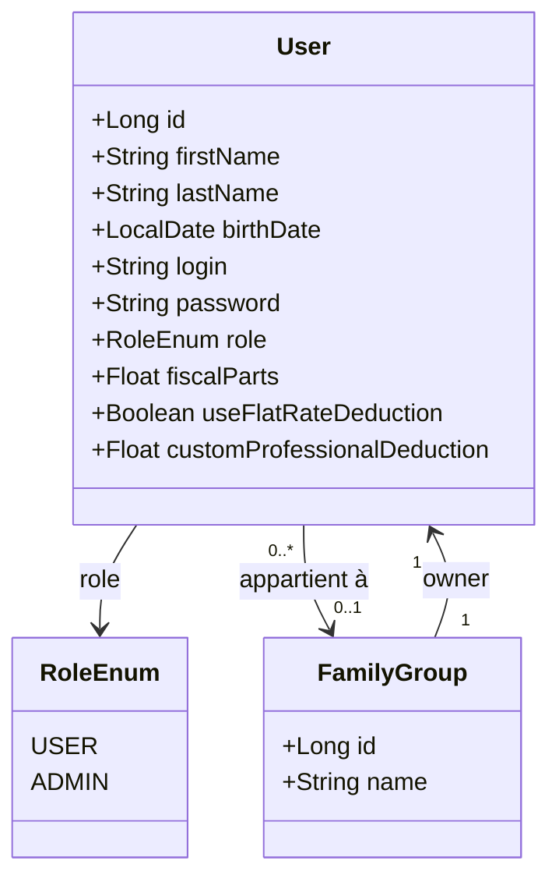

# Gestion des accès des utilisateurs

## Rôles

Il y a 2 rôles sur MyFinance :

- **Utilisateur (USER)** : Gère et consulte son propre patrimoine.
- **Administrateur (ADMIN)** : Dispose de tous les droits d'un utilisateur + les droits d'administration de l'application. Un administrateur possède lui aussi un patrimoine personnel.

## Authentification

L'authentification repose sur Spring Security avec :
- **Hashage du mot de passe** : BCrypt
- **Session** : cookie de session HTTP (géré par Spring Security, pas de JWT)
- **Pas de SSO** ni d'authentification externe

## Gestion des accès par fonctionnalité

### Gestion des utilisateurs (Admin uniquement)

| Fonctionnalité                 | Accès |
| ------------------------------ | ----- |
| Créer un utilisateur           | Admin |
| Modifier un utilisateur        | Admin |
| Supprimer un utilisateur       | Admin |
| Créer un regroupement familial | Admin |

### Gestion du patrimoine

| Fonctionnalité                                | Accès       |
| --------------------------------------------- | ----------- |
| Choisir consultation personnelle ou familiale | Admin, User |
| Actualisation manuelle d'une position         | Admin, User |
| — Modification d'une position existante       | Admin, User |
| — Création d'une position                     | Admin, User |
| — Fermeture d'une position                    | Admin, User |
| Actualisation manuelle des données stockées   | Admin, User |

### Gestion des revenus salariaux

| Fonctionnalité | Accès |
| --- | --- |
| Créer / modifier / supprimer son contrat salarial | Admin, User |
| Consulter ses projections salariales | Admin, User |
| Ajouter / modifier / supprimer ses bulletins mensuels | Admin, User |
| Consulter les données d'un autre utilisateur | Admin |

### Gestion des revenus complémentaires

| Fonctionnalité | Accès |
| --- | --- |
| Ajouter / modifier / supprimer ses revenus complémentaires | Admin, User |
| Consulter les revenus d'un autre utilisateur | Admin |

### Simulateur des impôts

| Fonctionnalité | Accès |
| --- | --- |
| Mettre à jour son profil fiscal (parts, abattement) | Admin, User |
| Lancer sa propre simulation d'impôt | Admin, User |
| Lancer la simulation d'un autre utilisateur | Admin |

### Gestion des automatisations

| Fonctionnalité                        | Accès       |
| ------------------------------------- | ----------- |
| Saisir une position à suivre          | Admin, User |
| — Crypto-monnaie                      | Admin, User |
| — Bourse                              | Admin, User |
| Suivi automatisé                      | Admin, User |
| — Analyse des cours de crypto-monnaie | Admin, User |
| — Analyse des cours de bourse         | Admin, User |

### Consultation des positions

| Fonctionnalité                                        | Accès       |
| ----------------------------------------------------- | ----------- |
| Graphique du patrimoine brut                          | Admin, User |
| Graphique du patrimoine net                           | Admin, User |
| Graphique des plus-values                             | Admin, User |
| Graphique de la diversification par secteur de marché | Admin, User |
| Graphique de diversification par secteur géographique | Admin, User |
| Graphique du suivi des revenus                        | Admin, User |
| Graphique du suivi des dépenses                       | Admin, User |

### Importation / Exportation de données (Admin uniquement)

| Fonctionnalité         | Format | Accès |
| ---------------------- | ------ | ----- |
| Importation de données | JSON   | Admin |
| Exportation de données | JSON   | Admin |
| Exportation de données | Excel  | Admin |

## Modèle utilisateur

## Profil fiscal

Chaque utilisateur dispose d'un profil fiscal utilisé par le **Simulateur des impôts**.

| Champ | Type | Nullable | Description |
|-------|------|----------|-------------|
| `fiscalParts` | `Float` | Non | Nombre de parts fiscales (quotient familial). Ex : 1.0 célibataire, 2.5 couple + 1 enfant |
| `useFlatRateDeduction` | `Boolean` | Non | `true` = abattement forfaitaire 10% sur les revenus salariaux ; `false` = frais réels déclarés |
| `customProfessionalDeduction` | `Float` | Oui | Montant des frais réels déclarés (€). Obligatoire si `useFlatRateDeduction = false` |

Ces champs sont gérés via `PUT /api/users/{id}` (admin) ou via la page **Profil** de l'utilisateur connecté. La documentation détaillée de la simulation est dans [`docs/architecture/tax-simulator.md`](tax-simulator.md).

## Gestion des regroupements familiaux

Un utilisateur peut créer un regroupement familial et en devenir le propriétaire. Les membres sont ajoutés par l'administrateur.

Règles :
- Un utilisateur ne peut appartenir qu'à **un seul** regroupement familial.
- Le regroupement nécessite **au minimum 2 membres**.
- Le propriétaire du regroupement est un `User` existant (pas nécessairement un Admin).
- Si un utilisateur appartient à un regroupement, il peut choisir de consulter soit son patrimoine personnel, soit le patrimoine consolidé du regroupement (fusion des données de tous les membres).
